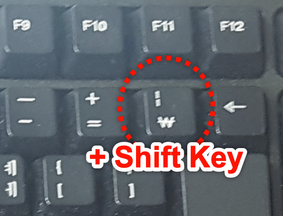

# 03-연산자

변수를 활용하여 각종 연산을 수행하는데 사용되는 특수 기호

## #01. 산술연산자(사칙연산자)

일반적인 덧셈, 뺄셈, 곱셈, 나눗셈에 사용되는 기호

### 1) 산술연산자의 종류

| 연산자 | 설명                                        |
| ------ | ------------------------------------------- |
| +      | 덧셈                                        |
| -      | 뺄셈                                        |
| *      | 곱셈                                        |
| /      | 나눗셈                                      |
| %      | 나눗셈에서의 정수 부분의 몫을 제외한 나머지 |

### 2) 연산자의 활용

- `console.log()` 명령을 통해 변수간의 연산 결과를 출력
- 연산 결과를 새로운 변수에 할당

### 3) 나눗셈에서의 주의사항

| 케이스                      | 설명                                                                |
| --------------------------- | ------------------------------------------------------------------- |
| 일반적인 나눗셈             | 몫이 소수점까지 갖는 경우 연산할 수 있는 최대한의 자리수까지 계산함 |
| 나누어 떨어지지 않는 나눗셈 | 처리 가능한 범위 안에서 최대한의 소수점 자리수까지 계산함.          |


### 4) 문자열의 연산

| 케이스                    | 설명                                                                                                     |
| ------------------------- | -------------------------------------------------------------------------------------------------------- |
| 문자열 끼리의 덧셈        | 문자열을 하나로 병합하는 효과가 있다.                                                                    |
| 문자열과 다른 타입의 덧셈 | 문자열 이외의 값들을 모두 문자열로 취급하여 덧셈을 수행한다. 즉, 문자열끼리의 연결과 같은 결과를 갖는다. |


## #02. 대입 연산자.

좌변에 우변을 대입한다는 의미의 `=` 연산자.

이미 앞에서 많이 사용한 기호이다.

### 활용 방법
1. 연산 결과를 새로운 변수에 대입
1. 이미 생성된 변수의 값을 다른 값으로 변경
1. 연산 결과를 변수 스스로에게 덮어 씌우기
  - 어떤 변수 x에 대한 연산 결과를 다시 x에 덮어 씌울 수 있다.


## #03. 단항 연산자

- 어떤 변수 `x`에 대한 연산 결과를 다시 `x`에 덮어 씌우는 연산을 축약한 표현
- `+=`, `-=`, `*=`, `/=`, `%=`

## #04. 증감연산자

### 1) 스스로 1 증가 혹은 감소

- 단항 연산자를 덧셈과 뺄셈에 한하여 축약한 형태.
- 스스로 1증가 혹은 1감소로 해석할 수 있다.

### 2) 증감 연산자의 위치

- `++`, `--` 연산자가 독립적으로 사용되는 경우는 위치에 상관 없이 결과가 동일하지만, 다른 수식에 포함된 상태로 사용되는 경우 위치에 따라 결과값이 달라진다.

#### 전위 증감 연산자

- 연산자가 앞에 위치한 경우 (앞북)
- 증감연산자가 앞에 위치한 경우 변수 스스로의 값에 대해 증가, 감소를 먼저 수행한 후 전체 수식을 연산한다.

#### 후위 증감 연산자

- 연산자가 뒤에 위치한 경우 (뒷북)
- 변수에 대한 증감연산자가 작용하기 전에 전체 수식을 먼저 처리한 다음 나중에서야 증감 연산자가 수행된다.


## #05. 비교 연산자

- 두 값간의 크기를 비교하는 식에 대한 **참**, **거짓**을 판별한다.
- 비교 연산의 결과는 논리값(`true` 혹은 `false`)로 결정된다.

### 1) 이상(`>=`), 초과(`>`), 이하(`<=`), 미만(`<`)

- 초등학교에서 배우는 부등식

### 2) 같다(`==`, `===`), 다르다(`!=`, `!==`)

- `==`, `!=` : 값의 내용만 비교하기 때문에 문자열 1(`"1"`)과 숫자형 1(`1`)을 같다고 판단한다.
- `===`, `!==` : 값의 데이터 타입까지도 일치해야만 같다고 판단하기 때문에 문자열 1(`"1"`)과 숫자형 1(`1`)을 다르다고 판단한다.
- Javascript에서 `1 === 1.0` 은 정수와 실수를 구분하지 않고 모두 number 타입으로 처리하기 때문에 `true` 로 판단한다.


## #06. 논리 연산자

두 개의 논리값(`true` 혹은 `false`)간에 AND(`&&`), OR(`||`) 연산을 수행한다.

| 연산자    | 설명                                                                                                             |
| --------- | ---------------------------------------------------------------------------------------------------------------- |
| AND (**`&&`**) | 연산에 사용되는 모든 값이 `true`인 경우만 결과가 `true`이고 그 외의 경우는 모든 결과가 `false`           |
| OR (**`\|\|`**)  | 연산에 사용되는 값중에서 하나라도 `true`라면 결과가 `true`이고 모든 값이 `false`인 경우만 결과가 `false` |
| NOT (**`!`**)  | 느낌표 `!`를 사용하여 논리형 값 true, false를 부정하여 반대의 결과를 만들어 내는 연산자.                         |

### 파이프



### NOT 연산자 특이사항

- AND가 OR보다 항상 우선한다.
- 숫자 값에 적용할 경우 `0`은 false으로 식별되고 `0`이 아닌 모든 수는 true로 식별된다.
- 문자열에 적용할 경우 빈 문자열(`""`)은 false로 식별되고 한 글자라도 포함된 문자열은 true로 식별된다.


## #07. 삼항 연산자 `? :`

```js
let 변수 = 조건식 ? 값1 : 값2;
```

조건식을 판별하여 식이 참인 경우 `값1`이 변수에 대입되고, 조건식이 거짓인 경우 `값2`가 변수에 대입되는 연산자.