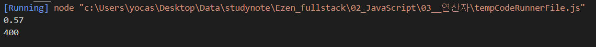

# 천경재 연산자 연습문제 과제
> 2021-01-25

## 문제 1)
현재 년도에 대한 값을 `year`라는 상수로 생성하고 이 값을 활용하여 자신의 나이를 연산한 후,   
`age`라는 이름의 지역변수에 할당하고 "나는 OO세 입니다." 라는 형식의 문장으로 이스케이프 문자를 활용하여 출력하시오.

```javascript
// 내 답은
const year1 = 2022;
let age1 = 1994;
let MyAge1 = year1 - age1;

console.log("나는 %d세 입니다.", MyAge1);

// 정답은
const year1 = 2022;
let age1 = year1 - 1994 + 1;

console.log("나는 %d세 입니다.", age1);
```

#### 내 결과


#### 정답 결과


<br/><br/>
---
---
<br/><br/>


## 문제 2) 
자신의 나이를 의미하는 상수 `age`를 정의하고 이 값을 활용하여 자신이 태어난 년도 `year`를 전역 변수 형식으로 산출하여   
"나는 OOOO년도에 태어났습니다."라는 형식의 문장으로 이스케이프 문자를 활용하여 출력하시오.

```javascript
// 내 답
const Age2 = 29;
var year2 = 2022 - Age2;

console.log("나는 %d년도에 태어났습니다.", year2);

// 정답
const age = 29;
var year = 2022 - (29-1);

console.log("나는 %d년도에 태어났습니다.", year);
```

#### 내 답 결과


#### 정답 결과


<br/><br/>
---
---
<br/><br/>


## 문제 3)
사과를 바구니에 나누어 담으려고 한다. 하나의 바구니는 사과를 10개씩 담을 수 있으며 사과를 담다가 10개 미만으로 남는 경우 하나의 바구니를   
추가로 사용해야 한다. 예를 들어 120개의 사과를 나누어 담기 위해서는 12개의 바구니가 필요하지만 121~130개까지 사과가 있다면   
13개의 바구니가 필요하고 다시 131개의 사과를 나누어 담기 위해서는 14개의 바구니가 필요하게 된다.


현재 갖고 있는 사과의 수를 의미하는 `numOfApples` 변수에 123이라는 값이 할당되어 있을 경우 필요한 바구니의 수를 구하는 프로그램을   구현하시오.

```javascript
// 내 답
const numOfApples = 123;
const Basket = numOfApples >= 130 ? "14개" : "13개";

console.log("필요한 바구니는 %s 입니다.", Basket);

// 정답

const numOfApples = 123;
const extra = (numOfApples % 10) / 10; // 123의 나머지 3을 나누기 10 하면 0.3
console.log(extra);

let basketCount = (numOfApples / 10) - extra; // 123 나누기 10 하면 12
basketCount += extra > 0 ? 1 : 0 ; // 0보다 extra(0.3)이 크면 basketCount 1 증가
console.log(basketCount);
```
#### 내 답 결과


#### 정답 결과


<br/><br/>
---
---
<br/><br/>

## 문제 4)
어떤 계산기는 입력된 값에서 백의자리 이하를 버리고 결과를 도출한다고 한다. 예를 들어 입력된 값이 457이라면 400이 결과로 출력된다.   
이러한 출력결과를 만들 수 있는 코드를 작성하시오.

```javascript
// 내 답
const Result = 457;
const Print = Result >= 400 ? "400" : "300";

console.log("입력 값 456의 계산기 출력 값은 %s 입니다.", Print);

// 정답
const number = 457;
const extra = (number % 100) / 100; // number(457) % 100 은 57이다, 57에 / 100 하면 0.57
console.log(extra);

const result = ((number / 100) - extra) * 100; // 457 / 100 = 4.57이다, -0.57 하고 * 100 해서 400이 된다. 
console.log(result);

```

#### 내 답 결과


#### 정답 결과



