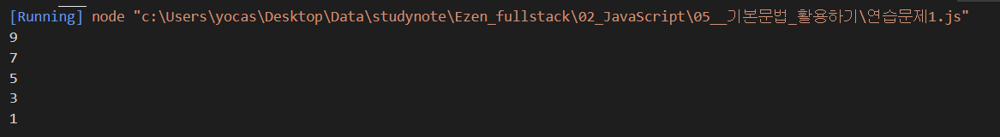
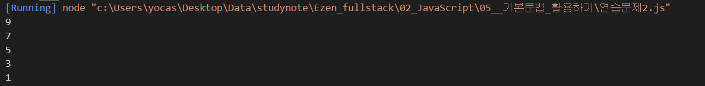
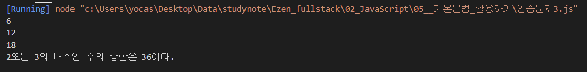
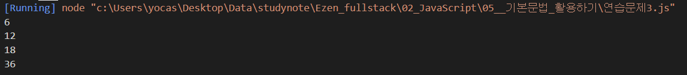
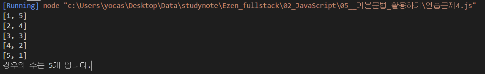
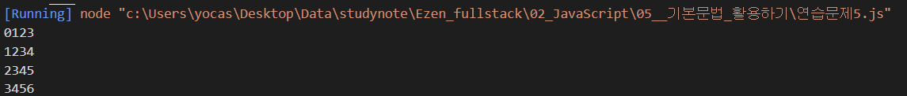
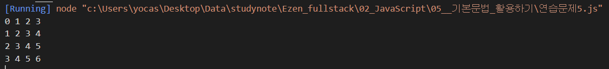
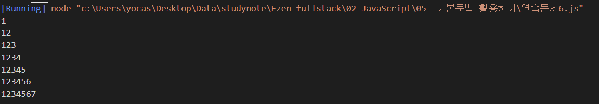
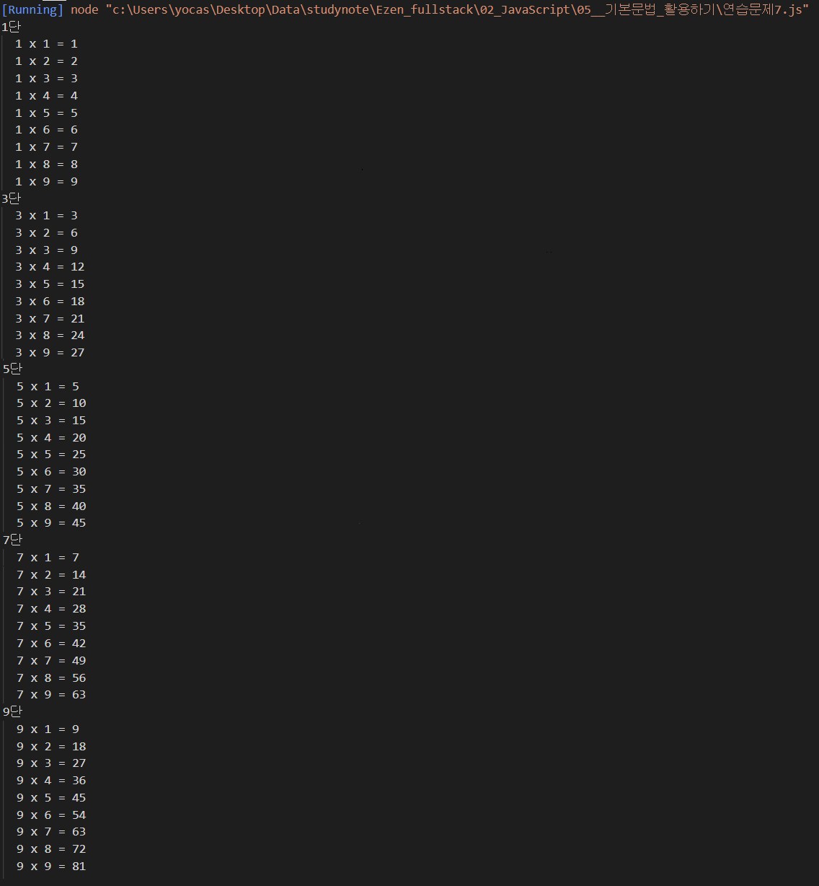
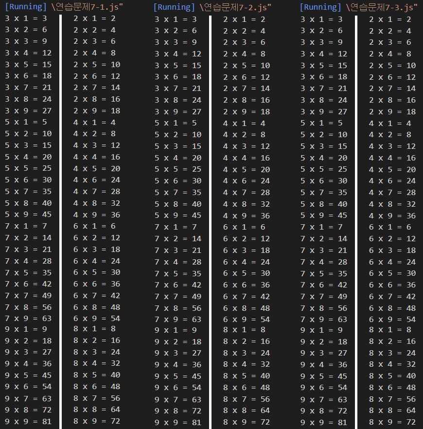

# 기본문법 활용하기 연습문제

> 2021-01-26

## 문제 1.

`for문을 사용하여 0부터 10미만의 정수 중에서 홀수만을 큰수부터 출력하시오.`

```javascript
// 내 답
for (let i = 9; i > -1; i--) {
  if (i % 2 == 1) {
    console.log(i);
  }
}

// 다른 풀이

for (let i = 9; i > -1; i -= 2) {
  // -1 에서 2씩 증가 하면 홀수
  console.log(i);
}
```

#### 내 답 결과



#### 다른 풀이 결과


<br/><br/>

## 문제 2.

`while문을 사용하여 0 부터 10 미만의 정수 중에서 홀수만을 큰수부터 출력하시오.`

```javascript
// 내 답
let i = 9;

while (i > -1) {
  if (i % 2 == 1) {
    console.log(i);
  }
  i--;
}

// 다른 풀이

let j = 9;

while (j > -1) {
  console.log(j);
  j -= 2;
}
```

#### 내 답 결과



#### 다른 풀이 결과


<br/><br/>

## 문제 3.

`1부터 20 미만의 정수 중에서 2 또는 3의 배수인 수의 총합을 구하시오.`

```javascript
// 내 답
const x = 2;
const y = 3;

let sum = 0;

for (let i = 0; i <= 20; i++) {
  if (i % (x * y) == 0) {
    sum += i;
    console.log(i);
  }
}
console.log("%d또는 %d의 배수인 수의 총합은 %d이다.", x, y, sum);

// 다른 답

let sum = 0;
for (let i = 1; i <= 20; i++) {
    // if (i % 2 == 0 || i % 3 == 0)
    if (i % (2 * 3) == 0) {
        sum += i;
        console.log(i);
    }
}
console.log(sum);

```

#### 내 답 결과


#### 다른 풀이 결과


<br/><br/>

## 문제 4.

`두 개의 주사위를 던졌을 때, 눈의 합이 6이 되는 모든 경우의 수를 출력하고 경우의 수는 총 몇가지 인지를 아래와 같이 출력하는 코드를 성하시오.`

```
[ 1, 5 ]
[ 2, 4 ]
[ 3, 3 ]
[ 4, 2 ]
[ 5, 1 ]
경우의 수는 5개 입니다.
```

```javascript
// 내 답
let sum = 0;

for (let i = 1; i < 7; i++) {
  for (let j = 1; j < 7; j++) {
    if (i + j == 6) {
      console.log("[%d, %d]", i, j);
      sum = i + j - 1;
    }
  }
}
console.log("경우의 수는 %d개 입니다.", sum);

// 정답

let sum = 0; // 갯수를 셀 경우 0으로 초기화 된 변수가 필요하다.

for (let i = 1; i <= 6; i++) {   // 첫번쨰 주사위의 반복

    for (let j = 1; j <= 6; j++) {  // 두번째 주사위의 반복
        if (i + j == 6) {
            console.log("[%d, %d]", i, j);

            sum++; // 조건이 충족될때 마다 1씩 증가 --> 갯수 세기
        }
    }
}
console.log("경우의 수는 %d개 입니다.", sum);

```

#### 내 답 결과



#### 정답 결과


<br/><br/>

## 문제 5.

`for문을 중첩하여 실행하여 아래와 같은 출력 결과를 만드시오.`

```
0 1 2 3
1 2 3 4
2 3 4 5
3 4 5 6
```

```javascript
// 내 답

for (let i = 0; i < 4; i++) {
  let str = "";

  for (let j = 0; j < 4; j++) {
    str += i + j;
  }
  console.log(str);
}

// 정답

for (let i = 0; i < 4; i++) {
  // 한 줄에 출력할 문자열 변수
  let str = "";

  for (let j = 0; j < 4; j++) {
    str += i + j;

    if (j + 1 < 4) {
      str += " ";
    }
  }

  console.log(str);
}
```

#### 내 답 결과


#### 정답 결과



<br/><br/>

## 문제 6.

`아래와 같은 출력 결과가 나타나도록 중첩 반복문을 for 문 형식으로 구현하시오.`

```
1
12
123
1234
12345
123456
1234567
```

```javascript
// 내 답
let str = "";
let j = 0;

for (let i = 1; i < 8; i++) {
  if (j <= i) {
    str += i;
  }
  console.log(str);
}

// 다른 풀이
for (let i=0; i<7; i++) {
    let str = "";

    for (let j=0; j<i+1; j++) {
        str += j+1;
    }

    console.log(str);
}

```

#### 내 답 결과



#### 다른 풀이 결과


<br/><br/>

## 문제 7.

`number라는 변수를 정의하고 1 혹은 2의 값을 임의로 할당하시오. 이 변수에는 1이나 2밖에 저장될 수 없습니다.`

`구구단 프로그램을 만들고자 한다.`

`전체를 출력하는 구구단이 아니라 number가 1일 때는 홀수 단(3, 5, 7, 9), number가 2일 때는 입력하면 짝수 단(2, 4, 6, 8)을 출력하는 프로그램을 완성하시오.`

```javascript
// 내 답
const number = 1;

for (let i = 1; i < 10; i++) {
  // 2~9
  if (i % 2 == number) {
    console.group("%d단", i);

    for (let j = 1; j < 10; j++) {
      // 1~9
      console.log("%d x %d = %d", i, j, i * j);
    }
    console.groupEnd();
  }
}

// 정답 1.
// const number = 2;  // 2, 4, 6, 8
const number = 2;  // 3, 5, 7, 9

for (let i=2; i < 10; i++) {

    if (number == 1) {
        if (i % 2 != 0) {
            for (let j=1; j<10; j++) {
                console.log("%d x %d = %d", i, j, i*j);
            }
        }
    } else {
        if (i % 2 == 0) {
            for (let j=1; j<10; j++) {
                console.log("%d x %d = %d", i, j, i*j);
            }
        }
    }
}

//정답 2.
// const number = 3;    // 3, 5, 7, 9
const number = 2;       // 2, 4, 6, 8

let start = number == 2 ? 2 : 3;

for (let i=start; i<10; i+=2) {     // 2가 2씩 증가하면 짝수 3이 2씩 증가하면 홀수
    for (let j=1; j<10; j++) {
        console.log("%d x %d = %d", i, j, i*j);
    }
}

//정답 3.
//const number = 1;     // 3, 5, 7, 9
const number = 2;       // 2, 4, 6, 8


for (let i=4-number; i<10; i+=2) {
    for (let j=1; j<10; j++) {
        console.log("%d x %d = %d", i, j, i*j);
    }
}

```

#### 내 답 결과



#### 정답 결과들

