## 기본문법 활용하기 연습문제

> 2021-01-30

## 문제 1. `다음의 소스코드는 boolean 데이터를 저장하고 있는 배열에 대한 어떤 처리를 보여준다. 실행 결과에서 제시하는 것과 같이 배열에 저장되어 있는 값들을 반전 (true -> false, false -> true) 변환하는 처리를 완성하시오.`
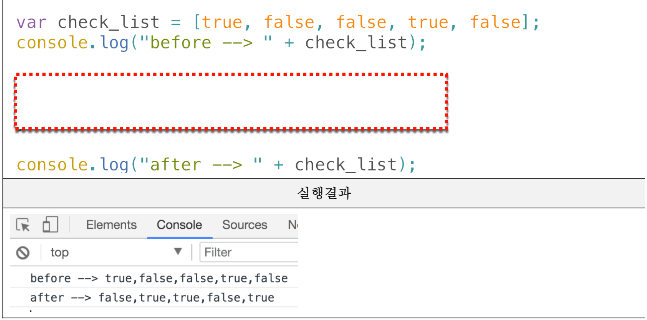

<br/>

#### 풀이
```js
// 내 답
var check_list = [true, false, false, true, false];

console.log("before --> " + check_list);
for (let i = 0; i < check_list.length; i++) {
    check_list[i] = !check_list[i];
}

console.log("after --> " + check_list);
```

#### 내 답 결과

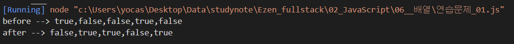
<br/><br/><br/>

## 문제 2. `다음표는 어떤 학생의 과목별 점수이다. 이 학생의 총점과 평균 점수를 구하는 프로그램에 대한 아래의 소스코드를 완성하시오.`

| | HTML | CSS | Javascript |
|---|---|---|---|
| 점수 | 75 | 82 | 91 |

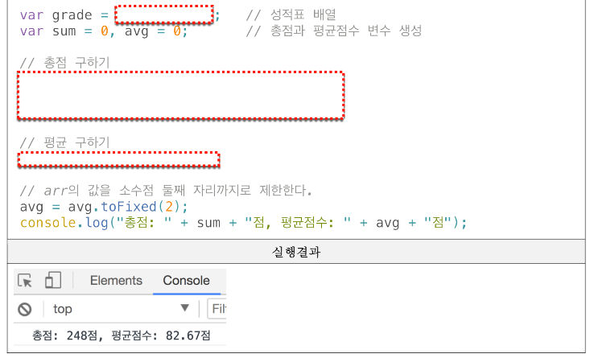

<br/>

#### 풀이

```js
// 내 답
var grade = [75, 82, 91];   // 성적표 배열
var sum = 0, avg = 0;   // 총점과 평균 점수 변수 생성

// 총점 구하기
for (i=0; i<grade.length; i++){
    sum += grade[i];
}

// 평균 구하기
    avg = sum / grade.length;

// arr의 값을 소수점 둘째 자리까리로 제한한다.
avg = avg.toFixed(2);
console.log("총점: " + sum + "점, 평균점수:" + avg + "점");

```
#### 내 답 결과
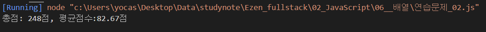

<br/><br/>

## 문제 3. `다음 표는 어떤 학생이 일요일부터 토요일까지의 일주일간 아르바이트를 한 시간이다.주말에는 7시간 평일에는 5시간을 일하기로 했지만, 금요일에 다른 직원의 사정으로 대신 근무를 하게되어 10시간을 일했다.이 학생의 시급이 4,500원이었지만 목요일 부터는 5,200원으로 올랐다고 할 때 일주일간의 총 급여를 구하는 프로그램을 작성하시오. (기본 코드는 아래 제시되는 내용을 사용하세요.`

| 일 | 월 | 화 | 수 | 목 | 금 | 토 |
|---|---|---|---|---|---|---|
| 7 | 5 | 5 | 5 | 5 | 10 | 7 |

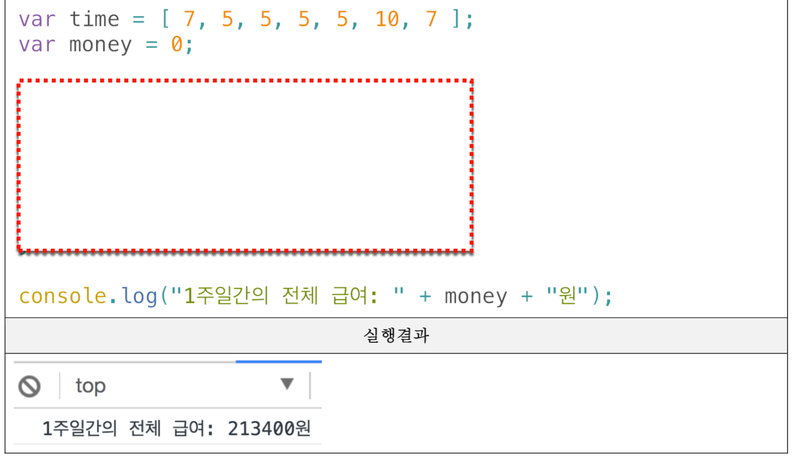
<br/>

#### 풀이

```js
// 내 답
// 모르겠어서 강제로 값을 맞췄습니다.

var time = [7, 5, 5, 5, 5, 10, 7];
var money = 0;

for (let i = 0; i < time.length; i++) {
    if (time[i] < 5) {
        time[i] = time[i] * 4500;
    } else {
        time[i] = time[i] * 4850;
    }
    money += time[i];
}
console.log("1주일간의 전체 급여: " + money + "원");

// 정답
var time = [7, 5, 5, 5, 5, 10, 7];
var money = 0;

for (let i = 0; i < time.length; i++) {
    if (i < 4) {
        money += time[i] * 4500;
    } else {
        money += time[i] * 5200;
    }
}
console.log("1주일간의 전체 급여: " + money + "원");
```

#### 내 답 결과
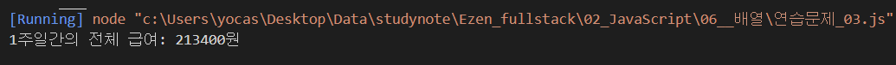
#### 정답 결과


<br/><br/>

## 문제 4. `아래의 화면은 쇼핑몰의 장바구니에 담은 상품에 대한 내역이다.`
## `상품의 가격을 원소로 갖는 1차 배열 price와 각 상품의 수량을 원소로 갖는 1차 배열 qty를 다음과 같이 정의하였을 때 이 사람이 총 얼마를 결제해야 하는지 결제금액을 구하는 프로그램을 작성하시오.`

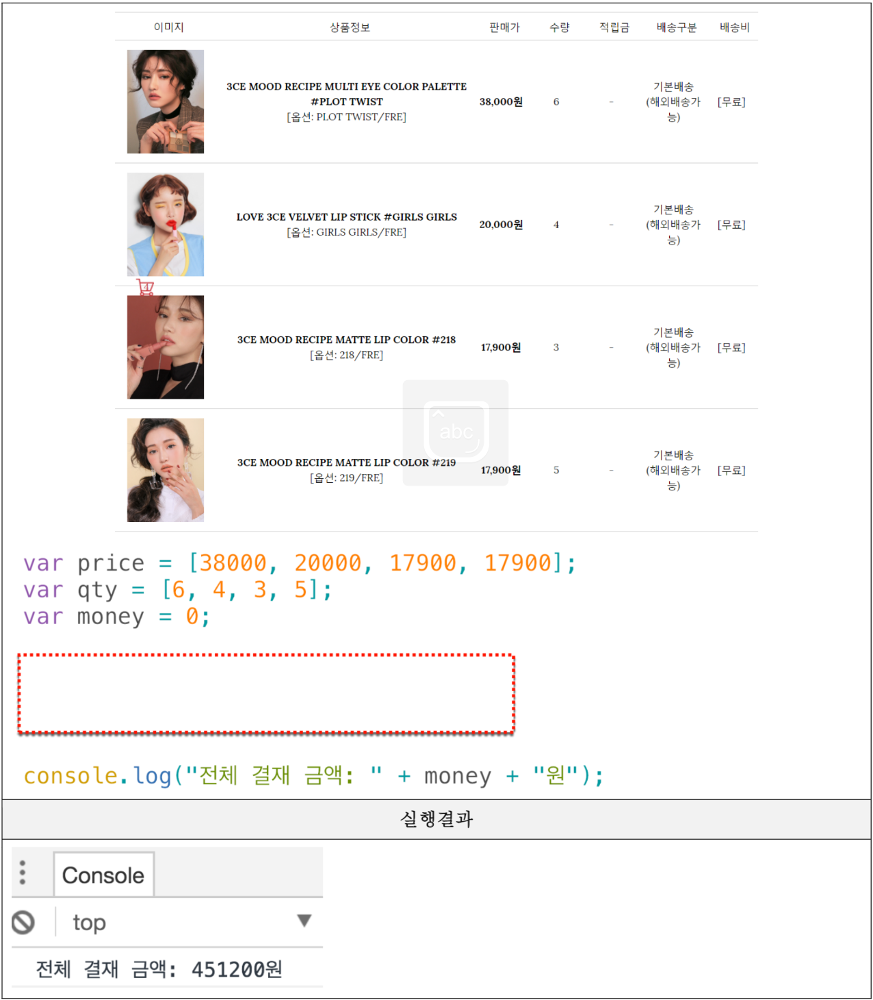
<br/>

#### 풀이

```js

// 내 답
var price = [38000, 20000, 17900, 17900];
var qty = [6, 4, 3, 5];
var money = 0;

for (let i=0; i<price.length; i++) {
        money += (price[i]*qty[i]);
}

console.log("전체 결제 금액: %d원", money);
```

#### 내 답 결과
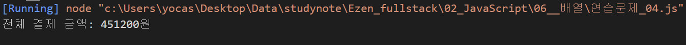

<br/><br/>

## 문제 5. `문제 4번의 장바구니 내역에서 상품금액 (판매가 * 수량)이 가장 비싼 항목은 얼마인지 출력하시오.`

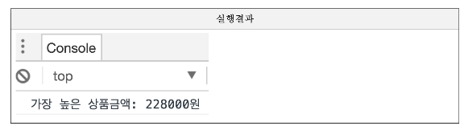
<br/>

#### 풀이

```js
// 내 답
var price = [38000, 20000, 17900, 17900];
var qty = [6, 4, 3, 5];
var TopPrice = price[0]* qty[0];

for (let i=0; i<price.length; i++) {
    for (let j=0; j<qty.length; j++) {
        if (TopPrice < price[i] * qty[j] ) {
            TopPrice = price[i] * qty[j];
        }
    }
}

console.log("가장 높은 상품금액: %d원", TopPrice);

// 정답
const price = [38000, 20000, 17900, 17900];
const qty = [6, 4, 3, 5];

// 단가*수량 중에서 가장 큰 값을 구해야 하므로 처음에 저장하는 값도 단가*수량으로 설정
let money = price[0] * qty[0];
// 단가*수량에 대한 최대값 구하기
// --> 인덱스가 동일한 요소들끼리의 계산이므로
// 인덱스 번호를 알 수 없는 for~of문은 사용불가
for (let i = 1; i < price.length; i++) {
    // i번째에 대한 총금액을 구한다.
    const sum = price[i] * qty[i];

    if (money < sum) {
        money = sum;
    }
}
console.log("가장 높은 상품금액: %d원", money);
```

#### 내 답 결과
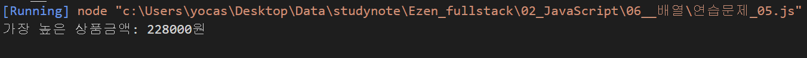

#### 정답 결과


<br/><br/>

## 문제 6. `문제 4번의 장바구니 내역에서는 모든 장바구니 상품이 개별 배송이라고 한다. 상품금액(판매가*수량)이 8만원 이상인 경우 무료로 배송이 된다고 할 때 무료로 배송되는 항목은 모두 몇 개 인지 구하는 프로그램을 구현하시오.`

<br/>

#### 풀이
```js
// 내 답
var price = [38000, 20000, 17900, 17900];
var qty = [6, 4, 3, 5];
var num = 0;

for (let i=0; i<price.length; i++) {
    for (let j=0; j<qty.length; j++) {
        if (price[i]*qty[j] > 80000) {
            num = 3;
        }
    }
}

console.log("무료배송 항목: %d건", num); // 모르겠소요

// 정답
var price = [38000, 20000, 17900, 17900];   // 단가 배열
var qty = [6, 4, 3, 5]; // 주문수량 배열
var count = 0;  // 수량을 저장할 변수 선언 --> 덧셈(합,카운트 등) 계산에서는 0으로 초기화

for (let i=0; i<price.length; i++) {
    // i번째에 대한 총 금액을 구한다.
    const sum = price[i] * qty[i];

    //원하는 조건이 충족될 때 카운트 1증가
    if (sum >= 80000) {
        count++;
    }
}
console.log("무료배송 항목: %d건", count);
```

#### 내 답 결과
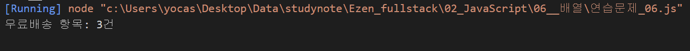

#### 정답 결과


<br/><br/>

## 문제 7. `다음은 어느 쇼핑몰의 상품 목록 화면이다.`
##  `아래의 소스코드는 위의 사움 목록에서 상품의 가격을 원소로 하는 배열 money를 정의하였을 때 "낮은가격순" 버튼이 눌러졋을 때 상품의 가격을 재정렬하기 위한 코드에 대한 일부이다. 빈 칸을 채워넣어 완성하시오.`
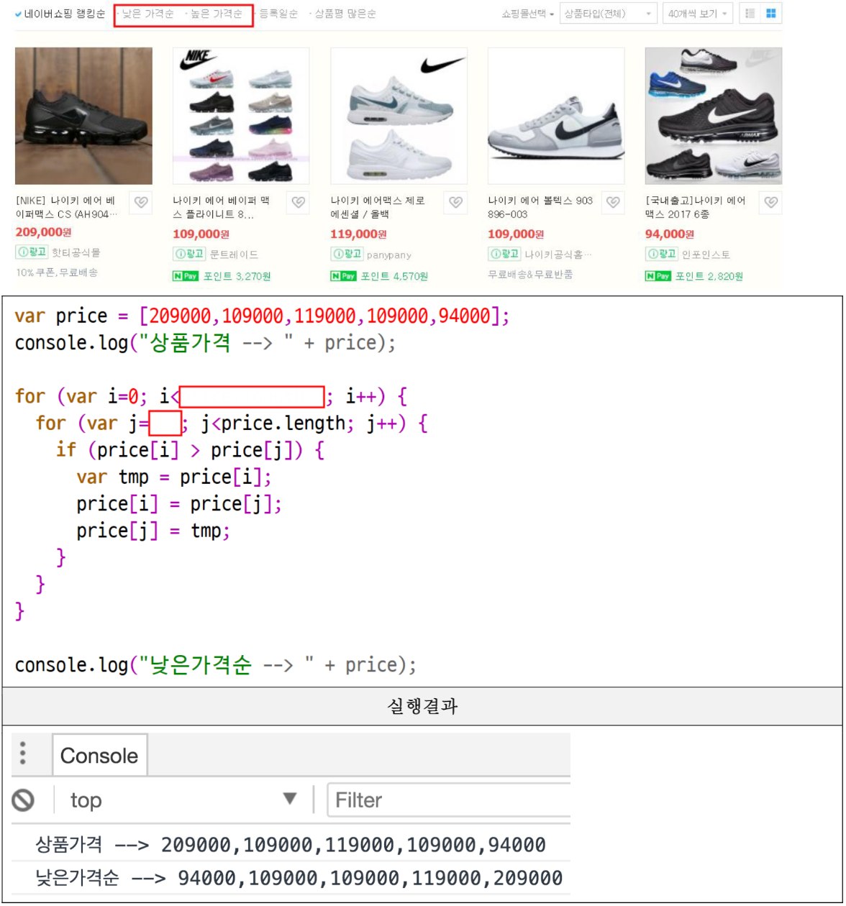
<br/>

#### 풀이
```js
// 내 답
let price = [209000,109000,119000,109000,94000];
console.log("상품가격 --> " + price);

for(let i=0; i<price.length; i++) {
    for (let j=0; j<price.length; j++) {
        if ( price[i] < price[j]) {
            var tmp = price[i];
            price[i] = price[j];
            price[j] = tmp;
        }
    }
}

console.log("낮은가격순 --> " + price);

// 정답
let price = [209000, 109000, 119000, 109000, 94000]; // 상품가격 배열
console.log("상품가격 --> " + price);

// 낮은 가격순으로 정렬 수행
// (공식) 부모 반복문 -> i가 0부터 길이 -1 보다 작은 동안
//        자식 반복문 -> i가 i+1부터 길이보다 작은 동안
//        i번째와 j번째의 크기를 비교하여 맞교환 처리 수행
for (let i = 0; i < price.length - 1; i++) {
    for (let j = i+1; j < price.length; j++) {
        if (price[i] > price[j]) {
            var tmp = price[i];
            price[i] = price[j];
            price[j] = tmp;
        }
    }
}
console.log("낮은가격순 --> " + price);
```

#### 내 답 결과
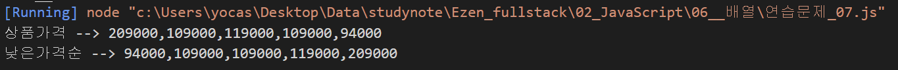
#### 정답 결과

<br/>

## 문제 8. `아래의 코드는 배열의 원소를 반대로 배치하는 소스코드의 일부이다. 빈 칸을 완성하시오. (번호가 같은 박스는 같은 코드가 들어갑니다.)`

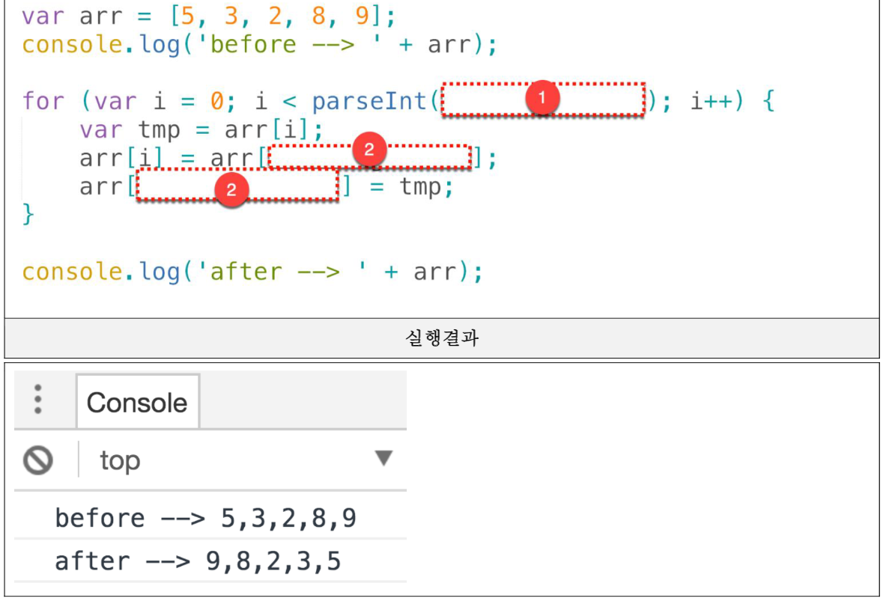
<br/>

#### 풀이
```js
// 내답
let arr = [5, 3, 2, 8, 9];
console.log('before --> ' + arr);

for (let i=0; i<parseInt(arr.length /2); i++) {
    let tmp = arr[i];
    arr[i] = arr[arr.length - i -1];
    arr[arr.length - i -1] = tmp;
}

console.log('after --> ' + arr);

//정답
let arr = [5, 3, 2, 8, 9];
console.log('before --> ' + arr);

// 역순 배치공식
// 1) 배열길이 /2 만큼만 반복
// 2) i번쨰와 길이-i-1 번째를 맞교환
for (let i = 0; i < arr.length / 2; i++) {
    const tmp = arr[i];
    arr[i] = arr[arr.length - i - 1];
    arr[arr.length - i - 1] = tmp;
}

console.log('after --> ' + arr);
```

#### 내 답 결과
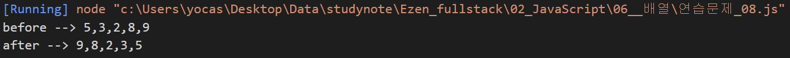

#### 정답 결과

<br/><br/>


## 문제 9. `다음 표는 어느 학급의 성적표이다.`
## `학생별 총점과 평균점수를 구하기 위한 소스코드를 아래와 같이 작성중이다. 빈 칸을 완성하시오. 단, 평균점수의 경우 toFixed() 함수를 사용하여 소수점 둘째 자리까지만 출력하시오.`

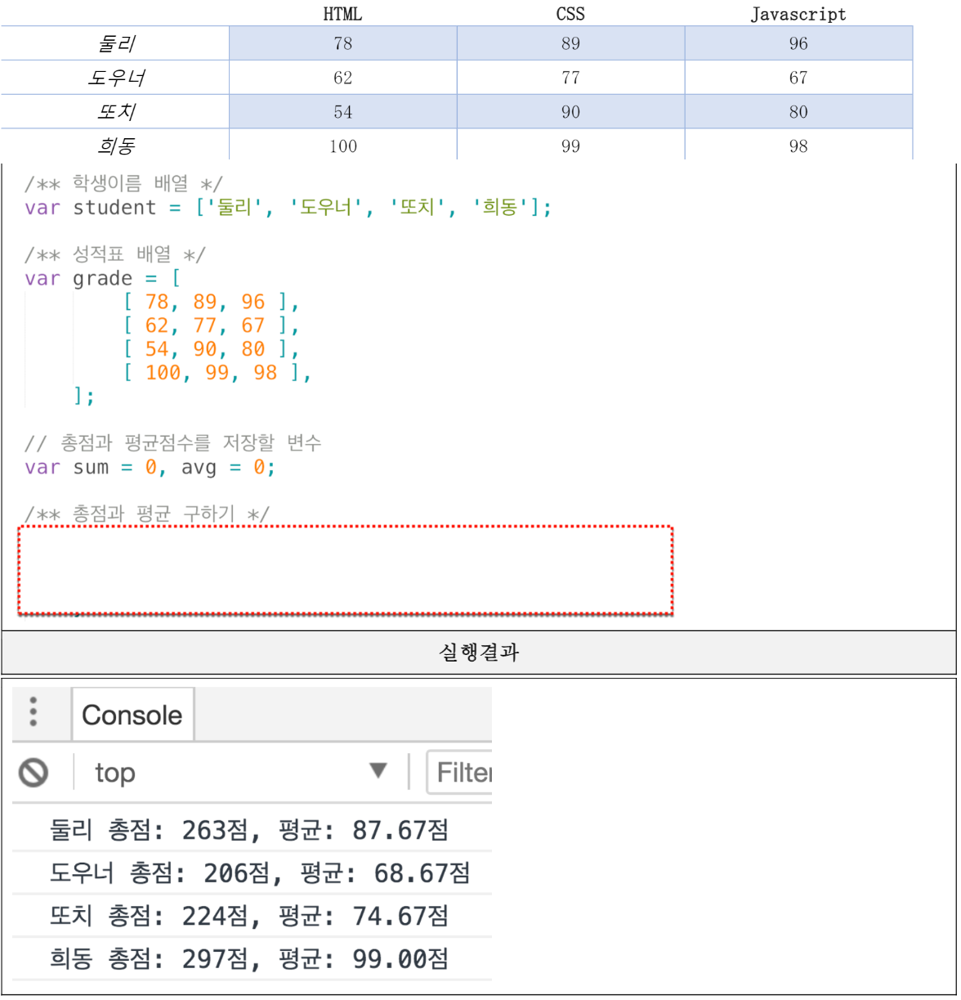
<br/>

#### 풀이
```js
// 정답
const student = ['둘리', '도우너', '또치', '희동이']; // 학생이름 배열
const grade = [     // 성적표 배열
    [78, 89, 96],
    [62, 77, 67],
    [54, 90, 80],
    [100, 99, 98],
];

// 총점과 평균점수를 저장할 변수
let sum = 0, avg = 0;   // 총점과 평균점수를 저장할 변수

for (let i = 0; i < grade.length; i++) {
    // 학생별 총점은 이 위치에서 변수가 초기화 되어야 한다.
    // 합계를 위한 변수가 이미 선언되어 있으므로 중복선언을 피하기 위해서
    // 기존의 변수를 0으로 리셋만 한다.
    sum = 0;

    // 각 학생의 과목별 반복 처리
    for (let j = 0; j < grade[i].length; j++) {
        sum += grade[i][j];
    }
    // 평균은 학생 한명의 총점을 한명이 응시한 과목수(=배열의 길이)로 나눈다.
    avg = sum / grade[i].length;
    // 소수점 둘째자리까지 표현하기
    avg = avg.toFixed(2);

    // student[i]가 학생 한명의 이름, grade[i]는 학생 한명의 점수
    console.log(student[i] + " 총점: %d점, 평균: %s점", sum, avg);
}
```

#### 정답 결과
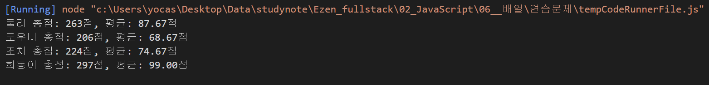
<br/><br/>

## 문제 10. `위 9번 문제에서 반 평균을 출력하시오. 반 평균은 학생의 평균점수 총 합/학생수로 구합니다.`
## `[주의] toFixed() 함수로 가공된 값은 문자열 형태이기 때문에 숫자 연산이 불가능합니다. 이를 감안하여 반 점수를 구하세요.`
<br/>

#### 풀이
```js
// 정답
const student = ['둘리', '도우너', '또치', '희동이']; // 학생이름 배열
const grade = [     // 성적표 배열
    [78, 89, 96],
    [62, 77, 67],
    [54, 90, 80],
    [100, 99, 98],
];

// 총점과 평균점수를 저장할 변수
let sum = 0, avg = 0;   // 총점과 평균점수를 저장할 변수

let class_sum = 0; // 학생별 평균점수의 총 합

let class_avg = 0; // 반평균

for (let i = 0; i < grade.length; i++) {
    sum = 0;

    for (let j = 0; j < grade[i].length; j++) {
        sum += grade[i][j];
    }
    avg = sum / grade[i].length;
    
    //toFixed() 함수로 소수점을 처리한 결과는 문자열이기 때문에 숫자 연산이
    // 불가능하므로 toFixed() 함수 적용 전에 반점수를 구해야 한다.
    class_sum += avg;
    avg = avg.toFixed(2);

    console.log(student[i] + ' 총점: ' + sum + '점, 평균: ' + avg + '점');
}
class_avg = class_sum / student.length;
class_avg.toFixed(2);
console.log('반평균 = ' + class_avg + '점');
```

#### 정답 결과
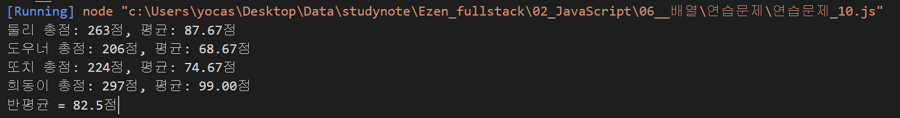
<br/><br/>

## 문제 11. `아래는 어느 게임 유저의 아이템 인벤토리이다.`
## `첫 줄에 있는 아이템을 판매한다고 할 때 이 유저가 벌어들이는 골드(G)의 총액은 얼마인가? (판매를 위해 선택한 아이템의 상단에는 1개당 가격이 표시되고, 아이템을 판매할 때는 원래가격의 90%만 받을 수 있다고 한다.)`
## `- 가격과 아이템 수량의 정보를 2차 배열로 구성하는 소스코드를 완성하세요. ("단가-수량"을 한 세트로 하는 정보들을 배열로 구성하면 2차 배열 형태가 됩니다.)`

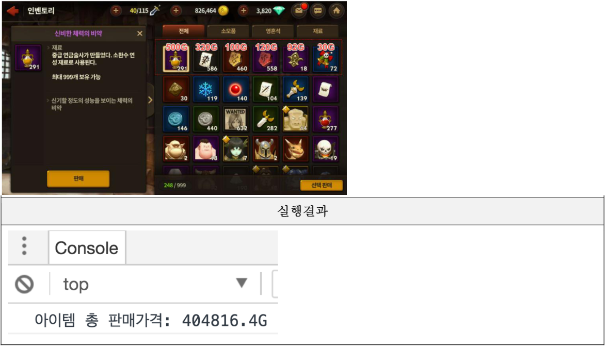
<br/>

#### 풀이
```js
// 정답
// "단가-수량"을 한 세트로 하는 정보들을 배열로 구성하면 2차 배열 형태가 된다.

const inven =  [
    [500, 291], [320, 586], [100, 460], [120, 558], [92, 18], [30, 72]
];

let total_price = 0;

for (let i = 0; i<inven.length; i++) {
    const item_price = (inven[i][0] * 0.9) * inven[i][1];
    total_price += item_price;
}
console.log("아이템 총 판매가격: " + total_price + "G");

// ---------------------------------------------------------------------------
// case2
// ---------------------------------------------------------------------------
const inven2 = [
    [500, 320, 100, 120, 92, 30],
    [291, 586, 460, 558, 18, 72]
];

let total_price2 = 0;

// 0번째 행과 1번째 행의 길이가 동일함이 보장되므로
// 0번째 행에 대한 길이를 직접 구해서 처리한다.
for (let i=0; i<inven2[0].length; i++) {
    total_price2 += (inven2[0][i]*0.9) * inven2[1][i];
}

console.log("아이템 총 판매가격: " + total_price2 + "G");
```

#### 정답 결과
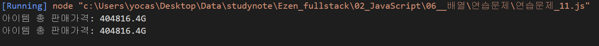
<br/><br/>

## 문제 12. # 배열 연습문제 2

## 문제 12. `자신의 주민번호 한 글자씩 모든 숫자를 원소로 갖는 배열 jumin을 아래와 같이 정의하시오.`

```js
ssn = [0,1,1,2,1,3,1,0,0,0,1,2,3]
```

`정의된 배열을 활용하여 유요한 주민등록번호인지 아닌지를 판별하는 코드를 구현해보자. 판별 방법은 아래와 같다.`

`- 기본 주민등록코드에는 각 숫자에 대응하는 가중치가 있다. 가중치는 주민등록번호의 순서에 따라 `2 3 4 5 6 7 8 9 2 3 4 5` 이다.`
`- 먼저 마지막 숫자는 제외하고, 기본코드의 각 12자리와 가중치를 모두 곱하여 합한다.`
`- 합한 값을 11로 나눈 나머지 값을 구한다.`
`- 11에서 그 나머지 값을 뺀 후, 이를 10을 나눈 나머지를 구한다.`
`- 나머지의 1의 자리 값과 주민등록번호 마지막 자리 값이 맞아야 유효한 주민등록번호이다.`
<br/>

#### 풀이
```js
// 정답
// 자신의 주민번호 한 글자씩 모든 숫자를 원소로 갖는 배열 ssn을 정의
// --> 이 값은 가짜 주민번호로 실행결과는 유효하지 않은 주민번호로 판별.
ssn = [1,0,1,1,1,7,1,1,1,1,1,1,5];

// 정의된 배열을 활용하여 유효한 주민등록번호인지 판별

// 기본 주민등록코드에는 각 숫자에 대응하는 가중치가 있다. 가중치는 주민등록번호의 순서에 따라 `2 3 4 5 6 7 8 9 2 3 4 5` 이다.

let k = 2;  // -> 가중치 변수 k

// 마지막 숫자는 제외하고, 기본코드의 각 12자리와 가중치를 모두 곱하여 합한다.
let sum = 0;

for (let i=0; i<ssn.length-1; i++) {
    sum += ssn[i] * k;
    k++; // 다음번 숫자와 곱하기 위해 가중치르 1씩 증가

    // 가중치 값이 9보다 크면 2로 리셋
    if (k > 9) {
        k = 2;
    }
}

// 합한 값을 11로 나눈 나머지 값을 구한다.
let mod = sum % 11;

// 11에서 그 나머지 값을 뺀 후, 이를 10을 나눈 나머지를 구한다.
let x = (11 - mod) % 10

// 나머지의 1의 자리 값과 주민등록번호 마지막 자리 값이 맞아야 유효한 주민등록번호이다.
let y = x % 10;

if (y == ssn[ssn.length -1]) {
    console.log("유효한 주민번호");
} else {
    console.log("유효하지 않은 주민번호");
}
```

#### 정답 결과
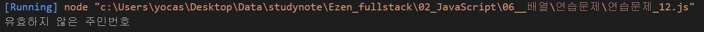
<br/><br/>

