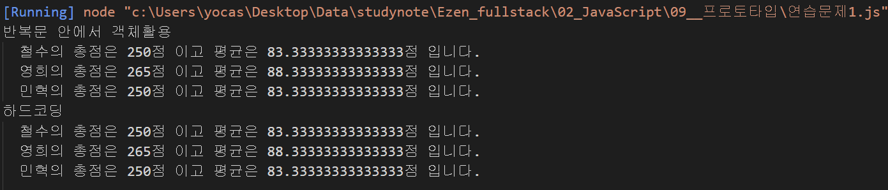
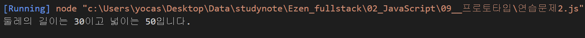

# 프로토타입 연습문제

## 문제1. 

국어, 영어, 수학 점수를 생성자 파라미터로 입력받아서 합계와 평균을 구하는 클래스 Student를 작성하시오.

이 때 Stuent 클래스는 합계를 리턴하는 메서드인 `sum()`과 평균을 리턴하는 `avg()`를 제공합니다.

작성된 클래스를 활용하여 아래 표에 대한 학생별 합계 점수와 평균점수를 출력하시오.

클래스는 JSON 형식으로 작성되어야 합니다.

| 이름 | 국어 | 영어 | 수학 |
|---|---|---|---|
| 철수 | 92 | 81 | 77 |
| 영희 | 72 | 95 | 98 |
| 민혁 | 80 | 86 | 84 |


#### 출력결과

```
철수의 총점은 250점 이고 평균은 83.33333333333333점 입니다.
영희의 총점은 265점 이고 평균은 88.33333333333333점 입니다.
민혁의 총점은 250점 이고 평균은 83.33333333333333점 입니다.
```
#### 정답
```js
function Student(kor, eng, math) {
    this._kor = kor;
    this._eng = eng;
    this._math = math;
}

Student.prototype = {
    sum : function() {
        return this._kor + this._eng + this._math;
    },
    avg : function() {
        return this.sum() / 3;
    },
}

console.group("반복문 안에서 객체활용");
const grade = [
    ["철수", 92, 81, 77],
    ["영희", 72, 95, 98],
    ["민혁", 80, 86, 84]
];
for(const item of grade) {
    const s = new Student(item[1], item[2], item[3]);
    console.log("%s의 총점은 %d점 이고 평균은 %d점 입니다.", item[0], s.sum(), s.avg());
}
console.groupEnd();

console.group("하드코딩");
const s1 = new Student(92, 81, 77);
const s2 = new Student(72, 95, 98);
const s3 = new Student(80, 86, 84);
console.log("철수의 총점은 %d점 이고 평균은 %d점 입니다.",s1.sum(), s1.avg());
console.log("영희의 총점은 %d점 이고 평균은 %d점 입니다.",s2.sum(), s2.avg());
console.log("민혁의 총점은 %d점 이고 평균은 %d점 입니다.",s3.sum(), s3.avg());
console.groupEnd();
```

#### 결과


<br/><br/>
---

## 문제2.

가로(`width`), 세로(`height`)정보를 getter, setter로 관리하는 Rectangle 클래스를 정의하시오.

이 클래스는 생성자의 파라미터가 없으며 둘레의 길이를 구해 리턴하는 getAround() 메서드와 넓이를 구해 리턴하는 gerArea() 메서드를 제공합니다.

클래스는 JSON 형식으로 작성되어야 합니다.


#### 출력결과

가로가 10이고 세로가 5인 경우

```
둘레의 길이는 30이고 넓이는 50입니다.
```

#### 정답
```js
function Rectangle() {
    this._width = null;
    this._height = null;
}

Rectangle.prototype = {
    get width() {
        return this._width;
    },
    set width(param) {
        this._width = param;
    },
    get height() {
        return this._height;
    },
    set height(param) {
        this._height = param;
    },
    getAround: function () {
        return this.width * 2 + this.height * 2;
    },
    getArea: function () {
        return this.width * this.height;
    },
};

const rect = new Rectangle();
rect.width = 10;
rect.height = 5;

console.log('둘레의 길이는 %d이고 넓이는 %d입니다.', rect.getAround(), rect.getArea());
```

#### 결과
