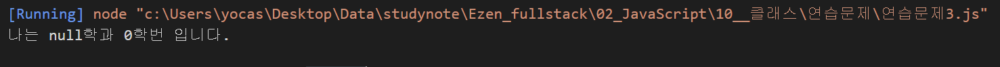
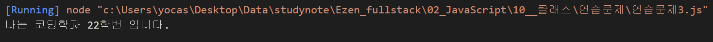
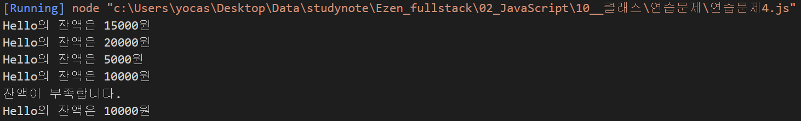

# Class 기반 객체지향 연습문제

## 문제3. 다음을 만족하는 Student 클래스를 작성하시오.

1) String형의 학과와 정수형의 학번을 프로퍼티로로 선언후 생성자를 통해 주입
2) getter, setter를 정의
3) sayHello() 메서드를 통해 "나는 OOOO학과 OO학번 입니다." 를 출력하는 기능을 구현

#### 풀이
```js
// 내 풀이
class Student {
    constructor(depn, clsnb) {
        this._depn = null;
        this._clsnb = null;
    }

    get depn() {
        return this._depn;
    }
    set depn(depn) {
        this._depn = depn;
    }

    get clsnb() {
        return this._clsnb;
    }
    set clsnb(clsnb) {
        this._clsnb = clsnb;
    }

    sayHello() {
        console.log("나는 %s학과 %d학번 입니다.", this.depn, this.clsnb);
    }

}
const stud = new Student("코딩", 22);
stud.sayHello();

// 정답
class Student {
    // 생성자
    constructor(depn, clsnb) {
        this._depn = depn;    // 학과이름
        this._clsnb = clsnb;  // 학번이름
    }
    // 학번 getter
    get depn() {
        return this._depn;
    }
    // 학번 setter
    set depn(depn) {
        this._depn = depn;
    }
    // 학과 getter
    get clsnb() {
        return this._clsnb;
    }
    // 학과 setter
    set clsnb(clsnb) {
        this._clsnb = clsnb;
    }
    sayHello() {
        console.log("나는 %s학과 %d학번 입니다.", this.depn, this.clsnb);
    }

}
const stud = new Student("코딩", 22);
stud.sayHello();
```

#### 결과


<br/><br/>

---

## 문제3. 다음을 만족하는 클래스 Account를 작성하시오.

1) 다음의 2 개의 필드를 선언
    문자열 owner; (이름)
    숫자형 balance; (금액)
2) 위 모든 필드에 대한 getter와 setter의 구현
3) 위 모든 필드를 사용하는 가능한 모든 생성자의 구현
3) 메소드 deposit()의 헤드는 다음과 같으며 인자인 금액을 저축하는 메소드
    deposit(amount)
4) 메소드 withdraw()의 헤드는 다음과 같으며 인자인 금액을 인출(리턴)하는 메소드
    withdraw(long amount)
    인출 상한 금액은 잔액까지로 하며, 이 경우 이러한 상황을 출력

#### 풀이
```js
// 정답
class Account {

    constructor(owner, balance) {
        this._owner = owner;
        this._balance = balance;
    }

    get owner() {
        return this._owner;
    }
    set owner(value){
        this._owner = value;
    }
    get balance() {
        return this._balance;
    }
    set balance(value){
        this._balance = value;
    }

    dosposit(amount) {
        this._balance += amount;
    }

    withdraw(amount) {
        if (this.balance < amount) {
            // 인출 상한 금액은 잔액까지로 하며, 이 경우 이러한 상황을 출력
            console.log("잔액이 부족합니다.");
            return;
        }
        this.balance -= amount;
        return amount;
    }
}

const acc = new Account("Hello", 15000);
console.log("%s의 잔액은 %d원", acc.owner, acc.balance);

// 저축
// 잔액 20000원
acc.dosposit(5000);
console.log("%s의 잔액은 %d원", acc.owner, acc.balance);

// 잔액 5000원
acc.withdraw(15000);
console.log("%s의 잔액은 %d원", acc.owner, acc.balance);

// 잔액 10000원
acc.dosposit(5000);
console.log("%s의 잔액은 %d원", acc.owner, acc.balance);

// 잔액부족합니다.
// 잔액은 10000원
acc.withdraw(15000);
console.log("%s의 잔액은 %d원", acc.owner, acc.balance);
```

#### 결과
