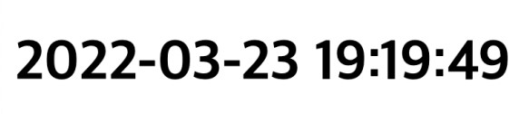
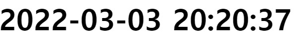
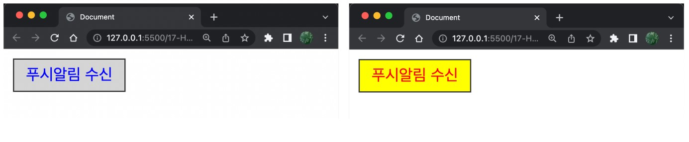
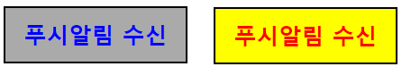
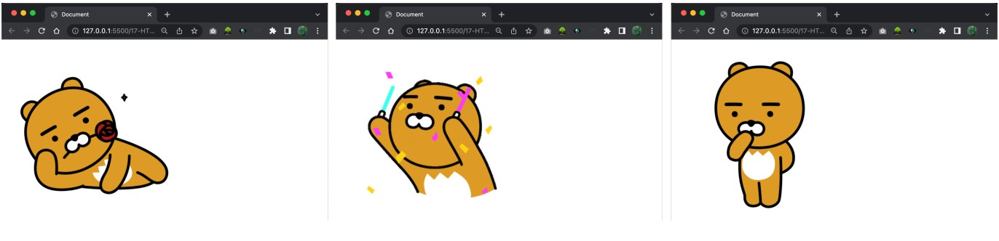
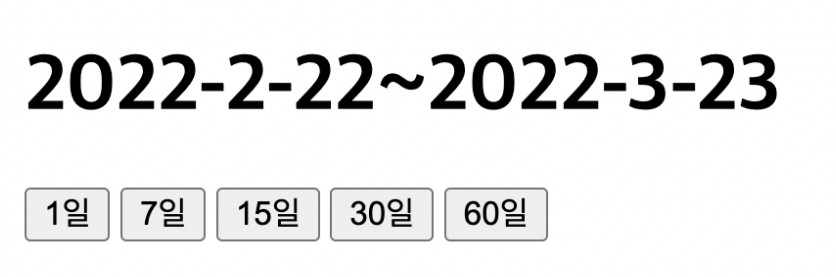

# HTML 제어하기 연습문제

## 문제01
`아래 화면과 같이 현재 시각을 yyyy-mm-dd hh:mi:ss 형식으로 출력하는 웹 페이지를 구현하시오.`<br/>
`년도는 4자리 숫자로 구성되며 월,일,시,분,초는 2자리 숫자 입니다.`<br/>
`출력되는 시간은 매초마다 자동으로 화면상에서 갱신되어야 합니다`<br/><br/>


### 풀이
```html
<!DOCTYPE html>
<html lang="ko">
<head>
    <meta charset="UTF-8">
    <meta name="viewport" content="width=device-width, initial-scale=1.0">
    <title>Document</title>
    <style>
        #clock {
            font-size: 60px;
            font-weight: 600;
        }
    </style>
</head>

<body>
    <div id="clock"></div>

    <script>
    function clock() {
        let time = new Date();
        let year = time.getFullYear();
        let mth = time.getMonth() + 1;
        let day = time.getDay();
        let hr = time.getHours();
        let mm = time.getMinutes();
        let ss = time.getSeconds();

        let clock = document.getElementById("clock");
        clock.innerHTML = year + "-" 
        + (( "0" + mth.toString()).slice(-2)) + "-" 
        + (("0"+ day.toString()).slice(-2)) + " " 
        + (("0"+ hr.toString()).slice(-2)) + ":" 
        + (("0"+ mm.toString()).slice(-2)) + ":" 
        + (("0"+ ss.toString()).slice(-2));
    }
    clock();
    setInterval(clock, 1000);
    </script>
</body>
</html>
```
### 결과


---

<br/><br/>

## 문제02
`아래 화면과 같이 off 상태의 버튼이 누를때마다 on/off 의 상태가 변경되도록 CSS를 적용할 수 있는 코드를 작성하세요.`<br/><br/>


### 풀이
```html
<!DOCTYPE html>
<html lang="ko">
  <head>
    <meta charset="UTF-8" />
    <meta name="viewport" content="width=device-width, initial-scale=1.0" />
    <title>Document</title>
    <style>
      #off {
        width: 200px;
        height: 60px;
        background-color: #aaa;
        color: blue;
        border: 2px solid black;
        font-size: 25px;
        text-align: center;
        line-height: 60px;
        font-weight: 600;
        cursor: pointer;
      }

      #on {
        width: 200px;
        height: 60px;
        background-color: yellow;
        color: red;
        border: 2px solid black;
        font-size: 25px;
        text-align: center;
        line-height: 60px;
        font-weight: 600;
        cursor: pointer;
      }
    </style>
  </head>

  <body>
    <div id="off">푸시알림 수신</div>
    <script>
      document.querySelector("#off").addEventListener("click", (e) => {
        const box = document.getElementById("off");
        box.id = "on";
      });

      document.querySelector("#on").addEventListener("click", (e) => {
        const box = document.getElementById("on");
        box.id = "off";
      });

      // 토글이 안됨..
    </script>
  </body>
</html>
```
### 결과


---

<br/><br/>

## 문제03
`아래 화면과 같이 3장의 이미지가 3초마다 한번씩 자동으로 변경되는 웹 페이지를 작성하시오.`<br/>
`세 번째 이미지가 표시된 후 3초 후에는 다시 첫 번째 이미지가 표시되어야 합니다.`<br/>
`이미지 파일은 각자 임의의 이미지를 선정하여 사용하고, 이미지 파일 이름도 각자 임의로 구성합니다.`<br/><br/>


### 풀이
```html

```
### 결과


---

<br/><br/>

## 문제04
`아래의 화면과 같이 버튼에 따라 과거의 n일 전부터 오늘까지의 범위를 표시하는 웹 페이지를 작성하시오.`<br/><br/>


### 풀이
```html

```
### 결과


---

<br/><br/>


