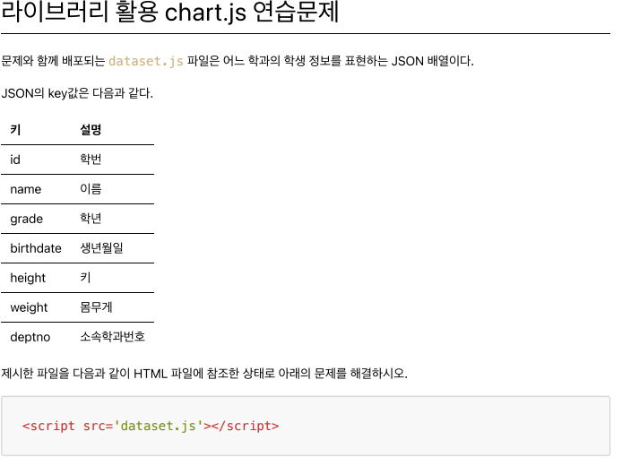
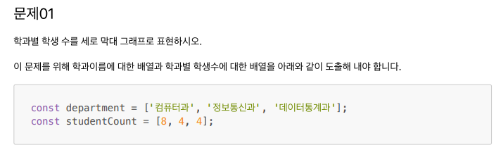
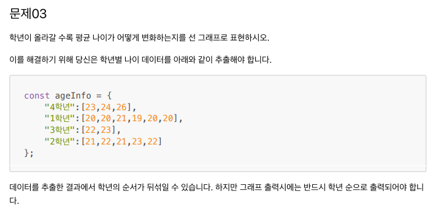
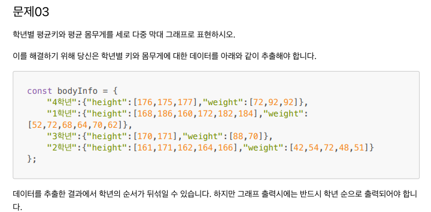
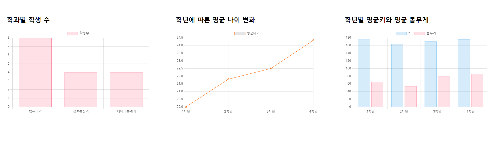

# 답

```html
<!DOCTYPE html>
<html lang="ko">
  <head>
    <meta charset="UTF-8" />
    <meta name="viewport" content="width=device-width, initial-scale=1.0" />
    <title>Chart</title>
    <style>
      .subplot {
        float: left;
        width: 33.3%;
        padding: 50px;
        box-sizing: border-box;
      }
      .subplot-item {
        width: auto;
        height: 320px;
      }
    </style>
  </head>
  <body>
    <div class="subplot">
      <h2>학과별 학생 수</h2>
      <div class="subplot-item">
        <canvas id="mychart1"></canvas>
      </div>
    </div>
    <div class="subplot">
      <h2>학년에 따른 평균 나이 변화</h2>
      <div class="subplot-item">
        <canvas id="mychart2"></canvas>
      </div>
    </div>
    <div class="subplot">
      <h2>학년별 평균키와 평균 몸무게</h2>
      <div class="subplot-item">
        <canvas id="mychart3"></canvas>
      </div>
    </div>

    <script src="https://cdnjs.cloudflare.com/ajax/libs/Chart.js/3.7.1/chart.min.js"></script>
    <script src="dataset.js"></script>

    <script>
      /** 배열을 파라미터로 받아 평균을 리턴하는 함수 */
      function getAvg(data) {
        let sum = 0;

        data.forEach((v, i) => {
          sum += v;
        });

        return sum / data.length;
      }
    </script>

    <script>
      /** 1) 학과별 학생수 */
      const department = [];
      const studentCount = [];

      student.forEach((v, i) => {
        // i번째 학생에 대한 학과번호 추출
        d = v.deptno;

        // department 배열에 학과번호 값이 있는지 확인
        p = department.indexOf(d);

        // 학과번호가 없다면?
        if (p == -1) {
          // 새로운 학과로 추가
          department.push(d);
          // 이 학과의 학생수 1로 설정
          studentCount.push(1);
        } else {
          // p번째 학과에 대응되는 학생수 1증가
          studentCount[p]++;
        }
      });

      console.log(department);
      console.log(studentCount);

      new Chart(mychart1, {
        type: "bar",
        data: {
          labels: department,
          datasets: [
            {
              label: "학생수",
              data: studentCount,
              borderWidth: 0.5,
              borderColor: "rgba(255, 99, 132, 1)",
              backgroundColor: "rgba(255, 99, 132, 0.2)",
            },
          ],
        },
        options: {
          maintainAspectRatio: false,
          indexAxis: "x",
        },
      });
    </script>

    <script>
      /** 2) 학년별 평균 나이 구하기 */
      const ageInfo = {};

      // 현재 년도
      const nowYear = new Date().getFullYear();

      student.forEach((v, i) => {
        const key = v.grade + "학년";

        // 생년월일에서 왼쪽 4글자를 추출하여 숫자로 변환
        const birthYear = parseInt(v.birthdate.substring(0, 4));
        // 년도를 나이로 환산
        const age = nowYear - birthYear + 1;

        // json에 i번째 학년에 대한 key가 없다면?
        if (ageInfo[key] === undefined) {
          ageInfo[key] = [age];
        } else {
          ageInfo[key].push(age);
        }
      });

      console.log(ageInfo);

      const level = [];
      const age = [];

      for (let key in ageInfo) {
        level.push(key);
        age.push(getAvg(ageInfo[key]));
      }

      for (let i = 0; i < level.length - 1; i++) {
        for (let j = i + 1; j < level.length; j++) {
          const x = parseInt(level[i]);
          const y = parseInt(level[j]);

          if (x > y) {
            let tmp = level[i];
            level[i] = level[j];
            level[j] = tmp;

            tmp = age[i];
            age[i] = age[j];
            age[j] = tmp;
          }
        }
      }

      console.log(level);
      console.log(age);

      new Chart(mychart2, {
        type: "line",
        data: {
          labels: level,
          datasets: [
            {
              label: "평균나이",
              data: age,
              borderWidth: 1,
              borderColor: "#ff6600",
            },
          ],
        },
        options: {
          maintainAspectRatio: false,
        },
      });
    </script>

    <script>
      /** 3) 학년별 평균키와 평균 몸무게 */
      const bodyInfo = {};

      student.forEach((v, i) => {
        const key = v.grade + "학년";
        // json에 i번째 학년에 대한 key가 없다면?
        if (bodyInfo[key] === undefined) {
          bodyInfo[key] = { height: [v.height], weight: [v.weight] };
        } else {
          bodyInfo[key].height.push(v.height);
          bodyInfo[key].weight.push(v.weight);
        }
      });

      console.log(bodyInfo);

      const grade = [];
      const height = [];
      const weight = [];

      for (let key in bodyInfo) {
        grade.push(key);
        height.push(getAvg(bodyInfo[key].height));
        weight.push(getAvg(bodyInfo[key].weight));
      }

      for (let i = 0; i < grade.length - 1; i++) {
        for (let j = i + 1; j < grade.length; j++) {
          if (parseInt(grade[i]) > parseInt(grade[j])) {
            let tmp = grade[i];
            grade[i] = grade[j];
            grade[j] = tmp;

            tmp = height[i];
            height[i] = height[j];
            height[j] = tmp;

            tmp = weight[i];
            weight[i] = weight[j];
            weight[j] = tmp;
          }
        }
      }

      console.log(grade);
      console.log(height);
      console.log(weight);

      new Chart(mychart3, {
        type: "bar",
        data: {
          labels: grade,
          datasets: [
            {
              label: "키",
              data: height,
              borderWidth: 0.5,
              borderColor: "rgba(54, 162, 235, 1)",
              backgroundColor: "rgba(54, 162, 235, 0.2)",
            },
            {
              label: "몸무게",
              data: weight,
              borderWidth: 0.5,
              borderColor: "rgba(255, 99, 132, 1)",
              backgroundColor: "rgba(255, 99, 132, 0.2)",
            },
          ],
        },
        options: {
          maintainAspectRatio: false,
        },
      });
    </script>
  </body>
</html>
```

---

# 결과



