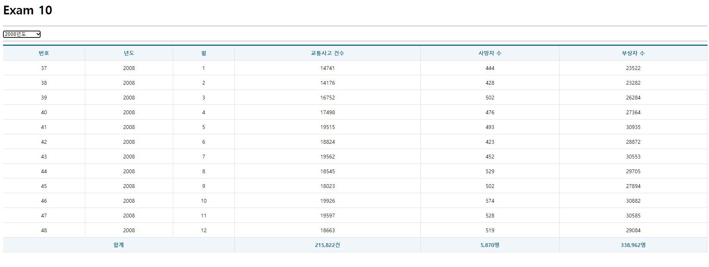

# 구현 결과 (답지 보고 수정)



## App.js

```js
import React, { useCallback } from "react";
import Table from "./components/Table";
import Spinner from "./components/Spinner";
import useMounterdRef from "./hooks/useMounterdRef";
import useAxios from "axios-hooks";

const URL = "http://localhost:3001/traffic_acc";

const App = () => {
  const [{ data, loading, error }, refetch] = useAxios(URL);

  const [year, setYear] = React.useState("");

  const mountedRef = useMounterdRef();

  const selectDropDown = useCallback(
    (e) => {
      e.preventDefault();

      const current = e.target;
      const key = current.name;
      const value = current[current.selectedIndex].value;

      const newYear = { ...year, [key]: value };

      setYear(newYear);

      console.log(newYear);
    },
    [setYear, year]
  );

  React.useEffect(() => {
    if (mountedRef.current) {
      const params = {};
      for (const key in year) {
        if (year[key]) {
          params[key] = year[key];
        }
      }
      refetch({
        params: params,
      });
    }
  }, [mountedRef, refetch, year]);

  if (error) {
    console.error(error);
    return (
      <div>
        <h1>Oops~!!! {error.code} Error.</h1>
        <hr />
        <p>{error.message}</p>
      </div>
    );
  }

  new Array(2018 - 2005 + 1);

  return (
    <div>
      <Spinner visible={loading} />
      <h1>Exam 10</h1>
      <hr />
      <select name="year" onChange={selectDropDown}>
        <option value="">-- 년도 선택 --</option>
        {[...new Array(2018 - 2005 + 1 )].map((v, i) => {
          return (<option key={i} value={2005 + i}>{2005 + i}년도</option>)
        })}
      </select>
      <hr />
      <Table>
        <thead>
          <tr>
            <th>번호</th>
            <th>년도</th>
            <th>월</th>
            <th>교통사고 건수</th>
            <th>사망자 수</th>
            <th>부상자 수</th>
          </tr>
        </thead>
        <tbody>
          {data &&
            data.map(({ id, year, month, accident, death, injury }, i) => {
              return (
                <tr key={id}>
                  <td>{id}</td>
                  <td>{year}</td>
                  <td>{month}</td>
                  <td>{accident}</td>
                  <td>{death}</td>
                  <td>{injury}</td>
                </tr>
              );
            })}
        </tbody>
        <tfoot>
          <tr>
            <th colSpan={3}>합계</th>
            {/* 리액트는 렌더링이 먼저 되기에, 데이터가 없을 경우 undefined로 에러가 날 수 있다.
                && 연산자를 사용해 주면 에러 해결이 가능하다. */}
            <th>{data && data.map((v) => v.accident).reduce((p, c) => p + c, 0).toLocaleString()}건</th>
            <th>{data && data.map((v) => v.death).reduce((p, c) => p + c, 0).toLocaleString()}명</th>
            <th>{data && data.map((v) => v.injury).reduce((p, c) => p + c, 0).toLocaleString()}명</th>
          </tr>
        </tfoot>
      </Table>
    </div>
  );
};

export default App;
```
