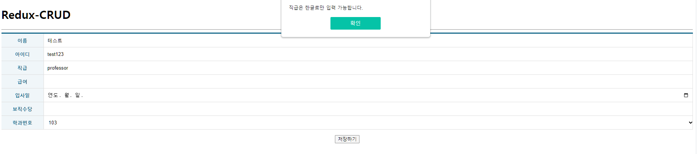

# 통합구현_보고서_천경재

* 공통
```js
/**
 * @filename    : app.js
 * @author      : 천경재 (yocasd2@gamil.com)
 * @description : 라우팅
*/

import React, { memo } from 'react';
import { Routes, Route } from 'react-router-dom';

import ProfessorList from './pages/ProfessorList';
import ProfessorAdd from './pages/ProfessorAdd';
import ProfessorEdit from './pages/ProfessorEdit';
import ProfessorItem from './pages/ProfessorItem';

const App = memo(() => {
    return (
        <div>
            <h1>Redux-CRUD</h1>

            <hr/>

            <Routes>
                <Route path='/' exapt element={<ProfessorList />} />
                <Route path='/professorAdd' element={<ProfessorAdd />} />
                <Route path='/ProfessorEdit/:profno' exapt element={<ProfessorEdit />} />
                <Route path='/ProfessorItem/:profno' element={<ProfessorItem />} />
            </Routes>
        </div>
    );
});

export default App;
```

## 【문항1】 페이지 번호와 키워드 검색 기능이 포함된 목록 조회 기능을 갖는 웹 페이지를 구현하고 이에 대한 소스코드와 실행 스크린샷을 제출하시오. Redux Slice, Page 및 관련된 컴포넌트들의 소스코드를 제시 하여야 합니다.

* 슬라이스
```js
/**
 * @filename    : ProfessorSlice.js
 * @author      : 천경재 (yocasd2@gamil.com)
 * @description : 목록조회, 검색, 페이지네이션
*/

import { createSlice, createAsyncThunk } from "@reduxjs/toolkit";
import { pending, fulfilled, rejected } from "../Util";
import axios from "axios";

const API_URL = "http://localhost:3001/professor/";

export const getList = createAsyncThunk(
    "ProfessorSlice/getList",
    async (payload, { rejectWithValue }) => {
        let result = null;

        try {
            result = await axios.get(API_URL, {
                params: {
                    query: payload?.query,
                    page: payload?.page,
                    rows: payload?.rows,
                },
            });
        } catch (err) {
            result = rejectWithValue(err.response);
        }

        return result;
    }
);

const ProfessorSlice = createSlice({
    name: "ProfessorSlice",
    initialState: {
        data: null,
        loading: false,
        error: null,
    },
    reducers: {},
    extraReducers: {
        [getList.pending]: pending,
        [getList.fulfilled]: fulfilled,
        [getList.rejected]: rejected,
    },
});

export default ProfessorSlice.reducer;
```

* 페이지
```js
/**
 * @filename    : ProfessorList.js
 * @author      : 천경재 (yocasd2@gamil.com)
 * @description : 목록조회 페이지(목록조회, 검색, 페이지네이션)
*/

import React, { memo, useCallback, useRef } from "react";
import styled from "styled-components";
import { NavLink, useNavigate } from "react-router-dom";
import { useQueryString } from "../hooks/useQueryString";
import dayjs from "dayjs";

import Spinner from "../components/Spinner";
import ErrorView from "../components/ErrorView";
import Table from "../components/Table";

import { useSelector, useDispatch } from "react-redux";
import { getList } from "../slices/ProfessorSlice";

const ControlContainer = styled.form`
    position: sticky;
    top: 0;
    background-color: #fff;
    border-top: 1px solid #eee;
    border-bottom: 1px solid #eee;
    padding: 10px 0;

    .controll {
        margin-right: 5px;
        display: inline-block;
        font-size: 16px;
        padding: 7px 10px 5px 10px;
        border: 1px solid #ccc;
    }

    .clickable {
        background-color: #fff;
        color: #000;
        text-decoration: none;
        cursor: pointer;

        &:hover {
            background-color: #06f2;
        }
        &:active {
            transform: scale(0.9, 0.9);
        }
    }
`;

const Pagenation = styled.ul`
    list-style: none;
    padding: 0;
    margin: 20px 0;
    display: flex;
    justify-content: center;

    a {
        color: black;
        padding: 8px 12px;
        text-decoration: none;
        transition: background-color 0.3s;
        margin: 0 5px;

        &.current-page {
            background-color: #116688;
            color: white;
            border-radius: 5px;
        }

        &.disabled {
            color: #ccc;
            cursor: not-allowed;
        }
        &:hover:not(.current-page) {
            background-color: #ddd;
            border-radius: 5px;
        }
    }
`;

const ProfessorList = memo(() => {
    const dispatch = useDispatch();
    const { data, loading, error } = useSelector(
        (state) => state.ProfessorSlice
    );
    const navigate = useNavigate();

    const refRowsDropdown = useRef();
    const refTextInput = useRef();

    const { query, rows, page } = useQueryString({
        query: "",
        rows: 10,
        page: 1,
    });

    // 검색
    React.useEffect(() => {
        dispatch(
            getList({
                query: query,
                rows: rows,
                page: page,
            })
        );
        refRowsDropdown.current.value = rows;
        refTextInput.current.value = query;
    }, [dispatch, query, rows, page]);

    // 목록 조회
    const onSearchSubmit = useCallback((e) => {
        e.preventDefault();
        const dropdown = refRowsDropdown.current;
        const input = refTextInput.current;

        navigate(`/?query=${input.value}&rows=${dropdown.value}`);
    }, [navigate]);


    return (
        <div>
            <Spinner visible={loading} />

            <ControlContainer onSubmit={onSearchSubmit}>
                <select defaultValue={rows} name="rows" className="controll" onChange={onSearchSubmit} ref={refRowsDropdown}>
                    <option value={rows}>10개씩 보기</option>
                    <option value="20">20개씩 보기</option>
                    <option value="30">30개씩 보기</option>
                </select>
                <input type="text" className="controll" ref={refTextInput} placeholder='교수번호 혹은 이름 입력.'/>
                <button type="submit" className="controll clickable">
                    검색
                </button>
            </ControlContainer>

            {error ? (
                <ErrorView error={error} />
            ) : (
                data && (
                    <>
                        <Table>
                            <thead>
                                <tr>
                                    <th>교수번호</th>
                                    <th>이름</th>
                                    <th>아이디</th>
                                    <th>직급</th>
                                    <th>급여</th>
                                    <th>입사일</th>
                                    <th>보직수당</th>
                                    <th>학과번호</th>
                                </tr>
                            </thead>
                            <tbody>
                                {data.item.length > 0 ? (
                                    data.item.map((item, index) => {
                                        return (
                                            <tr key={item.profno} className="profno">
                                                {/* 데이터를 텍스트로 출력 */}
                                                <td>{item.profno}</td>
                                                <td>{item.name}</td>
                                                <td>{item.userid}</td>
                                                <td>{item.position}</td>
                                                <td>{item.sal}</td>
                                                <td>{dayjs(item.hiredate).format('YYYY-MM-DD')}</td>
                                                <td>{item.comm === null ? "없음" : item.comm}</td>
                                                <td>{item.deptno}</td>
                                            </tr>
                                        );
                                    })
                                ) : (
                                    <tr>
                                        <td colSpan="5" align="center">
                                            검색결과가 없습니다.
                                        </td>
                                    </tr>
                                )}
                            </tbody>
                        </Table>

                        {data && (
                            <Pagenation>
                                {data.pagenation.prevGroupLastPage > 0 ? (
                                    <li><NavLink 
                                        to={`/?query=${query}&rows=${rows}&page=${data.pagenation.prevGroupLastPage}`}>&laquo;
                                    </NavLink></li>
                                ) : (
                                    <li><NavLink to='#' className='disabled'>&laquo;</NavLink></li>
                                )}

                                {(() => {
                                    const li = [];
                                    const start = data.pagenation.groupStart;
                                    const end = data.pagenation.groupEnd + 1;
                                    for (let i = start; i < end; i++) {
                                        if (i === data.pagenation.nowPage) {
                                            li.push(
                                                <li key={i}>
                                                    <NavLink to='#' className='current-page'>{i}
                                                    </NavLink>
                                                </li>
                                            )
                                        } else {
                                            li.push(
                                                <li key={i}>
                                                    <NavLink to={`/?query=${query}&rows=${rows}&page=${i}`}>{i}
                                                    </NavLink>
                                                </li>
                                            )
                                        }
                                    }
                                    
                                    return li;
                                })()}

                                {data.pagenation.nextGroupFirstPage > 0 ? (
                                    <li><NavLink 
                                        to={`/?query=${query}&rows=${rows}&page=${data.pagenation.nextGroupFirstPage}`}>&raquo;
                                    </NavLink></li>
                                ) : (
                                    <li><NavLink to='#' className='disabled'>&raquo;</NavLink></li>
                                )}
                            </Pagenation>
                        )}
                    </>
                )
            )}
        </div>
    );
});

export default ProfessorList;
```


<hr/>

## 【문항2】단일 항목에 대한 상세 조회 기능을 갖는 웹 페이지를 구현하고 이에 대한 소스코드와 실행 스크린샷을 제출하시오. Redux Slice, Page 및 관련된 컴포넌트들의 소스코드를 제시하여야 합니다.

* 슬라이스
```js
/**
 * @filename    : ProfessorSlice.js
 * @author      : 천경재 (yocasd2@gamil.com)
 * @description : 단일항목 상세조회
*/

import { createSlice, createAsyncThunk } from "@reduxjs/toolkit";
import { pending, fulfilled, rejected } from "../Util";
import axios from "axios";

const API_URL = "http://localhost:3001/professor/";

export const getList = createAsyncThunk(
    "ProfessorSlice/getList",
    async (payload, { rejectWithValue }) => {
        let result = null;

        try {
            result = await axios.get(API_URL, {
                params: {
                    query: payload?.query,
                    page: payload?.page,
                    rows: payload?.rows,
                },
            });
        } catch (err) {
            result = rejectWithValue(err.response);
        }

        return result;
    }
);

/* 단일행 데이터 조회*/
export const getItem = createAsyncThunk(
    "ProfessorSlice/getItem",
    async (payload, { rejectWithValue }) => {
        let result = null;
        console.log(payload?.profno);
        try {
            result = await axios.get(`${API_URL}${payload?.profno}/`);
        } catch (err) {
            result = rejectWithValue(err.response);
        }

        return result;
    }
);

const ProfessorSlice = createSlice({
    name: "ProfessorSlice",
    initialState: {
        data: null,
        loading: false,
        error: null,
    },
    reducers: {},
    extraReducers: {
        [getList.pending]: pending,
        [getList.fulfilled]: fulfilled,
        [getList.rejected]: rejected,

        /** 단일행 데이터 조회 */
        [getItem.pending]: pending,
        [getItem.fulfilled]: fulfilled,
        [getItem.rejected]: rejected,
    },
});

export default ProfessorSlice.reducer;
```

* 페이지-1
```js
/**
 * @filename    : ProfessorList.js
 * @author      : 천경재 (yocasd2@gamil.com)
 * @description : 단일 항목 상세보기 검색
*/

import React, { memo, useCallback, useRef } from "react";
import styled from "styled-components";
import { NavLink, useNavigate } from "react-router-dom";
import { useQueryString } from "../hooks/useQueryString";
import dayjs from "dayjs";

import Spinner from "../components/Spinner";
import ErrorView from "../components/ErrorView";
import Table from "../components/Table";

import { useSelector, useDispatch } from "react-redux";
import { getList } from "../slices/ProfessorSlice";

styled 생략...

const ProfessorList = memo(() => {
    const dispatch = useDispatch();
    const { data, loading, error } = useSelector(
        (state) => state.ProfessorSlice
    );
    const navigate = useNavigate();

    const refRowsDropdown = useRef();
    const refTextInput = useRef();
    const refDetails = useRef();

    const { query, rows, page } = useQueryString({
        query: "",
        rows: 10,
        page: 1,
    });

    // 검색
    React.useEffect(() => {
        dispatch(
            getList({
                query: query,
                rows: rows,
                page: page,
            })
        );
        refRowsDropdown.current.value = rows;
        refTextInput.current.value = query;
    }, [dispatch, query, rows, page]);

    // 목록 조회
    const onSearchSubmit = useCallback((e) => {
        e.preventDefault();
        const dropdown = refRowsDropdown.current;
        const input = refTextInput.current;

        navigate(`/?query=${input.value}&rows=${dropdown.value}`);
    }, [navigate]);
 
    // 상세 페이지로 이동
    const onDetailSubmit = useCallback((e) => {
        e.preventDefault();
        const input = refDetails.current.value;
        navigate(`/ProfessorItem/${input}`);
    }, [navigate]);

    return (
        <div>
            <Spinner visible={loading} />

            <ControlContainer onSubmit={onSearchSubmit}>
                <select defaultValue={rows} name="rows" className="controll" onChange={onSearchSubmit} ref={refRowsDropdown}>
                    <option value={rows}>10개씩 보기</option>
                    <option value="20">20개씩 보기</option>
                    <option value="30">30개씩 보기</option>
                </select>
                <input type="text" className="controll" ref={refTextInput} placeholder='교수번호 혹은 이름 입력.'/>
                <button type="submit" className="controll clickable">
                    검색
                </button>
            </ControlContainer>
            <ControlContainer onSubmit={onDetailSubmit}>
                <input type="text" className="controll" ref={refDetails} placeholder='교수번호를 입력해주세요.'/>
                <button type="submit" className="controll clickable">
                    상세보기
                </button>
            </ControlContainer>


            {error ? (
                <ErrorView error={error} />
            ) : (
                data && (
                    <>
                        <Table>
                            <thead>
                                <tr>
                                    <th>교수번호</th>
                                    <th>이름</th>
                                    <th>아이디</th>
                                    <th>직급</th>
                                    <th>급여</th>
                                    <th>입사일</th>
                                    <th>보직수당</th>
                                    <th>학과번호</th>
                                </tr>
                            </thead>
                            <tbody>
                                {data.item.length > 0 ? (
                                    data.item.map((item, index) => {
                                        return (
                                            <tr key={item.profno} className="profno">
                                                {/* 데이터를 텍스트로 출력 */}
                                                <td>{item.profno}</td>
                                                <td>{item.name}</td>
                                                <td>{item.userid}</td>
                                                <td>{item.position}</td>
                                                <td>{item.sal}</td>
                                                <td>{dayjs(item.hiredate).format('YYYY-MM-DD')}</td>
                                                <td>{item.comm === null ? "없음" : item.comm}</td>
                                                <td>{item.deptno}</td>
                                            </tr>
                                        );
                                    })
                                ) : (
                                    <tr>
                                        <td colSpan="5" align="center">
                                            검색결과가 없습니다.
                                        </td>
                                    </tr>
                                )}
                            </tbody>
                        </Table>

                        {data && (
                            <Pagenation>
                                {data.pagenation.prevGroupLastPage > 0 ? (
                                    <li><NavLink 
                                        to={`/?query=${query}&rows=${rows}&page=${data.pagenation.prevGroupLastPage}`}>&laquo;
                                    </NavLink></li>
                                ) : (
                                    <li><NavLink to='#' className='disabled'>&laquo;</NavLink></li>
                                )}

                                {(() => {
                                    const li = [];
                                    const start = data.pagenation.groupStart;
                                    const end = data.pagenation.groupEnd + 1;
                                    for (let i = start; i < end; i++) {
                                        if (i === data.pagenation.nowPage) {
                                            li.push(
                                                <li key={i}><NavLink to='#' className='current-page'>{i}</NavLink></li>
                                            )
                                        } else {
                                            li.push(
                                                <li key={i}>
                                                    <NavLink to={`/?query=${query}&rows=${rows}&page=${i}`}>{i}
                                                    </NavLink>
                                                </li>
                                            )
                                        }
                                    }
                                    
                                    return li;
                                })()}

                                {data.pagenation.nextGroupFirstPage > 0 ? (
                                    <li><NavLink 
                                        to={`/?query=${query}&rows=${rows}&page=${data.pagenation.nextGroupFirstPage}`}>&raquo;
                                    </NavLink></li>
                                ) : (
                                    <li><NavLink to='#' className='disabled'>&raquo;</NavLink></li>
                                )}
                            </Pagenation>
                        )}
                    </>
                )
            )}
        </div>
    );
});

export default ProfessorList;
```
* 페이지 2
```js
/**
 * @filename    : ProfessorItem.js
 * @author      : 천경재 (yocasd2@gamil.com)
 * @description : 단일 항목 상세 페이지
 * 
*/

import React, { memo } from "react";
import Spinner from "../components/Spinner";
import ErrorView from "../components/ErrorView";
import TableEx from "../components/TableEx";
import { useSelector, useDispatch } from "react-redux";
import { useParams } from "react-router-dom";
import { getItem } from "../slices/ProfessorSlice";
import styled from "styled-components";

const ItemCSS = styled(TableEx)`
p {
    padding-left: 15px;
    font-size: 18px;
}
`;

const ProfessorItem = memo(() => {
    const { profno } = useParams();

    const dispatch = useDispatch();
    const { data, loading, error } = useSelector(
        (state) => state.ProfessorSlice
    );

    console.log(data);
    React.useEffect(() => {
        dispatch(
            getItem({
                profno: profno,
            })
        );
    }, [dispatch, profno]);

    return (
        <>
            <Spinner visible={loading} />

            {error ? (
                <ErrorView error={error} />
            ) : (
                <div>
                    <h2>항목 상세보기</h2>
                    <ItemCSS>
                        <colgroup>
                            <col width="120" />
                            <col />
                        </colgroup>
                        <tbody>
                            <tr>
                                <th>교수번호</th>
                                <td className="inputWrapper">
                                <p>{data && data.item.profno}</p>
                                </td>
                            </tr>
                            <tr>
                                <th>이름</th>
                                <td className="inputWrapper">
                                    <p>{data && data.item.name}</p>
                                </td>
                            </tr>
                            <tr>
                                <th>아이디</th>
                                <td className="inputWrapper">
                                <p>{data && data.item.userid}</p>
                                </td>
                            </tr>
                            <tr>
                                <th>직급</th>
                                <td className="inputWrapper">
                                <p>{data && data.item.position}</p>
                                </td>
                            </tr>
                            <tr>
                                <th>급여</th>
                                <td className="inputWrapper">
                                <p>{data && data.item.sal}</p>
                                </td>
                            </tr>
                            <tr>
                                <th>입사일</th>
                                <td className="inputWrapper">
                                <p>{data && data.item.hiredate}</p>
                                </td>
                            </tr>
                            <tr>
                                <th>보직수당</th>
                                <td className="inputWrapper">
                                <p>{data && data.item.comm}</p>
                                </td>
                            </tr>
                            <tr>
                                <th>학과번호</th>
                                <td className="inputWrapper">
                                <p>{data && data.item.deptno}</p>
                                </td>
                            </tr>
                        </tbody>
                    </ItemCSS>
                </div>
            )}
        </>
    );
});

export default ProfessorItem;
```


<hr/>

## 【문항3】 신규 데이터를 등록할 수 있는 기능을 갖는 웹 페이지를 구현하고 이에 대한 소스코드와 실행 스크린샷을 제출하시오 관련된 참조키는 Redux가 아닌 hook을 사용하여 백엔드로부터 데이터를 받아온 후 Dropdown을 통해 선택할 수 있어야 합니다. Redux Slice, Page 및 관련된 컴포넌트들의 소스코드를 제시하여야 합니다.

* 슬라이스
```js
/**
 * @filename    : ProfessorSlice.js
 * @author      : 천경재 (yocasd2@gamil.com)
 * @description : 신규 데이터 등록
*/

import { createSlice, createAsyncThunk } from "@reduxjs/toolkit";
import { pending, fulfilled, rejected } from "../Util";
import axios from "axios";
import { cloneDeep } from "lodash";

const API_URL = "http://localhost:3001/professor/";

export const getList = createAsyncThunk(
    "ProfessorSlice/getList",
    async (payload, { rejectWithValue }) => {
        let result = null;

        try {
            result = await axios.get(API_URL, {
                params: {
                    query: payload?.query,
                    page: payload?.page,
                    rows: payload?.rows,
                },
            });
        } catch (err) {
            result = rejectWithValue(err.response);
        }

        return result;
    }
);

/* 데이터 저장 */
export const postItem = createAsyncThunk(
    "ProfessorSlice/postItem",
    async (payload, { rejectWithValue }) => {
        let result = null;
        
        try {
            result = await axios.post(API_URL, {
                name: payload.name,
                userid: payload.userid,
                position: payload.position,
                sal: payload.sal,
                hiredate: payload.hiredate,
                comm: payload.comm,
                deptno: payload.deptno,
            });
        } catch (err) {
            result = rejectWithValue(err.response);
        }

        return result;
    }
);

const ProfessorSlice = createSlice({
    name: "ProfessorSlice",
    initialState: {
        data: null,
        loading: false,
        error: null,
    },
    reducers: {},
    extraReducers: {
        [getList.pending]: pending,
        [getList.fulfilled]: fulfilled,
        [getList.rejected]: rejected,

        [getItem.pending]: pending,
        [getItem.fulfilled]: fulfilled,
        [getItem.rejected]: rejected,

        /** 데이터 저장 */
        [postItem.pending]: pending,
        [postItem.fulfilled]: (state, { meta, payload }) => {
            const data = cloneDeep(state.data);
            data.item.unshift(payload.data.item);
            data.item.pop();

            return {
                data: data,
                loading: false,
                error: null,
            };
        },
        [postItem.rejected]: rejected,
    },
});

export default ProfessorSlice.reducer;
```
* 페이지 1
```js
/**
 * @filename    : ProfessorList.js
 * @author      : 천경재 (yocasd2@gamil.com)
 * @description : 신규 데이터 등록 페이지로 route
*/

import React, { memo, useCallback, useRef } from "react";
import styled from "styled-components";
import { NavLink, useNavigate } from "react-router-dom";
import { useQueryString } from "../hooks/useQueryString";
import dayjs from "dayjs";

import Spinner from "../components/Spinner";
import ErrorView from "../components/ErrorView";
import Table from "../components/Table";

import { useSelector, useDispatch } from "react-redux";
import { getList } from "../slices/ProfessorSlice";

styled 생략...

const ProfessorList = memo(() => {
    const dispatch = useDispatch();
    const { data, loading, error } = useSelector(
        (state) => state.ProfessorSlice
    );
    const navigate = useNavigate();

    const refRowsDropdown = useRef();
    const refTextInput = useRef();

    const { query, rows, page } = useQueryString({
        query: "",
        rows: 10,
        page: 1,
    });

    // 검색
    React.useEffect(() => {
        dispatch(
            getList({
                query: query,
                rows: rows,
                page: page,
            })
        );
        refRowsDropdown.current.value = rows;
        refTextInput.current.value = query;
    }, [dispatch, query, rows, page]);

    // 목록 조회
    const onSearchSubmit = useCallback((e) => {
        e.preventDefault();
        const dropdown = refRowsDropdown.current;
        const input = refTextInput.current;

        navigate(`/?query=${input.value}&rows=${dropdown.value}`);
    }, [navigate]);

    return (
        <div>
            <Spinner visible={loading} />

            <ControlContainer onSubmit={onSearchSubmit}>
                <select defaultValue={rows} name="rows" className="controll" onChange={onSearchSubmit} ref={refRowsDropdown}>
                    <option value={rows}>10개씩 보기</option>
                    <option value="20">20개씩 보기</option>
                    <option value="30">30개씩 보기</option>
                </select>
                <input type="text" className="controll" ref={refTextInput} placeholder='교수번호 혹은 이름 입력.'/>
                <button type="submit" className="controll clickable">
                    검색
                </button>
                <NavLink to="professorAdd" className="controll clickable">
                    교수정보 추가하기
                </NavLink>
            </ControlContainer>

            {error ? (
                <ErrorView error={error} />
            ) : (
                data && (
                    <>
                        <Table>
                            <thead>
                                <tr>
                                    <th>교수번호</th>
                                    <th>이름</th>
                                    <th>아이디</th>
                                    <th>직급</th>
                                    <th>급여</th>
                                    <th>입사일</th>
                                    <th>보직수당</th>
                                    <th>학과번호</th>
                                </tr>
                            </thead>
                            <tbody>
                                {data.item.length > 0 ? (
                                    data.item.map((item, index) => {
                                        return (
                                            <tr key={item.profno} className="profno">
                                                <td>{item.profno}</td>
                                                <td>{item.name}</td>
                                                <td>{item.userid}</td>
                                                <td>{item.position}</td>
                                                <td>{item.sal}</td>
                                                <td>{dayjs(item.hiredate).format('YYYY-MM-DD')}</td>
                                                <td>{item.comm === null ? "없음" : item.comm}</td>
                                                <td>{item.deptno}</td>
                                            </tr>
                                        );
                                    })
                                ) : (
                                    <tr>
                                        <td colSpan="5" align="center">
                                            검색결과가 없습니다.
                                        </td>
                                    </tr>
                                )}
                            </tbody>
                        </Table>

                        {data && (
                            <Pagenation>
                                {data.pagenation.prevGroupLastPage > 0 ? (
                                    <li><NavLink 
                                        to={`/?query=${query}&rows=${rows}&page=${data.pagenation.prevGroupLastPage}`}>&laquo;
                                    </NavLink></li>
                                ) : (
                                    <li><NavLink to='#' className='disabled'>&laquo;</NavLink></li>
                                )}

                                {(() => {
                                    const li = [];
                                    const start = data.pagenation.groupStart;
                                    const end = data.pagenation.groupEnd + 1;
                                    for (let i = start; i < end; i++) {
                                        if (i === data.pagenation.nowPage) {
                                            li.push(
                                                <li key={i}><NavLink to='#' className='current-page'>{i}</NavLink></li>
                                            )
                                        } else {
                                            li.push(
                                                <li key={i}>
                                                    <NavLink to={`/?query=${query}&rows=${rows}&page=${i}`}>{i}
                                                    </NavLink>
                                                </li>
                                            )
                                        }
                                    }
                                    
                                    return li;
                                })()}

                                {data.pagenation.nextGroupFirstPage > 0 ? (
                                    <li><NavLink 
                                        to={`/?query=${query}&rows=${rows}&page=${data.pagenation.nextGroupFirstPage}`}>&raquo;
                                    </NavLink></li>
                                ) : (
                                    <li><NavLink to='#' className='disabled'>&raquo;</NavLink></li>
                                )}
                            </Pagenation>
                        )}
                    </>
                )
            )}
        </div>
    );
});

export default ProfessorList;
```
* 페이지 2
```js
/**
 * @filename    : ProfessorAdd.js
 * @author      : 천경재 (yocasd2@gamil.com)
 * @description : 신규 데이터 등록 페이지
*/

import React, { memo } from "react";
import { useNavigate } from "react-router-dom";

import Spinner from "../components/Spinner";
import ErrorView from "../components/ErrorView";
import TableEx from "../components/TableEx";

import regexHelper from "../libs/RegexHelper";

import { useSelector, useDispatch } from "react-redux";
import { postItem } from "../slices/ProfessorSlice";
import dayjs from "dayjs";
import useAxios from "axios-hooks";

const ProfessorAdd = memo(() => {
    // 학과번호 dropdown은 redux아닌 hook사용.
    const [{ data }] = useAxios("http://localhost:3001/department");
    
    const navigate = useNavigate();
    const dispatch = useDispatch();
    const { loading, error } = useSelector((state) => state.ProfessorSlice);
    const [today] = React.useState(dayjs().format('YYYY-MM-DD'));
    
    const onSubmit = React.useCallback((e) => {
        e.preventDefault();

        const current = e.target;
        const time = ' 00:00:00';

        try {
            regexHelper.value(current.name.value, "이름을 입력해주세요.");
            regexHelper.minLength(current.name.value, 2, "이름은 최소 2글자 이상부터 입력 가능합니다.");
            regexHelper.maxLength(current.name.value, 20, "이름은 최대 20글자 까지 입력 가능합니다.");
            regexHelper.kor(current.name.value, "이름은 한글로만 입력 가능합니다.");
    
            regexHelper.value(current.userid.value, "아이디를 입력해주세요.");
            regexHelper.minLength(current.userid.value, 2, "아이디는 최소 2글자 이상부터 입력 가능합니다.");
            regexHelper.maxLength(current.userid.value, 20, "아이디는 최대 20글자 까지 입력 가능합니다.");
            regexHelper.engNum(current.userid.value, "아이디는 영문과 숫자로만 입력 가능합니다.");
    
            regexHelper.value(current.position.value, "직급을 입력해주세요.");
            regexHelper.minLength(current.position.value, 2, "직급은 최소 2글자 이상부터 입력 가능합니다.");
            regexHelper.maxLength(current.position.value, 20, "직급은 최대 20자 까지 입력 가능합니다.");
            regexHelper.kor(current.position.value, "직급은 한글로만 입력 가능합니다.");
                
            regexHelper.value(current.sal.value, "급여를 입력해주세요.");
            regexHelper.minLength(current.sal.value, 2, "급여는 최소 2글자 이상부터 입력 가능합니다.");
            regexHelper.maxLength(current.sal.value, 20, "급여는 최대 20자 까지 입력 가능합니다.");
            regexHelper.num(current.sal.value, "급여는 숫자로만 입력 가능합니다.");

            regexHelper.value(current.hiredate.value, "입사일을 입력해주세요.");
            regexHelper.date(current.hiredate.value+time, "입사일은 YYYY-MM-DD 형식에 맞게 입력해주세요.");

            regexHelper.nullNum(current.comm.value, "보직수당은 미입력 또는 숫자로만 입력 가능합니다.");
            regexHelper.value(current.deptno.value, "학과번호를 입력해주세요.");
            regexHelper.num(current.deptno.value, "학과번호는 숫자로만 입력 가능합니다.");
        } catch (e) {
            window.alert(e.message);
            e.field.focus();
            return;
        }

        dispatch(postItem({
                name: current.name.value,
                userid: current.userid.value,
                position: current.position.value,
                sal: current.sal.value,
                hiredate: current.hiredate.value+time,
                comm: current.comm.value,
                deptno: current.deptno.value,
        })).then(() => {
            navigate("/");
        });

    }, [dispatch, navigate]);

    return (
        <>
            <Spinner visible={loading} />

            {error ? (
                <ErrorView error={error} />
            ) : (
                <form onSubmit={onSubmit}>
                    <TableEx>
                        <colgroup>
                            <col width="120" />
                            <col />
                        </colgroup>
                        <tbody>
                            <tr>
                                <th>이름</th>
                                <td className="inputWrapper">
                                    <input className="field" type="text" name="name" />
                                </td>
                            </tr>
                            <tr>
                                <th>아이디</th>
                                <td className="inputWrapper">
                                    <input className="field" type="text" name="userid" />
                                </td>
                            </tr>
                            <tr>
                                <th>직급</th>
                                <td className="inputWrapper">
                                    <input className="field" type="text" name="position" />
                                </td>
                            </tr>
                            <tr>
                                <th>급여</th>
                                <td className="inputWrapper">
                                    <input className="field" type="text" name="sal" />
                                </td>
                            </tr>
                            <tr>
                                <th>입사일</th>
                                <td className="inputWrapper">
                                    <input className="field" type="date" name="hiredate" max={today}/>
                                </td>
                            </tr>
                            <tr>
                                <th>보직수당</th>
                                <td className="inputWrapper">
                                    <input className="field" type="text" name="comm" />
                                </td>
                            </tr>
                            <tr>
                                <th>학과번호</th>
                                <td className="inputWrapper">
                                    <select className="field" name="deptno">
                                        {data && data.item.map((v, i) => <option key={i} value={v.deptno}>{v.deptno}</option>)}
                                    </select>                                            
                                </td>
                            </tr>
                        </tbody>
                    </TableEx>

                    <div style={{ textAlign: "center" }}>
                        <button type="submit">저장하기</button>
                    </div>
                </form>
            )}
        </>
    );
});

export default ProfessorAdd;
```





<hr/>

## 【문항4】데이터를 수정할 수 있는 기능을 갖는 웹 페이지를 구현하고 이에 대한 소스코드와 실행 스크린샷을 제출하시오 관련된 참조키는 Redux가 아닌 hook을 사용하여 백엔드로부터 데이터를 받아온 후 Dropdown을 통해 선택할 수 있어야 합니다. Redux Slice, Page 및 관련된 컴포넌트들의 소스코드를 제시하여야 합니다.

* 슬라이스
```js
/**
 * @filename    : ProfessorSlice.js
 * @author      : 천경재 (yocasd2@gamil.com)
 * @description : 데이터 수정
*/
import { createSlice, createAsyncThunk } from "@reduxjs/toolkit";
import { pending, fulfilled, rejected } from "../Util";
import axios from "axios";
import { cloneDeep } from "lodash";

const API_URL = "http://localhost:3001/professor/";

/* 다중행 데이터 조회를 위한 비동기 함수 */
export const getList = createAsyncThunk(
    "ProfessorSlice/getList",
    async (payload, { rejectWithValue }) => {
        let result = null;

        try {
            result = await axios.get(API_URL, {
                params: {
                    query: payload?.query,
                    page: payload?.page,
                    rows: payload?.rows,
                },
            });
        } catch (err) {
            result = rejectWithValue(err.response);
        }

        return result;
    }
);

/* 데이터 수정 */
export const putItem = createAsyncThunk(
    "ProfessorSlice/putItem",
    async (payload, { rejectWithValue }) => {
        let result = null;

        try {
            result = await axios.put(`${API_URL}${payload.profno}/`, {
                profno: payload.profno,
                name: payload.name,
                userid: payload.userid,
                position: payload.position,
                sal: payload.sal,
                hiredate: payload.hiredate,
                comm: payload.comm,
                deptno: payload.deptno,
            });
        } catch (err) {
            result = rejectWithValue(err.response);
        }

        return result;
    }
);


const ProfessorSlice = createSlice({
    name: "ProfessorSlice",
    initialState: {
        data: null,
        loading: false,
        error: null,
    },
    reducers: {},
    extraReducers: {
        [getList.pending]: pending,
        [getList.fulfilled]: fulfilled,
        [getList.rejected]: rejected,

        /** 데이터 수정 */
        [putItem.pending]: pending,
        [putItem.fulfilled]: (state, { meta, payload }) => {
            const data = cloneDeep(state.data);
            console.log(data);

            const index = data.item.findIndex((el) => el.profno === parseInt(meta.arg.profno));
            console.log("index=" + index);

            if (index !== undefined) {
                data.item.splice(index, 1, payload.data.item);
            }
            console.log(data);

            return {
                data: data,
                loading: false,
                error: null,
            };
        },
        [putItem.rejected]: rejected,
    },
});

export default ProfessorSlice.reducer;
```
* 페이지 1
```js
/**
 * @filename    : ProfessorList.js
 * @author      : 천경재 (yocasd2@gamil.com)
 * @description : 데이터 수정 페이지로 이동
*/

import React, { memo, useCallback, useRef } from "react";
import styled from "styled-components";
import { NavLink, useNavigate } from "react-router-dom";
import { useQueryString } from "../hooks/useQueryString";
import dayjs from "dayjs";

import Spinner from "../components/Spinner";
import ErrorView from "../components/ErrorView";
import Table from "../components/Table";

import { useSelector, useDispatch } from "react-redux";
import { getList } from "../slices/ProfessorSlice";

styled 생략..

const ProfessorList = memo(() => {
    const dispatch = useDispatch();
    const { data, loading, error } = useSelector(
        (state) => state.ProfessorSlice
    );
    const navigate = useNavigate();

    const refRowsDropdown = useRef();
    const refTextInput = useRef();

    const { query, rows, page } = useQueryString({
        query: "",
        rows: 10,
        page: 1,
    });

    // 검색
    React.useEffect(() => {
        dispatch(
            getList({
                query: query,
                rows: rows,
                page: page,
            })
        );
        refRowsDropdown.current.value = rows;
        refTextInput.current.value = query;
    }, [dispatch, query, rows, page]);

    // 목록 조회
    const onSearchSubmit = useCallback((e) => {
        e.preventDefault();
        const dropdown = refRowsDropdown.current;
        const input = refTextInput.current;

        navigate(`/?query=${input.value}&rows=${dropdown.value}`);
    }, [navigate]);

    const onEditClick = useCallback((e) => {
        e.preventDefault();
        const current = e.target;
        const profno = current.dataset.profno;
        navigate(`/ProfessorEdit/${profno}`);

    }, [navigate]);

    return (
        <div>
            <Spinner visible={loading} />

            <ControlContainer onSubmit={onSearchSubmit}>
                <select defaultValue={rows} name="rows" className="controll" onChange={onSearchSubmit} ref={refRowsDropdown}>
                    <option value={rows}>10개씩 보기</option>
                    <option value="20">20개씩 보기</option>
                    <option value="30">30개씩 보기</option>
                </select>
                <input type="text" className="controll" ref={refTextInput} placeholder='교수번호 혹은 이름 입력.'/>
                <button type="submit" className="controll clickable">
                    검색
                </button>
            </ControlContainer>

            {error ? (
                <ErrorView error={error} />
            ) : (
                data && (
                    <>
                        <Table>
                            <thead>
                                <tr>
                                    <th>교수번호</th>
                                    <th>이름</th>
                                    <th>아이디</th>
                                    <th>직급</th>
                                    <th>급여</th>
                                    <th>입사일</th>
                                    <th>보직수당</th>
                                    <th>학과번호</th>
                                    <th>수정</th>
                                </tr>
                            </thead>
                            <tbody>
                                {data.item.length > 0 ? (
                                    data.item.map((item, index) => {
                                        return (
                                            <tr key={item.profno} className="profno">
                                                <td>{item.profno}</td>
                                                <td>{item.name}</td>
                                                <td>{item.userid}</td>
                                                <td>{item.position}</td>
                                                <td>{item.sal}</td>
                                                <td>{dayjs(item.hiredate).format('YYYY-MM-DD')}</td>
                                                <td>{item.comm === null ? "없음" : item.comm}</td>
                                                <td>{item.deptno}</td>
                                                <td>
                                                    <button type="button" data-profno={item.profno} onClick={onEditClick}>
                                                        수정하기
                                                    </button>
                                                </td>
                                            </tr>
                                        );
                                    })
                                ) : (
                                    <tr>
                                        <td colSpan="5" align="center">
                                            검색결과가 없습니다.
                                        </td>
                                    </tr>
                                )}
                            </tbody>
                        </Table>

                        {data && (
                            <Pagenation>
                                {data.pagenation.prevGroupLastPage > 0 ? (
                                    <li><NavLink 
                                        to={`/?query=${query}&rows=${rows}&page=${data.pagenation.prevGroupLastPage}`}>&laquo;
                                    </NavLink></li>
                                ) : (
                                    <li><NavLink to='#' className='disabled'>&laquo;</NavLink></li>
                                )}

                                {(() => {
                                    const li = [];
                                    const start = data.pagenation.groupStart;
                                    const end = data.pagenation.groupEnd + 1;
                                    for (let i = start; i < end; i++) {
                                        if (i === data.pagenation.nowPage) {
                                            li.push(
                                                <li key={i}><NavLink to='#' className='current-page'>{i}</NavLink></li>
                                            )
                                        } else {
                                            li.push(
                                                <li key={i}>
                                                    <NavLink to={`/?query=${query}&rows=${rows}&page=${i}`}>{i}
                                                    </NavLink>
                                                </li>
                                            )
                                        }
                                    }
                                    
                                    return li;
                                })()}

                                {data.pagenation.nextGroupFirstPage > 0 ? (
                                    <li><NavLink 
                                        to={`/?query=${query}&rows=${rows}&page=${data.pagenation.nextGroupFirstPage}`}>&raquo;
                                    </NavLink></li>
                                ) : (
                                    <li><NavLink to='#' className='disabled'>&raquo;</NavLink></li>
                                )}
                            </Pagenation>
                        )}
                    </>
                )
            )}
        </div>
    );
});

export default ProfessorList;
```
* 페이지 2
```js
/**
 * @filename    : ProfessorEdit.js
 * @author      : 천경재 (yocasd2@gamil.com)
 * @description : 데이터 수정 페이지
*/
import React, { memo, useEffect, useState } from "react";
import { useNavigate, useParams } from "react-router-dom";
import dayjs from "dayjs";

import Spinner from "../components/Spinner";
import ErrorView from "../components/ErrorView";
import TableEx from "../components/TableEx";
import regexHelper from "../libs/RegexHelper";

import { useSelector, useDispatch } from "react-redux";
import { putItem } from "../slices/ProfessorSlice";

import useAxios from "axios-hooks";

const ProfessorEdit = memo(() => {
    // deptno Dropdown은 Redux가 아닌, hook사용.
    const [ dept ] = useAxios("http://localhost:3001/department");
    const [deptItem, setdeptItem] = useState();

    useEffect(() => {
        if (dept.loading === false) {
            if (dept.data) {
                setdeptItem(dept && dept.data.item);
            }
        }
    }, [dept]);

    const {profno} = useParams();
    const navigate = useNavigate();
    const dispatch = useDispatch();
    const { data, loading, error } = useSelector((state) => state.ProfessorSlice);
    const [today] = React.useState(dayjs().format('YYYY-MM-DD'));

    const [origin, setOrigin] = useState({
        name: '',
        userid: '',
        position: '',
        sal: '',
        hiredate: '',
        comm: '',
        deptno: '',
    })

    useEffect(() => {
        const index = data && data.item.findIndex(e => e.profno === parseInt(profno));
        setOrigin({
            name: data.item[index].name,
            userid: data.item[index].userid,
            position: data.item[index].position,
            sal: data.item[index].sal,
            hiredate: dayjs(data.item[index].hiredate).format('YYYY-MM-DD'),
            comm: data.item[index].comm,
            deptno: data.item[index].deptno,
        });
        console.log(data.item[index].deptno);
    }, [data, profno]);

    const onSubmit = React.useCallback((e) => {
        e.preventDefault();

        const current = e.target;
        const time = ' 00:00:00';

        try {
            regexHelper.value(current.name.value, "이름을 입력해주세요.");
            regexHelper.minLength(current.name.value, 2, "이름은 최소 2글자 이상부터 입력 가능합니다.");
            regexHelper.maxLength(current.name.value, 20, "이름은 최대 20글자 까지 입력 가능합니다.");
            regexHelper.kor(current.name.value, "이름은 한글로만 입력 가능합니다.");
    
            regexHelper.value(current.userid.value, "아이디를 입력해주세요.");
            regexHelper.minLength(current.userid.value, 2, "아이디는 최소 2글자 이상부터 입력 가능합니다.");
            regexHelper.maxLength(current.userid.value, 20, "아이디는 최대 20글자 까지 입력 가능합니다.");
            regexHelper.engNum(current.userid.value, "아이디는 영문과 숫자로만 입력 가능합니다.");
    
            regexHelper.value(current.position.value, "직급을 입력해주세요.");
            regexHelper.minLength(current.position.value, 2, "직급은 최소 2글자 이상부터 입력 가능합니다.");
            regexHelper.maxLength(current.position.value, 20, "직급은 최대 20자 까지 입력 가능합니다.");
            regexHelper.kor(current.position.value, "직급은 한글로만 입력 가능합니다.");
                
            regexHelper.value(current.sal.value, "급여를 입력해주세요.");
            regexHelper.minLength(current.sal.value, 2, "급여는 최소 2글자 이상부터 입력 가능합니다.");
            regexHelper.maxLength(current.sal.value, 20, "급여는 최대 20자 까지 입력 가능합니다.");
            regexHelper.num(current.sal.value, "급여는 숫자로만 입력 가능합니다.");

            regexHelper.value(current.hiredate.value, "입사일을 입력해주세요.");
            regexHelper.date(current.hiredate.value+time, "입사일은 YYYY-MM-DD 형식에 맞게 입력해주세요.");

            regexHelper.nullNum(current.comm.value, "보직수당은 미입력 또는 숫자로만 입력 가능합니다.");
            regexHelper.value(current.deptno.value, "학과번호를 입력해주세요.");
            regexHelper.num(current.deptno.value, "학과번호는 숫자로만 입력 가능합니다.");

        } catch (e) {
            window.alert(e.message);
            e.field.focus();
            return;
        }

        dispatch(putItem({
            profno: profno,
            name: current.name.value,
            userid: current.userid.value,
            position: current.position.value,
            sal: current.sal.value,
            hiredate: current.hiredate.value+time,
            comm: current.comm.value,
            deptno: current.deptno.value,
        })).then(() => {
            navigate("/");
        });

    }, [dispatch, profno, navigate]);

    return (
        <>
            <Spinner visible={loading} />

            {error ? (
                <ErrorView error={error} />
            ) : (
                <form onSubmit={onSubmit}>
                    <TableEx>
                        <colgroup>
                            <col width="120" />
                            <col />
                        </colgroup>
                        <tbody>
                            <tr>
                                <th>이름</th>
                                <td className="inputWrapper">
                                    <input className="field" type="text" name="name" defaultValue={origin.name}/>
                                </td>
                            </tr>
                            <tr>
                                <th>아이디</th>
                                <td className="inputWrapper">
                                    <input className="field" type="text" name="userid" defaultValue={origin.userid} />
                                </td>
                            </tr>
                            <tr>
                                <th>직급</th>
                                <td className="inputWrapper">
                                    <input className="field" type="text" name="position" defaultValue={origin.position} />
                                </td>
                            </tr>
                            <tr>
                                <th>급여</th>
                                <td className="inputWrapper">
                                    <input className="field" type="text" name="sal" defaultValue={origin.sal} />
                                </td>
                            </tr>
                            <tr>
                                <th>입사일</th>
                                <td className="inputWrapper">
                                    <input className="field" type="date" name="hiredate" max={today} 
                                        defaultValue={origin.hiredate}/>
                                </td>
                            </tr>
                            <tr>
                                <th>보직수당</th>
                                <td className="inputWrapper">
                                    <input className="field" type="text" name="comm" defaultValue={origin.comm} />
                                </td>
                            </tr>
                            <tr>
                                <th>학과번호</th>
                                <td className="inputWrapper">
                                    <select className="field" name="deptno" key={origin.deptno} defaultValue={origin.deptno}>
                                        {deptItem && deptItem.map((v, i) => 
                                            <option key={i} value={v.deptno}>{v.deptno}</option>)}
                                    </select>                                            
                                </td>
                            </tr>
                        </tbody>
                    </TableEx>

                    <div style={{ textAlign: "center" }}>
                        <button type="submit">저장하기</button>
                    </div>
                </form>
            )}
        </>
    );
});

export default ProfessorEdit;
```


<hr/>

## 【문항5】목록 페이지의 삭제버튼을 통해 데이터를 삭제할 수 있는 기능을 갖는 웹 페이지를 구현하고 이에 대한 소스코드와 실행 스크린샷을 제출하시오. Redux Slice, Page 및 관련된 컴포넌트들의 소스코드를 제시하여야 합니다.

* 슬라이스
```js
/**
 * @filename    : ProfessorSlice.js
 * @author      : 천경재 (yocasd2@gamil.com)
 * @description : 데이터 삭제
*/

import { createSlice, createAsyncThunk } from "@reduxjs/toolkit";
import { pending, fulfilled, rejected } from "../Util";
import axios from "axios";
import { cloneDeep } from "lodash";

const API_URL = "http://localhost:3001/professor/";

export const getList = createAsyncThunk(
    "ProfessorSlice/getList",
    async (payload, { rejectWithValue }) => {
        let result = null;

        try {
            result = await axios.get(API_URL, {
                params: {
                    query: payload?.query,
                    page: payload?.page,
                    rows: payload?.rows,
                },
            });
        } catch (err) {
            result = rejectWithValue(err.response);
        }

        return result;
    }
);

/* 데이터 삭제 */
export const deleteItem = createAsyncThunk(
    "ProfessorSlice/deleteItem",
    async (payload, { rejectWithValue }) => {
        let result = null;

        try {
            result = await axios.delete(`${API_URL}${payload.profno}/`);
        } catch (err) {
            result = rejectWithValue(err.response);
        }

        return result;
    }
);

const ProfessorSlice = createSlice({
    name: "ProfessorSlice",
    initialState: {
        data: null,
        loading: false,
        error: null,
    },
    reducers: {},
    extraReducers: {
        [getList.pending]: pending,
        [getList.fulfilled]: fulfilled,
        [getList.rejected]: rejected,

        /** 데이터 삭제 */
        [deleteItem.pending]: pending,
        [deleteItem.fulfilled]: (state, { meta, payload }) => {
            const data = cloneDeep(state.data);
            const index = data.item.findIndex((el) => el.profno === parseInt(meta.arg.profno));

            if (index !== undefined) {
                data.item.splice(index, 1);
            }
            console.log(data);

            return {
                data: data,
                loading: false,
                error: null,
            };
        },
        [deleteItem.rejected]: rejected,
    },
});

export default ProfessorSlice.reducer;
```
* 페이지
```js
/**
 * @filename    : ProfessorList.js
 * @author      : 천경재 (yocasd2@gamil.com)
 * @description : 데이터 삭제 페이지
*/

import React, { memo, useCallback, useRef } from "react";
import styled from "styled-components";
import { NavLink, useNavigate } from "react-router-dom";
import { useQueryString } from "../hooks/useQueryString";
import dayjs from "dayjs";

import Spinner from "../components/Spinner";
import ErrorView from "../components/ErrorView";
import Table from "../components/Table";

import { useSelector, useDispatch } from "react-redux";
import { getList, deleteItem } from "../slices/ProfessorSlice";

styled 생략..

const ProfessorList = memo(() => {
    const dispatch = useDispatch();
    const { data, loading, error } = useSelector(
        (state) => state.ProfessorSlice
    );
    const navigate = useNavigate();

    const refRowsDropdown = useRef();
    const refTextInput = useRef();

    const { query, rows, page } = useQueryString({
        query: "",
        rows: 10,
        page: 1,
    });

    // 검색
    React.useEffect(() => {
        dispatch(
            getList({
                query: query,
                rows: rows,
                page: page,
            })
        );
        refRowsDropdown.current.value = rows;
        refTextInput.current.value = query;
    }, [dispatch, query, rows, page]);

    // 목록 조회
    const onSearchSubmit = useCallback((e) => {
        e.preventDefault();
        const dropdown = refRowsDropdown.current;
        const input = refTextInput.current;

        navigate(`/?query=${input.value}&rows=${dropdown.value}`);
    }, [navigate]);

    const onDeleteClick = useCallback(
        (e) => {e.preventDefault();

        const current = e.target;

        if (window.confirm(`정말 ${current.dataset.name}(을)를 삭제하시겠습니까?`)) {
            dispatch(
                deleteItem({
                    profno: current.dataset.profno,
                })
            );
        }
    }, [dispatch]);
    
    return (
        <div>
            <Spinner visible={loading} />

            <ControlContainer onSubmit={onSearchSubmit}>
                <select defaultValue={rows} name="rows" className="controll" onChange={onSearchSubmit} ref={refRowsDropdown}>
                    <option value={rows}>10개씩 보기</option>
                    <option value="20">20개씩 보기</option>
                    <option value="30">30개씩 보기</option>
                </select>
                <input type="text" className="controll" ref={refTextInput} placeholder='교수번호 혹은 이름 입력.'/>
                <button type="submit" className="controll clickable">
                    검색
                </button>
            </ControlContainer>

            {error ? (
                <ErrorView error={error} />
            ) : (
                data && (
                    <>
                        <Table>
                            <thead>
                                <tr>
                                    <th>교수번호</th>
                                    <th>이름</th>
                                    <th>아이디</th>
                                    <th>직급</th>
                                    <th>급여</th>
                                    <th>입사일</th>
                                    <th>보직수당</th>
                                    <th>학과번호</th>
                                    <th>삭제</th>
                                </tr>
                            </thead>
                            <tbody>
                                {data.item.length > 0 ? (
                                    data.item.map((item, index) => {
                                        return (
                                            <tr key={item.profno} className="profno">
                                                <td>{item.profno}</td>
                                                <td>{item.name}</td>
                                                <td>{item.userid}</td>
                                                <td>{item.position}</td>
                                                <td>{item.sal}</td>
                                                <td>{dayjs(item.hiredate).format('YYYY-MM-DD')}</td>
                                                <td>{item.comm === null ? "없음" : item.comm}</td>
                                                <td>{item.deptno}</td>
                                                <td>
                                                    <button type="bitton" data-profno={item.profno} 
                                                        data-name={item.name} onClick={onDeleteClick}>
                                                            삭제하기
                                                    </button>
                                                </td>
                                            </tr>
                                        );
                                    })
                                ) : (
                                    <tr>
                                        <td colSpan="5" align="center">
                                            검색결과가 없습니다.
                                        </td>
                                    </tr>
                                )}
                            </tbody>
                        </Table>

                        {data && (
                            <Pagenation>
                                {data.pagenation.prevGroupLastPage > 0 ? (
                                    <li><NavLink 
                                        to={`/?query=${query}&rows=${rows}&page=${data.pagenation.prevGroupLastPage}`}>&laquo;
                                    </NavLink></li>
                                ) : (
                                    <li><NavLink to='#' className='disabled'>&laquo;</NavLink></li>
                                )}

                                {(() => {
                                    const li = [];
                                    const start = data.pagenation.groupStart;
                                    const end = data.pagenation.groupEnd + 1;
                                    for (let i = start; i < end; i++) {
                                        if (i === data.pagenation.nowPage) {
                                            li.push(
                                                <li key={i}><NavLink to='#' className='current-page'>{i}</NavLink></li>
                                            )
                                        } else {
                                            li.push(
                                                <li key={i}>
                                                    <NavLink to={`/?query=${query}&rows=${rows}&page=${i}`}>{i}
                                                    </NavLink>
                                                </li>
                                            )
                                        }
                                    }
                                    
                                    return li;
                                })()}

                                {data.pagenation.nextGroupFirstPage > 0 ? (
                                    <li><NavLink 
                                        to={`/?query=${query}&rows=${rows}&page=${data.pagenation.nextGroupFirstPage}`}>&raquo;
                                    </NavLink></li>
                                ) : (
                                    <li><NavLink to='#' className='disabled'>&raquo;</NavLink></li>
                                )}
                            </Pagenation>
                        )}
                    </>
                )
            )}
        </div>
    );
});

export default ProfessorList;
```


