# 컴포넌트

```
- 컴포넌트는 데이터가 주어졌을 때 이에 맞추어 UI를 만들어 주는 것은 물론이고,
  hook을 이용하여 컴포넌트가 화면에서 나타날 때, 사라질 때, 변화가 일어날  때
  주어진 작업들을 처리할 수 있으며, 임의 메서드를 만들어 특별한 기능을 붙여 줄 수 있다.

- 함수형이 클래스형보다 선언하기가 훨씬 편하고, 메모리 자원도 덜 사용한다.
  또한, 배포할 때도 과물의 파일 크기가 더 작다.(사실상 크기면에서 별 차이가 없다.)

- 리액트 공식 - 새 컴포넌트 작성 시 함수 컴포넌트와 Hooks를 사용하도록 권장

- 함수 컴포넌트를 선언할 때 function 키워드를 사용하는 것과
  화살표 함수 문법을 사용하는 것간에는 큰 차이가 없다.

- this - 일반 함수는 종속된 객체를, 화살표 함수는 종속된 인스턴스를 가리킨다.

- 확장 프로그램 Reactjs Code Snippet 설치 후 약어 rsc로 쉽게 생성 가능.
```

#### \* 컴포넌트 생성 후 모듈 export, 그리고 import 하기

```js
// 컴포넌트 생성 후 export 내보내기
import React from "react";

const MyComponent = () => {
  return <div>나의 새롭고 멋진 컴포넌트</div>;
};

export default MyComponent;
```

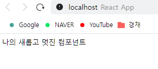

```js
// import 불러오기
import React from "react";
import MyComponent from "./components/MyComponent";

function App() {
  return <MyComponent />;
}

export default App;
```

<div style="page-break-after: always;"></div>

## - props

```
- 컴포넌트 속성을 설정할 때 사용하는 요소이다.
- props 값은 부모 컴포넌트에서 지정할 수 있다.
```

#### \* props 사용 방법.

```js
// 부모 컴포넌트에서 값 지정
import React from "react";
import MyComponent from "./components/MyComponent";

function App() {
  return <MyComponent name="React" />;
}

export default App;
```

```js
// 자식 컴포넌트에서 값 받기
import React from "react";

const MyComponent = (props) => {
  return <div>안녕하세요, 제 이름은 {props.name}입니다.</div>;
};

export default MyComponent;
```

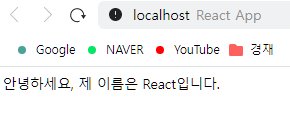
<div style="page-break-after: always;"></div>

#### \* defaultProps - props 값이 없을 때, 기본값 설정하기

```js
// props 값을 지정하지 않음.
import React from "react";
import MyComponent from "./components/MyComponent";

function App() {
  return <MyComponent />;
}

export default App;
```

```js
// 기본으로 설정된 값이 출력됨.
import React from "react";

const MyComponent = (props) => {
  return <div>안녕하세요, 제 이름은 {props.name}입니다.</div>;
};

MyComponent.defaultProps = {
  name: "기본 이름",
};

export default MyComponent;
```

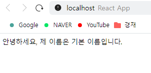
<div style="page-break-after: always;"></div>

#### \* 태그 사이의 내용을 보여 주는 children(이것도 props)

```js
// 태그사이에 "리액트"라고 적어보았다.
import React from "react";
import MyComponent from "./components/MyComponent";

function App() {
  return <MyComponent>리액트</MyComponent>;
}

export default App;
```

```js
/*  부모에서 값을 정해주지 않았으니 "기본 이름"이 출력되고,
    chiledren으로 태그 사이의 "리액트"가 출력된다. */
import React from "react";

const MyComponent = (props) => {
  return (
    <div>
      안녕하세요, 제 이름은 {props.name}입니다. <br />
      children 값은 {props.children}
      입니다.
    </div>
  );
};

MyComponent.defaultProps = {
  name: "기본 이름",
};

export default MyComponent;
```

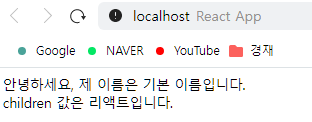
<div style="page-break-after: always;"></div>

#### \* 객체 비구조화 할당 문법

```
- 파라미터가 객체라면 그 값을 바로 비구조화해서 사용가능.
```

```js
// props값 추출하기
import React from "react";

const MyComponent = (props) => {
  const { name, children } = props;
  return (
    <div>
      안녕하세요, 제 이름은 {name}입니다. <br />
      children 값은 {children}
      입니다.
    </div>
  );
};

MyComponent.defaultProps = {
  name: "기본 이름",
};

export default MyComponent;
```

```js
// 함수의 파라미터 부분에서 추출하기
import React from "react";

const MyComponent = ({ name, children }) => {
  return (
    <div>
      안녕하세요, 제 이름은 {name}입니다. <br />
      children 값은 {children}
      입니다.
    </div>
  );
};

MyComponent.defaultProps = {
  name: "기본 이름",
};

export default MyComponent;
```

<div style="page-break-after: always;"></div>

#### \* props검증 - propTypes & .isRequired

```
- props를 검증할 시 propTypes를 사용한다.

- propTypes를 사용하면 데이터 타입을 검사하게 되는데,
  뒤에 .isRequired를 붙여주면 맞는 값을 필수로 지정해야 한다.
  지정되지 않았을 때 경고 메시지를 띄운다.

- PropTypes 종류
  • array: 배열
  • bool: true 혹은 false 값
  • func: 함수
  • number: 숫자
  • object: 객체
  • string: 문자열
  --
  • instanceOf(클래스): 특정 클래스의 인스턴스 (예: instanceOf(MyClass))
  • oneOf(['dog', 'cat']): 주어진 배열 요소 중 값 하나
  • oneOfType([React.PropTypes.string, PropTypes.number]): 주어진 배열속 종류 중 하나
  • any: 아무 종류
  ...
```

```js
// 데이터 타입을 string으로 지정해 보았다.
import React from "react";
import PropTypes from "prop-types";

const MyComponent = ({ name, children }) => {
  return (
    <div>
      안녕하세요, 제 이름은 {name}입니다. <br />
      children 값은 {children}
      입니다.
    </div>
  );
};

MyComponent.defaultProps = {
  name: "기본 이름",
};

MyComponent.propTypes = {
  name: PropTypes.string,
};

export default MyComponent;
```

<div style="page-break-after: always;"></div>

```js
/*  부모 요소에서 데이터 타입에 맞지 않는 값을 주었을 때이다. 값을 맞게 준다면 문제 없다.*/
import React from "react";
import MyComponent from "./components/MyComponent";

function App() {
  return <MyComponent name={3}>리액트</MyComponent>;
}

export default App;
```

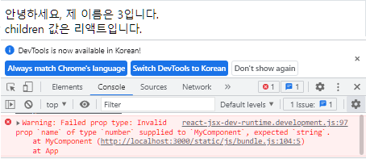

```js
// favoriteNumber 값에 .isRequired 사용해 보았다.
import React from "react";
import PropTypes from "prop-types";

const MyComponent = ({ name, favoriteNumber, children }) => {
  return (
    <div>
      안녕하세요, 제 이름은 {name}입니다. <br />
      children 값은 {children}
      입니다.
      <br />
      제가 좋아하는 숫자는 {favoriteNumber}입니다.
    </div>
  );
};

MyComponent.defaultProps = {
  name: "기본 이름",
};
MyComponent.propTypes = {
  name: PropTypes.string,
  favoriteNumber: PropTypes.number.isRequired,
};

export default MyComponent;
```

<div style="page-break-after: always;"></div>

```js
// 부모 요소에서 favoriteNumber 값을 지정하지 않았기에 오류가 발생한다.
import React from "react";
import MyComponent from "./components/MyComponent";

function App() {
  return <MyComponent name="React">리액트</MyComponent>;
}

export default App;
```

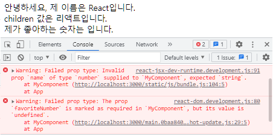

## - useState

#### \* 배열 비구조화 할당

```
- 배열 안에 들어 있는 값을 쉽게 추출가능.
- useState는 배열을 return 한다.
```

```js
const array = [1, 2];
const one = array[0];
const two = array[1];

// 위 코드를 배열 비구조화 할당으로 축약하면 아래와 같다.
const array = [1, 2];
const [one, two] = array;
```

<div style="page-break-after: always;"></div>

#### \* useState 핵심 흐름

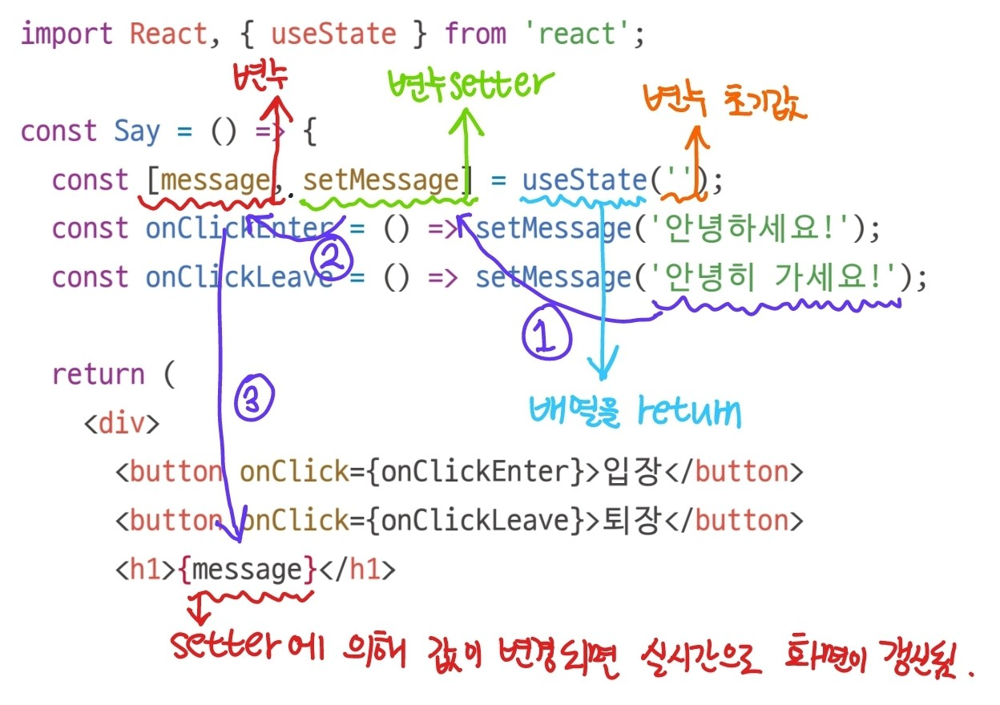<br/>

```js
import React from "react";
import Say from "./Say";

function App() {
  return <Say />;
}

export default App;
```

```js
import React, { useState } from "react";

const Say = () => {
  const [message, setMessage] = useState("");
  const onClickEnter = () => setMessage("안녕하세요!");
  const onClickLeave = () => setMessage("안녕히 가세요!");

  return (
    <div>
      <button onClick={onClickEnter}>입장</button>
      <button onClick={onClickLeave}>퇴장</button>
      <h1>{message}</h1>
    </div>
  );
};

export default Say;
```

<div style="page-break-after: always;"></div>
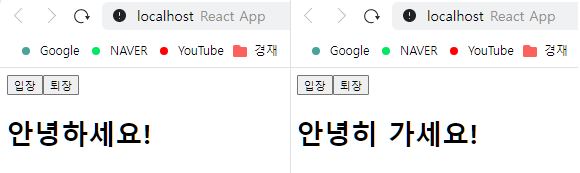

#### \* 한 컴포넌트에서 useState 여러 번 사용하기

```js
import React, { useState } from "react";

const Say = () => {
  const [message, setMessage] = useState("");
  const onClickEnter = () => setMessage("안녕하세요!");
  const onClickLeave = () => setMessage("안녕히 가세요!");
  const [color, setColor] = useState("black");
  return (
    <div>
      <button onClick={onClickEnter}>입장</button>
      <button onClick={onClickLeave}>퇴장</button>
      <h1 style={{ color }}>{message}</h1>
      <button style={{ color: "red" }} onClick={() => setColor("red")}>
        빨간색
      </button>
      <button style={{ color: "green" }} onClick={() => setColor("green")}>
        초록색
      </button>
      <button style={{ color: "blue" }} onClick={() => setColor("blue")}>
        파란색
      </button>
    </div>
  );
};

export default Say;
```


<div style="page-break-after: always;"></div>

## - State 주의 사항

```
- state 값을 바꾸어야 할 때는 useState를 통해 전달(리턴)받은 세터 함수를 사용해야 한다.

- 배열이나 객체 업데이트는 사본을 만들고 그 사본의 상태를 세터 함수를 통해 업데이트 한다.
  객체는 spread(...) 연산자로 처리하고, 배열은 내장 함수들을 활용한다. (concat, map, filter 등)

- props는 부모 컴포넌트가 설정, state는 컴포넌트 자체적으로 지닌 값이다.
  부모의 state를 자식의 props로 전달하고, 자식에서 특정 이벤트가 발생할 때,
  부모 컴포넌트의 메서드를 호출하면 props도 유동적으로 사용할 수 있다.
```

#### \* 사본을 만들어서 업데이트하는 예시

```js
// 객체 다루기
const object = { a: 1, b: 2, c: 3 };
const nextObject = { ...object, b: 2 }; // 사본을 만들어서 b 값만 덮어쓰기

// 배열 다루기
const array = [
{ id: 1, value: true },
{ id: 2, value: true },
{ id: 3, value: false }
];
let nextArray = array.concat({ id: 4 }); // 새 항목 추가
nextArray.filter(item => item.id != = 2); // id가 2인 항목 제거
// id가 1인 항목의 value를 false로 설정
nextArray.map(item => (item.id === 1 ? { ...item, value: false } : item));
```

<hr style="border-color: #82645c;"/>
<br/>

# 이벤트 핸들링

```
- 사용자가 웹 브라우저에서 DOM 요소들과 상호 작용하는 것을 이벤트라고 한다.

- 리액트의 이벤트 시스템은 웹 브라우저의 HTML 이벤트와 사용법이 동일하다.

- 이벤트 이름은 카멜 표기법으로 작성하고, 함수 형태의 값을 전달한다.
  전달 시 콜백 형식으로 바로 해도 되고, 별도의 함수를 연결해도 된다.

- DOM 요소에만 이벤트를 설정할 수 있고, 직접만든 컴포넌트에는 이벤트를 설정할 수 없다.
```
<div style="page-break-after: always;"></div>

```js
<MyComponent onClick={doSomething} />      // 직접 만든거라 불가능
<div onClick={this.props.onClick}></div>  // DOM요소라 가능
```
#### 예제 1) 입력 값 콘솔에 찍어보기 (콜백 형식으로 처리)
```js
// 컴포넌트 생성, 이벤트 적용 후 export 
import React from "react";

const EventPractice = () => {
  return (
    <div>
      <h1>이벤트 연습</h1>
      <input
        type="text"
        name="message"
        placeholder="아무거나 입력해 보세요"
        onChange={(e) => {
          console.log(e.target.value);
        }}
      />
    </div>
  );
};

export default EventPractice;
```
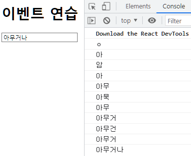

```js
// App.js에서 import해서 렌더링 하기

import React from "react";
import EventPractice from "./EventPractice";

function App() {

  return <EventPractice />;
}

export default App;
```
<br/>
<div style="page-break-after: always;"></div>

#### 예제 2) useState로 input 값 초기화 (콜백 형식으로 처리)
```js
/*  button 클릭시 setMessage -> message 경로로 공백이 업데이트 되기에
    위 input 태그의 {message}도 공백으로 초기화 됨.*/
import React from "react";

const EventPractice = () => {
  const [message, setMessage] = React.useState("");

  return (
    <div>
      <h1>이벤트 연습</h1>
      <input
        type="text"
        name="message"
        placeholder="아무거나 입력해 보세요"
        value={message}
        onChange={(e) => {
          setMessage(e.target.value);
        }}
      />
      <button onClick={() => {
        alert(message);
        setMessage("");
      }}>확인</button>
    </div>
  );
};

export default EventPractice;
```
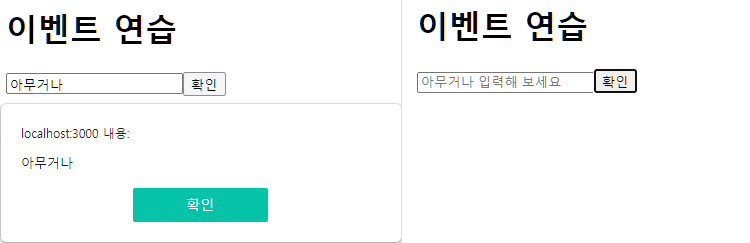
<div style="page-break-after: always;"></div>

#### 예제 3) 미리 함수를 준비하여 호출하는 방식
```js
// 함수 호출이 콜백 형식이 아닌 것 외에 예제 2 와 동일하다.
import React, { useState } from "react";

const EventPractice = () => {
  const [message, setMessage] = useState("");
  const handleChange = (e) => {
    setMessage(e.target.value);
  };
  const handleClick = () => {
    alert(message);
    setMessage("");
  };

  return (
    <div>
      <h1>이벤트 연습</h1>
      <input
        type="text"
        name="message"
        placeholder="아무거나 입력해 보세요"
        value={message}
        onChange={handleChange}
      />
      <button onClick={handleClick}>확인</button>
    </div>
  );
};

export default EventPractice;
```

<div style="page-break-after: always;"></div>

#### 예제 4) keyPress 이벤트 처리
```js
// 엔터를 누르거나, 버튼을 클릭하면 입력값이 공백이 되도록 처리.
import React, { useState } from "react";

const EventPractice = () => {
  const [username, setUsername] = useState("");
  const [message, setMessage] = useState("");
  const onChangeUsername = (e) => setUsername(e.target.value);
  const onChangeMessage = (e) => setMessage(e.target.value);

  const onClick = () => {
    alert(username + ": " + message);
    setUsername("");
    setMessage("");
  };
  const onKeyPress = (e) => {
    if (e.key === "Enter") {
      onClick();
    }
  };

  return (
    <div>
      <h1>이벤트 연습</h1>
      <input type="text" name="username" placeholder="사용자명" 
        value={username} onChange={onChangeUsername} />
      <input type="text" name="message" placeholder="아무거나 입력해 보세요"
        value={message} onChange={onChangeMessage} onKeyPress={onKeyPress} />
      <button onClick={onClick}>확인</button>
    </div>
  );
};
export default EventPractice;
``` 
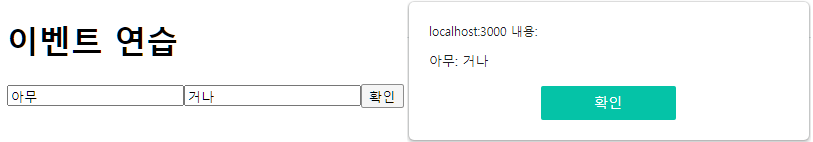
<div style="page-break-after: always;"></div>

#### 예제 5) onChange 함수를 활용해 입력 태그에 따라 어떤 상태값을 적용할지 바뀌게 처리. 
```js
import React, { useState } from "react";

const EventPractice = () => {
  /** onChange 함수를 input 태그에 동시에 걸고, name을 다르게 주어서, 태그에 따라 어떤 상태값을 적용할지 바뀌게 처리.  */
  
  //  상태값이 JSON 형태로 구성되어 있기에, 하나의 form 값에 여러 하위 값 포함가능.
  const [form, setForm] = useState({ username: "", message: "" });
  const { username, message } = form;   // 상태값을 비구조 문법으로 분리
  const onChange = (e) => {
    const nextForm = {
      ...form,                          // 기존의 form 내용을 이 자리에 복사
      [e.target.name]: e.target.value,  // 원하는 값을 덮어 씌우기
    };
    setForm(nextForm);                  // 변경된 내용을 setter에 전달
  };
  const onClick = () => {
    alert(username + ": " + message);
    setForm({ username: "", message: "" });
  };
  const onKeyPress = (e) => {
    if (e.key === "Enter") { onClick(); }
  };
  return (
    <div>
      <h1>이벤트 연습</h1>
      <input type="text" name="username" placeholder="사용자명"
        value={username} onChange={onChange} />
      <input type="text" name="message" placeholder="아무거나 입력해 보세요"
        value={message} onChange={onChange} onKeyPress={onKeyPress} />
      <button onClick={onClick}>확인</button>
    </div>
  );
};

export default EventPractice;
```
