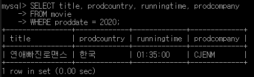
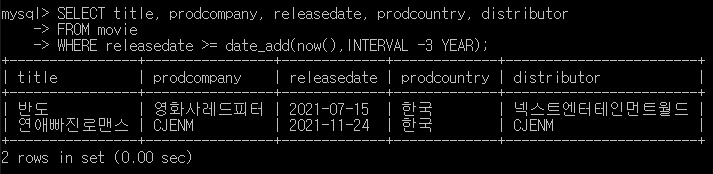
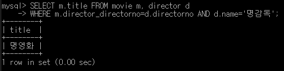

# SQL 응용 보고서 _ 천경재

## 【문항1】 위 영화 관리 시스템의 ERD를 작성하고 그 결과 이미지를 제출하시오.


## 【문항2】 문제1의 ERD에 대한 물리 저장소를 생성하기 위한 DDL을 작성하시오.

CMD 창에서 MySQL 로그인 후 아래 코드 입력
```
CREATE SCHEMA `moviefan` DEFAULT CHARSET utf8;

use moviefan;

CREATE TABLE `movie` (
  `movieno` INT(11) NOT NULL AUTO_INCREMENT PRIMARY KEY COMMENT '영화코드번호',
  `title` VARCHAR(45) CHARSET 'utf8' NOT NULL COMMENT '제목',
  `proddate` YEAR NOT NULL COMMENT '제작년도',
  `prodcountry` VARCHAR(45) CHARSET 'utf8' NOT NULL COMMENT '제작국가',
  `runningtime` TIME NOT NULL COMMENT '상영시간',
  `releasedate` DATE NOT NULL COMMENT '개봉일자',
  `prodcompany` VARCHAR(45) CHARSET 'utf8' NOT NULL COMMENT '제작사',
  `distributor` VARCHAR(45) CHARSET 'utf8' NOT NULL COMMENT '배급사'
) ENGINE = InnoDB DEFAULT CHARSET=`utf8` COMMENT='영화 테이블';

CREATE TABLE `director` (
  `directorno` INT(11) NOT NULL AUTO_INCREMENT PRIMARY KEY COMMENT '등록번호',
  `name` VARCHAR(45) CHARSET 'utf8' NOT NULL COMMENT '이름',
  `gender` ENUM('M', 'F') CHARSET 'utf8' NOT NULL COMMENT '성별',
  `birthdate` DATE NOT NULL COMMENT '생년월일',
  `birthplace` VARCHAR(45) CHARSET 'utf8' NOT NULL COMMENT '출생지',
  `education` VARCHAR(45) CHARSET 'utf8' NOT NULL COMMENT '학력사항'
) ENGINE = InnoDB DEFAULT CHARSET=`utf8` COMMENT='감독 테이블';

CREATE TABLE  `actor` (
  `actorno` INT(11) NOT NULL AUTO_INCREMENT PRIMARY KEY COMMENT '배우번호',
  `birthdate` DATE NOT NULL COMMENT '생년월일',
  `name` VARCHAR(45) CHARSET 'utf8' NOT NULL COMMENT '이름',
  `gender` ENUM('M', 'F') CHARSET 'utf8' NOT NULL COMMENT '성별',
  `birthplace` VARCHAR(45) CHARSET 'utf8' NOT NULL COMMENT '출생지',
  `height` INT(11) NOT NULL COMMENT '키',
  `weight` INT(11) NOT NULL COMMENT '몸무게',
  `bloodtype` ENUM('A', 'B', 'O', 'AB') CHARSET 'utf8' NOT NULL COMMENT '혈액형'
) ENGINE = InnoDB DEFAULT CHARSET=`utf8` COMMENT='배우 테이블';

ALTER TABLE `movie` ADD `director_directorno` INT(11) COMMENT '감독등록번호';
ALTER TABLE `movie` ADD `actor_actorno` INT(11) COMMENT '배우번호';
ALTER TABLE `movie` ADD `part` VARCHAR(45) COMMENT '배역';
ALTER TABLE `movie` CONVERT TO CHARSET 'utf8';
ALTER TABLE `director` ADD `movie_movieno` INT(11) COMMENT '영화코드번호';
ALTER TABLE `director` CONVERT TO CHARSET 'utf8';
ALTER TABLE `actor` ADD `movie_movieno` INT(11) COMMENT '영화코드번호';
ALTER TABLE `actor` CONVERT TO CHARSET 'utf8';

ALTER TABLE `movie` ADD FOREIGN KEY(`director_directorno`) REFERENCES `director`(`directorno`);
ALTER TABLE `movie` ADD FOREIGN KEY(`actor_actorno`) REFERENCES `actor`(`actorno`);
ALTER TABLE `director` ADD FOREIGN KEY(`movie_movieno`) REFERENCES `movie`(`movieno`);
ALTER TABLE `actor` ADD FOREIGN KEY(`movie_movieno`) REFERENCES `movie`(`movieno`);
```

## 【문항3】문제 1의 ERD에 대한 테이블 명세서를 작성하시오.


## 【문항4】문제 1의 스키마를 참조하여 다음 정보를 출력하기 위한 SQL문을 작성하시오.
#### 1) 2020년에 제작된 영화의 제목, 제작국가, 상영시간, 제작사를 출력하시오.
```
SELECT title, prodcountry, runningtime, prodcompany
FROM movie
WHERE proddate = 2020;
```


#### 2) 현재 날짜를 기준으로 최근 3년 안에 제작된 영화의 제목, 제작국가, 개봉일, 제작사, 배급사를 출력하시오.
```
SELECT title, prodcompany, releasedate, prodcountry, distributor
FROM movie
WHERE releasedate >= date_add(now(),INTERVAL -3 YEAR);
```


#### 3) 이름이 '명감독'인 감독이 촬영한 영화의 제목을 출력하시오.
```
SELECT m.title FROM movie m, director d
WHERE m.director_directorno=d.directorno AND d.name='명감독';
```


#### 4) 감독이 직접 배우로 출현한 영화의 제목과, 제작국가, 상영시간을 출력하시오. (이름과 생년월일이 같으면 동일인으로 인정)
```
SELECT m.title, m.prodcountry, m.runningtime
FROM movie m INNER JOIN director d
ON m.director_directorno=d.directorno
LEFT OUTER JOIN actor a
ON m.actor_actorno=a.actorno
WHERE d.name = a.name;
```
