# Nodejs 보고서 천경재

## 【문항1】교수 데이터 생성

`SQL Mapper`
```js
<?xml version="1.0" encoding="URF-8"?>
<!DOCTYPE mapper PUBLIC "-//mybatis.org//DTD Mapper 3.0//EN"
  "http://mybatis.org/dtd/mybatis-3-mapper.dtd">

<mapper namespace="ProfessorMapper">
    <insert id="insertItem">
        INSERT INTO professor (name, userid, position, sal, hiredate, comm,
        deptno) VALUES (#{name}, #{userid}, #{position}, #{sal}, #{hiredate}, #
        {comm}, #{deptno});
    </insert>
</mapper>
```

`Service Layer`
```js
import mybatisMapper from "mybatis-mapper";
import DBPool from "../helper/DBPool.js";
import RuntimeException from "../exceptions/RuntimeException.js";

class ProfessorService {
    constructor() {
        mybatisMapper.createMapper([
            "./mappers/StudentMapper.xml",
            "./mappers/ProfessorMapper.xml",
        ]);
    }
    async addItem(params) {
        let dbcon = null;
        let data = null;

        try {
            dbcon = await DBPool.getConnection();

            let sql = mybatisMapper.getStatement(
                "ProfessorMapper",
                "insertItem",
                params
            );
            let [{ insertId, affectedRows }] = await dbcon.query(sql);

            if (affectedRows === 0) {
                throw new RuntimeException("저장된 데이터가 없습니다.");
            } else {
                console.log("------ 저장완료 -------");
                console.log(insertId);
            }

            sql = mybatisMapper.getStatement("ProfessorMapper", "selectItem", {
                profno: insertId,
            });
            let [result] = await dbcon.query(sql);

            if (result.length === 0) {
                throw new RuntimeException(
                    "저장된 데이터를 조회할 수 없습니다."
                );
            }

            data = result[0];
        } catch (err) {
            throw err;
        } finally {
            if (dbcon) {
                dbcon.release();
            }
        }

        return data;
    }
}
```

`Controller`
```js
import express from "express";
import regexHelper from "../helper/RegexHelper.js";
import professorService from "../services/ProfessorService.js";

const ProfessorController = () => {
    const url = "/professor";
    const router = express.Router();

    router.post("/professor", async (req, res, next) => {
        const name = req.post("name");
        const userid = req.post("userid");
        const position = req.post("position");
        const sal = req.post("sal");
        const hiredate = req.post("hiredate");
        const comm = req.post("comm");
        const deptno = req.post("deptno");

        try {
            regexHelper.value(name, "이름을 입력해주세요.");
                        regexHelper.kor(name, "이름은 한글로만 입력 가능합니다.");
            regexHelper.maxLength(name, 20, "이름은 최대 20자 까지 입력 가능합니다.");
            regexHelper.value(userid, "아이디를 입력해주세요.");
            regexHelper.engNum(userid, "아이디는 영문과 숫자로만 입력 가능합니다.");
            regexHelper.maxLength(userid, 20, "아이디는 최대 20자 까지 입력 가능합니다.");
            regexHelper.value(position, "직급을 입력해주세요.");
            regexHelper.maxLength(position, 20, "직급은 최대 20자 까지 입력 가능합니다.");
            regexHelper.value(sal, "급여를 입력해주세요.");
            regexHelper.num(sal, "급여는 숫자로만 입력 가능합니다.");
            regexHelper.maxLength(sal, 20, "급여는 최대 20자 까지 입력 가능합니다.");
            regexHelper.value(hiredate, "입사일을 입력해주세요.");
            regexHelper.date(hiredate, "입사일은 yyyy-MM-dd hh:mm:ss 형식에 맞게 입력해주세요.");
            regexHelper.nullNum(comm, "보직수당은 미입력 또는 숫자로만 입력 가능합니다.");
            regexHelper.value(deptno, "학과번호를 입력해주세요.");
        } catch (err) {
            return next(err);
        }

        let json = null;

        try {
            json = await professorService.addItem({
                name: name,
                userid: userid,
                position: position,
                sal: sal,
                hiredate: hiredate,
                comm: comm,
                deptno: deptno,
            });
        } catch (err) {
            return next(err);
        }

        res.sendResult({ item: json });
    });
    return router;
};
```

`실행결과`
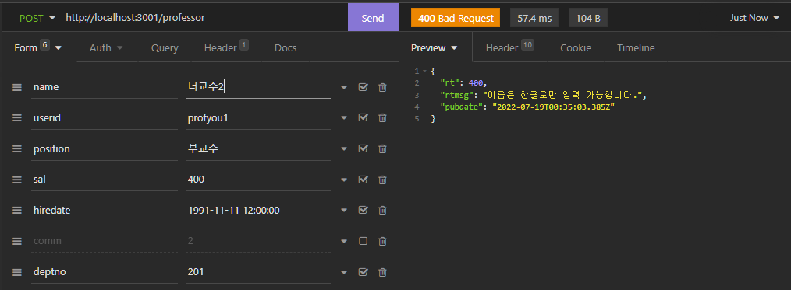
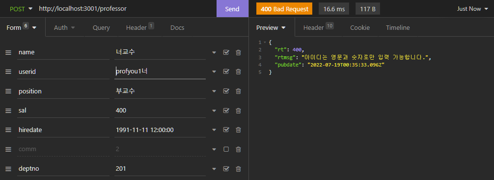
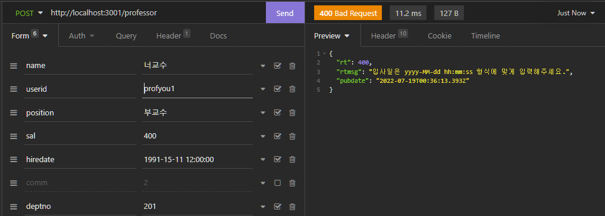
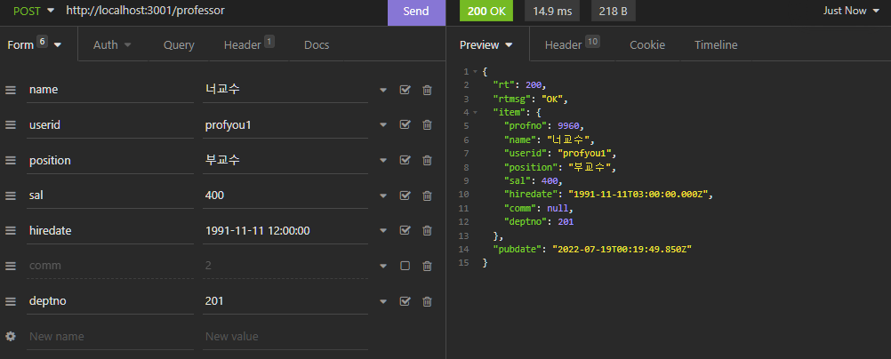
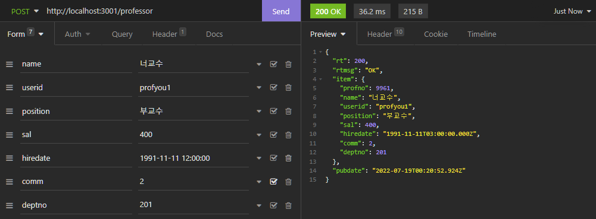
<hr/>

## 【문항2】교수 데이터 수정

`SQL Mapper`
```js
<?xml version="1.0" encoding="URF-8"?>
<!DOCTYPE mapper PUBLIC "-//mybatis.org//DTD Mapper 3.0//EN"
  "http://mybatis.org/dtd/mybatis-3-mapper.dtd">

<mapper namespace="ProfessorMapper">
    <update id="updateItem">
        UPDATE professor SET name=#{name}, userid=#{userid}, position=#{position}, 
        sal=#{sal}, hiredate=#{hiredate}, comm=#{comm}, deptno=#{deptno}
        WHERE profno=#{profno};
    </update>

    <select id="selectJoin">
    SELECT 
      p.profno, p.name, p.userid, p.position, 
      p.sal, p.hiredate, p.comm, p.deptno, d.dname
    FROM professor AS `p`
    INNER JOIN department AS `d`
    ON p.deptno = d.deptno
    WHERE profno=#{profno}
    </select>
</mapper>
```

`Service Layer`
```js
import mybatisMapper from "mybatis-mapper";
import DBPool from "../helper/DBPool.js";
import RuntimeException from "../exceptions/RuntimeException.js";

class ProfessorService {
    constructor() {
        mybatisMapper.createMapper([
            "./mappers/StudentMapper.xml",
            "./mappers/ProfessorMapper.xml",
        ]);
    }
    async editItem(params) {
        let dbcon = null;
        let data = null;

        try {
            dbcon = await DBPool.getConnection();

            let sql = mybatisMapper.getStatement("ProfessorMapper", "updateItem", params);
            let [{ affectedRows }] = await dbcon.query(sql);

            if (affectedRows === 0) {
                throw new RuntimeException("수정된 데이터가 없습니다.");
            }

            sql = mybatisMapper.getStatement("ProfessorMapper", "selectJoin", { profno: params.profno });
            let [result] = await dbcon.query(sql);

            if (affectedRows === 0) {
                throw new RuntimeException(
                    "수정된 데이터를 조회할 수 없습니다."
                );
            }

            data = result[0];
        } catch (err) {
            throw err;
        } finally {
            if (dbcon) {
                dbcon.release();
            }
        }

        return data;
    }
}
```

`Controller`
```js
import express from "express";
import regexHelper from "../helper/RegexHelper.js";
import professorService from "../services/ProfessorService.js";

const ProfessorController = () => {
    const url = "/professor";
    const router = express.Router();

    router.put(`${url}/:profno`, async (req, res, next) => {
        const profno = req.get('profno');
        const name = req.put("name");
        const userid = req.put("userid");
        const position = req.put("position");
        const sal = req.put("sal");
        const hiredate = req.put("hiredate");
        const comm = req.put("comm");
        const deptno = req.put("deptno");

        try {
            regexHelper.value(profno, "교수번호를 입력해주세요.");
            regexHelper.num(profno, "교수번호가 잘못되었습니다.");
            regexHelper.value(name, "이름을 입력해주세요.");
            regexHelper.kor(name, "이름은 한글로만 입력 가능합니다.");
            regexHelper.maxLength(name, 20, "이름은 최대 20자 까지 입력 가능합니다.");
            regexHelper.value(userid, "아이디를 입력해주세요.");
            regexHelper.engNum(userid, "아이디는 영문과 숫자로만 입력 가능합니다.");
            regexHelper.maxLength(userid, 20, "아이디는 최대 20자 까지 입력 가능합니다.");
            regexHelper.value(position, "직급을 입력해주세요.");
            regexHelper.maxLength(position, 20, "직급은 최대 20자 까지 입력 가능합니다.");
            regexHelper.value(sal, "급여를 입력해주세요.");
            regexHelper.num(sal, "급여는 숫자로만 입력 가능합니다.");
            regexHelper.maxLength(sal, 20, "급여는 최대 20자 까지 입력 가능합니다.");
            regexHelper.value(hiredate, "입사일을 입력해주세요.");
            regexHelper.date(hiredate, "입사일은 yyyy-MM-dd hh:mm:ss 형식에 맞게 입력해주세요.");
            regexHelper.nullNum(comm, "보직수당은 미입력 또는 숫자로만 입력 가능합니다.");
            regexHelper.value(deptno, "학과번호를 입력해주세요.");
        } catch (err) {
            return next(err);
        }

        let json = null;

        try {
            json = await professorService.editItem({
                profno: profno,
                name: name,
                userid: userid,
                position: position,
                sal: sal,
                hiredate: hiredate,
                comm: comm,
                deptno: deptno
            });
        } catch (err) {
            return next(err);
        }

        res.sendResult({ item: json });
    });
    return router;
};
```

`실행결과`


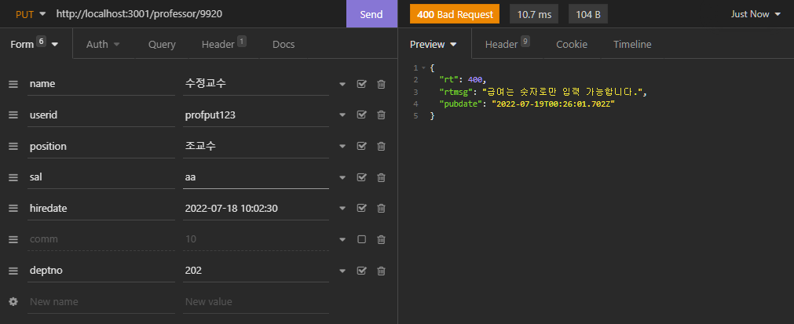


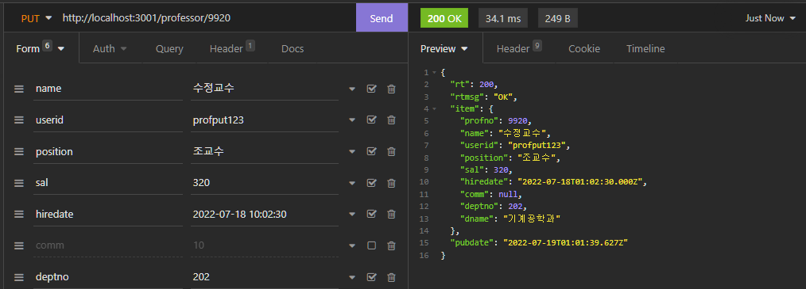
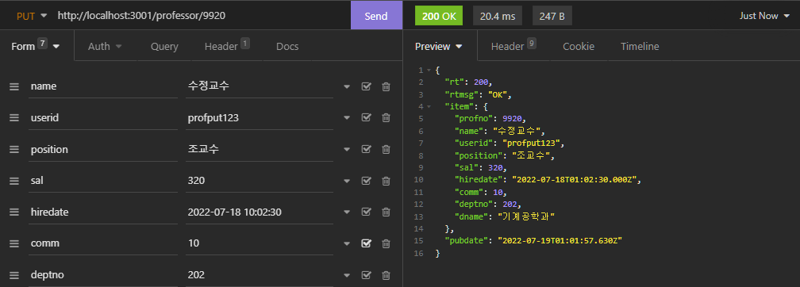

<hr/>

## 【문항3】교수 데이터 삭제

`SQL Mapper`
```js
// 교수
<?xml version="1.0" encoding="URF-8"?>
<!DOCTYPE mapper PUBLIC "-//mybatis.org//DTD Mapper 3.0//EN"
  "http://mybatis.org/dtd/mybatis-3-mapper.dtd">
  
<mapper namespace="ProfessorMapper">
    <delete id="deleteItem">
    DELETE FROM professor WHERE profno=#{profno};
    </delete>
</mapper>
```
```js
// 학생
<?xml version="1.0" encoding="URF-8"?>
<!DOCTYPE mapper PUBLIC "-//mybatis.org//DTD Mapper 3.0//EN"
  "http://mybatis.org/dtd/mybatis-3-mapper.dtd">

<mapper namespace="StudentMapper">

    <update id="profnoUpdate">
    UPDATE student SET profno=null WHERE profno=#{profno};
    </update>

</mapper>
```

`Service Layer`
```js
import mybatisMapper from "mybatis-mapper";
import DBPool from "../helper/DBPool.js";
import RuntimeException from "../exceptions/RuntimeException.js";

class ProfessorService {
    constructor() {
        mybatisMapper.createMapper([
            "./mappers/StudentMapper.xml",
            "./mappers/ProfessorMapper.xml",
        ]);
    }
    async deleteItem(params) {
        let dbcon = null;

        try {
            dbcon = await DBPool.getConnection();

            let sql = mybatisMapper.getStatement("StudentMapper", "profnoUpdate", params);
            let [{ affectedRows }] = await dbcon.query(sql);

            sql = mybatisMapper.getStatement("ProfessorMapper", "deleteItem", params);
            [{ affectedRows }] = await dbcon.query(sql);

            if (affectedRows === 0) {
                throw new RuntimeException("삭제된 데이터가 없습니다.");
            }
        } catch (err) {
            throw err;
        } finally {
            if (dbcon) {
                dbcon.release();
            }
        }
    }
}
```

`Controller`
```js
import express from "express";
import regexHelper from "../helper/RegexHelper.js";
import professorService from "../services/ProfessorService.js";

const ProfessorController = () => {
    const url = "/professor";
    const router = express.Router();

    router.delete(`${url}/:profno`, async (req, res, next) => {
        const profno = req.get('profno');
        try {
            regexHelper.value(profno, "교수번호를 입력해주세요.");
            regexHelper.num(profno, "교수번호가 잘못되었습니다.");
        } catch (err) {
            return next(err);
        }

        try {
            await professorService.deleteItem({
                profno: profno
            });
        } catch (err) {
            return next(err);
        }

        res.sendResult();
    });

    return router;
};
```

`실행결과`
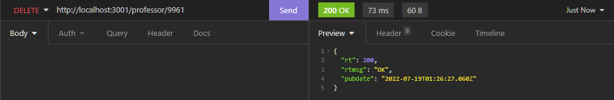
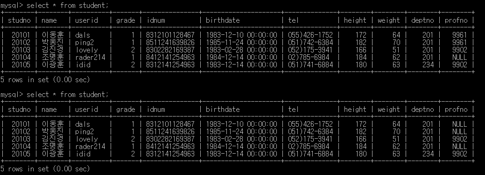
<hr/>

## 【문항4】교수 데이터 조회

`SQL Mapper`
```js
<?xml version="1.0" encoding="URF-8"?>
<!DOCTYPE mapper PUBLIC "-//mybatis.org//DTD Mapper 3.0//EN"
  "http://mybatis.org/dtd/mybatis-3-mapper.dtd">
  
<mapper namespace="ProfessorMapper">
    <select id="selectJoin">
    SELECT 
      p.profno, p.name, p.userid, p.position, 
      p.sal, p.hiredate, p.comm, p.deptno, d.dname
    FROM professor AS `p`
    INNER JOIN department AS `d`
    ON p.deptno = d.deptno
    WHERE profno=#{profno}
    </select>
</mapper>
```

`Service Layer`
```js
import mybatisMapper from "mybatis-mapper";
import DBPool from "../helper/DBPool.js";
import RuntimeException from "../exceptions/RuntimeException.js";

class ProfessorService {
    constructor() {
        mybatisMapper.createMapper([
            "./mappers/StudentMapper.xml",
            "./mappers/ProfessorMapper.xml",
        ]);
    }
    async getItem(params) {
        let dbcon = null;
        let data = null;

        try {
            dbcon = await DBPool.getConnection();

            let sql = mybatisMapper.getStatement("ProfessorMapper", "selectJoin", params);
            let [result] = await dbcon.query(sql);

            if (result.length === 0) {
                throw new RuntimeException("조회된 데이터가 없습니다.");
            }

            data = result[0];
        } catch (err) {
            throw err;
        } finally {
            if (dbcon) {
                dbcon.release();
            }
        }

        return data;
    }
}
```

`Controller`
```js
import express from "express";
import regexHelper from "../helper/RegexHelper.js";
import professorService from "../services/ProfessorService.js";

const ProfessorController = () => {
    const url = "/professor";
    const router = express.Router();

    router.get(`${url}/:profno`, async (req, res, next) => {
        const profno = req.get("profno");

        try {
            regexHelper.value(profno, "교수번호를 입력해주세요.");
            regexHelper.num(profno, "교수번호가 잘못되었습니다.");
        } catch (err) {
            return next(err);
        }

        let json = null;

        try {
            json = await professorService.getItem({
                profno: profno,
            });
        } catch (err) {
            return next(err);
        }

        res.sendResult({ item: json });
    });

    return router;
};
```

`실행결과`
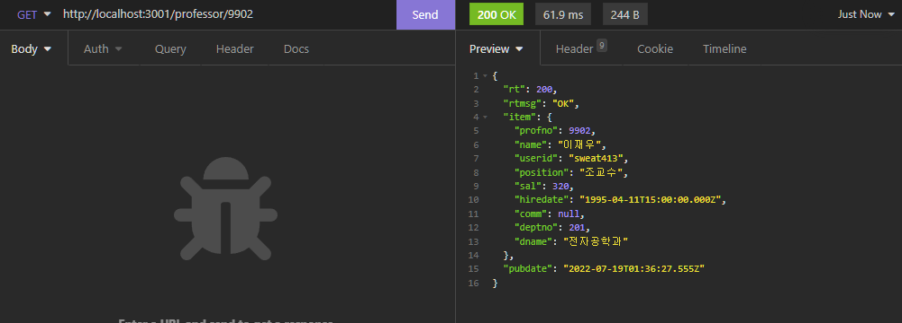
<hr/>

## 【문항5】교수 데이터 목록 조회

`SQL Mapper`
```js
<?xml version="1.0" encoding="URF-8"?>
<!DOCTYPE mapper PUBLIC "-//mybatis.org//DTD Mapper 3.0//EN"
  "http://mybatis.org/dtd/mybatis-3-mapper.dtd">
  
<mapper namespace="ProfessorMapper">
    <select id="selectList">
    select 
      p.profno, p.name, p.userid, p.position, 
      p.sal, p.hiredate, p.comm, p.deptno, d.dname
    FROM professor AS `p`
    INNER JOIN department AS `d`
    ON p.deptno = d.deptno
        <where>
            <if test="name != null and name != ''">
            name LIKE concat('%', #{name}, '%')
            </if>
        </where>
    ORDER BY profno DESC
        <if test="listCount > 0">
        LIMIT ${offset}, ${listCount}
        </if>
    </select>

    <select id="selectCountAll">
    SELECT COUNT(*) AS `cnt` FROM professor
        <where>
            <if test="name != null and name != ''">
            name LIKE concat('%', #{name}, '%')
            </if>
        </where>
    </select>
</mapper>
```

`Service Layer`
```js
import mybatisMapper from "mybatis-mapper";
import DBPool from "../helper/DBPool.js";
import RuntimeException from "../exceptions/RuntimeException.js";

class ProfessorService {
    constructor() {
        mybatisMapper.createMapper([
            "./mappers/StudentMapper.xml",
            "./mappers/ProfessorMapper.xml",
        ]);
    }

    async getCount(params) {
        let dbcon = null;
        let cnt = 0;

        try {
            dbcon = await DBPool.getConnection();

            let sql = mybatisMapper.getStatement("ProfessorMapper", "selectCountAll", params);
            let [result] = await dbcon.query(sql);

            if (result.length > 0) {
                cnt = result[0].cnt;
            }
        } catch (err) {
            throw err;
        } finally {
            if (dbcon) {
                dbcon.release();
            }
        }

        return cnt;
    }

    async getList(params) {
        let dbcon = null;
        let data = null;

        try {
            dbcon = await DBPool.getConnection();

            let sql = mybatisMapper.getStatement("ProfessorMapper", "selectList", params);
            let [result] = await dbcon.query(sql);

            if (result.length === 0) {
                throw new RuntimeException("조회된 데이터가 없습니다.");
            }

            data = result;
        } catch (err) {
            throw err;
        } finally {
            if (dbcon) {
                dbcon.release();
            }
        }

        return data;
    }
}
```

`Controller`
```js
import express from "express";
import regexHelper from "../helper/RegexHelper.js";
import { pagenation } from "../helper/UtilHelper.js";
import professorService from "../services/ProfessorService.js";

const ProfessorController = () => {
    const url = "/professor";
    const router = express.Router();

    router.get(url, async (req, res, next) => {

        const query = req.get('query');
        const page = req.get('page', 1);
        const rows = req.get('rows', 5);

        const params = {};
        if (query) {
            params.name = query;
        }

        let json = null;
        let pageInfo = null;

        try {
            const totalCount = await professorService.getCount(params);
            pageInfo = pagenation(totalCount, page, rows);

            params.offset = pageInfo.offset;
            params.listCount = pageInfo.listCount;
            json = await professorService.getList(params);
        } catch (err) {
            return next(err);
        }

        res.sendResult({ pagenation: pageInfo, item: json });
    });

    return router;
};
```

`실행결과`
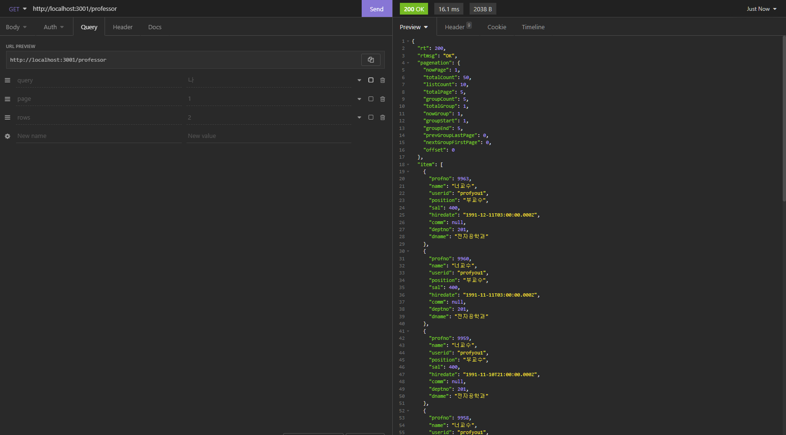
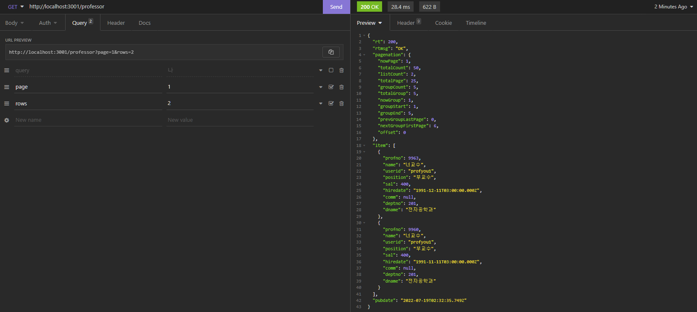
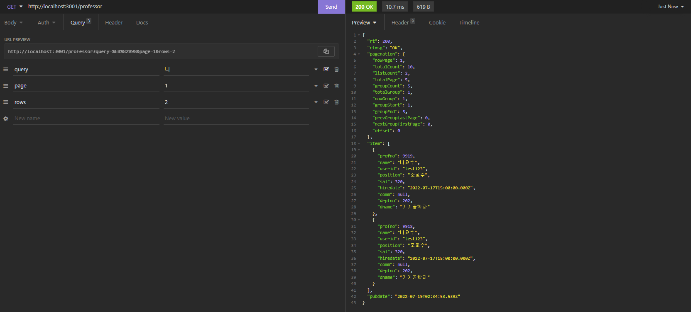