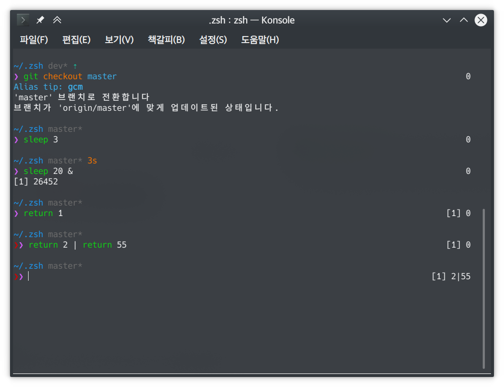
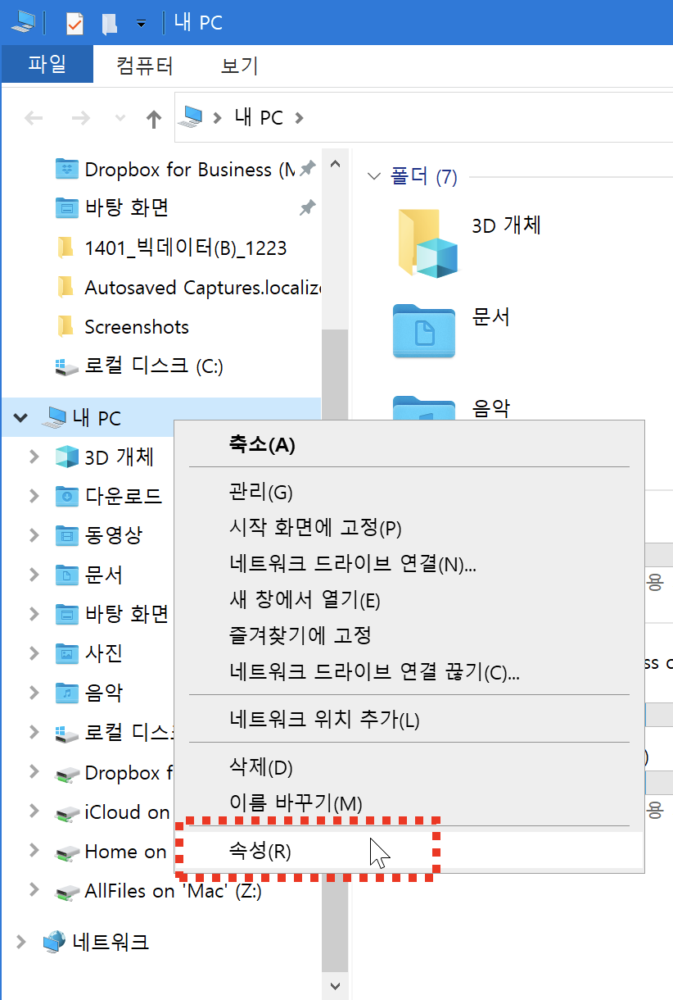
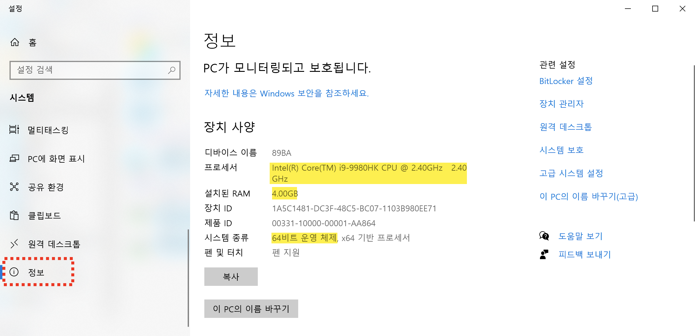

# 운영체제의 이해

# #01. 운영체제의 이해

## 1. 운영체제란?

하드웨어와 소프트웨어를 직접적으로 관리하여 유기적으로 동작이 가능하게 하는 시스템 프로그램

- 사용자가 컴퓨터를 쉽게 사용할 수 있도록 한다.
- 운영체제 프로그램 없이는 컴퓨터 사용 불가
- Window, MacOS, Linux 등

## 2. 운영체제의 목적

### 1. **컴퓨터 하드웨어 관리**

- 컴퓨터에는 CPU, 메모리, 디스크, 키보드, 마우스, 모니터, 네트워크 장치 등의 수 많은 하드웨어가 존재함.
- 컴퓨터를 효율적으로 사용한다는 것은 하드웨어를 잘 관리,운용한다는 것을 의미
- 그러므로 운영체제의 성능이 좋을수록 컴퓨터의 성능도 좋아짐.

-10.png)

### 2. 응용 프로그램와 하드웨어의 중간 다리 역할

- 일반적인 응용 프로그램들은 하드웨어를 통해 정해진 동작을 수행함.
- 예를 들어 게임의 경우 **RAM에 3D 모델을 로드하고, 키보드로 입력 받은 명령을 CPU를 통해 연산 하여 그 결과를 그래픽카드를 거쳐 모니터에 표시**함.
- 운영체제는 하드웨어와 소프트웨어간에 정보를 주고 받을 수 있는 전달자 역할을 함.
- 운영체제가 없다면 위에서 말한 하드웨어에 관한 모든 관리를 사용자가 해야함.

## 3. 운영체제의 종류

- 클라이언트용 운영체제
- 단일 사용자용 운영체제
- 윈도우 계열 : Window XP, 7, 8
- 애플 계열 : MacOs

# #02. 운영체제의 구분

# #03. 운영체제의 종류

## 1. 용도에 따른 구분

### 1) 클라이언트용 운영체제

- 단일 사용자용 운영체제
- 윈도우 계열 : Window XP, 7, 8
- 애플 계열 : MacOs

### 2) 서버용 운영체제

- 다중 사용자용 운영체제
- 동시에 여러 사용자의 서비스를 요청 받아 처리
- 윈도우 서버(Windows Server) 계열
- 유닉스(UNIX) 계열 : 솔라리스(Solaris), Red Hat(Redhat), 페도라(fedora)

## 2. 운영체제 종류별 변천사

[OS.xmind](res/OS.xmind)

## 3. Unix

### Unix 소개

- 최초의 운영체제.
- 초창기 운영체제는 컴퓨터의 부피가 매우 컸기 때문에 한 대의 컴퓨터에 여러 사람이 콘솔을 연결하여 사용하는 다중 사용자를 지원하는 형태로 발전함.
- 바탕화면 개념이 생기기 전 환경이므로 콘솔상에서 명령어를 입력하는 형태로 컴퓨터를 사용함.
- 일반인이 사용하기에는 매우 어려움

콘솔의 예

### 터미널과 쉘

- 터미널 : 콘솔상에서 실행하여 명령어를 입력하기 위한 환경
- 쉘 : 터미널에 탑제된 명령어 해석기.
    - 유닉스 계열 : C쉘, Bash쉘,zsh쉘 등이 있음.
    - 윈도우 계열 : 명령프롬프트(cmd), 파워쉘(PowerShell)

리눅스 터미널상에서 zsh쉘을 탑제한 모습

## 4. SunOS와 Solaris, 그리고 MacOS

- Unix에서 파생된 수 많은 운영체제들의 하나.
- Unix를 좀 더 쉽게 사용할 수 있도록 고안된 운영체제.
- Linux의 점유율이 높아짐에 따라 SunOS와 Solaris는 거의 사용되지 않음.
- MacOS는 Apple의 하드웨어 전략에 힘입어 활발히 사용되고 있음.(맥 전용 하드웨어에서만 구동됨)

## 5. Linux

- 리누스 토발즈가 개발한 다중 사용자용 운영체제.
- Fedora라는 프로토타입 버전이 배포되면 이를 누구나 내려받아 수정,보완,재배포가 가능한 오픈소스.
- 지금까지 가장 활발하게 진행되고 있는 대표적인 오픈소스 프로젝트임.
- Fedora에서 파생된 다른 버전을 리눅스 배포판이라고 부름.
- 가장 대표적인 배포판으로는 RedHat(CentOS)과 Ubuntu가 있음.

- 무료로 배포되기 때문에 수많은 기업들이 상용 시스템을 운영하는데 활용하고 있음.
- 실무를 진행하기 전 리눅스 명령어를 익히는 것은 상용 시스템의 사용법을 익힌다는 점에서 매우 중요함.

## 4) Windows

### MS-DOS 계열

- Microsoft에서 출시한 IBM 컴퓨터용 운영체제
- IBM 컴퓨터에 무상으로 탑재되면서 시장을 장악함
- 하드 디스크에 파일을 기록하는 방식(파일시스템)으로 FAT32 방식을 채택.
- 이는 하나의 프로그램에 문제가 발생하면 실행중인 모든 프로그램이 다운되는 치명적인 결함이 있었음 → 블루스크린
- 치명적인 결함으로 인해 Window 3.1 → 95 → 98 → ME 를 끝으로 단종됨.

### NT 계열

- Microsoft에서 리눅스가 장학하고 있는 기업용 운영체제 시장에 도전하기 위해 개발한 다중 사용자용 운영체제.
- 블루스크린의 단점을 개선하기 위해 NTFS 방식이라는 새로운 파일 시스템을 개발함.
- 이는 하나의 프로그램에 문제가 발생하더라도 그 프로그램만 격리시켜 종료하기 때문에 전체에 영향을 주지 않게 됨.
- 윈도우 2000 이후 개인용 운영체제도 NT 계열로 출시되고 있음 (XP → 7 → 8 → 1000)
- Window Server 제품군을 통해 기업에서 서버를 운영하기 위한 운영체제가 꾸준히 출시되고 있으며 리눅스와 경쟁중 (아직은 역부족)

## 5) 내 컴퓨터의 CPU, RAM 사양 확인하기

### 1) 컴퓨터 정보 창 열기

- 폴더 창의 왼쪽 트리에서 `내 PC`를 선택한 후 마우스 우클릭
- 메뉴 하단의 `속성` 선택
    

    

### 2) 컴퓨터 정보 확인

- 컴퓨터 정보 화면의 왼쪽 메뉴 맨 하단에 있는 `정보` 항목 선택하면 CPU와 RAM의 정보, 운영체제의 종류를 확인할 수 있다.

