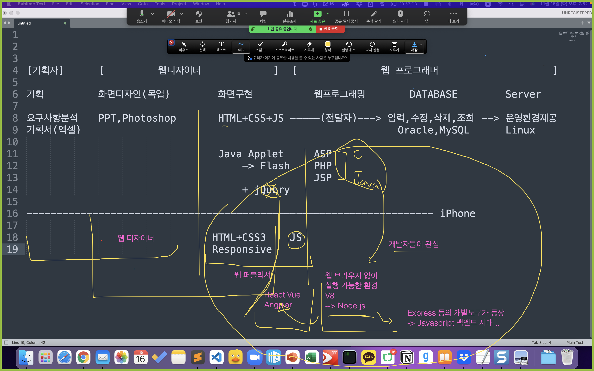

# Hello Javascript

## #01. 웹 사이트 관련 직군 / 언어 분류



## #02. 실행환경 구성

### 1) Node.js

#### 설치확인

윈도우의 경우 명령프롬프트 실행

> WinKey + R > cmd (엔터)

맥의 경우 터미널 실행

> Cmd + Space > 터미널 검색

명령어 수행

```shell
node --version
```

결과값이 출력되지 않을 경우 https://nodejs.org 에서 프로그램 내려받아 설치 필요함.

대부분의 경우 LTS 버전 권장.

Mac M1 버전의 경우 17.1 이상 버전 필요함.

설치 완료 후 열어두었던 명령프롬프트나 터미널을 종료하고 재시작.

앞서 수행한 버전확인 명령어를 통해 설치 완료 확인.


### 2) Visual Studio Code

https://code.visualstudio.com/


## #03. Hello Javascript

### 1) 소스코드

프로그램 명령어를 저장해 놓은 파일

사용하는 프로그래밍 언어에 따라 확장자가 서로 다르다. (`*.java`, `*.js`, `*.py`, `*.cpp`)

일반적인 메모장용 텍스트파일의 확장자를 강제로 수정해서 사용한다.

### 2) 주석문

프로그램 소스코드 안에 명시하는 필기.

소스코드에 대한 부연 설명을 작성하는 용도.

#### 한 줄 전용

`//` 를 명시하고 그 뒤에 주석 내용을 작성한다. 여러 줄을 지정해야 할 경우 모든 행 앞에 `//`가 붙는다.


```javascript
// 여기는 주석입니다.
// 여기는 주석입니다.
// 여기는 주석입니다.
// 여기는 주석입니다.
```

#### 여러줄 처리

`/*`과 `*/` 사이에 주석 내용을 작성한다. 이 안에서는 줄바꿈이 자유롭다.

```javascript
/*
여기는 주석입니다.
여기는 주석입니다.
여기는 주석입니다.
여기는 주석입니다.
*/
```

### 3) 첫 번째 Javascript program

#### JS가 HTML안에 존재하는 경우.

원래 JS는 HTML에 기생하는 존재.

> simple.html


#### JS코드와 HTML을 분리

하나의 파일에 HTML(뼈대) + CSS(옷) + JS(동작)가 혼합되면서 코드가 복잡해지고 길어진다. (스파게티 코드)

CSS와 JS를 별도의 파일로 분리하는 것이 바람직.

##### 확장자가 `*.js`인 파일이 순수 JS코드만 작성

> HelloWorld.js

##### JS파일을 참조하는 HTML

> HelloWorld.html


### 4) JS 소스코드 작성시 주의 사항

1. 대소문자를 업격히 구분한다.
2. 줄바꿈과 띄어쓰기는 개발자가 코드를 읽기 수월하게 하기 위한 용도일 뿐 실행에는 아무런 영향이 없다.


### 5) JS 파일 직접 실행

#### 명령프롬프트(win)를 통한 실행

- `WinKey+R` -> cmd `(엔터)` 로 명령프롬프트 실행
- 소스파일이 존재하는 폴더로 이동 `cd 폴더경로`
    - 폴더 위치가 C드라이브가 아닌 경우 `/d` 옵션 적용 -> `cd /d 폴더경로`
- `node 파일이름` 명령으로 코드 실행


#### VSCode를 통한 실행

- `Code Runner` 확장 익스텐션 설치


- 코드 창에서 `Ctrl + Alt + N` 으로 실행
- 원하는 부분만 드래그 후 부분 실행 가능함.

##### 실행시 이전 출력 내용 삭제 설정


