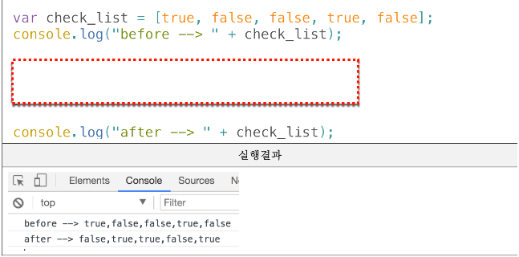
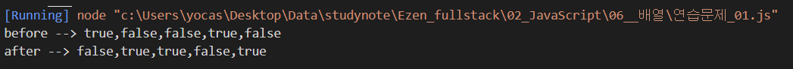
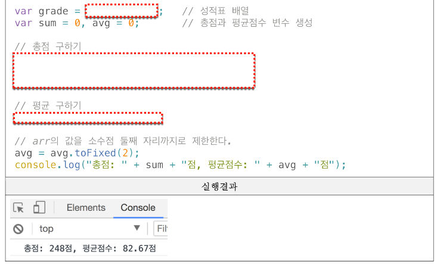

## 기본문법 활용하기 연습문제

> 2021-01-30

## 문제 1. `다음의 소스코드는 boolean 데이터를 저장하고 있는 배열에 대한 어떤 처리를 보여준다. 실행 결과에서 제시하는 것과 같이 배열에 저장되어 있는 값들을 반전 (true -> false, false -> true) 변환하는 처리를 완성하시오.`


<br/>

#### 풀이
```js
// 내 답
var check_list = [true, false, false, true, false];

console.log("before --> " + check_list);
for (let i = 0; i < check_list.length; i++) {
    check_list[i] = !check_list[i];
}

console.log("after --> " + check_list);
```

#### 내 답 결과


<br/><br/><br/>

## 문제 2. `다음표는 어떤 학생의 과목별 점수이다. 이 학생의 총점과 평균 점수를 구하는 프로그램에 대한 아래의 소스코드를 완성하시오.`

| | HTML | CSS | Javascript |
|---|---|---|---|
| 점수 | 75 | 82 | 91 |



<br/>

#### 풀이

```js
// 내 답

var grade = [75, 82, 91];   // 성적표 배열
var sum = 0, avg = 0;   // 총점과 평균 점수 변수 생성

// 총점 구하기
for (i=0; i<grade.length; i++){
    sum += grade[i];
}

// 평균 구하기
    avg = sum / grade.length;

// arr의 값을 소수점 둘째 자리까리로 제한한다.
avg = avg.toFixed(2);
console.log("총점: " + sum + "점, 평균점수:" + avg + "점");

```
#### 내 답 결과

