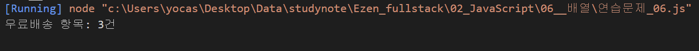
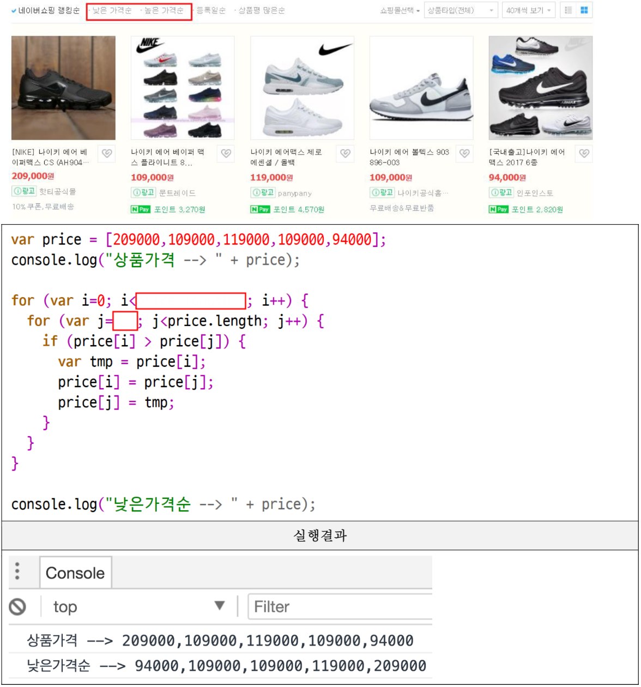
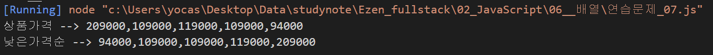
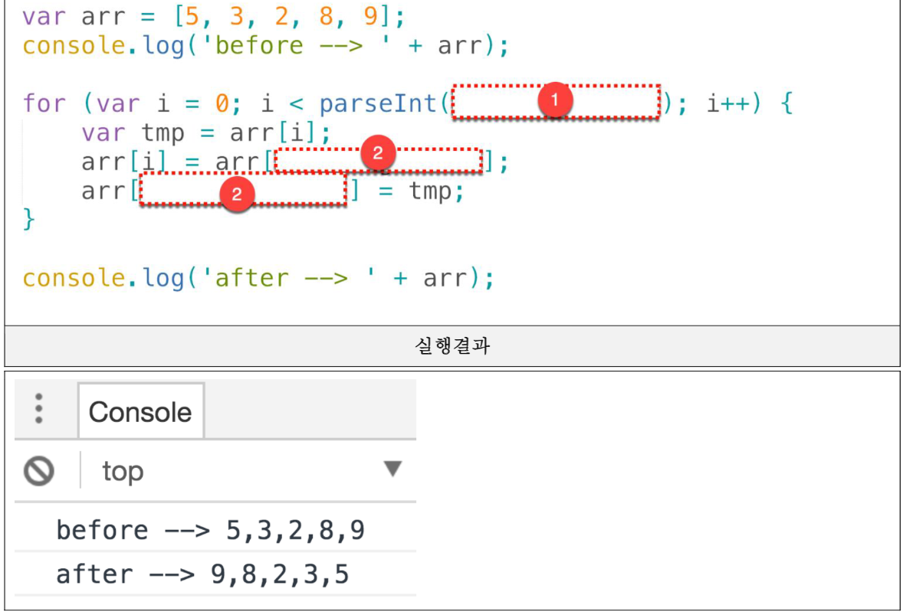
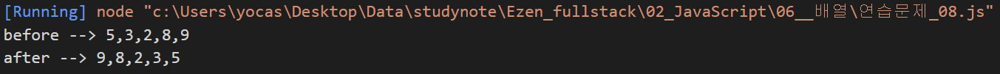

## 기본문법 활용하기 연습문제

> 2021-01-30

## 문제 1. `다음의 소스코드는 boolean 데이터를 저장하고 있는 배열에 대한 어떤 처리를 보여준다. 실행 결과에서 제시하는 것과 같이 배열에 저장되어 있는 값들을 반전 (true -> false, false -> true) 변환하는 처리를 완성하시오.`


<br/>

#### 풀이
```js
// 내 답
var check_list = [true, false, false, true, false];

console.log("before --> " + check_list);
for (let i = 0; i < check_list.length; i++) {
    check_list[i] = !check_list[i];
}

console.log("after --> " + check_list);
```

#### 내 답 결과


<br/><br/><br/>

## 문제 2. `다음표는 어떤 학생의 과목별 점수이다. 이 학생의 총점과 평균 점수를 구하는 프로그램에 대한 아래의 소스코드를 완성하시오.`

| | HTML | CSS | Javascript |
|---|---|---|---|
| 점수 | 75 | 82 | 91 |


<br/>

#### 풀이

```js
// 내 답
var grade = [75, 82, 91];   // 성적표 배열
var sum = 0, avg = 0;   // 총점과 평균 점수 변수 생성

// 총점 구하기
for (i=0; i<grade.length; i++){
    sum += grade[i];
}

// 평균 구하기
    avg = sum / grade.length;

// arr의 값을 소수점 둘째 자리까리로 제한한다.
avg = avg.toFixed(2);
console.log("총점: " + sum + "점, 평균점수:" + avg + "점");

```
#### 내 답 결과


<br/><br/>

## 문제 3. `다음 표는 어떤 학생이 일요일부터 토요일까지의 일주일간 아르바이트를 한 시간이다.주말에는 7시간 평일에는 5시간을 일하기로 했지만, 금요일에 다른 직원의 사정으로 대신 근무를 하게되어 10시간을 일했다.이 학생의 시급이 4,500원이었지만 목요일 부터는 5,200원으로 올랐다고 할 때 일주일간의 총 급여를 구하는 프로그램을 작성하시오. (기본 코드는 아래 제시되는 내용을 사용하세요.`

| 일 | 월 | 화 | 수 | 목 | 금 | 토 |
|---|---|---|---|---|---|---|
| 7 | 5 | 5 | 5 | 5 | 10 | 7 |


<br/>

#### 풀이

```js
// 내 답
// 모르겠어서 강제로 값을 맞췄습니다.

var time = [7, 5, 5, 5, 5, 10, 7];
var money = 0;

for (let i = 0; i < time.length; i++) {
    if (time[i] < 5) {
        time[i] = time[i] * 4500;
    } else {
        time[i] = time[i] * 4850;
    }
    money += time[i];
}
console.log("1주일간의 전체 급여: " + money + "원");

// 정답
var time = [7, 5, 5, 5, 5, 10, 7];
var money = 0;

for (let i = 0; i < time.length; i++) {
    if (i < 4) {
        money += time[i] * 4500;
    } else {
        money += time[i] * 5200;
    }
}
console.log("1주일간의 전체 급여: " + money + "원");
```

#### 내 답 결과

#### 정답 결과


<br/><br/>

## 문제 4. `아래의 화면은 쇼핑몰의 장바구니에 담은 상품에 대한 내역이다.`
## `상품의 가격을 원소로 갖는 1차 배열 price와 각 상품의 수량을 원소로 갖는 1차 배열 qty를 다음과 같이 정의하였을 때 이 사람이 총 얼마를 결제해야 하는지 결제금액을 구하는 프로그램을 작성하시오.`


<br/>

#### 풀이

```js

// 내 답
var price = [38000, 20000, 17900, 17900];
var qty = [6, 4, 3, 5];
var money = 0;

for (let i=0; i<price.length; i++) {
        money += (price[i]*qty[i]);
}

console.log("전체 결제 금액: %d원", money);
```

#### 내 답 결과


<br/><br/>

## 문제 5. `문제 4번의 장바구니 내역에서 상품금액 (판매가 * 수량)이 가장 비싼 항목은 얼마인지 출력하시오.`


<br/>

#### 풀이

```js
// 내 답
var price = [38000, 20000, 17900, 17900];
var qty = [6, 4, 3, 5];
var TopPrice = price[0]* qty[0];

for (let i=0; i<price.length; i++) {
    for (let j=0; j<qty.length; j++) {
        if (TopPrice < price[i] * qty[j] ) {
            TopPrice = price[i] * qty[j];
        }
    }
}

console.log("가장 높은 상품금액: %d원", TopPrice);

// 정답
const price = [38000, 20000, 17900, 17900];
const qty = [6, 4, 3, 5];

// 단가*수량 중에서 가장 큰 값을 구해야 하므로 처음에 저장하는 값도 단가*수량으로 설정
let money = price[0] * qty[0];
// 단가*수량에 대한 최대값 구하기
// --> 인덱스가 동일한 요소들끼리의 계산이므로
// 인덱스 번호를 알 수 없는 for~of문은 사용불가
for (let i = 1; i < price.length; i++) {
    // i번째에 대한 총금액을 구한다.
    const sum = price[i] * qty[i];

    if (money < sum) {
        money = sum;
    }
}
console.log("가장 높은 상품금액: %d원", money);
```

#### 내 답 결과


#### 정답 결과


<br/><br/>

## 문제 6. `문제 4번의 장바구니 내역에서는 모든 장바구니 상품이 개별 배송이라고 한다. 상품금액(판매가*수량)이 8만원 이상인 경우 무료로 배송이 된다고 할 때 무료로 배송되는 항목은 모두 몇 개 인지 구하는 프로그램을 구현하시오.`

<br/>

#### 풀이
```js
// 내 답
var price = [38000, 20000, 17900, 17900];
var qty = [6, 4, 3, 5];
var num = 0;

for (let i=0; i<price.length; i++) {
    for (let j=0; j<qty.length; j++) {
        if (price[i]*qty[j] > 80000) {
            num = 3;
        }
    }
}

console.log("무료배송 항목: %d건", num); // 모르겠소요

// 정답
var price = [38000, 20000, 17900, 17900];   // 단가 배열
var qty = [6, 4, 3, 5]; // 주문수량 배열
var count = 0;  // 수량을 저장할 변수 선언 --> 덧셈(합,카운트 등) 계산에서는 0으로 초기화

for (let i=0; i<price.length; i++) {
    // i번째에 대한 총 금액을 구한다.
    const sum = price[i] * qty[i];

    //원하는 조건이 충족될 때 카운트 1증가
    if (sum >= 80000) {
        count++;
    }
}
console.log("무료배송 항목: %d건", count);
```

#### 내 답 결과


#### 정답 결과


<br/><br/>

## 문제 7. `다음은 어느 쇼핑몰의 상품 목록 화면이다.`
##  `아래의 소스코드는 위의 사움 목록에서 상품의 가격을 원소로 하는 배열 money를 정의하였을 때 "낮은가격순" 버튼이 눌러졋을 때 상품의 가격을 재정렬하기 위한 코드에 대한 일부이다. 빈 칸을 채워넣어 완성하시오.`

<br/>

#### 풀이
```js
// 내 답
let price = [209000,109000,119000,109000,94000];
console.log("상품가격 --> " + price);

for(let i=0; i<price.length; i++) {
    for (let j=0; j<price.length; j++) {
        if ( price[i] < price[j]) {
            var tmp = price[i];
            price[i] = price[j];
            price[j] = tmp;
        }
    }
}

console.log("낮은가격순 --> " + price);

// 정답
let price = [209000, 109000, 119000, 109000, 94000]; // 상품가격 배열
console.log("상품가격 --> " + price);

// 낮은 가격순으로 정렬 수행
// (공식) 부모 반복문 -> i가 0부터 길이 -1 보다 작은 동안
//        자식 반복문 -> i가 i+1부터 길이보다 작은 동안
//        i번째와 j번째의 크기를 비교하여 맞교환 처리 수행
for (let i = 0; i < price.length - 1; i++) {
    for (let j = i+1; j < price.length; j++) {
        if (price[i] > price[j]) {
            var tmp = price[i];
            price[i] = price[j];
            price[j] = tmp;
        }
    }
}
console.log("낮은가격순 --> " + price);
```

#### 내 답 결과

#### 정답 결과

<br/>

## 문제 8. `아래의 코드는 배열의 원소를 반대로 배치하는 소스코드의 일부이다. 빈 칸을 완성하시오. (번호가 같은 박스는 같은 코드가 들어갑니다.)`


<br/>

#### 풀이
```js
// 내답
let arr = [5, 3, 2, 8, 9];
console.log('before --> ' + arr);

for (let i=0; i<parseInt(arr.length /2); i++) {
    let tmp = arr[i];
    arr[i] = arr[arr.length - i -1];
    arr[arr.length - i -1] = tmp;
}

console.log('after --> ' + arr);

//정답
let arr = [5, 3, 2, 8, 9];
console.log('before --> ' + arr);

// 역순 배치공식
// 1) 배열길이 /2 만큼만 반복
// 2) i번쨰와 길이-i-1 번째를 맞교환
for (let i = 0; i < arr.length / 2; i++) {
    const tmp = arr[i];
    arr[i] = arr[arr.length - i - 1];
    arr[arr.length - i - 1] = tmp;
}

console.log('after --> ' + arr);
```

#### 내 답 결과


#### 정답 결과

<br/><br/>

