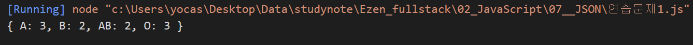
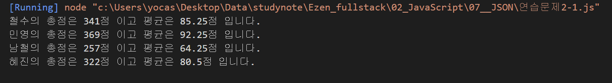
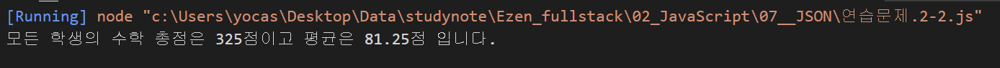
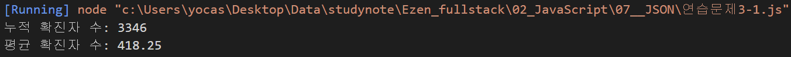
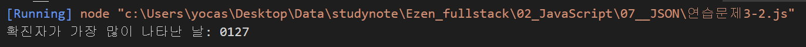

# JSON 연습문제

## 문제1.

다음은 10명의 학생들에 대한 혈액형 데이터이다.

```
['A', 'A', 'A', 'O', 'B', 'B', 'O', 'AB', 'AB', 'O']
```

아래와 같은 JSON을 정의하고, 각 혈액형별 학생수를 아래의 json의 각 key에 대한 value에 저장하시오. (혈액형별 학생 수를 for문을 활용하여 산출해야 합니다.)

```js
const result = {"A" : 0, "B" : 0, "AB" : 0, "O" : 0};
```
#### 풀이

```js
const result = {"A": 0, "B": 0, "AB":0, "O": 0};

blood = ['A', 'A', 'A', 'O', 'B', 'B', 'O', 'AB', 'AB', 'O'];

for (const b of blood) {
    result[b]++;
}
console.log(result);
```

#### 결과

<br/><br/>
---

## 문제2.

다음의 JSON은 어느 학급의 중간고사 성적을 나타낸다.

```js
const exam = {
    "철수": [89, 82, 79, 91],
    "민영": [91, 95, 94, 89],
    "남철": [65, 57, 71, 64],
    "혜진": [82, 76, 81, 83]
}
```

### 2-1.

위 데이터에서 학생별 총점과 평균을 구하시오.

#### 출력결과

```
철수의 총점은 341점 이고 평균은 85.25점 입니다.
민영의 총점은 369점 이고 평균은 92.25점 입니다.
남철의 총점은 257점 이고 평균은 64.25점 입니다.
혜진의 총점은 322점 이고 평균은 80.5점 입니다.
```
#### 풀이

```js
const exam = {
    "철수": [89, 82, 79, 91],
    "민영": [91, 95, 94, 89],
    "남철": [65, 57, 71, 64],
    "혜진": [82, 76, 81, 83]
}

// JSON의 key에 대한 반복처리
for (const key in exam){
    // 학생별 총점을 위한 변수 초기화
    let sum = 0;

    // exam[key]는 학생 한명의 점수 배열.
    // 이 배열의 원소를 스캔하는 반복문을 사용하여 총점 구하기
    for (const p of exam[key]) {
        sum += p;
    }

    let avg = sum / exam[key].length;

    console.log("%s의 총점은 %d점 이고 평균은 %d점 입니다.", key, sum, avg);
}
```

#### 결과

<br/><br/>
---

### 2-2.

위 문제의 점수가 순서대로 국어, 영어, 수학, 과학일 경우 수학에 대한 모든 학생의 총점과 평균을 구하시오.

#### 출력결과

```
모든 학생의 수학 총점은 325점 이고 평균은 81.25점 입니다.
```
#### 풀이

```js
const exam = {
    "철수": [89, 82, 79, 91],
    "민영": [91, 95, 94, 89],
    "남철": [65, 57, 71, 64],
    "혜진": [82, 76, 81, 83]
}

// 전체 학생에 대한 총점이므로 반복문의 바깥에서 변수 초기화

let sum = 0;

// JSON은 길이를 알 수 없기 때문에 JSON의 원소 하나를 반복문으로 스캔할 때마다
// count 변수를 1씩 증가하여 전체 학생 수를 알아내야 한다.
let student_count = 0;

for (const key in exam) {
    sum += exam[key][2];

    // 몇 번째 학생인지 카운트
    student_count++;
}

// 학생별 수학 총점 / 학생수
let avg = sum / student_count;

console.log("모든 학생의 수학 총점은 %d점이고 평균은 %d점 입니다.", sum, avg);
```

#### 결과


<br/><br/>
---

## 문제3.

아래의 데이터는 2021년 01월 25일부터 02월 01일까지의 Covid19 일별 확진자 수를 표현한 자료구조다.

```javascript
covid19 = [
    {date: '0125': active: 426}, 
    {date: '0126': active: 343}, 
    {date: '0127': active: 547}, 
    {date: '0128': active: 490}, 
    {date: '0129': active: 460}, 
    {date: '0130': active: 443}, 
    {date: '0131': active: 338}, 
    {date: '0201': active: 299}
]
```

### 3-1.

1월 25일부터 2월 1일까지의 누적 확진자 수와 일 평균 확진자 수를 구하시오.

#### 출력결과

```
누적 확진자 수: 3346
평균 확진자 수: 418.25
```
#### 풀이

```js
covid19 = [
    { date: `0125`, active: 426 },
    { date: `0126`, active: 343 },
    { date: `0127`, active: 547 },
    { date: `0128`, active: 490 },
    { date: `0129`, active: 460 },
    { date: `0130`, active: 443 },
    { date: `0131`, active: 338 },
    { date: `0132`, active: 299 },
]

// 전체 확진자 수를 위한 합계 변수
let sum = 0;

for (const j of covid19) {
    sum += j.active;
}

console.log("누적 확진자 수: %d", sum);
console.log("평균 확진자 수: %d", sum / covid19.length);
```

#### 결과

<br/><br/>
---

### 3-2

1월 25일부터 2월 1일까지 중에서 확진자가 가장 많이 나타난 날짜는 언제인가?

#### 출력결과

```
확진자가 가장 많이 나타난 날: 0127
```
#### 풀이

```js
covid19 = [
    { date: `0125`, active: 426 },
    { date: `0126`, active: 343 },
    { date: `0127`, active: 547 },
    { date: `0128`, active: 490 },
    { date: `0129`, active: 460 },
    { date: `0130`, active: 443 },
    { date: `0131`, active: 338 },
    { date: `0132`, active: 299 },
]

let max_active = covid19[0].active;
let max_date = covid19[0].date;

for (const j of covid19) {
    if (max_active < j.active) {
        max_active = j.active;
        max_date = j.date;
    }
}

console.log("확진자가 가장 많이 나타난 날: %s", max_date);
```

#### 결과

<br/><br/>
---