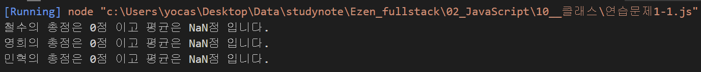
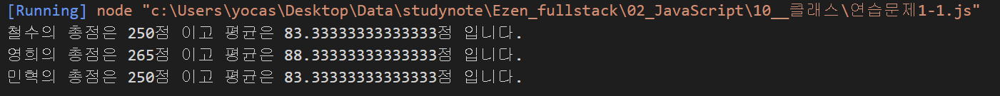
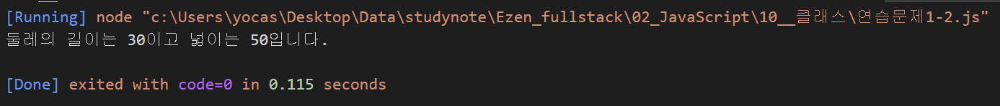

# Class 기반 객체지향 연습문제

## 문제1.

앞 단원에서 수행한 연습문제 1,2번을 Class 기반의 객체지행으로 재구성하시오.

### 1-1

#### 내 풀이

```js
class Student {
    constructor() {
        this.kor = null;
        this.eng = null;
        this.math = null;
    }
    sum(grade) {
        return this.kor + this.eng + this.math;
    }
    avg(grade) {
        return this.sum / 3;
    }

};
const grade = [
    ["철수", 92, 81, 77],
    ["영희", 72, 95, 98],
    ["민혁", 80, 86, 84]
];

for (const item of grade) {
    const s = new Student(item[1], item[2], item[3]);
    console.log("%s의 총점은 %d점 이고 평균은 %d점 입니다.", item[0], s.sum(), s.avg());
}
```

#### 풀이 결과


#### 정답

```js
class Student {
    constructor(kor, eng, math) {
        this._kor = kor;
        this._eng = eng;
        this._math = math;
    }
    sum() {
        return this._kor + this._eng + this._math;
    }
    avg() {
        return this.sum() / 3;
    }

};
const s1 = new Student(92, 81, 77);
const s2 = new Student(72, 95, 98);
const s3 = new Student(80, 86, 84);
console.log("철수의 총점은 %d점 이고 평균은 %d점 입니다.",s1.sum(), s1.avg());
console.log("영희의 총점은 %d점 이고 평균은 %d점 입니다.",s2.sum(), s2.avg());
console.log("민혁의 총점은 %d점 이고 평균은 %d점 입니다.",s3.sum(), s3.avg());
console.groupEnd();

```

#### 정답 결과


<br/><br/>

---

### 1-2

#### 정답

```js
class Rectangle {
    constructor() {
        this.width = null;
        this.height = null;
    }

    get width() {
        return this._width;
    }

    set width(param) {
        this._width = param;
    }

    get height() {
        return this._height;
    }

    set height(param) {
        this._height = param;
    }

    getAround() {
        return this.width * 2 + this.height * 2;
    }

    getArea() {
        return this.width * this.height;
    }
};

const rect = new Rectangle();
rect.width = 10;
rect.height = 5;

console.log('둘레의 길이는 %d이고 넓이는 %d입니다.', rect.getAround(), rect.getArea());
```

#### 정답 결과
