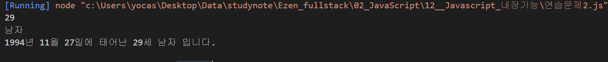
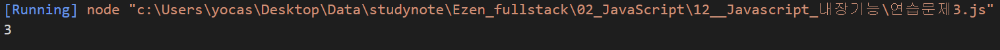
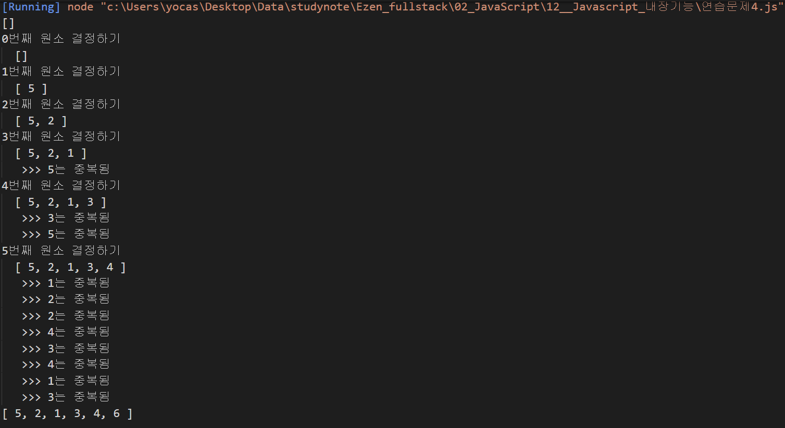
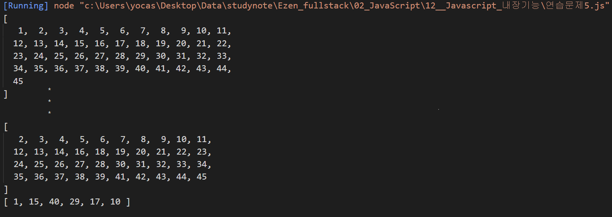
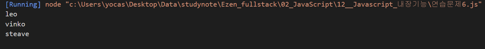

# 내장객체 연습문제

## 문제1.

자신의 이메일 주소를 `email` 이라는 변수에 저장하고 `@`를 기준으로 아이디와 도메인 부분을 분리하여 출력하시오.

### 출력결과

이메일이 leekh4232@gmail.com 인 경우

```
leekh4232
gmail.com
```

#### 풀이

```js
// 내 풀이
let email = "yocasd@gmail.com";
let sub1 = email.substring(0, 6);
let sub2 = email.substring(7, 16);
console.log(sub1);
console.log(sub2);

// 정답
email = "yocasd2@gmail.com";

p = email.indexOf("@");
id = email.substring(0, p);
domain = email.substring(p + 1);

console.log(id);
console.log(domain);
```

#### 풀이 결과


#### 정답 결과

<br/><br/>

---

## 문제2.

임의의 주민번호를 다음과 같이 `*`을 포함하여 변수에 저장하시오.

```
ssn = '020517-3******'
```

또한 현재 년도를 now_year라는 변수로 저장하시오.

이 값을 사용하여 생년월일, 나이, 성별을 출력하시오.

#### 출력결과

```
2002년 5월 17일에 태어난 20세 남자 입니다.
```

#### 풀이

```js
// 정답
const ssn = '941127-1******'

const date = new Date();
const now_year = date.getFullYear();

let yy = parseInt(ssn.substring(0, 2));
let mm = parseInt(ssn.substring(2, 4));
let dd = parseInt(ssn.substring(4, 6));
let gen = parseInt(ssn.substring(7, 8));

//console.log("%d, %d, %d, %d", yy, mm, dd, gen);  94 11 27 1

// 2000년도 이전 출생자의 주민번호 뒷자리 -> 1,2
// 2000년도 이후 출생자의 주민번호 뒷자리 -> 3,4
yy = (gen > 2) ? yy + 2000 : yy + 1900; // gen이 2보다 크면 yy에 2000 더하고 그렇지 않으면 1900 더해라

// 나이 계산
const age = now_year - yy + 1;
console.log(age);

// 성별 확인
const sex = (gen % 2) ? "남자" : "여자";
console.log(sex);

console.log("%d년 %d월 %d일에 태어난 %d세 %s 입니다.", yy, mm, dd, age, sex);

```

#### 정답 결과

<br/><br/>

---

## 문제3.

아래의 문장에서 "수업시간"이라는 단어가 총 몇 번 등장하는지 카운트 하는 프로그램을 구현하시오.

```
str = "수업시간에 배운것은 수업시간에 다 이해하고 넘어가야지 수업시간에 놓치면 따라오기 힘들다."
```

#### 출력결과

#### 풀이

```js
// 정답
str = "수업시간에 배운것은 수업시간에 다 이해하고 넘어가야지 수업시간에 놓치면 따라오기 힘들다."

word = "수업시간";
flen = word.length;
find = true;
count = 0;

while(find) {
    //console.log(str);
    p = str.indexOf(word);
    find = p > -1;

    if (find) {
        count++;
        str = str.substring(p+flen);
    }
}

console.log(count);
```

#### 정답 결과

<br/><br/>

---

```
3
```

## 문제4. (로또번호 생성기 1)

주어진 범위 안에서 랜덤한 숫자를 추출하는 함수는 아래와 같다.

```javascript
function random(n1, n2) {
  return parseInt(Math.random() * (n2 - n1 + 1)) + n1;
}
```

0개의 원소를 갖는 배열 `lotto`를 생성하고 6회의 반복을 수행하는 for문을 사용하여 배열의 각 원소를 `1~45` 사이의 범위를 갖는 임의의 숫자로 채워 넣으시오.

반복이 종료되었을 때 `lotto`의 원소는 6개의 숫자가 채워져 있어야 하고 각 숫자는 중복되지 않아야 합니다.

중복되지 않는 숫자를 생성하기 위해 for문 안에서 무한반복을 위한 while문을 수행해야 합니다.

#### 풀이

```js
// 정답
// 랜덤함수
function random(n1, n2) {
    return parseInt(Math.random() * (n2 - n1 + 1)) + n1;
}

// 0개의 원소를 갖는 배열
const lotto = [];
console.log(lotto);

// 6회의 반복을 수행
for (let i=0; i<6; i++) {
    console.group("%d번째 원소 결정하기", i);
    console.log("%s", lotto);
    // 중복되지 않는 숫자가 몇 번째에 생성될지 알 수 없으므로 무한 반복
    while (true) {
        // 랜덤한 숫자
        // const rnd = random(1, 45);
        const rnd = random(1, 6);

        // rnd 값이 lotto배열안의 원소와 중복되지 않는다면?
        if (!lotto.includes(rnd)){
            lotto.push(rnd);
            break;
        } else {
            console.log(" >>> %d는 중복됨", rnd);
        }
    }
    console.groupEnd();
}

console.log(lotto);
```

#### 정답 결과

<br/><br/>

---

## 문제5. (로또번호 생성기 2)

`1~45`사이의 범위의 1씩 증가 하는 원소가 저장되어 있는 배열 `balls`을 생성하고 6개의 빈 칸을 갖는 배열 `lotto`를 생성하시오.

`lotto` 배열을 탐색하는 반복을 수행하면서 `balls` 배열에서 임의의 원소 하나를 추출하여 `lotto` 배열에 채워 넣으시오.

추출된 숫자는 `balls` 배열에서는 삭제되어야 합니다.

#### 풀이

```js
// 정답
function random(n1, n2) {
    return parseInt(Math.random() * (n2 - n1 + 1)) + n1;
}

// `1~45`사이의 범위의 1씩 증가 하는 원소가 저장되어 있는 배열 `balls`를 생성
const balls = new Array(45);

for (let i = 0; i < balls.length; i++) {
    balls[i] = i + 1;
}
// console.log(balls);

// 6개의 빈 칸을 갖는 배열 `lotto`를 생성
const lotto = new Array(6);

for (let i=0; i<lotto.length; i++){
    console.log(balls);

    // balls의 index범위 안에서 임의의 위치를 선정
    const rnd = random(0, balls.length-1);

    // `balls` 배열에서 임의의 원소 하나를 추출하여 `lotto` 배열에 채워넣기
    lotto[i] = balls[rnd];

    // rnd번째의 위치에서 하나의 데이터를 잘나냄
    balls.splice(rnd, 1);
}

console.log(lotto);
```

#### 정답 결과

<br/><br/>

---

## 문제6.

수많은 마라톤 선수들이 마라톤에 참여하였습니다. 단 한 명의 선수를 제외하고는 모든 선수가 마라톤을 완주하였습니다.

마라톤에 참여한 선수들의 이름이 담긴 배열 participant와 완주한 선수들의 이름이 담긴 배열 completion이 주어질 때, 완주하지 못한 선수의 이름을 return 하도록 solution 함수를 작성해주세요.

```javascript
function solution(participant, completion) {
  var answer = "";
  return answer;
}
```

### 제한사항

- 마라톤 경기에 참여한 선수의 수는 1명 이상 100,000명 이하입니다.
- completion의 길이는 participant의 길이보다 1 작습니다.
- 참가자의 이름은 1개 이상 20개 이하의 알파벳 소문자로 이루어져 있습니다.
- 참가자 중에는 동명이인이 있을 수 없습니다.

### 입출력 예

| participant                                       | completion                               | return  |
| ------------------------------------------------- | ---------------------------------------- | ------- |
| ["leo", "kiki", "eden"]                           | ["eden", "kiki"]                         | "leo"   |
| ["marina", "josipa", "nikola", "vinko", "filipa"] | ["josipa", "filipa", "marina", "nikola"] | "vinko" |
| ["mislav", "stanko", "steave", "ana"]             | ["stanko", "ana", "mislav"]              | "steave |

```javascript
// "leo"는 참여자 명단에는 있지만, 완주자 명단에는 없기 때문에 완주하지 못했습니다.
// 출력결과: "leo"가 출력
console.log(solution(["leo", "kiki", "eden"], ["eden", "kiki"]));

// "vinko"는 참여자 명단에는 있지만, 완주자 명단에는 없기 때문에 완주하지 못했습니다.
// 출력결과: "vinko"가 출력
console.log(
  solution(
    ["marina", "josipa", "nikola", "vinko", "filipa"],
    ["josipa", "filipa", "marina", "nikola"]
  )
);

// "steave"는 참여자 명단에는 있지만, 완주자 명단에는 없기 때문에 완주하지 못했습니다.
// 출력결과: "steave"가 출력
console.log(
  solution(["mislav", "stanko", "steave", "ana"], ["stanko", "ana", "mislav"])
);
```

#### 풀이

```js
// 정답
function solution(participant, completion) {
    var answer = '';

    // participant원소 중에서 completion에 포함되지 않은 하나의 원소를 찾아서 answer에 저장하는 것이 문제 내용.
    // --> participant의 원소를 탐색하여 completion에 속하지 않음을 확인하면 그 순간 반복 중단
    //      1) for문을 사용해 탐색하다가 break사용
    // for (let i = 0; i < participant.length; i++) {
    //     const p = participant[i];

    //     if (!completion.includes(p)) {
    //         answer = p;
    //         break;
    //     }
    // }

    //     2) 배열의 some함수 사용
    participant.some((v, i) => {
        if (!completion.includes(v)) {
            answer = v;
            return true;
        }
    });
    
    return answer;
}

// "leo"는 참여자 명단에는 있지만, 완주자 명단에는 없기 때문에 완주하지 못했습니다.
// 출력결과: "leo"가 출력
console.log(solution(["leo", "kiki", "eden"], 
                     ["eden", "kiki"]));

// "vinko"는 참여자 명단에는 있지만, 완주자 명단에는 없기 때문에 완주하지 못했습니다.
// 출력결과: "vinko"가 출력
console.log(solution(["marina", "josipa", "nikola", "vinko", "filipa"], 
                     ["josipa", "filipa", "marina", "nikola"]));

// "steave"는 참여자 명단에는 있지만, 완주자 명단에는 없기 때문에 완주하지 못했습니다.
// 출력결과: "steave"가 출력
console.log(solution(["mislav", "stanko", "steave", "ana"], 
                     ["stanko", "ana", "mislav"]));
```

#### 정답 결과

<br/><br/>

---