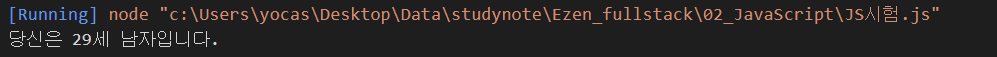
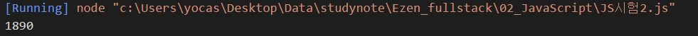
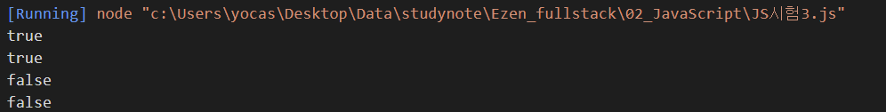
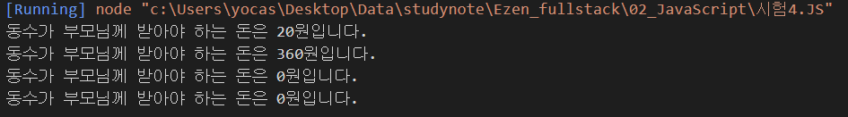
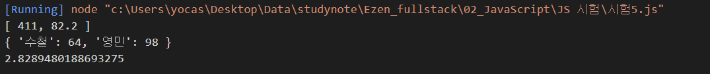

# 문제1

### 풀이
```js
const date = new Date();
const now_year = date.getFullYear();

let ssn = "9411271";
let yy = Number(ssn.substring(0, 2));
let gen = Number(ssn.substring(6, 7));

let my_year = (yy = (gen > 2) ? yy + 2000 : yy + 1900);
let age = now_year - my_year + 1;

console.log("당신은 %d세 남자입니다.", age);
```

### 출력결과


---

# 문제2

### 풀이
```js
function random(n1, n2) {
    return parseInt(Math.random() * (n2 - n1 + 1)) + n1;
}

let number = random(100, 200);
let sum = 0;

for (i = 1; i < number; i++) {
    if (i % 3 == 0) {
        sum += i;
    }
}
console.log(sum);
```

### 출력결과


---

# 문제3

### 풀이
```js
function solution(x) {
    let arr = String(x).split("");
    let sum = 0;
    for (let i = 0; i < arr.length; i++) {
        sum += Number(arr[i])
    }
    return (x % sum == 0) ? true : false;
}

console.log(solution(10));
console.log(solution(12));
console.log(solution(11));
console.log(solution(13));
```

### 출력결과


---

# 문제4

### 풀이
```js
function solution(k, n, m) {
    let money = k * n - m;
    if (money > 0) {
        console.log("동수가 부모님께 받아야 하는 돈은 %d원입니다.", money);
    } else {
        console.log("동수가 부모님께 받아야 하는 돈은 %d원입니다.", 0);
    }
}

solution(30, 4, 100);
solution(250, 2, 140);
solution(20, 6, 120);
solution(20, 10, 320);
```

### 출력결과


---

# 문제5

### 풀이
```js
class Student {
    constructor() {
        this._grade = [];
        this._score = [];
    }
    set score(param) {
        this._score = param;
    }
    set grade(score) {
        this._grade = score;
    }

    getSumAvg() {
        let sum = 0;
        for (let i in this._grade) {
            sum += this._grade[i];
        }
        let avg = sum / 5;
        return this.grade = [sum, avg];

    }
    getMinMax() {
        let max = this._score[0];
        let min = this._score[0];
        for (let i = 1; i < this._score.length; i++) {
            if (max < this._score[i]) {
                max = this._score[i];
            } else if (min > this._score[i]) {
                min = this._score[i];
            }
        }
        JSON.stringify(min);
        JSON.stringify(max);
        let jsn = { "수철": min, "영민": max };
        return jsn;
    }
    getVar() {
        let sum2 = 0;
        for (let i = 0; i < this._score.length; i++) {
            sum2 += this._score[i];
        }
        let avg = sum2 / 5;
        let a = 0;
        let b = 0;
        for (let j = 0; j < this._score.length; j++) {
            a += Math.sqrt(Math.abs(avg - this._score[j]));
        }
        b = a / this._score.length;
        return b;
    }
    getStd() {
    }
}

const a = new Student();
a.grade = [82, 76, 91, 98, 64];
a.score = [82, 76, 91, 98, 64];
console.log(a.getSumAvg());
console.log(a.getMinMax());
console.log(a.getVar());
//1. 생성자에서 원소가 0개인 빈 배열 grade를 생성합니다.
//2. setter에 학생 한명의 점수를 주입하면 grade의 원소로 추가됩니다. getter는 제공되지않습니다.
//3. 주입된 점수의 총점과 평균을 배열로 리턴하는 getSumAvg() 함수를 제공합니다.
//4. 주입된 점수 중에서 최하점과 최고점을 JSON으로 리턴하는 getMinMax() 함수를 제공합니다.
//5. 주입된 점수에 대한 분산을 리턴하는 getVar() 함수를 제공합니다.
//6. 주입된 점수에 대한 표준편차를 리턴하는 getStd() 함수를 제공합니다.
```

### 출력결과
