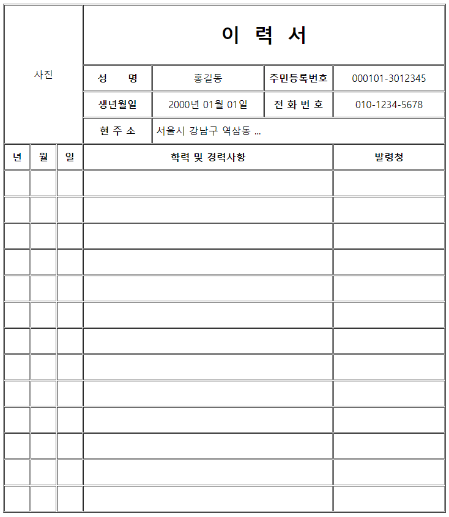

# 표 그리기
## #01) 표 그리기 기본 구성

- 영역 구문이 모호할 경우 thead, tbody, tfoot은 생략할 수 있다.
- tr,td,th는 필요한 만큼 반복 사용 가능

```html
<table border="굵기" width="넓이"                       ← 표의 영역 지정
       align="left|center|right">
    <thead>                                             ← 제목영역
        <tr>                                            ← 행(줄)
            <th width="넓이" align="left|center|right"> ← 열(th=제목용도, td=내용용도)
                  ... 내용 </th>
        </tr>
    </thead>
    <tbody>                                             ← 내용영역
        <tr>
            <td>... 내용 </td>
        </tr>
    </tbody>
    <tfoot>                                             ← 하단영역
        <tr>
            <th>... 내용 </th>
        </tr>
    </tfoot>
</table>
```

## #02. 표의 줄, 칸 합치기

td나 th 태그에 대하여...

- colspan="숫자"  --> 칸 합치기
- rowspan="숫자"  --> 줄 합치기


## #03. 여백설정

table 태그에 대하여...

- cellpadding --> 칸과 내용 사이의 여백
- cellspacing --> 칸과 칸 사이의 여백

일반적으로 border, cellpadding, cellspacing은 0으로 설정하여 모든 여백과 테두리 굵기를 0으로 리셋시키고 CSS를 활용하여 세밀한 디자인을 적용한다.

최근의 웹 브라우저는 border, cellpadding, cellspacing을 명시하지 않은 경우 기본값을 0으로 지정한다.

----

# 연습문제

HTML 테이블을 활용하여 다음의 형태로 본인의 이력서를 작성하시오.

