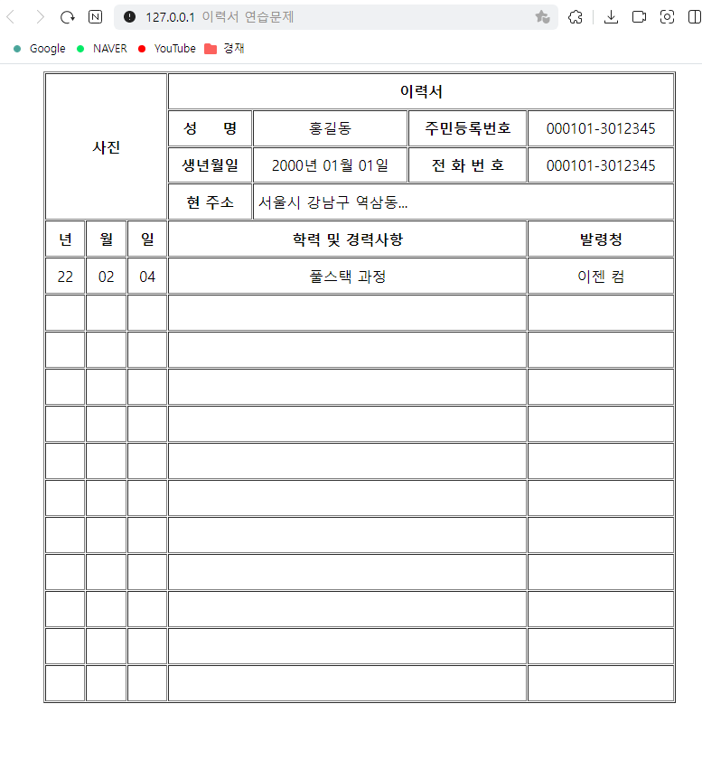

# 이력서 연습문제

## 코드

```html
<!DOCTYPE html>
<html lang="ko">
  <head>
    <meta charset="UTF-8" />
    <meta name="viewport" content="width=device-width, initial-scale=1.0" />
    <title>이력서 연습문제</title>
  </head>
  <body>
    <div>
      <table
        border="1"
        width="700"
        cellpadding="5"
        cellspacing="1"
        align="center"
      >
        <thead>
          <tr>
            <th colspan="3" rowspan="5" width="100" height="150">사진</th>
            <th align="center" colspan="4">이력서</th>
          </tr>
          <tr align="center">
            <th>성&nbsp&nbsp&nbsp&nbsp&nbsp명</th>
            <td>홍길동</td>
            <th>주민등록번호</th>
            <td>000101-3012345</td>
          </tr>
          <tr align="center">
            <th>생년월일</th>
            <td>2000년 01월 01일</td>
            <th>전&nbsp화&nbsp번&nbsp호</th>
            <td>000101-3012345</td>
          </tr>
          <tr>
            <th align="center">현 주소</th>
            <td colspan="3">서울시 강남구 역삼동...</td>
          </tr>
        </thead>
        <tbody align="center">
          <tr height="40">
            <th>년</th>
            <th>월</th>
            <th>일</th>
            <th colspan="3">학력 및 경력사항</th>
            <th>발령청</th>
          </tr>
          <tr height="40">
            <td>22</td>
            <td>02</td>
            <td>04</td>
            <td colspan="3">풀스택 과정</td>
            <td>이젠 컴</td>
          </tr>
          <tr height="40">
            <td></td>
            <td></td>
            <td></td>
            <td colspan="3"></td>
            <td></td>
          </tr>
          <tr height="40">
            <td></td>
            <td></td>
            <td></td>
            <td colspan="3"></td>
            <td></td>
          </tr>
          <tr height="40">
            <td></td>
            <td></td>
            <td></td>
            <td colspan="3"></td>
            <td></td>
          </tr>
          <tr height="40">
            <td></td>
            <td></td>
            <td></td>
            <td colspan="3"></td>
            <td></td>
          </tr>
          <tr height="40">
            <td></td>
            <td></td>
            <td></td>
            <td colspan="3"></td>
            <td></td>
          </tr>
          <tr height="40">
            <td></td>
            <td></td>
            <td></td>
            <td colspan="3"></td>
            <td></td>
          </tr>
          <tr height="40">
            <td></td>
            <td></td>
            <td></td>
            <td colspan="3"></td>
            <td></td>
          </tr>
          <tr height="40">
            <td></td>
            <td></td>
            <td></td>
            <td colspan="3"></td>
            <td></td>
          </tr>
        </tbody>
        <tfoot align="center">
          <tr height="40">
            <td></td>
            <td></td>
            <td></td>
            <td colspan="3"></td>
            <td></td>
          </tr>
          <tr height="40">
            <td></td>
            <td></td>
            <td></td>
            <td colspan="3"></td>
            <td></td>
          </tr>
          <tr height="40">
            <td></td>
            <td></td>
            <td></td>
            <td colspan="3"></td>
            <td></td>
          </tr>
        </tfoot>
      </table>
    </div>
  </body>
</html>
```

## 결과
