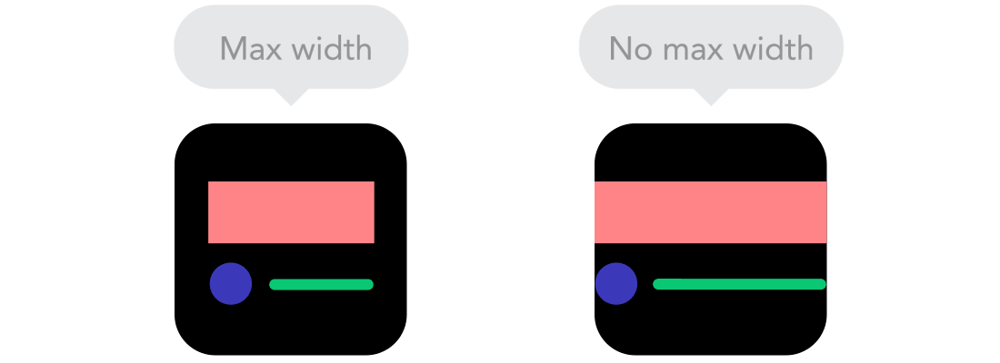
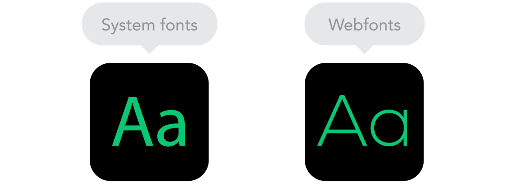

# CSS 효과

## #01. 박스 그림자 효과

```css
box-shadow: [inset]   x-offset   y-offset   blur-radius   color;
```

- x-offset : 본체와 그림자의 가로축 거리 (px단위)
- y-offset : 본체와 그람자의 세로축 거리 (px단위)
- blur-radius : 그림자의 번짐 정도 (px단위)
- color : 그림자의 색상

그림자 관련 값들을 콤마로 구분하여 여러개 지정할 경우 포토샵의 레이어 처럼 처리할 수 있다.


### 1) inset이 없는 경우

그림자가 박스의 뒤에 생성된다. (DropShadow 효과)

- x-offset : +값인 경우 박스의 오른쪽에 생성된다.
- y-offset : +값인 경우 박스의 아래쪽에 생성된다.

### 2) inset이 적용된 경우

그림자가 박스의 안쪽으로 생성된다. (InnerShadow 효과)

- x-offset : +값인 경우 박스의 왼쪽에 생성된다.
- y-offset : +값인 경우 박스의 위쪽에 생성된다.

## #02. 둥근 모서리 효과

### 1) 박스의 모서리를 둥글게 표시하기

4개의 값을 한번에 설정하는 형태와 단일 값을 설정하는 형태가 있다.

- 4개의 값을 부여하는 경우 : 좌측 상단부터 시계방향으로 모서리의 값을 서로 다르게 설정할 수 있다.<br/>각 값은 공백으로 구분한다.
    - ex: 5px  6px  7px  8px
- 단일 값을 사용하는 경우 : 네 모서리 모두 동일한 값이 적용된다.
- 4 모서리를 개별적으로 설정하기 위한 분리 속성
    - border-top-left-radius : 좌측 상단 모서리 처리
    - border-top-right-radius : 우측 상단 모서리 처리
    - border-bottom-left-radius : 좌측 하단 모서리 처리
    - border-bottom-right-radius : 우측 하단 모서리 처리

### 2) 이미지 둥글게 표시하기

border-radius 속성을 이미지에 적용할 경우 원 모양의 이미지 표현이 가능하다.

```css
.img-circle {
    border-radius: 50%;
}
```
```html

```

## #03. 투명도

모든 HTML요소에 대해 `opacity` 속성을 사용하여 투명도를 지정할 수 있다.

`0`은 완전 투명, `1`은 불투명, `0.5`는 반투명이다.

## #04. 요소 변형하기

요소의 형태를 변환한다.

이 때 변형되는 요소의 중심을 기준으로 상대적으로 좌표가 구성된다.

두 개 이상의 효과를 적용할 경우 공백으로 구분하여 함수를 명시한다.

```css
transform: 함수1(값) 함수1(값) ... 함수n(값)
```

| 함수 | 설명 | 적용 예 |
|---|---|---|
| rotate | 중점을 기준으로 회전한다.<br/>각도가 양수인 경웅 오른쪽, 음수인 경우 왼쪽으로 회전한다. | `transform: rotate(45deg);` |
| rotateX | X축을 기준으로 회전한다. | `transform: rotateX(45deg);` |
| rotateY | Y축을 기준으로 회전한다. | `transform: rotateY(45deg);` |
| translate | 요소를 이동한다. 가로,세로 순서로 값을 지정한다. | `transform: translate(45px 45px);` |
| translateX | 요소를 횡으로 이동한다. | `transform: translateX(45px);` |
| translateY | 요소를 종으로 이동한다. | `transform: translateY(45px);` |
| scale | 요소의 크기를 변환한다. 가로,세로 순서로 값을 지정한다. | `transform: scale(2, 2);` |
| scaleX | 요소의 넓이를 변환한다. | `transform: scaleX(2);` |
| scaleY | 요소의 높이를 변환한다. | `transform: scaleY(2);` |
| skew | 요소를 찌그러트린다. | `transform: skew(45deg 45deg);` |
| skewX | 요소를 찌그러트린다. | `transform: skewX(45deg);` |
| skewY | 요소를 찌그러트린다. | `transform: skewY(45deg);` |


## #04. 트랜지션

CSS 프로퍼티의 값이 변화할 때, 프로퍼티 값의 변화가 일정 시간(duration)에 걸쳐 일어나도록 하는 것.

```css
transition: 속성명 시간 [리듬];
```

- 속성명을 지정할 경우 해당 속성에 대해서만 작용한다.
- 속성명을 `all`로 지정할 경우 모든 CSS속성에 작용한다.
- 시간은 `1/1000`초를 의미하는 `ms`단위와 `1`초단위를 의미하는 `s`를 사용할 수 있다.
  - ex) `300ms`, `0.3s`
- 리듬은 트랜지션 효과의 변화 흐름, 시간에 따른 변화 속도와 같은 일종의 변화의 리듬을 지정한다.

### 트랜지션 리듬

| 프로퍼티값 | 효과 |
|---|---|
| ease | 기본값. 느리게 시작하여 점점 빨라졌다가 느리지면서 종료한다. |
| linear | 시작부터 종료까지 등속 운동을 한다. |
| ease-in | 느리게 시작한 후 일정한 속도에 다다르면 그 상태로 등속 운동한다. |
| ease-out | 일정한 속도의 등속으로 시작해서 점점 느려지면서 종료한다. |
| ease-in-out | ease와 비슷하게 느리게 시작하여 느리지면서 종료한다. |


## #05. Media Query

CSS가 적용될 해상도 구간을 지정하여 구간별로 CSS를 다르게 적용하는 기법

### 1) 적용예시

#### 최소 해상도만 지정한 경우

```CSS
@media screen and (min-width: 최소넓이px) {
    selector {
        속성: 값
    }
}
```

#### 최소 해상도만 지정한 경우

```CSS
@media screen and (max-width: 최대넓이px) {
    selector {
        속성: 값
    }
}
```

#### 해상도 구간을 지정한 경우

```CSS
@media screen and (min-width: 최소넓이px) and (max-width: 최대넓이px) {
    selector {
        속성: 값
    }
}
```

### 2) 반응형 웹

미디어 쿼리를 활용하여 하나의 웹 페이지가 해상도 구간에 따라 다른 레이아웃으로 구성되도록 한 웹 페이지

#### 최소 해상도 중심

```CSS
/* Small devices (landscape phones, 576px and up) */
@media screen and (min-width: 576px) { ... }

/* Medium devices (tablets, 768px and up) */
@media screen and (min-width: 768px) { ... }

/* Large devices (desktops, 992px and up) */
@media screen and (min-width: 992px) { ... }

/* X-Large devices (large desktops, 1200px and up) */
@media screen and (min-width: 1200px) { ... }

/* XX-Large devices (larger desktops, 1400px and up) */
@media screen and (min-width: 1400px) { ... }
```

#### 최대 해상도 중심

```CSS
/* X-Small devices (portrait phones, less than 576px) */
@media screen and (max-width: 576px) { ... }

/* Small devices (landscape phones, less than 768px) */
@media screen and (max-width: 768px) { ... }

/* Medium devices (tablets, less than 992px) */
@media screen and (max-width: 992px) { ... }

/* Large devices (desktops, less than 1200px) */
@media screen and (max-width: 1200px) { ... }

/* X-Large devices (large desktops, less than 1400px) */
@media screen and (max-width: 1400px) { ... }
```


## #06. 반응형 웹 디자인의 9가지 기본 원칙

> 출처: https://knulab.com/archives/1153

반응형 웹 디자인은 다중 스크린 문제에 대한 훌륭한 솔루션이지만 인쇄 관점에서 볼 때 어려움을 겪습니다. 고정 된 페이지 크기가 없으며, 밀리미터 또는 인치가 없으며, 물리적 인 제약이 없습니다. 점점 더 많은 방문자가 웹 사이트를 열 수 있기 때문에 데스크톱 및 모바일 용 픽셀 단위로만 설계하는 것도 과거입니다. 따라서 여기에 반응형 웹 디자인의 기본 원리를 설명해 보겠습니다. 간단하게 유지하기 위해 레이아웃에 중점을 둘 것입니다.

### 1) 반응형(Responsive) vs 적응형(Adaptive) 웹 디자인

그것은 같아 보일지 모르지만 그렇지 않습니다. 두 가지 방법 모두 서로 보완 적이므로 올바른 방법이나 잘못된 방법은 없습니다. 내용을 결정하게 하십시오.


### 2) 흐름(The Flow)

화면 크기가 작아짐에 따라 콘텐츠가 더 많은 수직 공간을 차지하기 시작하고 아래의 모든 내용이 푸시 다운됩니다. 이를 흐름이라고 합니다. 픽셀과 포인트로 디자인하는데 익숙하다면 이해하기 까다로울 수 있지만 익숙해지면 완전히 이해할 수 있습니다.


### 3) 상대 단위(Relative units)

캔버스는 데스크톱, 모바일 화면 또는 그 사이의 모든 것일 수 있습니다. 픽셀 밀도도 다양 할 수 있으므로 유연하고 모든 곳에서 작동하는 장치가 필요합니다. 그것은 퍼센트와 같은 상대적 단위가 유용 할 때입니다. 그래서 무언가를 50% 넓이로 만들면 항상 화면의 절반 (또는 viewport 창은 열려있는 브라우저 창의 크기)이됩니다.


### 4) 브레이크포인트(Breakpoints)

브레이크포인트를 사용하면 레이아웃을 미리 정의 된 지점에서 변경할 수 있습니다. 즉, 데스크톱에서는 3 개의 열이 있지만 휴대 기기에서는 1 개의 열만 있습니다. 대부분의 CSS 속성은 하나의 중단 점에서 다른 중단 점으로 변경할 수 있습니다. 일반적으로 콘텐츠를 두는 위치는 콘텐츠에 따라 다릅니다. 문장이 중단되면 중단 점을 추가해야 할 수도 있습니다. 그러나 주의해서 사용하십시오. 무엇이 영향을 미치는지를 이해하는 것이 어려울 때 빠르게 지저분해질 수 있습니다.


### 5) 최대 값(Max values)과 최소 값(Min values)

때로는 콘텐츠가 휴대 기기와 같이 화면의 전체 너비를 차지하지만 콘텐츠가 TV 화면의 전체 너비까지 펼쳐지는 것이 좋지 않은 경우가 종종 있습니다. 이것이 Min / Max 값이 도움이되는 이유입니다. 예를 들어 너비가 100%이고 최대 너비가 1000px 인 경우 내용이 화면을 채우지 만 1000px를 넘지는 않습니다.



### 6) 중첩 된 객체(Nested objects)

상대 위치를 기억 하십시오. 서로에 따라 많은 요소를 가지면 제어하기가 어려우므로 컨테이너의 요소를 래핑하면 더 이해하기 쉽고 깨끗하며 깔끔하게 유지할 수 있습니다. 여기서 픽셀과 같은 정적 단위가 도움이 될 수 있습니다. 로고와 버튼처럼 크기를 조정하지 않으려는 콘텐츠에 유용합니다.


### 7) 모바일(Mobile) 또는 데스크톱(Desktop) 우선

기술적으로 작은 화면에서 큰 화면 (모바일 우선) 또는 그 반대로 (데스크톱 우선) 프로젝트를 시작하면 큰 차이가 없습니다. 그러나 모바일을 처음 사용하는 경우 추가 제한 사항이 추가되고 의사 결정을 내리는 데 도움이됩니다. 종종 사람들은 한 번에 양 끝에서 시작하기 때문에 실제로 무엇이 더 잘 작동하는지 확인해야 합니다.


### 8) 웹 폰트 vs 시스템 폰트

귀하의 웹 사이트에 멋지게 보이는 Futura 또는 Didot을 원하십니까? 웹 폰트 사용! 그들이 멋지게 보일지라도, 각각이 다운로드 될 것이고 더 많이 가질수록 페이지를 로드하는데 더 오래 걸릴 것임을 기억하십시오. 반면에 시스템 글꼴은 매우 빠르며 사용자가 로컬 글꼴을 가지고 있지 않은 경우를 제외하고는 기본 글꼴로 돌아갑니다.



### 9) Bitmap images vs Vectors

아이콘에 많은 세부 정보가 있고 멋진 효과가 적용 되었습니까? 그렇다면 비트 맵을 사용하십시오. 그렇지 않은 경우 벡터 이미지 사용을 고려하십시오. 비트 맵의 경우 jpg, png 또는 gif를 사용하고 벡터의 경우 SVG 또는 아이콘 글꼴을 사용하는 것이 가장 좋습니다. 각각에는 몇 가지 이점과 단점이 있습니다. 그러나 크기를 염두에 두십시오. 사진을 최적화하지 않으면 온라인 상태로 만들 수 없습니다. 반면에 벡터는 종종 작지만 일부 오래된 브라우저는 벡터를 지원하지 않습니다. 또한 곡선이 많으면 비트맵보다 무거울 수 있으므로 현명하게 선택하십시오.

