# 공통 공유 코드 선 명시

# BadRequestException 파일 코드

```javascript
/**
 * @filename    : BadRequestException.js
 * @author      : 천경재 (yocasd2@gmail.com)
 * @description : 에러객체, 멤버변수 가져오기
 */

class BadRequestException extends Error {
  constructor(msg = "잘못된 요청 입니다.", selector = null) {
    super(msg);
    this._statusCode = 400;
    this._selector = selector;
  }

  get statusCode() {
    return this._statusCode;
  }

  get selector() {
    return this._selector;
  }
}
```

# RegexHelper 파일과 정규표현식 검사 코드

```js
/**
 * @filename    : RegexHelper.js
 * @author      : 천경재 (yocasd2@gmail.com)
 * @description : 정규표현식 검사 수행
 */


class RegexHelper {
    /**
     * 입력값이 정규표현식을 충족하는지 검사한다.
     * @param   {string} selector   검사할 대상의 CSS 선택자
     * @param   {string} msg        표시할 메세지
     * @param   {object} regexExpr  검사할 정규 표현식
     */

     checkup(selector, msg, regexExpr) {
        this.value(selector, msg);

        const content = document.querySelector(selector).value;
        const src = content.trim();

        // 입력값에 대한 정규표현식 검사가 실패라면?
        if (!regexExpr.test(src)) {
            throw new BadRequestException(msg, selector);
        }

        return true;
    }

    ...
}
```

# html 파일의 script 문 일부

```html
  <!-- 정규표현식 검사 객체를 참조한다. -->
    <script src="libs/BadRequestException.js"></script>
    <script src="libs/RegexHelper.js"></script>
    <script type="text/javascript">
      const regexHelper = new RegexHelper();

      // 선택자 변수로 미리 생성.
      const user_id = document.querySelector("#user_id");
      const user_pw = document.querySelector("#user_pw");
      const user_pw_re = document.querySelector("#user_pw_re");
      const user_name = document.querySelector("#user_name");

      // catch문에서 사용할 콘솔 경고, 강제포커스 함수 만들기.
      function warring(e) {
        console.error(e);
        document.querySelector(e.selector).focus();
      }
```

# index.css 파일 소개코드

```css
@charset "utf-8";

/**
 * @filename    : index.css
 * @author      : 천경재 (yocasd2@gmail.com)
 * @description : CSS 수정
 */

* {
  font-family: Dotum, "돋움", Helvetica, sans-serif;
  background-color: #f5f6f7;
}
```

# 문제 이미지


<br/>

---

---

---

<br/>

### 【문항1】 (1)번 DOM 영역에 대한 구조를 설명하고 해당 영역에 대해 직접 작성한 HTML, CSS, JS 소스코드와 실행 결과를 제시하시오.

## DOM 구조

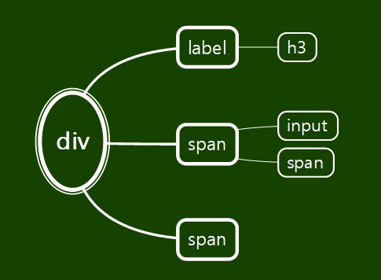

## html 코드

```html
<div class="inputbox">
  <label for="user_id"><h3>아이디</h3></label>
  <span class="textbox">
    <input type="text" id="user_id" />
    <span>@naver.com</span>
  </span>
  <span id="alert1" class="alert"></span>
</div>
```

```js
// 아이디 미입력 검사
user_id.addEventListener("blur", (e) => {
  const alert1 = document.querySelector("#alert1");
  try {
    regexHelper.value("#user_id", "필수 정보입니다.");
  } catch (e) {
    alert1.innerHTML = e.message;
    warring(e);
    return;
  }
});
// 아이디 정규식 검사
user_id.addEventListener("keyup", (e) => {
  const alert1 = document.querySelector("#alert1");
  try {
    regexHelper.engnum(
      "#user_id",
      "5~20자의 영문 소문자, 숫자와 특수기호(_),(-)만 사용 가능합니다."
    );
  } catch (e) {
    alert1.innerHTML = e.message;
    warring(e);
    return;
  }
  alert1.innerHTML = "";
});
```

## CSS 코드

```CSS
#container .inputbox {
    display: block;
    width: 460px;
    height: 98px;
    margin: 0 auto;
    cursor: pointer;
  }
.inputbox h3 {
    font-size: 14px;
    font-weight: 700;
    padding-bottom: 10px;
}
.textbox {
    display: block;
    width: 460px;
    height: 51px;
    background-color: white;
    position: relative;
    border: 1px solid #ccc;
}
.textbox span {
    font-size: 15px;
    font-weight: 100;
    color: #8f8f8f;
    background-color: white;
    position: relative;
    top: 10px;
    left: 7px;
}
#container .inputbox .alert {
    font-size: 12px;
    position: relative;
    top: 5px;
    color: red;
}
.textbox input {
    position: relative;
    top: 10px;
    left: 10px;
    width: 350px;
    height: 29px;
    border: 0;
    background-color: white;
}
.textbox input:focus {
    outline: 0;
}
```

## JS 코드

```javascript
    /**
     * 값의 존재 여부를 검사한다.
     * @param  {string} selector 검사할 대상의 CSS 선택자
     * @param  {string} msg      값이 없을 경우 표시할 메시지 내용
     */

    value(selector, msg) {
        const content = document.querySelector(selector).value;

        if (content == undefined || content == null || (typeof content == 'string' && content.trim().length == 0)) {
            throw new BadRequestException(msg, selector);
        }
        return true;
    }

    /**
     * 영문 소문자, 숫자와 특수기호(_),(-) 로만 이루어 졌는지 검사하기 위해 checkup()를 간접적으로 호출한다.
     * @param   {string} selector   검사할 대상의 CSS 선택자
     * @param   {string} msg        표시할 메시지
     */

    engnum(selector, msg) {
        return this.checkup(selector, msg, /^[a-z0-9_-]{5,20}/);
    }
```

## 실행결과

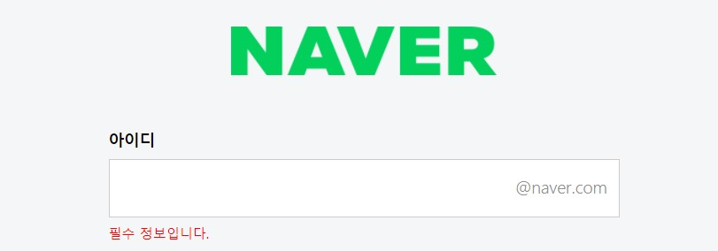
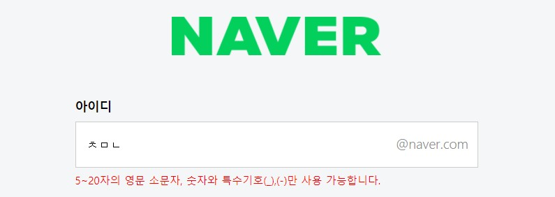

<br/>

---

<br/>

### 【문항2】영역에 대한 DOM 구조를 설명하고 해당 영역에 대해 직접 작성한 HTML, CSS, JS 소스코드와 실행 결과를 제시하시오.

## DOM 구조

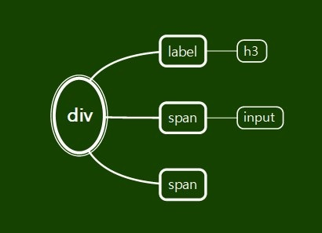

## html 코드

```html
<div class="inputbox">
  <label for="user_pw"><h3>비밀번호</h3></label>
  <span class="textbox"><input type="text" id="user_pw" /></span>
  <span id="alert2" class="alert"></span>
</div>
```

```js
// 비밀번호 미입력 검사
user_pw.addEventListener("blur", (e) => {
  const alert2 = document.querySelector("#alert2");
  try {
    regexHelper.value("#user_pw", "필수 정보입니다.");
  } catch (e) {
    alert2.innerHTML = e.message;
    warring(e);
    return;
  }
});

// 비밀번호 정규식 검사
user_pw.addEventListener("keyup", (e) => {
  const alert2 = document.querySelector("#alert2");
  try {
    regexHelper.engnum_pw(
      "#user_pw",
      "8~16자 영문 대 소문자, 숫자, 특수문자를 사용하세요."
    );
  } catch (e) {
    alert2.innerHTML = e.message;
    warring(e);
    return;
  }
  alert2.innerHTML = "";
});
```

## CSS 코드

```CSS
#container .inputbox {
    display: block;
    width: 460px;
    height: 98px;
    margin: 0 auto;
    cursor: pointer;
  }
.inputbox h3 {
    font-size: 14px;
    font-weight: 700;
    padding-bottom: 10px;
}
.textbox {
    display: block;
    width: 460px;
    height: 51px;
    background-color: white;
    position: relative;
    border: 1px solid #ccc;
}
.textbox span {
    font-size: 15px;
    font-weight: 100;
    color: #8f8f8f;
    background-color: white;
    position: relative;
    top: 10px;
    left: 7px;
}
#container .inputbox .alert {
    font-size: 12px;
    position: relative;
    top: 5px;
    color: red;
}
.textbox input {
    position: relative;
    top: 10px;
    left: 10px;
    width: 350px;
    height: 29px;
    border: 0;
    background-color: white;
}
.textbox input:focus {
    outline: 0;
}
```

## JS 코드

```javascript
    /**
     * 값의 존재 여부를 검사한다.
     * @param  {string} selector 검사할 대상의 CSS 선택자
     * @param  {string} msg      값이 없을 경우 표시할 메시지 내용
     */

    value(selector, msg) {
        const content = document.querySelector(selector).value;

        if (content == undefined || content == null || (typeof content == 'string' && content.trim().length == 0)) {
            throw new BadRequestException(msg, selector);
        }
        return true;
    }

    /**
     * 8~16자의 영문 대 소문자, 숫자, 특수문자를 검사하기 위해 checkup()를 간접적으로 호출한다.
     * @param   {string} selector   검사할 대상의 CSS 선택자
     * @param   {string} msg        표시할 메시지
     */

    engnum_pw(selector, msg) {
        return this.checkup(selector, msg, /^(?=.*[a-zA-Z])(?=.*[!@#$%^*+=-])(?=.*[0-9]).{8,16}$/);
    }
```

## 실행결과

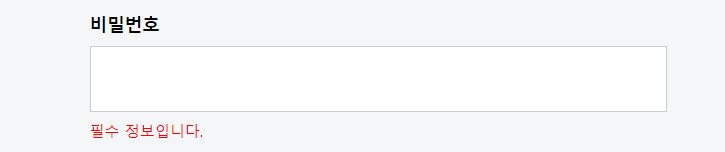
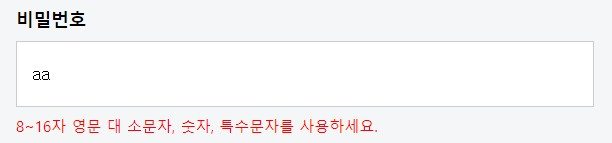

<br/>

---

<br/>

### 【문항3】 (3)번 DOM 영역에 대한 구조를 설명하고 해당 영역에 대해 직접 작성한 HTML, CSS, JS 소스코드와 실행 결과를 제시하시오.

## DOM 구조


## html 코드

```html
<div class="inputbox">
  <label for="user_pw_re"><h3>비밀번호 확인</h3></label>
  <span class="textbox"><input type="text" id="user_pw_re" /></span>
  <span id="alert3" class="alert"></span>
</div>
```

```js
// 비밀번호 확인 미입력 검사
user_pw_re.addEventListener("blur", (e) => {
  const alret3 = document.querySelector("#alert3");
  try {
    regexHelper.value("#user_pw_re", "필수 정보입니다.");
  } catch (e) {
    alret3.innerHTML = e.message;
    warring(e);
    return;
  }
});

// 비밀번호 확인 정규식 검사
user_pw_re.addEventListener("keyup", (e) => {
  const alret3 = document.querySelector("#alert3");
  try {
    regexHelper.compareTo(
      "#user_pw",
      "#user_pw_re",
      "비밀번호가 일치하지 않습니다."
    );
  } catch (e) {
    alret3.innerHTML = e.message;
    warring(e);
    return;
  }
  alret3.innerHTML = "";
});
```

## CSS 코드

```CSS
#container .inputbox {
    display: block;
    width: 460px;
    height: 98px;
    margin: 0 auto;
    cursor: pointer;
  }
.inputbox h3 {
    font-size: 14px;
    font-weight: 700;
    padding-bottom: 10px;
}
.textbox {
    display: block;
    width: 460px;
    height: 51px;
    background-color: white;
    position: relative;
    border: 1px solid #ccc;
}
.textbox span {
    font-size: 15px;
    font-weight: 100;
    color: #8f8f8f;
    background-color: white;
    position: relative;
    top: 10px;
    left: 7px;
}
#container .inputbox .alert {
    font-size: 12px;
    position: relative;
    top: 5px;
    color: red;
}
.textbox input {
    position: relative;
    top: 10px;
    left: 10px;
    width: 350px;
    height: 29px;
    border: 0;
    background-color: white;
}
.textbox input:focus {
    outline: 0;
}
```

## JS 코드

```javascript
/**
     * 값의 존재 여부를 검사한다.
     * @param  {string} selector 검사할 대상의 CSS 선택자
     * @param  {string} msg      값이 없을 경우 표시할 메시지 내용
     */

    value(selector, msg) {
        const content = document.querySelector(selector).value;

        if (content == undefined || content == null || (typeof content == 'string' && content.trim().length == 0)) {
            throw new BadRequestException(msg, selector);
        }
        return true;
    }

    /**
     * 두 값이 동일한지 검사한다.
     * @param   {string} origin   원본에 대한 CSS 선택자.
     * @param   {string} compare  검사할 대상의 CSS 선택자
     * @param   {string} msg      검사에 실패할 경우 표시할 메세지
     */
     compareTo(origin, compare, msg) {
        this.value(origin, msg);
        this.value(compare, msg);

        var src = document.querySelector(origin).value.trim(); // 원본값을 가져온다.
        var dsc = document.querySelector(compare).value.trim(); // 비교할 값을 가져온다.

        if (src != dsc) {
            throw new BadRequestException(msg, origin);
        }

        return true; // 성공했음을 리턴
    }
```

## 실행결과

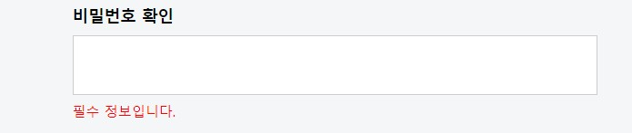
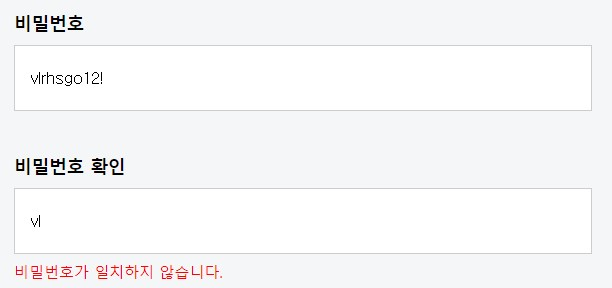
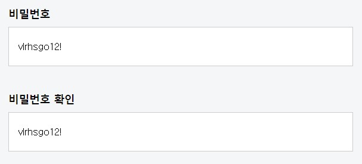

<br/>

---

<br/>

### 【문항4】 (4)번 DOM 영역에 대한 구조를 설명하고 해당 영역에 대해 직접 작성한 HTML, CSS, JS 소스코드와 실행 결과를 제시하시오.

## DOM 구조


## html 코드

```html
<div class="inputbox">
  <label for="user_name"><h3>이름</h3></label>
  <span class="textbox"><input type="text" id="user_name" /></span>
  <span id="alert4" class="alert"></span>
</div>
```

```js
// 이름 미입력 검사
user_name.addEventListener("blur", (e) => {
  const alret4 = document.querySelector("#alert4");
  try {
    regexHelper.value("#user_name", "필수 정보입니다.");
  } catch (e) {
    alret4.innerHTML = e.message;
    warring(e);
    return;
  }
  alret4.innerHTML = "";
});
```

## CSS 코드

```CSS
#container .inputbox {
    display: block;
    width: 460px;
    height: 98px;
    margin: 0 auto;
    cursor: pointer;
  }
.inputbox h3 {
    font-size: 14px;
    font-weight: 700;
    padding-bottom: 10px;
}
.textbox {
    display: block;
    width: 460px;
    height: 51px;
    background-color: white;
    position: relative;
    border: 1px solid #ccc;
}
.textbox span {
    font-size: 15px;
    font-weight: 100;
    color: #8f8f8f;
    background-color: white;
    position: relative;
    top: 10px;
    left: 7px;
}
#container .inputbox .alert {
    font-size: 12px;
    position: relative;
    top: 5px;
    color: red;
}
.textbox input {
    position: relative;
    top: 10px;
    left: 10px;
    width: 350px;
    height: 29px;
    border: 0;
    background-color: white;
}
.textbox input:focus {
    outline: 0;
}
```

## JS 코드

```javascript
    /**
     * 값의 존재 여부를 검사한다.
     * @param  {string} selector 검사할 대상의 CSS 선택자
     * @param  {string} msg      값이 없을 경우 표시할 메시지 내용
     */

    value(selector, msg) {
        const content = document.querySelector(selector).value;

        if (content == undefined || content == null || (typeof content == 'string' && content.trim().length == 0)) {
            throw new BadRequestException(msg, selector);
        }
        return true;
    }
```

## 실행결과

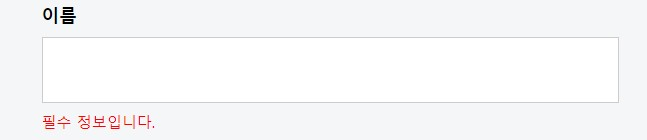
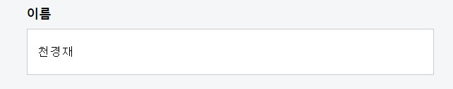

<br/>

---

<br/>

### 【문항5】 (5)번 DOM 영역에 대한 구조를 설명하고 해당 영역에 대해 직접 작성한 HTML, CSS, JS 소스코드와 실행 결과를 제시하시오.

## DOM 구조

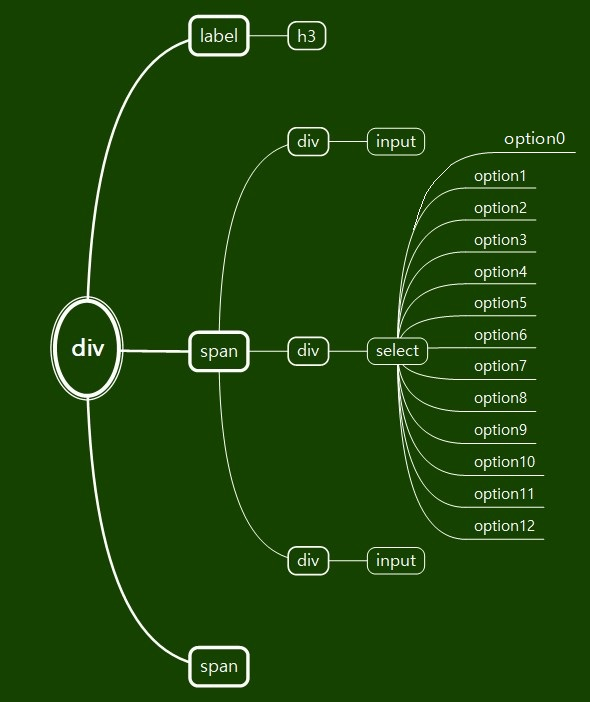

## html 코드

```html
<div class="inputbox">
  <label for="user_year"><h3>생년월일</h3></label>
  <span class="textbox" id="textbox">
    <div class="yearbox">
      <input
        type="text"
        class="user_year"
        id="user_year"
        placeholder="&nbsp;년(4자)"
      />
    </div>
    <div class="yearbox">
      <select name="user_year" class="user_year" id="user_year2">
        <option value="">월</option>
        <option value="1">1</option>
        <option value="2">2</option>
        <option value="3">3</option>
        <option value="4">4</option>
        <option value="5">5</option>
        <option value="6">6</option>
        <option value="7">7</option>
        <option value="8">8</option>
        <option value="9">9</option>
        <option value="10">10</option>
        <option value="11">11</option>
        <option value="12">12</option>
      </select>
    </div>
    <div class="yearbox">
      <input
        type="text"
        class="user_year"
        id="user_year3"
        placeholder="&nbsp;일"
      />
    </div>
  </span>
  <span id="alert5" class="alert"></span>
</div>
```

```js
// 출생연도 미입력 검사
document.querySelector("#user_year").addEventListener("blur", (e) => {
  const alret5 = document.querySelector("#alert5");
  try {
    regexHelper.value("#user_year", "태어난 년도 4자리를 정확하게 입력하세요.");
  } catch (e) {
    alret5.innerHTML = e.message;
    warring(e);
    return;
  }
});

// 출생연도 정규표현식 검사
document.querySelector("#user_year").addEventListener("keyup", (e) => {
  const alret5 = document.querySelector("#alert5");
  try {
    regexHelper.year_yy(
      "#user_year",
      "태어난 년도 4자리를 정확하게 입력하세요."
    );
  } catch (e) {
    alret5.innerHTML = e.message;
    warring(e);
    return;
  }
  alret5.innerHTML = "태어난 월을 선택하세요.";
});
```

## CSS 코드

```CSS
.inputbox #textbox {
    width: 600px;
    position: relative;
    right: 20px;
    border: 0;
    background-color: #f5f6f7;
}
.inputbox .yearbox {
    width: 140px;
    height: 51px;
    float: left;
    background-color: white;
    margin-left: 18px;
    border: 1px solid #ccc;
}
.inputbox .yearbox::after {
    display: none;
    content: "";
    float: none;
    clear: both;
}

.inputbox #user_year {
    width: 118px;
    height: 25px;
    border: 0;
    margin-bottom: 10px;
    font-size: 15px;
}
.inputbox #user_year2 {
    width: 118px;
    height: 26px;
    position: relative;
    top: 10px;
    left: 8px;
    border: 0;
    background-color: white;
    font-size: 15px;
}
.inputbox #user_year3 {
    width: 118px;
    height: 25px;
    border: 0;
    font-size: 15px;
}
.inputbox #user_year,
  #user_year2,
  #user_year3:focus {
    outline: 0;
}
```

## JS 코드

```javascript
/**
     * 태어난 년도 중 1900 ~ 2099 까지 4자리가 맞는지 검사하기 위해 checkup()를 간접적으로 호출한다.
     * @param   {string} selector   검사할 대상의 CSS 선택자
     * @param   {string} msg        표시할 메시지
     */

    year_yy(selector, msg) {
        return this.checkup(selector, msg, /^(19|20)[0-9]{2}$/);
    }
```

## 실행결과

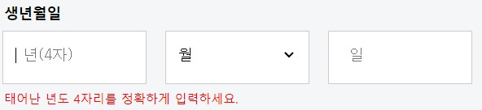

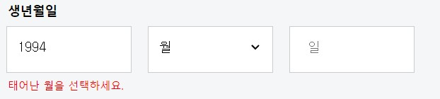
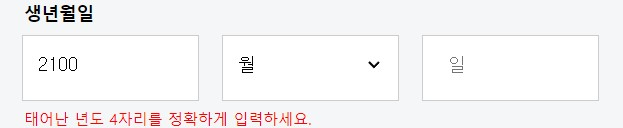

<br/>

---

<br/>

### 【문항6】 (6)번 DOM 영역에 대한 구조를 설명하고 해당 영역에 대해 직접 작성한 HTML, CSS, JS 소스코드와 실행 결과를 제시하시오.

## DOM 구조

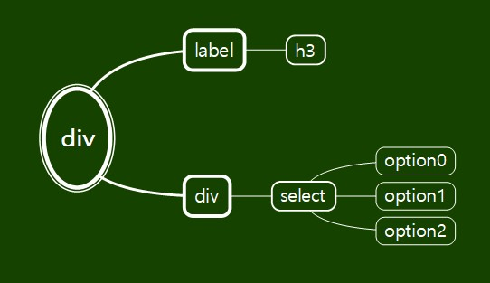

## html 코드

```html
<div class="inputbox" id="genderbox">
  <label for="user_gender"><h3>성별</h3></label>
  <div id="genderbox2">
    <select name="user_gender" id="user_gender">
      <option value="">성별</option>
      <option value="M">남자</option>
      <option value="F">여자</option>
    </select>
  </div>
</div>
```

## CSS 코드

```CSS
#container #genderbox {
    width: 460px;
    height: 75px;
    background-color: white;
    border: 0;
}
#container #genderbox select {
    display: block;
    width: 430px;
    height: 35px;
    margin: 0 auto;
    border: 0;
    background-color: white;
    position: relative;
    top: 10px;
    font-size: 15px;
}
#container #genderbox #genderbox2 {
    width: 460px;
    height: 55px;
    background-color: white;
    border: 1px solid #ccc;
    font-size: 15px;
}
```

## JS 코드

```javascript
//없음
```

## 실행결과

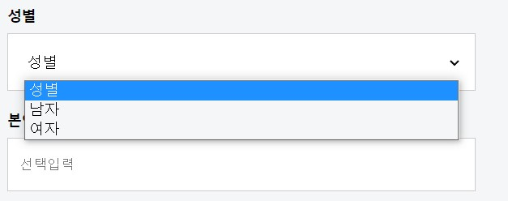
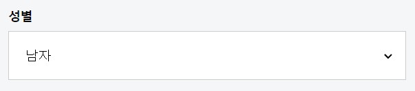

<br/>

---

<br/>

### 【문항7】 (7)번 DOM 영역에 대한 구조를 설명하고 해당 영역에 대해 직접 작성한 HTML, CSS, JS 소스코드와 실행 결과를 제시하시오.

## DOM 구조

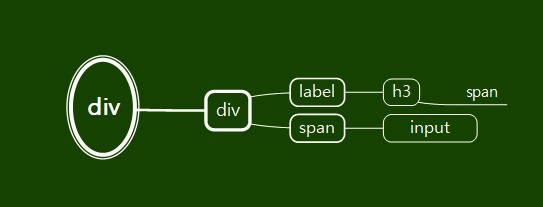

## html 코드

```html
<div id="mailbox">
  <div class="inputbox">
    <label for="user_email">
      <h3>본인 확인 이메일<span>(선택)</span></h3>
    </label>
    <span class="textbox"
      ><input type="text" id="user_email" placeholder="선택입력"
    /></span>
  </div>
</div>
```

## CSS 코드

```CSS
#container #content #mailbox {
    font-size: 15px;
    margin-top: 12px;
}
```

## JS 코드

```javascript
// 없음
```

## 실행결과

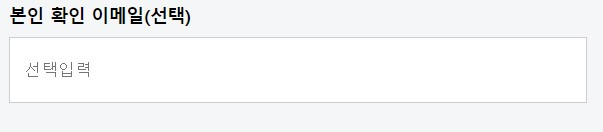

<br/>

---

<br/>

### 【문항8】 (8)번 DOM 영역에 대한 구조를 설명하고 해당 영역에 대해 직접 작성한 HTML, CSS, JS 소스코드와 실행 결과를 제시하시오.

## DOM 구조

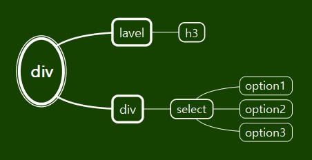

## html 코드

```html
<label for="user_phone"><h3>휴대전화</h3></label>
<div id="phbox1">
  <select name="user_phone" class="user_phone" id="user_phone">
    <option value="Korea">대한민국 +82</option>
    <option value="Denmark">덴마크 +45</option>
    <option value="Germany">독일 +49</option>
  </select>
</div>
```

## CSS 코드

```CSS
#container #content #phbox1 {
    width: 460px;
    height: 50px;
    background-color: white;
    border: 1px solid #ccc;
}

#container #content #phbox1 select {
    display: block;
    width: 437px;
    height: 30px;
    margin: 0 auto;
    position: relative;
    top: 12px;
    border: 0;
    background-color: white;
    font-size: 15px;
}
#container #content #phbox1 select:focus {
    outline: 0;
}
```

## JS 코드

```javascript
// 없음
```

## 실행결과

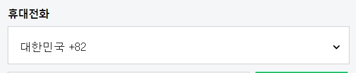
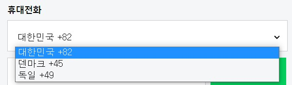

<br/>

---

<br/>

### 【문항9】 (9)번 DOM 영역에 대한 구조를 설명하고 해당 영역에 대해 직접 작성한 HTML, CSS, JS 소스코드와 실행 결과를 제시하시오.

## DOM 구조

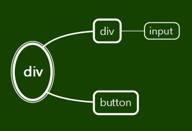

## html 코드

```html
<div id="phbox2">
  <input
    type="text"
    class="user_phone"
    id="user_phone2"
    placeholder="전화번호 입력"
  />
</div>
<button type="submit" class="user_phone" id="user_phone3">인증번호 받기</button>
```

```js
// 휴대전화 미입력 검사
document.querySelector("#user_phone2").addEventListener("blur", (e) => {
  const alret6 = document.querySelector("#alert6");
  try {
    regexHelper.value("#user_phone2", "필수 정보입니다.");
  } catch (e) {
    alret6.innerHTML = e.message;
    warring(e);
    return;
  }
  alret6.innerHTML = "";
});
```

## CSS 코드

```CSS
#container #content #phbox2 {
    width: 325px;
    height: 50px;
    background-color: white;
    border: 1px solid #ccc;
    float: left;
    margin-top: 10px;
}
#container #content #phbox2 input {
    display: block;
    width: 300px;
    height: 29px;
    margin: 0 auto;
    position: relative;
    top: 10px;
    border: 0;
    background-color: white;
    font-size: 15px;
}
#container #content #phbox2 input:focus {
    outline: 0;
}

#container #content button {
    display: block;
    width: 125px;
    height: 51px;
    background-color: #03cf5d;
    float: right;
    color: white;
    border: 1px solid #03cf5d;
    margin-top: 10px;
    font-size: 15px;
}
#container #phbox3 span {
    position: relative;
    right: 325px;
}
```

## JS 코드

```javascript
     /**
     * 값의 존재 여부를 검사한다.
     * @param  {string} selector 검사할 대상의 CSS 선택자
     * @param  {string} msg      값이 없을 경우 표시할 메시지 내용
     */

    value(selector, msg) {
        const content = document.querySelector(selector).value;

        if (content == undefined || content == null || (typeof content == 'string' && content.trim().length == 0)) {
            throw new BadRequestException(msg, selector);
        }
        return true;
    }
```

## 실행결과

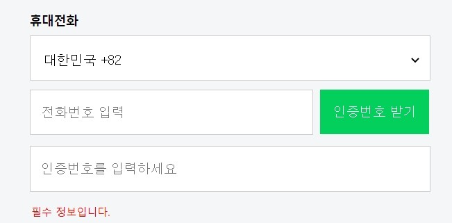
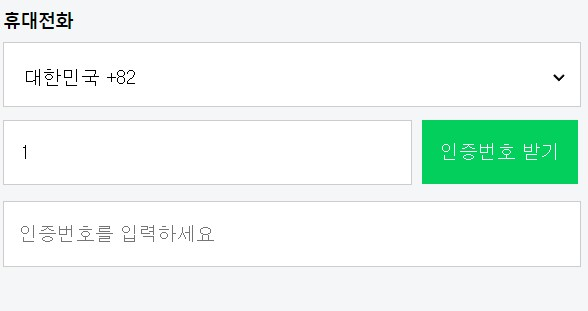

<br/>

---

<br/>

### 【문항10】 (10)번 DOM 영역에 대한 구조를 설명하고 해당 영역에 대해 직접 작성한 HTML, CSS, JS 소스코드와 실행 결과를 제시하시오.

## DOM 구조

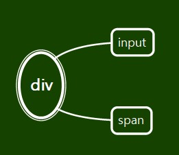

## html 코드

```html
<div id="phbox3">
  <input
    type="text"
    class="user_phone"
    id="user_phone4"
    placeholder="인증번호를 입력하세요"
  />
  <span id="alert6" class="alert"></span>
</div>
```

## CSS 코드

```CSS
#container #content #phbox3 {
    width: 460px;
    height: 51px;
    background-color: white;
    position: relative;
    top: 75px;
    border: 1px solid #ccc;
}

#container #content #phbox3 input {
    display: block;
    width: 430px;
    height: 29px;
    border: 0;
    background-color: white;
    position: absolute;
    top: 10px;
    left: 10px;
    font-size: 15px;
}
#container #content #phbox3 input:focus {
    outline: 0;
}
```

## JS 코드

```javascript
// 없음
```

## 실행결과

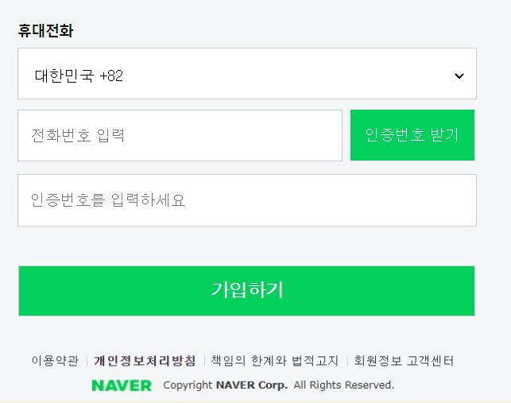

---

## 전체샷
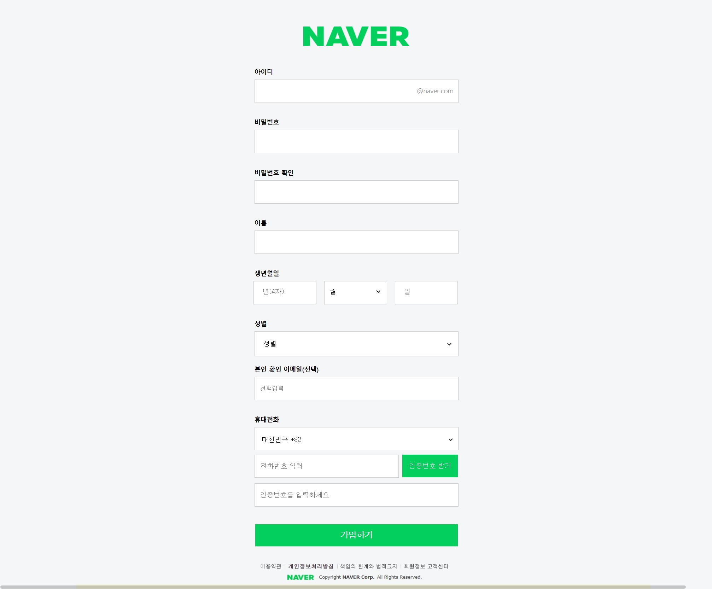