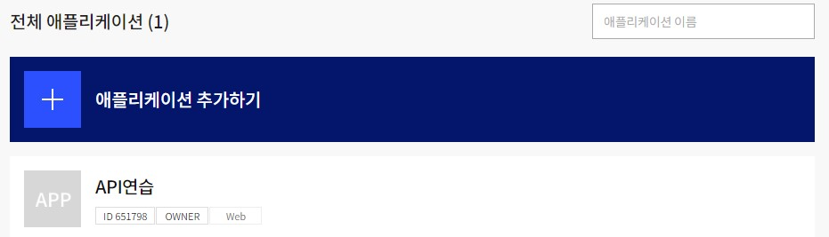
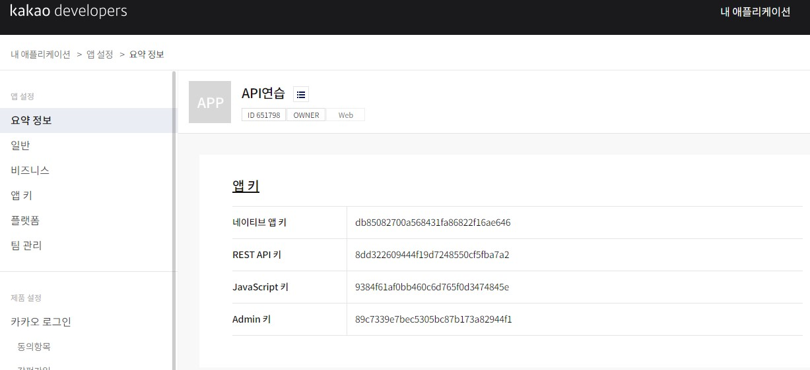
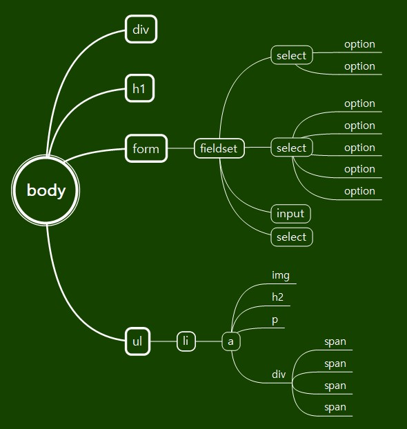
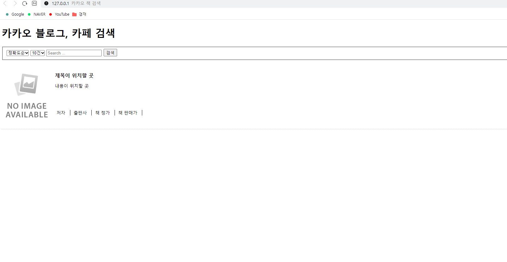
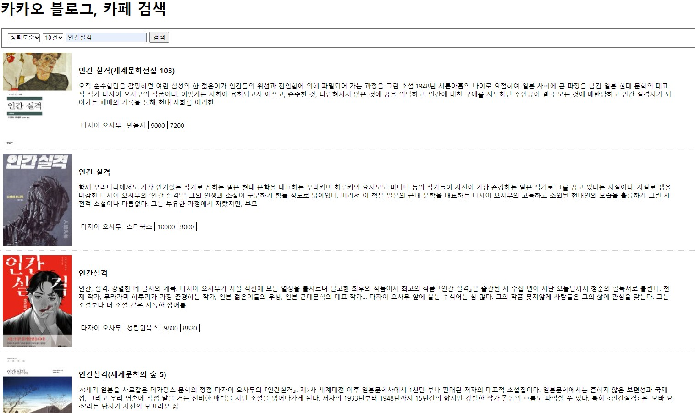
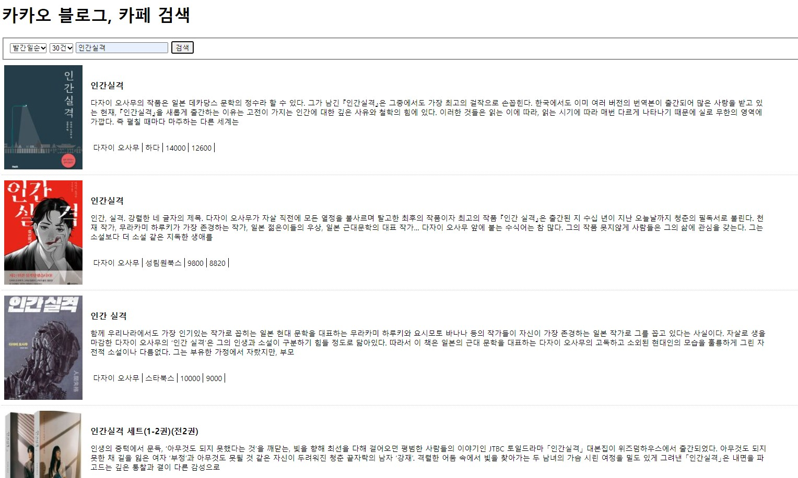
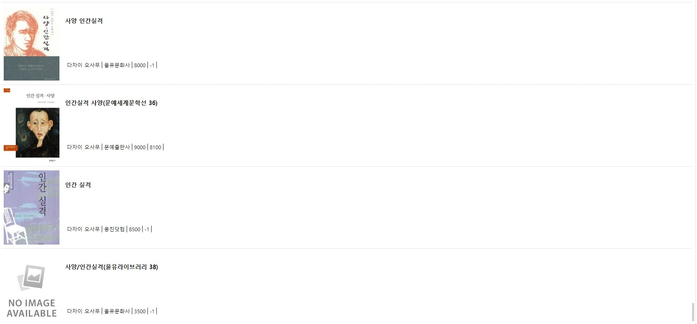

# 【문항1】 카카오 OpenAPI로부터 검색 API와의 연동에 필요한 인증키를 발급받으시오. 인증키가 발급된 결과 화면에 대한 스크린샷을 제출합니다. (10점)

## 내 답



<br/>

---

<br/>

# 【문항2】구현하고자 하는 화면에 대한 HTML DOM 구조를 최대한 자세히 제시하시오. 검색 목록은 1건의 검색 결과가 있는 상태로 DOM을 표현하면 되며 Javascript에 의해 동적으로 생성되는 부분을 포함하여 실제 구현 결과물과 DOM 구조간의 차이가 있으면 안됩니다. (10점)

## 내 답


<br/>

---

<br/>

# 【문항3】  Axios 라이브러리를 활용하여 카카오 OpenAPI로 사용자의 입력값을 요청 데이터로 보내고 응답 결과를 웹 페이지로 표시하는 웹 프로그램을 구현하시오.
- 요청 정보에는 정렬순서 정확도순 발간일순 와 한 페이지당 포함되어야 할 목록수 (10건, 20건 , 30건 , 40건, 50건)
를 드롭다운 형태로 선택할 수 있는 형태로 포함되어야 합니다
- 또한 1페이지에 해당하는 데이터를 로드한 후 스크롤이 화면의 맨 끝에 도착했을 경우 다음 페이지
의 데이터를 로드할 수 있어야 합니다.
- 책의 표지 이미지가 포함되지 않은 데이터인 경우 대체이미지가 표시되어야 합니다.
- Javascript 코드 상단에는 시나리오의 요구사항에서 명시하고 있는 형태의 프로그램 설명문이 작성
되어 있어야 합니다.
- 소스코드는 별도의 Javascript 파일로 저장하여 HTML 파일에 참조하는 형태로 작성하세요. (80점)

## 내 답

### HTML 코드

```html
<!-- 
@filename    : book_search.html
@author      : 천경재 (yocasd2@gmail.com)
@description : 책 검색 html구조 코드
-->

<!DOCTYPE html>
<html lang="ko">
  <head>
    <meta charset="UTF-8" />
    <meta name="viewport" content="width=device-width, initial-scale=1.0" />
    <title>카카오 책 검색</title>
    <link rel="stylesheet" type="text/css" href="libs/book_search.css" />
  </head>
  <body>
    <div id="loading"></div>
    <h1>카카오 블로그, 카페 검색</h1>

    <form id="searchForm">
      <fieldset>
        <select name="sort" id="sort">
          <option value="accuracy">정확도순</option>
          <option value="latest">발간일순</option>
        </select>
        <select name="number" id="number">
          <option value="10">10건</option>
          <option value="20">20건</option>
          <option value="30">30건</option>
          <option value="40">40건</option>
          <option value="50">50건</option>
        </select>
        <input type="search" id="query" placeholder="Search ..." />
        <button type="submit">검색</button>
      </fieldset>
    </form>

    <ul id="list">
      <li>
        <a href="#" target="_blank" title="제목">
          
          <h2>제목이 위치할 곳</h2>
          <p>내용이 위치할 곳</p>
          <span>저자 &nbsp;</span>
          <span>출판사 &nbsp;</span>
          <span>책 정가 &nbsp;</span>
          <span>책 판매가 &nbsp;</span>
        </a>
      </li>
    </ul>

    <script src="https://cdn.jsdelivr.net/npm/axios/dist/axios.min.js"></script>
    <script src="./libs/book_search.js"></script>
  </body>
</html>
```

### CSS 코드

```css
@charset "utf-8";

/**
 * @filename    : book_search.css
 * @author      : 천경재 (yocasd2@gmail.com)
 * @description : CSS 수정
 */

#loading {
    width: 100px;
    height: 100px;
    background-image: url(../img/loading.gif);
    background-size: cover;
    background-repeat: no-repeat;
    background-position: center center;
    display: block;
    position: absolute;
    left: 50%;
    top: 50%;
    margin-left: -50px;
    margin-top: -50px;
    z-index: 999999;
    display: none;
}

#loading.active {
    display: block;
}

#list {
    list-style: none;
    padding: 0;
    margin: 0;
}

#list li {
    height: 220px;
    border-bottom: 1px dotted #ccc;
}

#list li a {
    text-decoration: none;
    color: black;
}

#list li img {
    width: 150px;
    height: 200px;
    object-fit: cover;
    margin-left: 5px;
    margin-top: 10px;
}

#list li h2 {
    font-size: 16px;
    font-weight: bold;
    width: 70%;
    position: relative;
    left: 170px;
    top: -190px;
}

#list li p {
    font-size: 14px;
    position: relative;
    left: 170px;
    top: -190px;
    height: 70px;
    width: 70%;
}

#list li .span {
    
    width: 70%;
    
}

#list li span {
    font-size: 14px;
    border-right: 1px solid black;
    padding-left: 5px;
    padding-right: 5px;
    position: relative;
    left: 170px;
    top: -190px;
}
```

### JS 코드

```js
/**
 * @filename    : scroll_search.js
 * @author      : 천경재 (yocasd2@gmail.com)
 * @description : 책 검색 JS 구현
 */


const KAKAO_REST_KEY = "8dd322609444f19d7248550cf5fba7a2";

let currentPage = 1;
let queryKeyword;
let isEnd = false;
let sort;
let number;


/**
 * 입력, 선택된 값 검색 이벤트
 * @param   {String} queryKeyword   검색할 입력 값
 * @param   {Number} currentPage    결과 페이지 수
 * @param   {String} sort           문서 정렬 방식
 * @param   {Number} number         한 페이지에 보여질 문서 수
 */

document.querySelector("#searchForm").addEventListener("submit", (e) => {
    e.preventDefault();

    const queryField = document.querySelector("#query");
    queryKeyword = queryField.value.trim();

    const select1 = document.getElementById("sort");
    sort = select1.options[select1.selectedIndex].value;

    const select2 = document.getElementById("number");
    number = select2.options[select2.selectedIndex].value;

    if (!queryKeyword) {
        alert("검색어를 입력하세요");
        queryField.focus();
        return;
    }

    currentPage = 1;
    get_book_search();
});


/**
 * 스크롤 시 추가 검색 이벤트 
 * @param   {Number} currentPage    결과 페이지 수
 * @param   {boolean} isEnd         페이지의 끝인지 판별
 */

window.addEventListener("scroll", (e) => {
    if (
        isEnd ||
        document.querySelector("#loading").classList.contains("active")
    ) {
        return;
    }

    const scrollTop = window.scrollY;
    const windowHeight = window.screen.availHeight;
    const documentHeight = document.body.scrollHeight;

    if (scrollTop + windowHeight >= documentHeight) {
        currentPage++;
        get_book_search();
    }
});


/**
 * axios를 이용한 API 책 검색 함수
 * @param   {String} queryKeyword   검색할 입력 값
 * @param   {Number} currentPage    결과 페이지 수
 * @param   {String} sort           문서 정렬 방식
 * @param   {Number} number         한 페이지에 보여질 문서 수
 * @param   {String} KAKAO_REST_KEY API사용 인증키
 * @param   {Object} JSON           결과 데이터
 */

async function get_book_search() {
    const loading = document.querySelector("#loading");
    loading.classList.add("active");

    const list = document.querySelector("#list");

    if (currentPage == 1) {
        Array.from(list.getElementsByTagName("li")).forEach((v, i) => {
            list.removeChild(v);
        });
    }

    let json = null;

    try {
        json = await axios.get(`https://dapi.kakao.com/v3/search/book`, {
            params: {
                query: queryKeyword,
                page: currentPage,
                sort: sort,
                size: number,
            },
            headers: {
                Authorization: `KakaoAK ${KAKAO_REST_KEY}`,
            },
        });
    } catch (e) {
        console.error(e);
        alert("요청을 처리하는데 실패했습니다.");
        return;
    } finally {
        loading.classList.remove("active");
    }

    /** 검색된 데이터 값 화면 구현
     * @param   {boolean} isEnd         페이지의 끝인지 판별
     * @param   {Object} JSON           결과 데이터
     * @param   {String} url            도서 상세 URL
     * @param   {String} thumbnail      도서 표지 미리보기 URL
     * @param   {String} title          도서 제목
     * @param   {String} contents       도서 소개
     * @param   {Array} authors         저자 리스트
     * @param   {Number} price          도서 정가
     * @param   {Number} sale_price     도서 판매가
     * */

    if (json != null) {
        const { data } = json;

        isEnd = data.meta.is_end;

        data.documents.map((v, i) => {
            const li = document.createElement("li");

            const a = document.createElement("a");
            a.setAttribute("href", v.url);
            a.setAttribute("target", "_blank");
            a.setAttribute("title", v.title);

            const img = document.createElement("img");
            img.setAttribute("src", v.thumbnail);
            img.setAttribute("onerror", "this.src='img/noimage.jpg'");

            const h2 = document.createElement("h2");
            h2.innerHTML = v.title;

            const p = document.createElement("p");
            p.innerHTML = v.contents;

            const span1 = document.createElement("span");
            span1.innerHTML = v.authors;

            const span2 = document.createElement("span");
            span2.innerHTML = v.publisher;

            const span3 = document.createElement("span");
            span3.innerHTML = v.price;

            const span4 = document.createElement("span");
            span4.innerHTML = v.sale_price;

            a.appendChild(img);
            a.appendChild(h2);
            a.appendChild(p);
            a.appendChild(span1);
            a.appendChild(span2);
            a.appendChild(span3);
            a.appendChild(span4);

            li.appendChild(a);
            list.appendChild(li);
        });
    }
}
```

### 구현 결과




