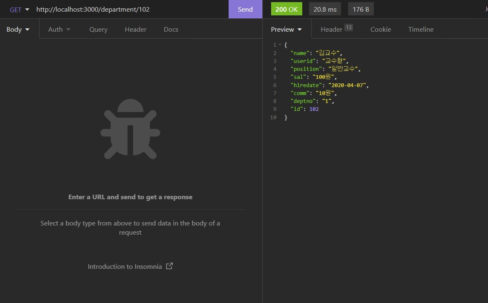
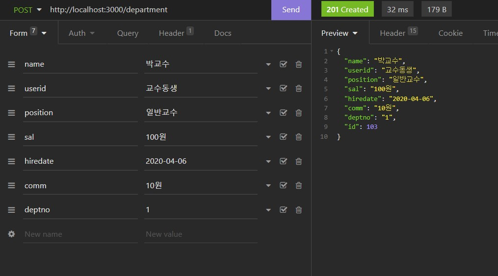
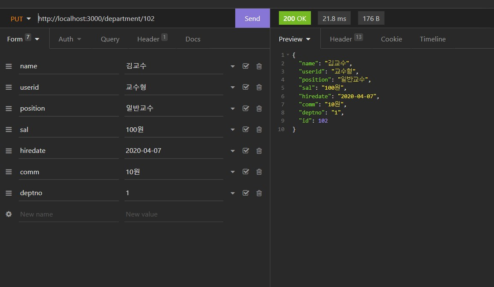
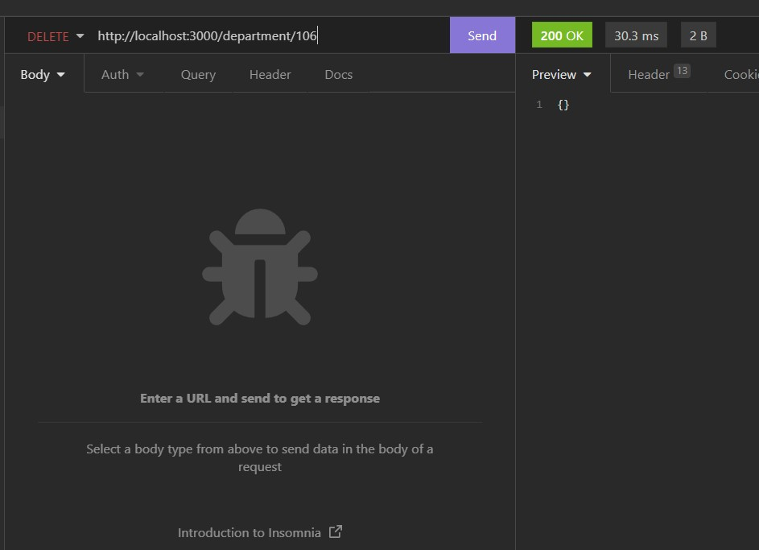
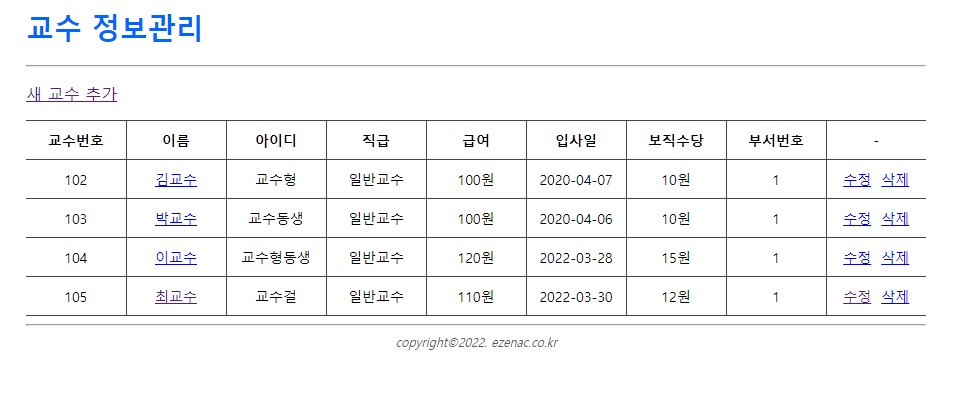
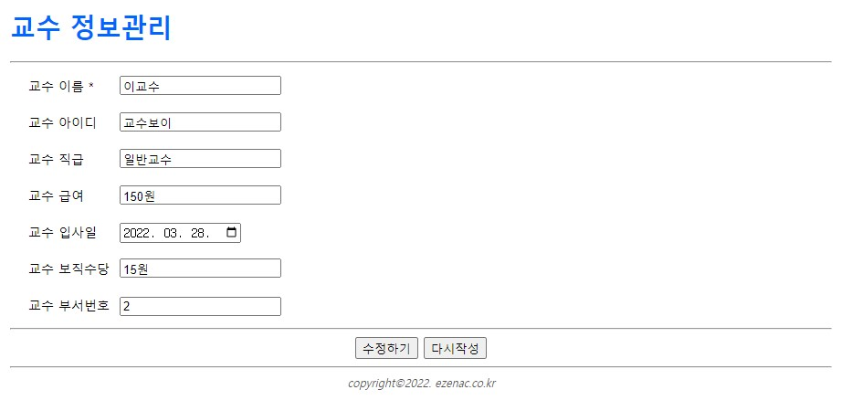
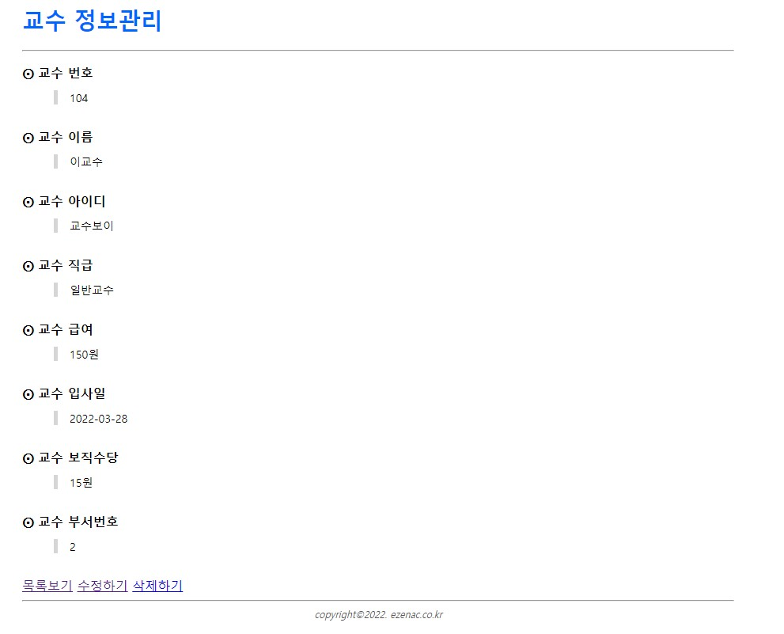
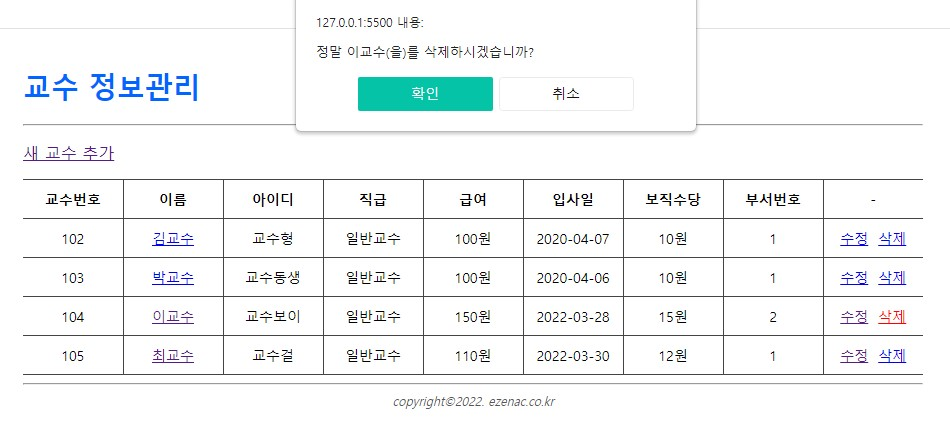
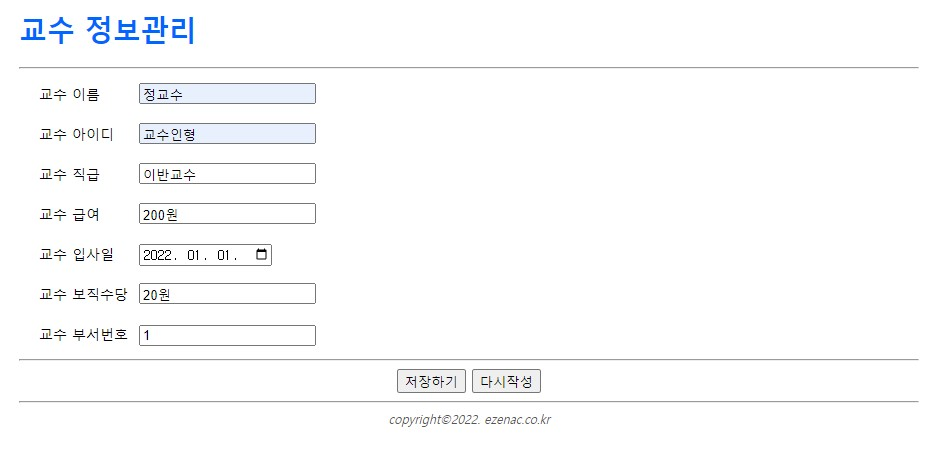
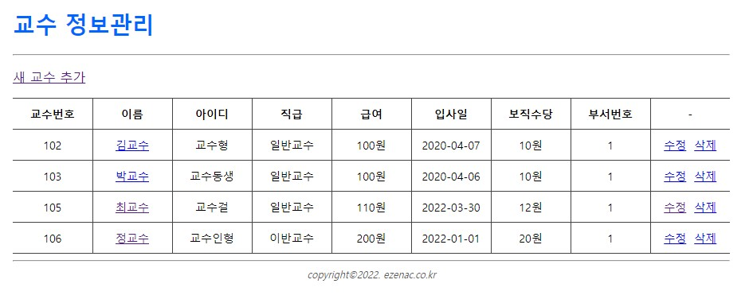

# 교수_연습문제 Restful





# 내 코드
## index.html
```html
<!DOCTYPE html>
<html lang="ko">
  <head>
    <meta charset="UTF-8" />
    <meta name="viewport" content="width=device-width, initial-scale=1.0" />
    <title>교수 정보관리 ::: MySchool</title>
    <link rel="stylesheet" href="assets/css//style.css" />
  </head>
  <body>
    <div class="container">
      <!-- header -->
      <div data-include="inc/header.html"></div>
      <!-- body -->
      <section>
        <p>
          <a href="add.html">새 교수 추가</a>
        </p>
        <table class="table">
          <colgroup>
            <col width="10%" />
            <col width="10%" />
            <col width="10%" />
            <col width="10%" />
            <col width="10%" />
            <col width="10%" />
            <col width="10%" />
            <col width="10%" />
            <col width="10%" />
          </colgroup>
          <thead>
            <tr>
              <th class="text-center">교수번호</th>
              <th class="text-center">이름</th>
              <th class="text-center">아이디</th>
              <th class="text-center">직급</th>
              <th class="text-center">급여</th>
              <th class="text-center">입사일</th>
              <th class="text-center">보직수당</th>
              <th class="text-center">부서번호</th>
              <th class="text-center">-</th>
            </tr>
          </thead>
          <tbody id="listBody"></tbody>
        </table>
      </section>
      <!-- footer -->
      <div data-include="inc/footer.html"></div>
    </div>

    <script src="https://cdn.jsdelivr.net/npm/axios/dist/axios.min.js"></script>
    <script src="assets/js/include.js"></script>
    <script>
      (async () => {
        let json = null;

        try {
          json = await axios.get("http://localhost:3000/department");
        } catch (e) {
          console.error(e);
          alert("요청 처리 실패");
          return;
        }

        if (json != null) {
          const listBody = document.querySelector("#listBody");
          const { data } = json;

          data.forEach((v, i) => {
            const tr = document.createElement("tr");

            const td1 = document.createElement("td");
            td1.innerHTML = v.id;
            tr.appendChild(td1);

            const td2 = document.createElement("td");
            tr.appendChild(td2);

            const a1 = document.createElement("a");
            a1.setAttribute("href", `view.html?id=${v.id}`);
            a1.innerHTML = v.name;
            td2.appendChild(a1);

            const td3 = document.createElement("td");
            td3.innerHTML = v.userid;
            tr.appendChild(td3);

            const td4 = document.createElement("td");
            td4.innerHTML = v.position;
            tr.appendChild(td4);

            const td5 = document.createElement("td");
            td5.innerHTML = v.sal;
            tr.appendChild(td5);

            const td6 = document.createElement("td");
            td6.innerHTML = v.hiredate;
            tr.appendChild(td6);

            const td7 = document.createElement("td");
            td7.innerHTML = v.comm;
            tr.appendChild(td7);

            const td8 = document.createElement("td");
            td8.innerHTML = v.deptno;
            tr.appendChild(td8);

            const td9 = document.createElement("td");
            tr.appendChild(td9);

            const a2 = document.createElement("a");
            a2.setAttribute("href", `edit.html?id=${v.id}`);
            a2.innerHTML = "수정";
            td9.appendChild(a2);

            const a3 = document.createElement("a");
            a3.setAttribute("href", "#");
            a3.dataset.id = v.id;
            a3.dataset.name = v.name;
            a3.innerHTML = "삭제";
            a3.classList.add("btn-delete");
            td9.appendChild(a3);

            listBody.appendChild(tr);

            // 삭제 버튼에 대한 클릭 이벤트 구현
            a3.addEventListener("click", async (e) => {
              e.preventDefault();
              const current = e.currentTarget;
              const id = current.dataset.id;
              const name = current.dataset.id;

              if (!confirm(`정말 ${name}(을)를 삭제하시겠습니까?`)) {
                return;
              }

              let json = null;

              try {
                json = axios.delete(`http://localhost:3000/department/${id}`);
              } catch (e) {
                console.error(e);
                alert("요청 처리 실패");
                return;
              }

              if (json != null) {
                current.closest("tr").remove();
              }
            });
          });
        }
      })();
    </script>
  </body>
</html>
```

## view.html
```html
<!DOCTYPE html>
<html lang="ko">
<head>
    <meta charset="UTF-8">
    <meta name="viewport" content="width=device-width, initial-scale=1.0">
    <title>교수 정보관리 ::: MySchool</title>
    <link rel="stylesheet" href="assets/css//style.css" />
</head>
<body>
    <div class="container">
        <!-- header -->
        <div data-include="inc/header.html"></div>
        <!-- body -->
        <section>
            <dl>
                <dt>교수 번호</dt>
                <dd class="id"></dd>
                <dt>교수 이름</dt>
                <dd class="name"></dd>
                <dt>교수 아이디</dt>
                <dd class="userid"></dd>
                <dt>교수 직급</dt>
                <dd class="position"></dd>
                <dt>교수 급여</dt>
                <dd class="sal"></dd>
                <dt>교수 입사일</dt>
                <dd class="hiredate"></dd>
                <dt>교수 보직수당</dt>
                <dd class="comm"></dd>
                <dt>교수 부서번호</dt>
                <dd class="deptno"></dd>
            </dl>
            <a href="index.html">목록보기</a>
            <a href="#" class="btn-edit">수정하기</a>
            <a href="#" class="btn-delete">삭제하기</a>
        </section>
        <!-- footer -->
        <div data-include="inc/footer.html"></div>
    </div>

    <script src="https://cdn.jsdelivr.net/npm/axios/dist/axios.min.js"></script>
    <script src="assets/js/include.js"></script>
    <script>
        (async () => {
            /** GET 파라미터 받기 */
            // window.location.search : "?id=101"
            console.log(`search값 => ${window.location.search}`);

            // querystring값이 key-value 형태로 객체로 분리됨
            const params = new URLSearchParams(window.location.search);

            // 객체에서 key사용하여 값을 추출 --> 101
            const id = params.get('id');
            console.log('id');

            // 파라미터가 정상적이지 않으므로 메세지 출력, 전페이지 이동 처리 후 수행 중단(return)
            if (!id) {
                alert('교수 번호가 없습니다.');
                history.back();
                return;
            }

            /** Ajax요청 */
            let json = null;

            try {
                json = await axios.get(`http://localhost:3000/department/${id}`);
            } catch (e) {
                console.error(e);
                alert('요청을 처리하는데 실패했습니다.');
                return;
            }

            if (json != null) {
                const {data} = json;

                document.querySelector('.id').innerHTML = data.id;
                document.querySelector('.name').innerHTML = data.name;
                document.querySelector('.userid').innerHTML = data.userid;
                document.querySelector('.position').innerHTML = data.position;
                document.querySelector('.sal').innerHTML = data.sal;
                document.querySelector('.hiredate').innerHTML = data.hiredate;
                document.querySelector('.comm').innerHTML = data.comm;
                document.querySelector('.deptno').innerHTML = data.deptno;

                // 가져온 데이터의 일련번호를 사용하여 어떤 대상을 수정할지에 대한 링크 URL 구성
                document.querySelector('.btn-edit').setAttribute('href', 'edit.html?id=' + data.id);

                // 가져온 데이터의 일련번호를 사용하여 어떤 대상을 삭제할지에 대한 dataset 구성
                const btnDelete = document.querySelector('.btn-delete');
                btnDelete.dataset.id = data.id;
                btnDelete.dataset.name = data.name;
            }
        })();

        /** 삭제 버튼에 대한 클릭 이벤트 */
        document.querySelector('.btn-delete').addEventListener('click', (e) => {
            e.preventDefault();

            const current = e.currentTarget;
            const id = current.dataset.id;
            const name = current.dataset.name;

            if (!confirm(`정말 ${name}(을)를 삭제하시겠습니까?`)) {
                return;
            }

            let json;

            try {
                json = axios.delete(`http://localhost:3000/department/${id}`);
            } catch (e) {
                console.error(e);
                alert('요청을 처리하는데 실패했습니다.');
                return;
            }

            if (json != null) {
                window.location = 'index.html';
            }
        });
    </script>
</body>
</html>
```

## add.html
```html
<!DOCTYPE html>
<html lang="ko">
  <head>
    <meta charset="UTF-8" />
    <meta name="viewport" content="width=device-width, initial-scale=1.0" />
    <title>교수 정보관리 ::: MySchool</title>
    <link rel="stylesheet" href="assets/css//style.css" />
  </head>
  <body>
    <div class="container">
      <!-- header -->
      <div data-include="inc/header.html"></div>
      <!-- body -->
      <section>
        <form name="form" id="department-form">
          <div class="form-group">
            <label for="name"> 교수 이름</label>
            <div>
              <input type="text" name="name" id="name" />
            </div>
          </div>
          <div class="form-group">
            <label for="userid"> 교수 아이디</label>
            <div>
              <input type="text" name="userid" id="userid" />
            </div>
          </div>
          <div class="form-group">
            <label for="position"> 교수 직급</label>
            <div>
              <input type="text" name="position" id="position" />
            </div>
          </div>
          <div class="form-group">
            <label for="sal"> 교수 급여</label>
            <div>
              <input type="text" name="sal" id="sal" />
            </div>
          </div>
          <div class="form-group">
            <label for="hiredate"> 교수 입사일</label>
            <div>
              <input type="date" name="hiredate" id="hiredate" />
            </div>
          </div>
          <div class="form-group">
            <label for="comm"> 교수 보직수당</label>
            <div>
              <input type="text" name="comm" id="comm" />
            </div>
          </div>
          <div class="form-group">
            <label for="deptno"> 교수 부서번호</label>
            <div>
              <input type="number" name="deptno" id="deptno" />
            </div>
          </div>
          <hr />
          <div class="text-center">
            <button type="submit">저장하기</button>
            <button type="reset">다시작성</button>
          </div>
        </form>
      </section>
      <!-- footer -->
      <div data-include="inc/footer.html"></div>
    </div>

    <script src="https://cdn.jsdelivr.net/npm/axios/dist/axios.min.js"></script>
    <script src="assets/js/include.js"></script>
    <script>
      document
        .querySelector("#department-form")
        .addEventListener("submit", async (e) => {
          e.preventDefault();

          // 입력값 받아오기
          const name = document.querySelector("#name").value;
          const userid = document.querySelector("#userid").value;
          const position = document.querySelector("#position").value;
          const sal = document.querySelector("#sal").value;
          const hiredate = document.querySelector("#hiredate").value;
          const comm = document.querySelector("#comm").value;
          const deptno = document.querySelector("#deptno").value;

          // 유효성 검사는 생략한다.

          let json = null;

          try {
            // 대부분의 backend가 일련번호는 자체적으로 생성하기 때문에 create에 해당하는 데이터 추가 처리에서는
            // 백엔드에게 일련번호를 제외한 변수만 전달해야 한다.
            json = await axios.post("http://localhost:3000/department", {
              name: name,
              userid: userid,
              position: position,
              sal: sal,
              hiredate: hiredate,
              comm: comm,
              deptno: deptno,
            });
          } catch (e) {
            console.error(e);
            alert('요청을 처리하는데 실패했습니다.');
            return;
          }

          if (json != null) {
            const {data} = json;
            console.log(data);
            // 백엔드에서 데이터 저장에 대한 응답으로 보낸 JSON에는 생성된 신규 항목에 대한 일련번호가 포함되어 있다.
            // 이 값을 활용하여 상세 페이지로 이동해야 한다.
            // 이 때, 어떤 대상을 열람할 것인지에 대한 GET 파라미터를 구성한다.
            window.location = 'view.html?id=' + data.id;
          }
        });
    </script>
  </body>
</html>
```

## edit.html
```html
<!DOCTYPE html>
<html lang="ko">
  <head>
    <meta charset="UTF-8" />
    <meta name="viewport" content="width=device-width, initial-scale=1.0" />
    <title>교수 정보관리 ::: MySchool</title>
    <link rel="stylesheet" href="assets/css//style.css" />
  </head>
  <body>
    <div class="container">
      <!-- header -->
      <div data-include="inc/header.html"></div>
      <!-- body -->
      <section>
        <form name="form" id="department-form">
          <!-- 수정할 대상에 대한 일련번호 값을 포함해야 하므로 hidden 필드로 처리한다. -->
          <input type="hidden" name="id" id="id" />
          <div class="form-group">
            <label for="name">
              교수 이름 <span class="text-danger">*</span></label
            >
            <div>
              <input type="text" name="name" id="name" />
            </div>
          </div>
          <div class="form-group">
            <label for="userid"> 교수 아이디</label>
            <div>
              <input type="text" name="userid" id="userid" />
            </div>
          </div>
          <div class="form-group">
            <label for="position"> 교수 직급</label>
            <div>
              <input type="text" name="position" id="position" />
            </div>
          </div>
          <div class="form-group">
            <label for="sal"> 교수 급여</label>
            <div>
              <input type="text" name="sal" id="sal" />
            </div>
          </div>
          <div class="form-group">
            <label for="hiredate"> 교수 입사일</label>
            <div>
              <input type="date" name="hiredate" id="hiredate" />
            </div>
          </div>
          <div class="form-group">
            <label for="comm"> 교수 보직수당</label>
            <div>
              <input type="text" name="comm" id="comm" />
            </div>
          </div>
          <div class="form-group">
            <label for="deptno"> 교수 부서번호</label>
            <div>
              <input type="number" name="deptno" id="deptno" />
            </div>
          </div>
          <hr />
          <div class="text-center">
            <button type="submit">수정하기</button>
            <button type="reset">다시작성</button>
          </div>
        </form>
      </section>
      <!-- footer -->
      <div data-include="inc/footer.html"></div>
    </div>

    <script src="https://cdn.jsdelivr.net/npm/axios/dist/axios.min.js"></script>
    <script src="assets/js/include.js"></script>
    <script>
      (async () => {
        /** GET 파라미터 받기 */
        const params = new URLSearchParams(window.location.search);
        const id = params.get("id");
        console.log(id);

        // 파라미터가 정삭적이지 않으므로 메세지 출력, 전페이지로 이동 처리 후 수행 중단(return)
        if (!id) {
          alert("교수 번호가 없습니다.");
          history.back();
          return;
        }

        /** Ajax요청 */
        // 기존에 저장되어 있는 내용을 <form>안에 셋팅하기 위해 Ajax로 데이터를 가져온다.
        let json;

        try {
          json = await axios.get(`http://localhost:3000/department/${id}`);
        } catch (e) {
          console.error(e);
          alert("요청을 처리하는데 실패했습니다.");
          return;
        }

        // 가져온 데이터가 있다면 <input> 태그의 value 속성으로 가져온 값을 적용한다.
        // 일련번호와 같이 시스템이 관리하는 값을 hidden 요소로 포함시킨다.
        if (json != null) {
          const { data } = json;
          document.querySelector("#id").value = data.id;
          document.querySelector("#name").value = data.name;
          document.querySelector("#userid").value = data.userid;
          document.querySelector("#position").value = data.position;
          document.querySelector("#sal").value = data.sal;
          document.querySelector("#hiredate").value = data.hiredate;
          document.querySelector("#comm").value = data.comm;
          document.querySelector("#deptno").value = data.deptno;
        }
      })();

      /** 수정 버튼의 submit 이벤트 */
      document
        .querySelector("#department-form")
        .addEventListener("submit", async (e) => {
          e.preventDefault();

          // 입력값 받아오기
          const id = document.querySelector("#id").value;
          const name = document.querySelector("#name").value;
          const userid = document.querySelector("#userid").value;
          const position = document.querySelector("#position").value;
          const sal = document.querySelector("#sal").value;
          const hiredate = document.querySelector("#hiredate").value;
          const comm = document.querySelector("#comm").value;
          const deptno = document.querySelector("#deptno").value;

          // 입력값에 대한 유효성 검사 진행.... (이 예제에서는 생략)

          let json = null;

          try {
            json = await axios.put(`http://localhost:3000/department/${id}`, {
              name: name,
              userid: userid,
              position: position,
              sal: sal,
              hiredate: hiredate,
              comm: comm,
              deptno: deptno,
            });
          } catch (e) {
            console.error(e);
            alert("요청을 처리하는데 실패했습니다.");
            return;
          }

          if (json != null) {
            window.location.href = `view.html?id=${id}`;
          }
        });
    </script>
  </body>
</html>
```

# 구현 스크린샷







<br/>

---

<br/>

---

<br/>

# 학생_연습문제 Restful


# 내 코드
## index.html
```html
<!DOCTYPE html>
<html lang="ko">
  <head>
    <meta charset="UTF-8" />
    <meta name="viewport" content="width=device-width, initial-scale=1.0" />
    <title>학생 관리 ::: MySchool</title>
    <link rel="stylesheet" href="assets/css//style.css" />
  </head>
  <body>
    <div class="container">
      <!-- header -->
      <div data-include="inc/header.html"></div>
      <!-- body -->
      <section>
        <p>
          <a href="add.html">새 학생 추가</a>
        </p>
        <table class="table">
          <colgroup>
            <col width="8%" />
            <col width="8%" />
            <col width="8%" />
            <col width="8%" />
            <col width="8%" />
            <col width="8%" />
            <col width="8%" />
            <col width="8%" />
            <col width="8%" />
            <col width="8%" />
            <col width="8%" />
          </colgroup>
          <thead>
            <tr>
              <th class="text-center">학생번호</th>
              <th class="text-center">이름</th>
              <th class="text-center">아이디</th>
              <th class="text-center">학년</th>
              <th class="text-center">주민번호</th>
              <th class="text-center">생년월일</th>
              <th class="text-center">전화번호</th>
              <th class="text-center">키</th>
              <th class="text-center">몸무게</th>
              <th class="text-center">학과번호</th>
              <th class="text-center">담당교수 일련번호</th>
              <th class="text-center">-</th>
            </tr>
          </thead>
          <tbody id="listBody"></tbody>
        </table>
      </section>
      <!-- footer -->
      <div data-include="inc/footer.html"></div>
    </div>

    <script src="https://cdn.jsdelivr.net/npm/axios/dist/axios.min.js"></script>
    <script src="assets/js/include.js"></script>
    <script>
      (async () => {
        let json = null;

        try {
          json = await axios.get("http://localhost:3000/department");
        } catch (e) {
          console.error(e);
          alert("요청 처리 실패");
          return;
        }

        if (json != null) {
          const listBody = document.querySelector("#listBody");
          const { data } = json;

          data.forEach((v, i) => {
            const tr = document.createElement("tr");

            const td1 = document.createElement("td");
            td1.innerHTML = v.id;
            tr.appendChild(td1);

            const td2 = document.createElement("td");
            tr.appendChild(td2);

            const a1 = document.createElement("a");
            a1.setAttribute("href", `view.html?id=${v.id}`);
            a1.innerHTML = v.name;
            td2.appendChild(a1);

            const td3 = document.createElement("td");
            td3.innerHTML = v.userid;
            tr.appendChild(td3);

            const td4 = document.createElement("td");
            td4.innerHTML = v.grade;
            tr.appendChild(td4);

            const td5 = document.createElement("td");
            td5.innerHTML = v.idnum;
            tr.appendChild(td5);

            const td6 = document.createElement("td");
            td6.innerHTML = v.birthdate;
            tr.appendChild(td6);

            const td7 = document.createElement("td");
            td7.innerHTML = v.tel;
            tr.appendChild(td7);

            const td8 = document.createElement("td");
            td8.innerHTML = v.height;
            tr.appendChild(td8);

            const td9 = document.createElement("td");
            td9.innerHTML = v.weight;
            tr.appendChild(td9);
            
            const td10 = document.createElement("td");
            td10.innerHTML = v.deptno;
            tr.appendChild(td10);

            const td11 = document.createElement("td");
            td11.innerHTML = v.profno;
            tr.appendChild(td11);

            const td12 = document.createElement("td");
            tr.appendChild(td12);

            const a2 = document.createElement("a");
            a2.setAttribute("href", `edit.html?id=${v.id}`);
            a2.innerHTML = "수정";
            td12.appendChild(a2);

            const a3 = document.createElement("a");
            a3.setAttribute("href", "#");
            a3.dataset.id = v.id;
            a3.dataset.name = v.name;
            a3.innerHTML = "삭제";
            a3.classList.add("btn-delete");
            td12.appendChild(a3);

            listBody.appendChild(tr);

            // 삭제 버튼에 대한 클릭 이벤트 구현
            a3.addEventListener("click", async (e) => {
              e.preventDefault();
              const current = e.currentTarget;
              const id = current.dataset.id;
              const name = current.dataset.name;

              if (!confirm(`정말 ${name}(을)를 삭제하시겠습니까?`)) {
                return;
              }

              let json = null;

              try {
                json = axios.delete(`http://localhost:3000/department/${id}`);
              } catch (e) {
                console.error(e);
                alert("요청 처리 실패");
                return;
              }

              if (json != null) {
                current.closest("tr").remove();
              }
            });
          });
        }
      })();
    </script>
  </body>
</html>
```

## view.html
```html
<!DOCTYPE html>
<html lang="ko">
<head>
    <meta charset="UTF-8">
    <meta name="viewport" content="width=device-width, initial-scale=1.0">
    <title>교수 정보관리 ::: MySchool</title>
    <link rel="stylesheet" href="assets/css//style.css" />
</head>
<body>
    <div class="container">
        <!-- header -->
        <div data-include="inc/header.html"></div>
        <!-- body -->
        <section>
            <dl>
                <dt>학생번호</dt>
                <dd class="id"></dd>
                <dt>이름</dt>
                <dd class="name"></dd>
                <dt>아이디</dt>
                <dd class="userid"></dd>
                <dt>학년</dt>
                <dd class="grade"></dd>
                <dt>주민번호</dt>
                <dd class="idnum"></dd>
                <dt>생년월일</dt>
                <dd class="birthdate"></dd>
                <dt>전화번호</dt>
                <dd class="tel"></dd>
                <dt>키</dt>
                <dd class="height"></dd>
                <dt>몸무게</dt>
                <dd class="weight"></dd>
                <dt>학과번호</dt>
                <dd class="deptno"></dd>
                <dt>담당교수 일련번호</dt>
                <dd class="profno"></dd>
            </dl>
            <a href="index.html">목록보기</a>
            <a href="#" class="btn-edit">수정하기</a>
            <a href="#" class="btn-delete">삭제하기</a>
        </section>
        <!-- footer -->
        <div data-include="inc/footer.html"></div>
    </div>

    <script src="https://cdn.jsdelivr.net/npm/axios/dist/axios.min.js"></script>
    <script src="assets/js/include.js"></script>
    <script>
        (async () => {
            /** GET 파라미터 받기 */
            // window.location.search : "?id=101"
            console.log(`search값 => ${window.location.search}`);

            // querystring값이 key-value 형태로 객체로 분리됨
            const params = new URLSearchParams(window.location.search);

            // 객체에서 key사용하여 값을 추출 --> 101
            const id = params.get('id');
            console.log('id');

            // 파라미터가 정상적이지 않으므로 메세지 출력, 전페이지 이동 처리 후 수행 중단(return)
            if (!id) {
                alert('학생번호가 없습니다.');
                history.back();
                return;
            }

            /** Ajax요청 */
            let json = null;

            try {
                json = await axios.get(`http://localhost:3000/department/${id}`);
            } catch (e) {
                console.error(e);
                alert('요청을 처리하는데 실패했습니다.');
                return;
            }

            if (json != null) {
                const {data} = json;

                document.querySelector('.id').innerHTML = data.id;
                document.querySelector('.name').innerHTML = data.name;
                document.querySelector('.userid').innerHTML = data.userid;
                document.querySelector('.grade').innerHTML = data.grade;
                document.querySelector('.idnum').innerHTML = data.idnum;
                document.querySelector('.birthdate').innerHTML = data.birthdate;
                document.querySelector('.tel').innerHTML = data.tel;
                document.querySelector('.height').innerHTML = data.height;
                document.querySelector('.weight').innerHTML = data.weight;
                document.querySelector('.deptno').innerHTML = data.deptno;
                document.querySelector('.profno').innerHTML = data.profno;

                // 가져온 데이터의 일련번호를 사용하여 어떤 대상을 수정할지에 대한 링크 URL 구성
                document.querySelector('.btn-edit').setAttribute('href', 'edit.html?id=' + data.id);

                // 가져온 데이터의 일련번호를 사용하여 어떤 대상을 삭제할지에 대한 dataset 구성
                const btnDelete = document.querySelector('.btn-delete');
                btnDelete.dataset.id = data.id;
                btnDelete.dataset.name = data.name;
            }
        })();

        /** 삭제 버튼에 대한 클릭 이벤트 */
        document.querySelector('.btn-delete').addEventListener('click', (e) => {
            e.preventDefault();

            const current = e.currentTarget;
            const id = current.dataset.id;
            const name = current.dataset.name;

            if (!confirm(`정말 ${name}(을)를 삭제하시겠습니까?`)) {
                return;
            }

            let json;

            try {
                json = axios.delete(`http://localhost:3000/department/${id}`);
            } catch (e) {
                console.error(e);
                alert('요청을 처리하는데 실패했습니다.');
                return;
            }

            if (json != null) {
                window.location = 'index.html';
            }
        });
    </script>
</body>
</html>
```

## add.html
```html
<!DOCTYPE html>
<html lang="ko">
  <head>
    <meta charset="UTF-8" />
    <meta name="viewport" content="width=device-width, initial-scale=1.0" />
    <title>학새 관리 ::: MySchool</title>
    <link rel="stylesheet" href="assets/css//style.css" />
  </head>
  <body>
    <div class="container">
      <!-- header -->
      <div data-include="inc/header.html"></div>
      <!-- body -->
      <section>
        <form name="form" id="department-form">
          <div class="form-group">
            <label for="name"> 이름</label>
            <div>
              <input type="text" name="name" id="name" />
            </div>
          </div>
          <div class="form-group">
            <label for="userid"> 아이디</label>
            <div>
              <input type="text" name="userid" id="userid" />
            </div>
          </div>
          <div class="form-group">
            <label for="grade"> 학년</label>
            <div>
              <input type="text" name="grade" id="grade" />
            </div>
          </div>
          <div class="form-group">
            <label for="idnum"> 주민번호 </label>
            <div>
              <input type="text" name="idnum" id="idnum" />
            </div>
          </div>
          <div class="form-group">
            <label for="birthdate">생년월일</label>
            <div>
              <input type="text" name="birthdate" id="birthdate" />
            </div>
          </div>
          <div class="form-group">
            <label for="tel"> 전화번호</label>
            <div>
              <input type="text" name="tel" id="tel" />
            </div>
          </div>
          <div class="form-group">
            <label for="height"> 키</label>
            <div>
              <input type="number" name="height" id="height" />
            </div>
          </div>
          <div class="form-group">
            <label for="weight"> 몸무게</label>
            <div>
              <input type="number" name="weight" id="weight" />
            </div>
          </div>
          <div class="form-group">
            <label for="deptno"> 학과번호</label>
            <div>
              <input type="number" name="deptno" id="deptno" />
            </div>
          </div>
          <div class="form-group">
            <label for="profno"> 교수일련번호</label>
            <div>
              <input type="number" name="profno" id="profno" />
            </div>
          </div>
          <hr />
          <div class="text-center">
            <button type="submit">저장하기</button>
            <button type="reset">다시작성</button>
          </div>
        </form>
      </section>
      <!-- footer -->
      <div data-include="inc/footer.html"></div>
    </div>

    <script src="https://cdn.jsdelivr.net/npm/axios/dist/axios.min.js"></script>
    <script src="assets/js/include.js"></script>
    <script>
      document
        .querySelector("#department-form")
        .addEventListener("submit", async (e) => {
          e.preventDefault();

          // 입력값 받아오기
          const name = document.querySelector("#name").value;
          const userid = document.querySelector("#userid").value;
          const grade = document.querySelector("#grade").value;
          const idnum = document.querySelector("#idnum").value;
          const birthdate = document.querySelector("#birthdate").value;
          const tel = document.querySelector("#tel").value;
          const height = document.querySelector("#height").value;
          const weight = document.querySelector("#weight").value;
          const deptno = document.querySelector("#deptno").value;
          const profno = document.querySelector("#profno").value;

          // 유효성 검사는 생략한다.

          let json = null;

          try {
            // 대부분의 backend가 일련번호는 자체적으로 생성하기 때문에 create에 해당하는 데이터 추가 처리에서는
            // 백엔드에게 일련번호를 제외한 변수만 전달해야 한다.
            json = await axios.post("http://localhost:3000/department", {
              name: name,
              userid: userid,
              grade: grade,
              idnum: idnum,
              birthdate: birthdate,
              tel: tel,
              height: height,
              weight: weight,
              deptno: deptno,
              profno: profno,
            });
          } catch (e) {
            console.error(e);
            alert('요청을 처리하는데 실패했습니다.');
            return;
          }

          if (json != null) {
            const {data} = json;
            console.log(data);
            // 백엔드에서 데이터 저장에 대한 응답으로 보낸 JSON에는 생성된 신규 항목에 대한 일련번호가 포함되어 있다.
            // 이 값을 활용하여 상세 페이지로 이동해야 한다.
            // 이 때, 어떤 대상을 열람할 것인지에 대한 GET 파라미터를 구성한다.
            window.location = 'view.html?id=' + data.id;
          }
        });
    </script>
  </body>
</html>
```

## edit.html
```html
<!DOCTYPE html>
<html lang="ko">
  <head>
    <meta charset="UTF-8" />
    <meta name="viewport" content="width=device-width, initial-scale=1.0" />
    <title>학과관리 ::: MySchool</title>
    <link rel="stylesheet" href="assets/css//style.css" />
  </head>
  <body>
    <div class="container">
      <!-- header -->
      <div data-include="inc/header.html"></div>
      <!-- body -->
      <section>
        <form name="form" id="department-form">
          <!-- 수정할 대상에 대한 일련번호 값을 포함해야 하므로 hidden 필드로 처리한다. -->
          <input type="hidden" name="id" id="id" />
          <div class="form-group">
            <label for="name"> 이름 <span class="text-danger">*</span></label>
            <div>
              <input type="text" name="name" id="name" />
            </div>
          </div>
          <div class="form-group">
            <label for="userid"> 아이디</label>
            <div>
              <input type="text" name="userid" id="userid" />
            </div>
          </div>
          <div class="form-group">
            <label for="grade"> 학년</label>
            <div>
              <input type="text" name="grade" id="grade" />
            </div>
          </div>
          <div class="form-group">
            <label for="idnum"> 주민번호</label>
            <div>
              <input type="text" name="idnum" id="idnum" />
            </div>
          </div>
          <div class="form-group">
            <label for="birthdate"> 생년월일</label>
            <div>
              <input type="text" name="birthdate" id="birthdate" />
            </div>
          </div>
          <div class="form-group">
            <label for="tel"> 전화번호</label>
            <div>
              <input type="text" name="tel" id="tel" />
            </div>
          </div>
          <div class="form-group">
            <label for="height"> 키</label>
            <div>
              <input type="number" name="height" id="height" />
            </div>
          </div>
          <div class="form-group">
            <label for="weight"> 몸무게</label>
            <div>
              <input type="number" name="weight" id="weight" />
            </div>
          </div>
          <div class="form-group">
            <label for="deptno"> 학과번호</label>
            <div>
              <input type="number" name="deptno" id="deptno" />
            </div>
          </div>
          <div class="form-group">
            <label for="profno"> 담당교수의 일련번호</label>
            <div>
              <input type="number" name="profno" id="profno" />
            </div>
          </div>
          <hr />
          <div class="text-center">
            <button type="submit">수정하기</button>
            <button type="reset">다시작성</button>
          </div>
        </form>
      </section>
      <!-- footer -->
      <div data-include="inc/footer.html"></div>
    </div>

    <script src="https://cdn.jsdelivr.net/npm/axios/dist/axios.min.js"></script>
    <script src="assets/js/include.js"></script>
    <script>
      (async () => {
        /** GET 파라미터 받기 */
        const params = new URLSearchParams(window.location.search);
        const id = params.get("id");
        console.log(id);

        // 파라미터가 정삭적이지 않으므로 메세지 출력, 전페이지로 이동 처리 후 수행 중단(return)
        if (!id) {
          alert("학생번호가 없습니다.");
          history.back();
          return;
        }

        /** Ajax요청 */
        // 기존에 저장되어 있는 내용을 <form>안에 셋팅하기 위해 Ajax로 데이터를 가져온다.
        let json;

        try {
          json = await axios.get(`http://localhost:3000/department/${id}`);
        } catch (e) {
          console.error(e);
          alert("요청을 처리하는데 실패했습니다.");
          return;
        }

        // 가져온 데이터가 있다면 <input> 태그의 value 속성으로 가져온 값을 적용한다.
        // 일련번호와 같이 시스템이 관리하는 값을 hidden 요소로 포함시킨다.
        if (json != null) {
          const { data } = json;
          document.querySelector("#id").value = data.id;
          document.querySelector("#name").value = data.name;
          document.querySelector("#userid").value = data.userid;
          document.querySelector("#grade").value = data.grade;
          document.querySelector("#idnum").value = data.idnum;
          document.querySelector("#birthdate").value = data.birthdate;
          document.querySelector("#tel").value = data.tel;
          document.querySelector("#height").value = data.height;
          document.querySelector("#weight").value = data.weight;
          document.querySelector("#deptno").value = data.deptno;
          document.querySelector("#profno").value = data.profno;
        }
      })();

      /** 수정 버튼의 submit 이벤트 */
      document
        .querySelector("#department-form")
        .addEventListener("submit", async (e) => {
          e.preventDefault();

          // 입력값 받아오기
          const id = document.querySelector("#id").value;
          const name = document.querySelector("#name").value;
          const userid = document.querySelector("#userid").value;
          const grade = document.querySelector("#grade").value;
          const idnum = document.querySelector("#idnum").value;
          const birthdate = document.querySelector("#birthdate").value;
          const tel = document.querySelector("#tel").value;
          const height = document.querySelector("#height").value;
          const weight = document.querySelector("#weight").value;
          const deptno = document.querySelector("#deptno").value;
          const profno = document.querySelector("#profno").value;

          // 입력값에 대한 유효성 검사 진행.... (이 예제에서는 생략)

          let json = null;

          try {
            json = await axios.put(`http://localhost:3000/department/${id}`, {
              name: name,
              userid: userid,
              grade: grade,
              idnum: idnum,
              birthdate: birthdate,
              tel: tel,
              height: height,
              weight: weight,
              deptno: deptno,
              profno: profno,
            });
          } catch (e) {
            console.error(e);
            alert("요청을 처리하는데 실패했습니다.");
            return;
          }

          if (json != null) {
            window.location.href = `view.html?id=${id}`;
          }
        });
    </script>
  </body>
</html>
```

# 구현 스크린샷


