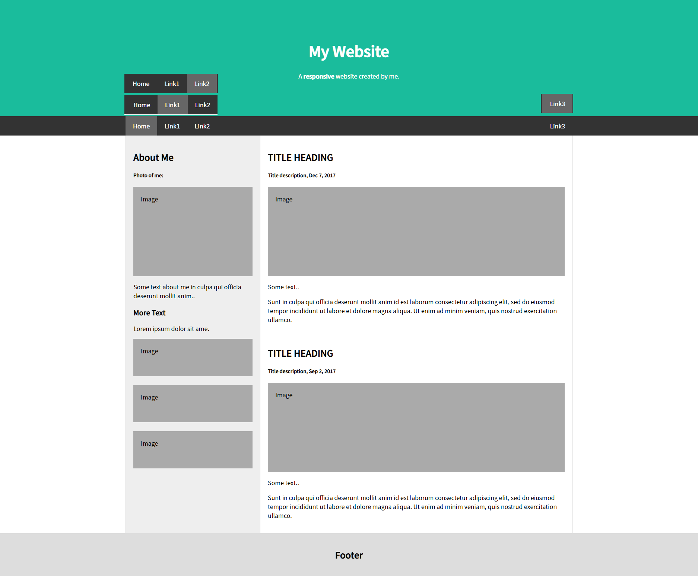

# 리엑트로 기존 HTML 예제 변환하기
<br/>


# index.js
```js
import React from "react";
import ReactDOM from "react-dom/client";
import App from "./App";
import { BrowserRouter  } from "react-router-dom";

const root = ReactDOM.createRoot(document.getElementById("root"));
root.render(
  <React.StrictMode>
    <BrowserRouter >
      <App />
    </BrowserRouter>
  </React.StrictMode>
);
```
# App.js
```js
import React from "react";
import { Routes, Route, } from "react-router-dom";
import Header from "./components/Header";
import Content from "./page/Content";
import Footer from "./components/Footer";
import GlobalStyles from "./components/GlobalStyles";
import Meta from "./components/Meta";

const App = () => {
  return (
    <div>
      <GlobalStyles />
      <Meta />
      <Header />
      <Routes>
        <Route path="/home" element={<Content/>}/>
        <Route path="/link:num" element={<Content/>}/>
      </Routes>
      <Footer />
    </div>
  );
};

export default App;
```
# component/Header.js
```js
import React from "react";
import { NavLink } from "react-router-dom";
import styled from "styled-components";

const H_cover = styled.div`
  .jumbotron {
    padding: 80px;
    text-align: center;
    background: #1abc9c;
    color: white;
  }

  .jumbotron h1 {
    font-size: 40px;
  }

  .navbar {
    overflow: hidden;
    background-color: #333;
    position: sticky;
  }

  .navbar > div {
    max-width: 1200px;
    margin: auto;
    display: flex;
    flex-direction: row;
    flex-wrap: nowrap;
    justify-content: flex-start;
  }

  .navbar div .link {
    display: block;
    color: white;
    text-align: center;
    padding: 14px 20px;
    text-decoration: none;
  }

  .navbar .link:last-child {
    margin-left: auto;
  }

  .navbar .link:hover {
    background-color: #ddd;
    color: black;
  }

  .navbar .link.active {
    background-color: #666;
    color: white;
  }
`;

const Header = () => {
  
  return (
    <header className="header">
      <H_cover>
        <div className="jumbotron">
          <h1>My Website</h1>
          <p>A <b>responsive</b> website created by me.</p>
        </div>
        <nav className="navbar">
          <div>
            <NavLink className="link" to="/home">Home</NavLink>
            <NavLink className="link" to="/link1">Link1</NavLink>
            <NavLink className="link" to="/link2">Link2</NavLink>
            <NavLink className="link" to="/link3">Link3</NavLink>
          </div>
        </nav>
      </H_cover>
    </header>
  );
};

export default Header;
```
# page/Content.js
```js
import React from "react";
import styled from "styled-components";
import Main from "../components/Main";
import Side from "../components/Side";

const C_cover = styled.div`
  max-width: 1200px;
  margin: auto;
  background-color: #eee;
  display: flex;
  flex-wrap: nowrap;
  flex-direction: row;
`;

const Content = () => {
  return (
    <section className="content">
      <C_cover>
      <Side />
      <Main />
      </C_cover>
    </section>
  );
};

export default Content;
```
# components/Side.js
```js
import React from "react";
import styled from "styled-components";

const S_cover = styled.div`
  width: 320px;
  

  .fakeimg {
    background-color: #aaa;
    width: auto;
    padding: 20px;
    height: 60px;
  }
`;

const Side = () => {

  const fakeimg = {
    height: "200px",
  };

  const side = {
    width: "360",
    borderLeft: '1px solid #d5d5d5',
    borderRight: '1px solid #d5d5d5',
    padding: '20px',
    flex: 'none',
  };

  return (
    <div className="side" style={side}>
      <S_cover>
        <h2>About Me</h2>
        <h5>Photo of me:</h5>
        <div className="fakeimg" style={fakeimg}>Image</div>
        <p>Some text about me in culpa qui officia deserunt mollit anim..</p>
        <h3>More Text</h3>
        <p>Lorem ipsum dolor sit ame.</p>
        <div className="fakeimg">Image</div>
        <br />
        <div className="fakeimg">Image</div>
        <br />
        <div className="fakeimg">Image</div>
      </S_cover>
    </div>
  );
};

export default Side;
```
# components/main.js
```js
import React from "react";
import styled from "styled-components";

const M_cover = styled.div`
  flex: 0 1 auto;
  background-color: white;
  border-right: 1px solid #d5d5d5;
  padding: 20px;

  .fakeimg {
    background-color: #aaa;
    width: auto;
    padding: 20px;
    height: 200px;
  }
`;

const Main = () => {
  return (
    <div className="main">
      <M_cover>
        <h2>TITLE HEADING</h2>
        <h5>Title description, Dec 7, 2017</h5>
        <div className="fakeimg">Image</div>
        <p>Some text..</p>
        <p>Sunt in culpa qui officia deserunt mollit anim id est laborum
          consectetur adipiscing elit, sed do eiusmod tempor incididunt ut
          labore et dolore magna aliqua. Ut enim ad minim veniam, quis nostrud
          exercitation ullamco.
        </p>
        <br />
        <h2>TITLE HEADING</h2>
        <h5>Title description, Sep 2, 2017</h5>
        <div className="fakeimg">Image</div>
        <p>Some text..</p>
        <p>
          Sunt in culpa qui officia deserunt mollit anim id est laborum
          consectetur adipiscing elit, sed do eiusmod tempor incididunt ut
          labore et dolore magna aliqua. Ut enim ad minim veniam, quis nostrud
          exercitation ullamco.
        </p>
      </M_cover>
    </div>
  );
};

export default Main;
```
# components/Footer.js
```js
import React from "react";
import styled from "styled-components";

const F_cover = styled.div`
  padding: 20px;
  text-align: center;
  background: #ddd;
`;

const Footer = () => {
  return (
    <footer className="footer">
      <F_cover>
      <h2>Footer</h2>
      </F_cover>
    </footer>
  );
};

export default Footer;
```
# components/GlobalStyles.js
```js
import { createGlobalStyle } from "styled-components";

const GlobalStyles = createGlobalStyle`

    * { font-family: 'Noto Sans KR';}
    
    body {
        padding: 0;
        margin: 0;
    }
`;

export default GlobalStyles;
```
# components/Meta.js
```js
import React from "react";
import { Helmet } from "react-helmet";
const Meta = (props) => {
  return (
    <Helmet>
      <meta charset="utf-8" />
      <title>{props.title}</title>
      {/* SEO 태그 */}
      <meta name="description" content={props.description} />
      <meta name="keywords" content={props.keywords} />
      <meta name="author" content={props.author} />
      <meta property="og:type" content="website" />
      <meta property="og:title" content={props.title} />
      <meta property="og:description" content={props.description} />
      <meta property="og:url" content={props.url} />

      <link rel="preconnect" href="https://fonts.googleapis.com" />
      <link rel="preconnect" href="https://fonts.gstatic.com" crossorigin />
      <link href="https://fonts.googleapis.com/css2? 
      family=Gugi&family=Noto+Sans+KR:wght@100;300;400;500&display=swap" rel="stylesheet" />
    </Helmet>
  );
};

Meta.defaultProps = {
  title: "React 연습문제",
  description: "React 연습문제 입니다.",
  keywords: "React",
  author: "dodo",
  url: window.location.href,
};

export default Meta;
```