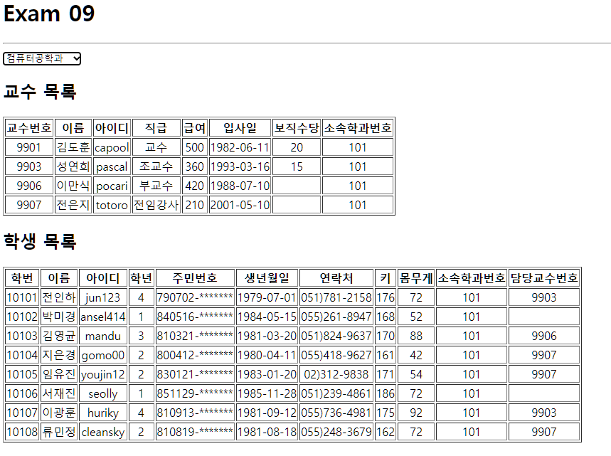

# 구현결과


## App.js
```js
import React, { useState, useEffect, useCallback, } from "react";
import axios from "axios";

import Student from "./components/Student";
import Professor from "./components/Professor";

const App = () => {
  const [dept, setDetp] = useState([]);
  const [deptno, setDeptno] = useState("");

  useEffect(() => {
    (async () => {
      try {
        const response = await axios.get("http://localhost:3001/department");
        setDetp(response.data);
        console.log(dept);
      } catch (e) {
        console.error(e);
      }
    })();
  }, []);

  const onDeptSelect = useCallback((e) => {
    setDeptno(e.currentTarget.value);
    console.log(deptno);
  }, []);

  return (
    <div>
      <h1>Exam 09</h1>

      <hr />

      <select name="dept" onChange={onDeptSelect}>
        {dept.map((v, i) => (
          <option key={i} value={v.id} >
            {v.dname}
          </option>
        ))}
      </select>

      <Professor deptno={deptno} />
      <Student deptno={deptno} />
    </div>
  );
};

export default  React.memo(App);
```
## Student.js
```js
import React, { useEffect, useState } from "react";
import axios from "axios";
import Spinner from "./Spinner";

const Student = ({ deptno }) => {
  const [student, setStudent] = useState([]);
  const [loading, setLoading] = useState(false);

  useEffect(() => {
    setTimeout(() => {
      (async () => {
        setLoading(true);

        try {
          const response = await axios.get(
            `http://localhost:3001/student?deptno=${deptno}`
          );
          setStudent(response.data);
        } catch (e) {
          console.log(e);
        } finally {
          setLoading(false);
        }
      })();
    }, 500);
  }, [deptno]);

  return (
    <div>
      <Spinner visible={loading} />
      <h2>학생 목록</h2>
      <table border="1">
        <thead>
          <tr>
            <th>학번</th>
            <th>이름</th>
            <th>아이디</th>
            <th>학년</th>
            <th>주민번호</th>
            <th>생년월일</th>
            <th>연락처</th>
            <th>키</th>
            <th>몸무게</th>
            <th>소속학과번호</th>
            <th>담당교수번호</th>
          </tr>
        </thead>
        <tbody>
          {student.map((v, i) => (
            <tr key={i} align="center">
              <td>{v.id}</td>
              <td>{v.name}</td>
              <td>{v.userid}</td>
              <td>{v.grade}</td>
              <td>{v.idnum.substring(0, 6)}-*******</td>
              <td>{v.birthdate.substring(0, 10)}</td>
              <td>{v.tel}</td>
              <td>{v.height}</td>
              <td>{v.weight}</td>
              <td>{v.deptno}</td>
              <td>{v.profno}</td>
            </tr>
          ))}
        </tbody>
      </table>
    </div>
  );
};

export default React.memo(Student);
```
## Professor.js
```js
import React, { useEffect, useState } from "react";
import axios from "axios";
import Spinner from "./Spinner";

const Professor = ({ deptno }) => {
  const [professor, setProfessor] = useState([]);
  const [loading, setLoading] = useState(false);

  useEffect(() => {
    setTimeout(() => {
      (async () => {
        setLoading(true);

        try {
          const response = await axios.get(
            `http://localhost:3001/professor?deptno=${deptno}`
          );
          setProfessor(response.data);
        } catch (e) {
          console.log(e);
        } finally {
          setLoading(false);
        }
      })();
    }, 500);
  }, [deptno]);

  return (
    <div>
      <Spinner visible={loading} />
      <h2>교수 목록</h2>
      <table border="1">
        <thead>
          <tr>
            <th>교수번호</th>
            <th>이름</th>
            <th>아이디</th>
            <th>직급</th>
            <th>급여</th>
            <th>입사일</th>
            <th>보직수당</th>
            <th>소속학과번호</th>
          </tr>
        </thead>
        <tbody>
          {professor.map((v, i) => (
            <tr key={i} align="center">
              <td>{v.id}</td>
              <td>{v.name}</td>
              <td>{v.userid}</td>
              <td>{v.position}</td>
              <td>{v.sal}</td>
              <td>{v.hiredate.substring(0, 10)}</td>
              <td>{v.comm}</td>
              <td>{v.deptno}</td>
            </tr>
          ))}
        </tbody>
      </table>
    </div>
  );
};

export default React.memo(Professor);
```
## Spinner.js
```js
// 08__simple_ajax것 그대로 가져옴
import React from 'react';
import PropTypes from 'prop-types';
import styled from 'styled-components';

/** 로딩바 컴포넌트 */
// --> https://mhnpd.github.io/react-loader-spinner/
import { Bars } from 'react-loader-spinner';

/** 로딩바 뒤에 표시될 반투명 막 */

const TransLayer = styled.div`
    position: fixed;
    left: 0;
    top: 0;
    z-index: 9999;
    background-color: #0003;
    width: 100%;
    height: 100%;
`;

const Spinner = ({ visible, color, width, height }) => {
    return (
        <>
            {visible && (
                <TransLayer>
                    <Bars 
                        color={color}
                        height={height}
                        width={width}
                        wrapperStyle={{
                            position: 'absolute',
                            zIndex: 10000,
                            left: '50%',
                            top: '50%',
                            marginLeft: (-width/2) + 'px',
                            marginTop: (height/2) + 'px'
                        }}
                    />
                </TransLayer>
            )}
        </>
    );
};

/** 기본값 정의 */
Spinner.defaultProps = {
    visible: false,
    color: '#06f',
    width: 100,
    height: 100
};

/** 데이터 타입 설정 */
Spinner.propTypes = {
    visible: PropTypes.bool.isRequired,
    color: PropTypes.string,
    width: PropTypes.string,
    height: PropTypes.string,
};

export default React.memo(Spinner);
```