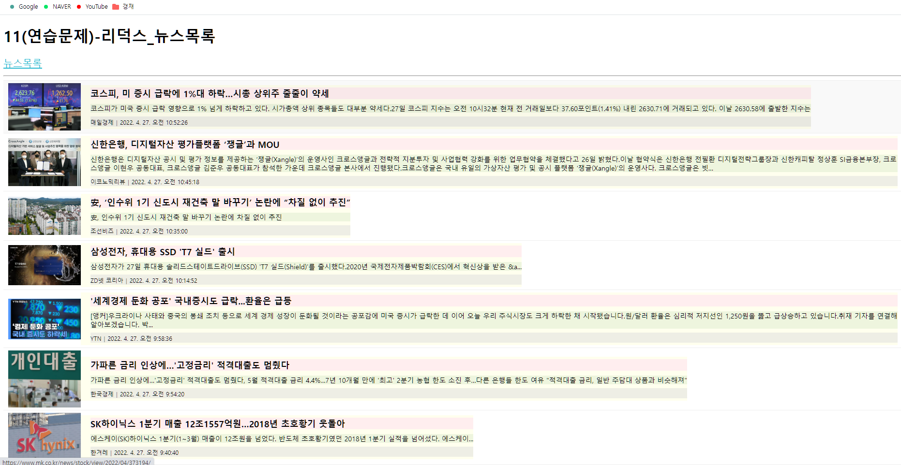

# 구현 코드
## src/index.js
```js
import React from "react";
import ReactDOM from "react-dom/client";
import App from "./App";
import { BrowserRouter } from "react-router-dom";

/** 리덕스 구성을 위한 참조 */
import { Provider } from "react-redux";
import store from "./Store";

const root = ReactDOM.createRoot(document.getElementById("root"));
root.render(
  <React.StrictMode>
    <Provider store={store}>
      <BrowserRouter>
        <App />
      </BrowserRouter>
    </Provider>
  </React.StrictMode>
);
```

## src/App.js
```js
import React from "react";
import { Routes, Route } from 'react-router-dom';

import MenuLink from "./components/MenuLink";
import News from "./pages/News";

const App = () => {
  return (
    <div>
      <h1>11(연습문제)_리덕스_뉴스목록</h1>

      <nav>
        <MenuLink to="/news">뉴스목록</MenuLink>
      </nav>
      <hr />
      <Routes>
        <Route path="/news" element={<News />} />
      </Routes>
    </div>
  );
};

export default App;
```

## src/Slice/NewsSlice.js
```js
import { createSlice, createAsyncThunk } from "@reduxjs/toolkit";
import axios from 'axios';

export const getList = createAsyncThunk("news/getList", async (payload, { rejectWithValue }) => {
  let result = null;

  try {
    result = await axios.get('http://localhost:3001/news');
  } catch (err) {
    result = rejectWithValue(err.response);
  }

  return result;
});

const newsSlice = createSlice({
  name: "news",
  initialState: {
    data: null,       // Ajax 처리를 통해 수신된 데이터
    loading: false,   // 로딩 여부
    error: null       // 에러정보
  },
  reducers: {},
  extraReducers: {
    [getList.pending]: (state, { payload }) => {
      return { ...state, loading: true }
    },
    [getList.fulfilled]: (state, { payload }) => {
      return {
        data: payload?.data,
        loading: false,
        error: null
      }
    },
    [getList.rejected]: (state, { payload }) => {
      return {
        data: payload?.data,
        loading: false,
        error: {
          code: payload?.status ? payload.status : 500,
          message: payload?.statusText ? payload.statusText : 'Server Error'
        }
      }
    }
  },
});

export default newsSlice.reducer;
```

## src/Store.js
```js
import { configureStore } from "@reduxjs/toolkit";
import newsSlice from "./Slice/NewsSlice";

const Store = configureStore({
  reducer: {
    news: newsSlice,
  },
  devTools: true,
});

export default Store;
```

## src/pages/News.js
```js
import React from 'react';
import Spinner from '../components/Spinner';
import NewsItem from '../components/NewsItem';
import styled from 'styled-components';

import { useSelector, useDispatch } from 'react-redux';
import { getList } from '../Slice/NewsSlice';


const ListContainer = styled.ul`
  list-style: none;
  padding: 0;
  margin: 0;
  width: 100%;
  box-sizing: border-box;
  display: flex;
  flex-direction: column;
  margin-bottom: 30px;
`;

const News = () => {
  React.useEffect(() => console.clear(), []);

  const { data, loading, error } = useSelector((state) => state.news);

  const dispatch = useDispatch();

  React.useEffect(() => {
    dispatch(getList());
  }, [dispatch]);

  return (
    <div>
      <Spinner visible={loading} />
      {error ? (
        <div>
          <h1>Oops~!!! {error.code} Error.</h1>
          <hr />
          <p>{error.message}</p>
        </div>
      ) : (
        <ListContainer>
           {data && data.map((v, i) => <NewsItem key={i} item={v} />)}
        </ListContainer>
      )}
    </div>
  );
};

export default React.memo(News);
```
<br/>

# 구현결과

