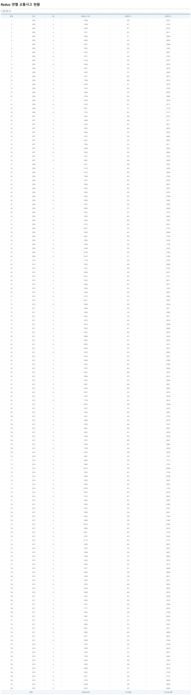
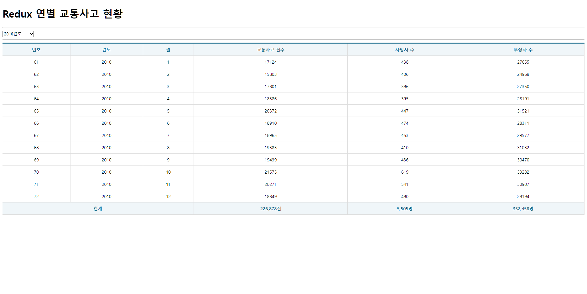

# 연별 교통사고 현황

# 구현 코드

## index.js
```js
import React from "react";
import ReactDOM from "react-dom/client";
import App from "./App";
import { Provider } from "react-redux";
import store from "./Store";

const root = ReactDOM.createRoot(document.getElementById("root"));
root.render(
  <React.StrictMode>
    <Provider store={store}>
      <App />
    </Provider>
  </React.StrictMode>
);
```
## App.js
```js
import React, { memo } from 'react';
import CarCrash from './pages/CarCrash';

const App = memo(() => {
  return (
      <CarCrash />
  );
});

export default App;
```
## Store.js
```js

```
## CarCrashSlice.js
```js
import { createSlice, createAsyncThunk } from "@reduxjs/toolkit";
import axios from 'axios';

export const getList = createAsyncThunk('carCrash/getList', async (payload, { rejectWithValue }) => {
  
  let result = null;
  try {
    result = await axios.get('http://localhost:3001/traffic_acc', {
      params: payload
    });
    if (result.data.faultInfo !== undefined) {
      const err = new Error();
      err.response = {status: 500, statusText: result.data.faultInfo.message};
      throw err;
    }
  } catch (err) {
    result = rejectWithValue(err.response);
  }

  return result;
});

const CarCrashSlice = createSlice({
  name: 'carCrash',
  initialState: {
    data: null,
    loading: false,
    error: null
  },
  reducers: {},
  extraReducers: {
    [getList.pending]: (state, { payload }) => {
      return { ...state, loading: true }
    },
    [getList.fulfilled]: (state, { payload }) => {
      return {
        data: payload?.data,
        loading: false,
        error: null
      }
    },
    [getList.rejected]: (state, { payload }) => {
      return {
        data: payload?.data,
        loading: false,
        error: {
          code: payload?.status ? payload.status : 500,
          message: payload?.statusText ? payload.statusText : 'Server Error'
        }
      }
    }
  },
});

export default CarCrashSlice.reducer;
```
## CarCrash.js
```js
import React, { memo, useCallback, useState } from "react";
import Spinner from "../components/Spinner";
import Table from "../components/Table";
import ErrorView from "../components/ErrorView";

import { useDispatch, useSelector } from "react-redux";
import { getList } from "../slices/CarCrashSlice";

const CarCrash = memo(() => {
  React.useEffect(() => console.clear(), []);

  const { data, loading, error } = useSelector((state) => state.carCrash);
  const dispatch = useDispatch();

  const [year, setYear] = useState();

  React.useEffect(() => {
    dispatch(getList({ year: year }));
  }, [dispatch, year]);

  const selectYear = useCallback((e) => {
    e.preventDefault();
    const current = e.target;
    const value = current[current.selectedIndex].value;
    setYear(value);
  }, []);

  return (
    <div>
      <Spinner visible={loading} />
      <h1>Redux 연별 교통사고 현황</h1>
      <hr />
      <select name="year" onChange={selectYear}>
        <option value="">-- 년도 선택 --</option>
        {[...new Array(2018 - 2005 + 1)].map((v, i) => <option key={i} value={2005 + i}>{2005 + i}년도</option>)}
      </select>
      <hr />
      {error ? (
        <ErrorView error={error} />
      ) : (
        <Table>
          <thead>
            <tr>
              <th>번호</th>
              <th>년도</th>
              <th>월</th>
              <th>교통사고 건수</th>
              <th>사망자 수</th>
              <th>부상자 수</th>
            </tr>
          </thead>
          <tbody>
            {data &&
              data.map(({ id, year, month, accident, death, injury }) => {
                return (
                  <tr key={id}>
                    <td>{id}</td>
                    <td>{year}</td>
                    <td>{month}</td>
                    <td>{accident}</td>
                    <td>{death}</td>
                    <td>{injury}</td>
                  </tr>
                );
              })}
          </tbody>
          <tfoot>
            <tr>
              <th colSpan={3}>합계</th>
              <th>{data && data.map((v) => v.accident).reduce((p, c) => p + c, 0).toLocaleString()}건</th>
              <th>{data && data.map((v) => v.death).reduce((d, c) => d + c, 0).toLocaleString()}명</th>
              <th>{data && data.map((v) => v.injury).reduce((d, c) => d + c, 0).toLocaleString()}명</th>
            </tr>
          </tfoot>
        </Table>
      )}
    </div>
  );
});

export default CarCrash;
```
<br/>

# 구현 결과



