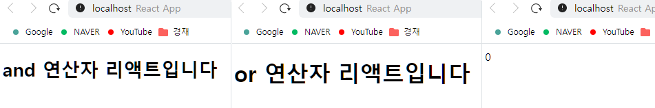

# 리액트

```
* JS 프레임워크들
 Angular (구글 제공, 너무 어려워져서 이용율 하락)
 Vue (중국 지지 발언으로 이용율 하락)
 React (페이스북 제공, 현재 최고, 프레임워크가 아닌 라이브러리)
 Svelte (요즘 뜨고 있는중)

* MVC
 Model: Data(DB)
 View: 화면
 Controller: Data 화면 출력처리
```

## - 리액트 이해

```
- 프레임워크들은 주로 MVC, MVVM 아키텍처를 사용하지만, 리액트는 오직 View만 신경 쓰는 라이브러리이다.
- 특정 부분이 어떻게 생길지 정하는 선언체가 있는데 이를 컴포넌트라고 하고, 컴포넌트는 재사용이 가능한 API이다.
- 사용자 화면에 뷰(DOM)를 보여주는 것을 렌더링이라고 한다.
```

```
* 초기 렌더링
- 맨 처음에 어떻게 보일지를 정하는 초기 렌더링, 리엑트에서는 render함수가 있다.
- 뷰가 어떻게 생겼고 어떻게 작동하는지에 대한 정보를 지닌 객체(JSX)를 반환한다.
- 컴포넌트 내부에는 또 다른 컴포넌트들이 들어갈 수 있다.
- reder 함수를 실행하면 그 내부에 있는 컴포넌트들도 재귀적으로 렌더링 한다.
```

```
* 조화 과정
- 리액트에서 중요한 부분인 업데이트(화면 갱신)은 컴포넌트에서 데이터에 변화가 있을 때 화면이 바뀌는 것처럼 보이지만,
새로운 객체를 만들어 갈아 끼워버린다. (render 함수가 담당)
```

<hr  style="border-color: #82645c;"/>
<br/>
<div style="page-break-after: always;"></div>

# 리액트의 특징

## - Virtual DOM

```
* DOM이란?
- DOM은 Document Object Model의 약어, 객체로 문서 구조를 표현하는 방법으로 XML이나 HTML로 작성한다.
- Tag에 의한 구조 표현이라고 한다.
- DOM의 치명적인 단점은 동적 UI에 최적화되어있지 않다는 것인데, 이는 JS를 사용하여 동적으로 만들 수 있다.
- 규모가 큰 웹 애플리케이션에서 DOM에 직접 접근하여 변화를 주다 보면 성능 이슈가 발생한다.
- 웹 브라우저에서 DOM에 변화가 일어나면 CSS를 다시 연산하고, 레이아웃을 구성하여 화면을 갱신한다. 이 과정에서 시간이 많이 소비된다.
- DOM을 조작할 때마다 엔진이 웹 페이지를 새로 그리기에 업데이트가 잦으면 성능이 저하될 수 있다.
- 화면 갱신을 최적화하기 위해 적절한 시점에 코드 동작이 중요하다. 이를 위해 useEffect 사용 권장.
- DOM을 최소한으로 조작하는 작업을 처리하는 방식을 개선한게 Virtual DOM이다.
```

```
* Virtual DOM
- 실제 DOM에 접근하여 조작하는 대신, 이를 추상화한 자바스크립트객체를 구성해서 사용한다. 메모리에 복사한 DOM의 가벼운 사본과 비슷.
- 지속적으로 데이터가 변화하는 대규모 애플리케이션을 구축하기 위해 적합하다.
- 최소한으로 연산하여 두 가지 뷰를 비교한 후, DOM 업데이트를 한다.
```


<hr  style="border-color: #82645c;"/>
<br/>
<div style="page-break-after: always;"></div>

# 설치

```
* Node.js
- ES6 -> ES5를 호환 시켜주는 babel, 모듈화된 코드들 합치고, 리로딩하는 webpack등 주요 도구들이 Node를 사용하기에 설치한다.
- 설치시 자동 설치되는 npm으로 패키지의 버전을 관리 할 수 있다.
- npm install -g yarn 으로 조금 더 진보된 yarn 사용가능.

* VSCode(코드 에디터) 설치
- 확장 프로그램 ESLink(자바 스크립트 문법 및 코드 스타일 검사 도구) 설치 추천
- 설치 후 터미널에서 npm install -g eslint 실행

* git 설치

* react 프로젝트 설치하는 방법
- 터미널에서 yarn create react-app 000 입력 (프로젝트이름 대문자 불가)
- 실행시에는 yarn start
```

<hr  style="border-color: #82645c;"/>
<br/>

# JSX

```
- 프로젝트 생성시 node_modules 디렉터리에 react 모듈이 설치된다.
- import 구문을 통해 리액트를 불러와서 사용할 수 있다.
- 분할된 JS파일을 import해서 조립, 번들러(대표적으로 webpack)으로 병합하여 웹페이지에 표시.
- 바벨이라는 도구를 사용해서 ES6 -> ES5 문법으로 변환해 준다.

(Node용)ES6로 작성 -> 병합(webpack) -> 변환(바벨) -> ES5(웹 브라우저용)
```

```
- JSX는 자바스크립트의 확장 문법이며 XML과 매우 비슷하다.
- 공식적인 자바스크립트 문법은 아니고, 개발자들이 임의로 만든 문법이다.
- 보통 여러줄일 경우 ()로 감싸준다. 필수는 아니다.
```

#### * function 키워드로 컴포넌트를 만들었는데, 이런 컴포넌트를 함수 컴포넌트라고 한다.

```js
function App() {
  return <div></div>;
}
```
<div style="page-break-after: always;"></div>

#### * 렌더링시 바벨을 통해 일반 JS 코드로 변환되는데 이는 아래와 같다.

```js
// 변환 전
function App() {
  return (
    <div>
      Hello <b>react</b>
    </div>
  );
}
```

```js
// 변환 후
function App() {
  return React.createElement(
    "div",
    null,
    "Hello ",
    React.createElement("b", null, "react")
  );
}
```
## - JSX 문법

#### * 컴포넌트에 여러 요소가 있다면 반드시 부모 요소 하나로 감싸야 한다.

```js
// 부모요소 하나 아님
function App() {
    return (
        <h1>리액트 안녕!</h1>
        <h2>잘 작동하니?</h2>
)
```

```js
// 부모요소 하나
function App() {
    return (
        <div>
            <h1>리액트 안녕!</h1>
            <h2>잘 작동하니?</h2>
        </dvi>
)
```
<div style="page-break-after: always;"></div>

```js
// div는 <></>로 대체 가능
function App() {
    return (
        <>
            <h1>리액트 안녕!</h1>
            <h2>잘 작동하니?</h2>
        </>
)
```


#### * JS 표현식은 { }로 감싸서 사용할 수 있다.

```js
function App() {
  const name = "리액트";
  return (
    <>
      <h1>{name} 안녕!</h1>
      <h2>잘 작동하니?</h2>
    </>
  );
}
export default App;
```


<div style="page-break-after: always;"></div>

#### * if문 대신에 { } 안에 삼항 연산자를 사용하면 된다.

```js
// 값 true면 앞의 내용을 출력
import React from "react";

function App() {

  const name = "리액트";
  return (
    <div>
      {name === "리액트" ? <h1>리액트입니다.</h1> : <h2>리액트가 아닙니다.</h2>}
    </div>
  );
}

export default App;
```

```js
// 값이 false면 뒤의 내용을 출력
import React from "react";

function App() {

  const name = "리액트아님";

  return (
    <div>
      {name === "리액트" ? <h1>리액트입니다.</h1> : <h2>리액트가 아닙니다.</h2>}
    </div>
  );
}

export default App;
```


<div style="page-break-after: always;"></div>

#### * and연산자(&&) 와 or연산자(||) 를 사용한 조건부 렌더링

```js
// && 연산자 조건이 거짓인 경우 표시되는 내용 없음.
import React from "react";

function App() {
  const name = "리액트";

  return (
    <div>{name === "리액트" && <h1>and 연산자 리액트입니다</h1>}</div>
  );
}

export default App;
```

```js
// || 연산자 조건이 참인 경우 표시되는 내용 없음.
import React from "react";

function App() {
  const name = "트액리";

  return (
    <div>{name == "리액트" || <h1>or 연산자 리액트입니다</h1>}</div>
  );
}
export default App;
```

```js
// 조건이 0일 경우 예외적으로 화면에 나타난다.
import React from "react";

function App() {
  const number = 0;

  return (
    <div>{number && <h1>리액트입니다</h1>}</div>
  );
}

export default App;
```


<br/>


#### * 인라인 스타일링
```
- 리액트 DOM 요소에 스타일을 적용할 시 문자열 형태가 아닌 객체 형태로 넣어주어야 한다.
- 카멜 케이스로 작성한다. (font-size => fontSize)
- 객체 선언 없이 DOM 요소에 바로 스타일을 적용하고 싶다면, {{ }}처럼 2중으로 작성한다.
```

#### * class값은 className을 사용한다.
```
JSX는 문법은 결국 JS문법으로 변경되기 때문에 class와 충돌, 작성 시 className으로 작성해야 한다.
class로 작성해도 작동은 되지만 경고 알람이 생긴다.
```

#### * 태그 닫아주기
```
<input></input> 혹은
<input /> 으로 꼭 태그를 닫아주어야 한다. (self-closing 태그)
```

#### * JSX내부 주석은 {/* */} 사용
```
JSX 내부 중 태그 안에서는 기존과 같이 // 주석을 사용할 수 있지만
태그 밖에서는 {/* */} 형식으로 주석을 사용해 주어야 한다.
```

<hr  style="border-color: #82645c;"/>
<br/>
<div style="page-break-after: always;"></div>