# ref

```
- ref(reference) 프로그램에서 변수간의 참조관계를 레퍼런스라고 한다.

- 리액트 프로젝트 내부에서 DOM에 이름을 다는 방법

- 리액트 컴포넌트 안에서는 중복의 우려가 있기에 id 사용을 권장하지 않는다.

- DOM을 직접적으로 건드려야 할 때 사용한다.

- state만으로 해결할 수 없을 때 DOM에 직접적으로 접근하기 위해 ref를 사용한다.
    • 특정 input에 포커스 주기
    • 스크롤 박스 조작하기
    • Canvas 요소에 그림 그리기 등
```

## - ref 사용

```
- React.useRef() 함수를 사용한다. 사용 예시는 아래 예제 코드 참조.
    'ref 참조변수.current`는 일반 JS HTMLElement 객체와 동일하다.
```

```css
/* CSS */
.success {
  background-color: lightgreen;
}
.failure {
  background-color: lightcoral;
}
```

```js
/*  button 클릭시 입력한 password값이 0000이 맞으면 배경색이 green, 아니면 coral로 변경되는 예제이다.
    ref 적용으로 button 클릭시 포커스가 input으로 설정 되었다. */

import React, { useState } from "react";
import "./ValidationSample.css";

const ValidationSample = () => {
  const [password, setPassword] = useState("");
  const [clicked, setClicked] = useState(false);
  const [validated, setValidated] = useState(false);
  const input = React.useRef(); // 1. 컴포넌트 내부에서 변수로 React.useRef()를 담아 주어야 한다.

  const handleChange = (e) => {
    setPassword(e.target.value);
  };

  const handleButtonClick = () => {
    setClicked(true);
    setValidated(password === "0000");
    input.current.focus(); // 3. ref 설정한 DOM에 접근시 input.current를 조회하면 된다.
  };

  return (
    // 2. 해당 변수를 ref를 달고자 하는 요소에 ref props로 넣어 주면 ref 설정 완료.
    <div>
      <input
        type="password"
        value={password}
        onChange={handleChange}
        ref={input}
        // 삼항 연산자속 삼항 연산자
        className={clicked ? (validated ? "success" : "failure") : ""}
      />
      <button onClick={handleButtonClick}>검증하기</button>
    </div>
  );
};

export default ValidationSample;
```

```js
// App.js
import React from "react";
import ValidationSample from "./ValidationSample";

function App() {
  return <ValidationSample />;
}

export default App;
```

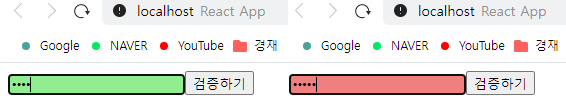

## - 컴포넌트에 ref 달기

```
- 컴포넌트 내부에 있는 DOM을 컴포넌트 외부에서 사용할 때 사용한다.

- 컴포넌트 내부에서 DOM에 직접 접근해야 할 때는 ref를 사용한다.
  먼저 ref를 사용 안 해도 원하는 기능을 구현 가능한지 고려 후에 활용한다.

- 다른 컴포넌트끼리 데이터를 교류할 때의 ref 사용은 잘못 사용된 것이다.
  사용은 가능하나, 이 방법은 리액트 사상에 어긋난 설계이다.
  컴포넌트끼리 데이터를 교류할 때는 언제나 데이터를 부모 ↔ 자식 흐름으로 교류한다.
```

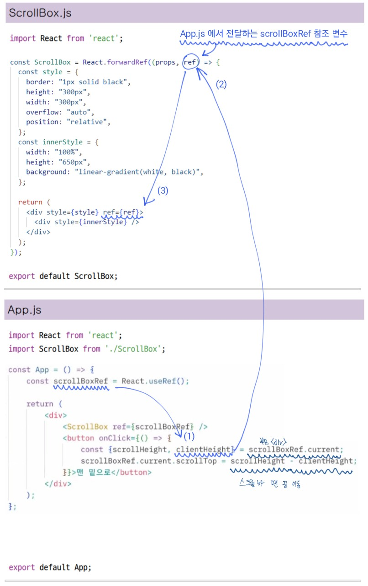
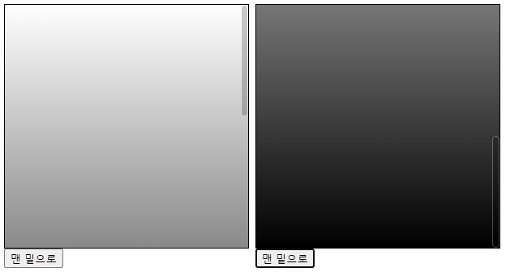

# 컴포넌트 반복

## - JS 배열의 map() 함수

```
- 자바스크립트 배열 객체의 내장 함수인 map 함수를 사용하여 반복되는 컴포넌트를 렌더링 할 수 있다.

- 문법
  arr.map(callback, [thisArg])

  이 함수의 파라미터는 다음과 같습니다.
  • callback: 새로운 배열의 요소를 생성하는 함수로 파라미터는 다음 세 가지입니다.
    - currentValue: 현재 처리하고 있는 요소
    - index: 현재 처리하고 있는 요소의 index 값
    - array: 현재 처리하고 있는 원본 배열
  • thisArg(선택 항목): callback 함수 내부에서 사용할 this 레퍼런스
```

```js
/*  <li>…</li> JSX 코드로 된 배열을 새로 생성한 후 nameList에 담는다.
    map 함수에서 JSX를 작성할 때는 아래 예제처럼 DOM 요소를 작성해도 되고, 컴포넌트를 사용해도 된다. */
import React from "react";

const IterationSample = () => {
  const names = ["눈사람", "얼음", "눈", "바람"];
  const nameList = names.map((name) => <li>{name}</li>);
  return <ul>{nameList}</ul>;
};

export default IterationSample;
```

```js
// App.js
import React from "react";
import IterationSample from "./IterationSample";

const App = () => {
  return <IterationSample />;
};

export default App;
```

`렌더링이 잘 되었으나 경고 메세지가 뜬다.`
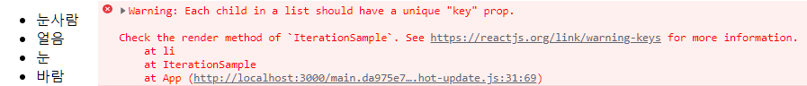

## - key

```
- key는 컴포넌트 배열을 렌더링했을 때 어떤 원소에 변동이 있었는지 알아내려고 사용한다.

- key 값을 설정할 때는 map 함수의 인자로 전달되는 함수 내부에서 컴포넌트 props를 설정하듯이 설정한다.

- key 값은 언제나 유일해야 하며, 데이터가 가진 고윳값을 key 값으로 설정한다.

- 고유번호가 없을 경우 map() 함수에 전달되는 index 값을 사용한다.

- 컴포넌트 배열을 렌더링할 때는 key 값 설정에 항상 주의해야 한다.
  상태 안에서 배열을 변형할 때는 배열에 직접 접근하여 수정하는 것이 아니라 concat, filter 등의
  배열 내장 함수를 사용하여 새로운 배열을 만든 후 이를 새로운 상태로 설정해야 한다.
```

```js
// key값 부여
import React from "react";

const IterationSample = () => {
  const names = ["눈사람", "얼음", "눈", "바람"];
  const nameList = names.map((name, index) => <li key={index}>{name}</li>);
  return <ul>{nameList}</ul>;
};

export default IterationSample;
```

#### \* concat을 사용한 데이터 추가

```
- push 함수는 기존 배열 자체를 변경해 주는 반면, concat은 새로운 배열을 만들어 준다.

- 리액트에서 상태를 업데이트할 때는 기존 상태를 그대로 두면서 새로운 값을 상태로 설정해야 한다.
  이를 불변성 유지라고 하는데, 불변성 유지를 지켜주는게 리액트의 규칙중 하나이다.
```

```js
// concat을 사용하여 버튼 클릭 시 배열 추가
import React, { useState } from "react";

const IterationSample = () => {
  const [names, setNames] = useState([
    { id: 1, text: "눈사람" },
    { id: 2, text: "얼음" },
    { id: 3, text: "눈" },
    { id: 4, text: "바람" },
  ]);
  const [inputText, setInputText] = useState("");
  const [nextId, setNextId] = useState(5); // 새로운 항목을 추가할 때 사용할 id
  const onChange = (e) => setInputText(e.target.value);

  const onClick = () => {
    const nextNames = names.concat({
      id: nextId, // nextId 값을 id로 설정하고
      text: inputText,
    });
    setNextId(nextId + 1); // nextId 값에 1을 더해 준다.
    setNames(nextNames); // names 값을 업데이트한다.
    setInputText(""); // inputText를 비운다.
  };

  const namesList = names.map((name) => <li key={name.id}>{name.text}</li>); // key값 설정

  return (
    <>
      <input value={inputText} onChange={onChange} />
      <button onClick={onClick}>추가</button>
      <ul>{namesList}</ul>
    </>
  );
};

export default IterationSample;
```

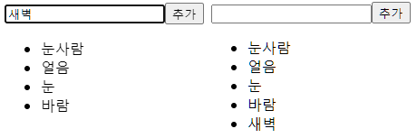

#### \* filter를 사용한 데이터 제거 기능

```js
// filter 함수로 특정 배열에서 특정 원소 제외하기
import React, { useState } from "react";

const IterationSample = () => {
  const [names, setNames] = useState([
    { id: 1, text: "눈사람" },
    { id: 2, text: "얼음" },
    { id: 3, text: "눈" },
    { id: 4, text: "바람" },
  ]);

  const [inputText, setInputText] = useState("");
  const [nextId, setNextId] = useState(5); // 새로운 항목을 추가할 때 사용할 id
  const onChange = (e) => setInputText(e.target.value);

  const onClick = () => {
    const nextNames = names.concat({
      id: nextId, // nextId 값을 id로 설정하고
      text: inputText,
    });
    setNextId(nextId + 1); // nextId 값에 1을 더해 준다.
    setNames(nextNames); // names 값을 업데이트한다.
    setInputText(""); // inputText를 비운다.
  };

  const onRemove = (id) => {
    const nextNames = names.filter((name) => name.id !== id);
    setNames(nextNames);
  };

  const namesList = names.map((name) => (
    <li key={name.id} onDoubleClick={() => onRemove(name.id)}>
      {name.text}
    </li>
  ));

  return (
    <>
      <input value={inputText} onChange={onChange} />
      <button onClick={onClick}>추가</button>
      <ul>{namesList}</ul>
    </>
  );
};

export default IterationSample;
```

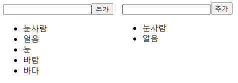

# hooks

```
함수형 컴포넌트에서도 상태 관리를 할 수 있는 useState,
렌더링 직후 작업을 설정하는 useEffect 등의 기능을 제공한다.
```

## - useState

```
- 가장 기본적인 Hook이며, 함수 컴포넌트에서도 가변적인 상태를 지닐 수 있게 해 준다.

- 하나의 useState 함수는 하나의 상태 값만 관리할 수 있다.
  컴포넌트에서 관리해야 할 상태가 여러 개 라면 useState를 여러 번 사용하면 된다.
```

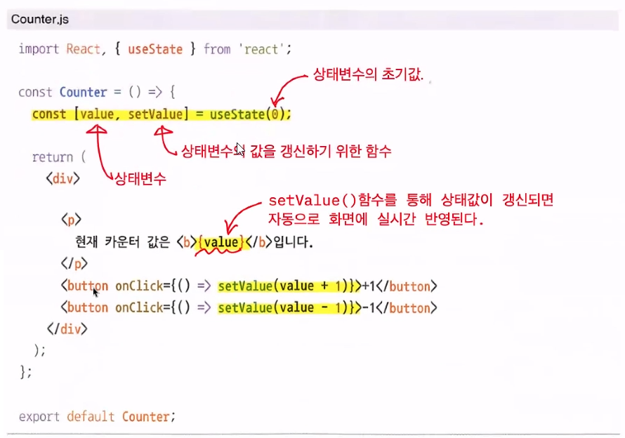
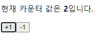

#### \* useState 여러번 사용하기

```js
// useState를 여러 번 사용하기
import React, { useState } from "react";

const Info = () => {
  const [name, setName] = useState("");
  const [nickname, setNickname] = useState("");
  const onChangeName = (e) => {
    setName(e.target.value);
  };
  const onChangeNickname = (e) => {
    setNickname(e.target.value);
  };

  return (
    <div>
      <div>
        <input value={name} onChange={onChangeName} />
        <input value={nickname} onChange={onChangeNickname} />
      </div>
      <div>
        <div>
          <b>이름:</b> {name}
        </div>
        <div>
          <b>닉네임:</b> {nickname}
        </div>
      </div>
    </div>
  );
};

export default Info;
```

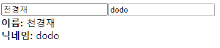

```js
//App.js
import Info from "./Info";

const App = () => {
  return <Info />;
};

export default App;
```

## - useEffect

```
- 컴포넌트가 렌더링될 때마다 특정 작업을 수행하도록 설정 할 수 있다.

- 컴포넌트가 화면을 맨 처음 렌더링 할 때만 실행되게 하려면, 두번째 파라미터에 [] 빈 배열을 넣어 주면 된다.

- 특정 값이 업데이트될 때만 실행되게 하려면, 두 번째 파라미터에 검사하고 싶은 값을 넣어 주면 된다.
  배열 안에는 useState 관리하는 상태 값을 넣어도 되고, props로 전달받은 값을 넣어도 된다.

- 언마운트되기 전이나 업데이트되기 직전에 어떠한 작업을 수행하고 싶다면, 뒷정리(cleanup) 함수를 반환해 주어야 한다.
  만약에 오직 언마운트 될 때만 뒷정리 함수를 호출 하고 싶다면 useEffect 두번째 파라미터에 [] 빈 배열을 넣어주면 된다.
```

```js
// useEffect 적용
import { useState, useEffect } from "react";

const Info = () => {
  const [name, setName] = useState("");
  const [nickname, setNickname] = useState("");

  useEffect(() => {
    console.log("렌더링이 완료되었습니다!");
    console.log({
      name,
      nickname,
    });
  });
  const onChangeName = (e) => {
    setName(e.target.value);
  };
  const onChangeNickname = (e) => {
    setNickname(e.target.value);
  };

  return (
    <div>
      <div>
        <input value={name} onChange={onChangeName} />
        <input value={nickname} onChange={onChangeNickname} />
      </div>
      <div>
        <div>
          <b>이름:</b> {name}
        </div>
        <div>
          <b>닉네임:</b> {nickname}
        </div>
      </div>
    </div>
  );
};

export default Info;
```

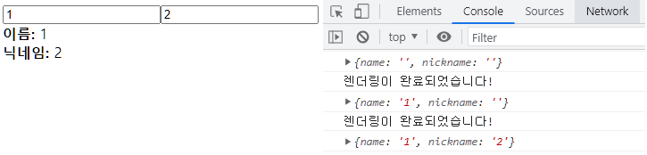

#### \* 화면을 맨 처음 렌더링 할 때만 실행하기

```js
// useEffect에 [](빈 배열) 넣기
useEffect(() => {
  console.log("마운트될 때만 실행됩니다.");
}, []);
```

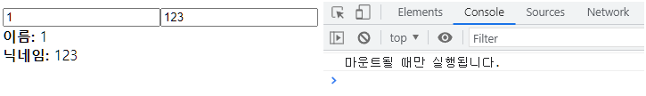

#### \* 특정 값이 업데이트될 때만 실행하기

```js
// useEffect에 [상태값 혹은 props] 넣기
useEffect(() => {
  console.log(name);
}, [name]);
```

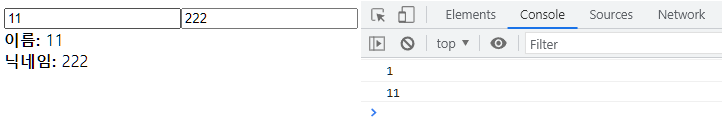

#### \* 언마운트 되거나, 업데이트되기 전 작업 실행 (뒷정리 함수)

```js
useEffect(() => {
  console.log("effect");
  console.log(name);
  // 컴포넌트가 언마운트 되거나, 업데이트되기 전, 리턴 속 구문이 실행된다. (cleanup)
  return () => {
    console.log("cleanup");
    console.log(name);
  };
}, [name]);

/** 만약 언마운트 될 때만 뒷정리 함수를 호출 하고 싶다면,
 *  useEffect 두번째 파마리터에 [] 빈 배열을 넣으면 된다. */
```

#### \* App 컴포넌트에서 Info 컴포넌트의 가시성 바꾸기

```js
import React, { useState } from "react";
import Info from "./Info";

const App = () => {
  const [visible, setVisible] = useState(false);

  return (
    <div>
      <buttonn
        onClick={() => {
          setVisible(!visible);
        }}
      >
        {visible ? "숨기기" : "보이기"}
      </buttonn>
      <hr />
      {visible && <Info />}
    </div>
    // CSS의 display속성을 제어하는게 아니라 실제로 DOM 자체가 생겼다가, 없어졌다가를 반복함
  );
};

export default App;
```

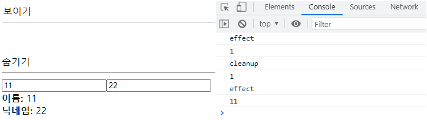

## - useReducer

```
- useReducer는 useState보다 더 다양한 컴포넌트 상황에 따라
  다양한 상태를 다른 값으로 업데이트해 주고 싶을 때 사용하는 Hook이다.

- 리듀서는 현재 상태, 그리고 업데이트를 위해 필요한 정보를 담은 액션(action) 값을 전달받아
  새로운 상태를 반환하는 함수이다. 리듀서 함수에서 새로운 상태를 만들 때는 반드시 불변성(복사본 활용 상태값 갱신)을 지켜 주어야 한다.

- useReducer의 첫 번째 파라미터에는 리듀서 함수를 넣고, 두 번째 파라미터에는 해당 리듀서의 기본값을 넣어 준다.
  state는 현재 가리키고 있는 상태고, dispatch는 액션을 발생시키는 함수이다.
  dispatch(action)과 같은 형태로, 함수안에 파라미터로 액션 값을 넣어 주면 리듀서 함수가 호출되는 구조이다.
  가장 큰 장점은 컴포넌트 업데이트 로직을 컴포넌트 바깥으로 빼낼 수 있다는 것이다.
```

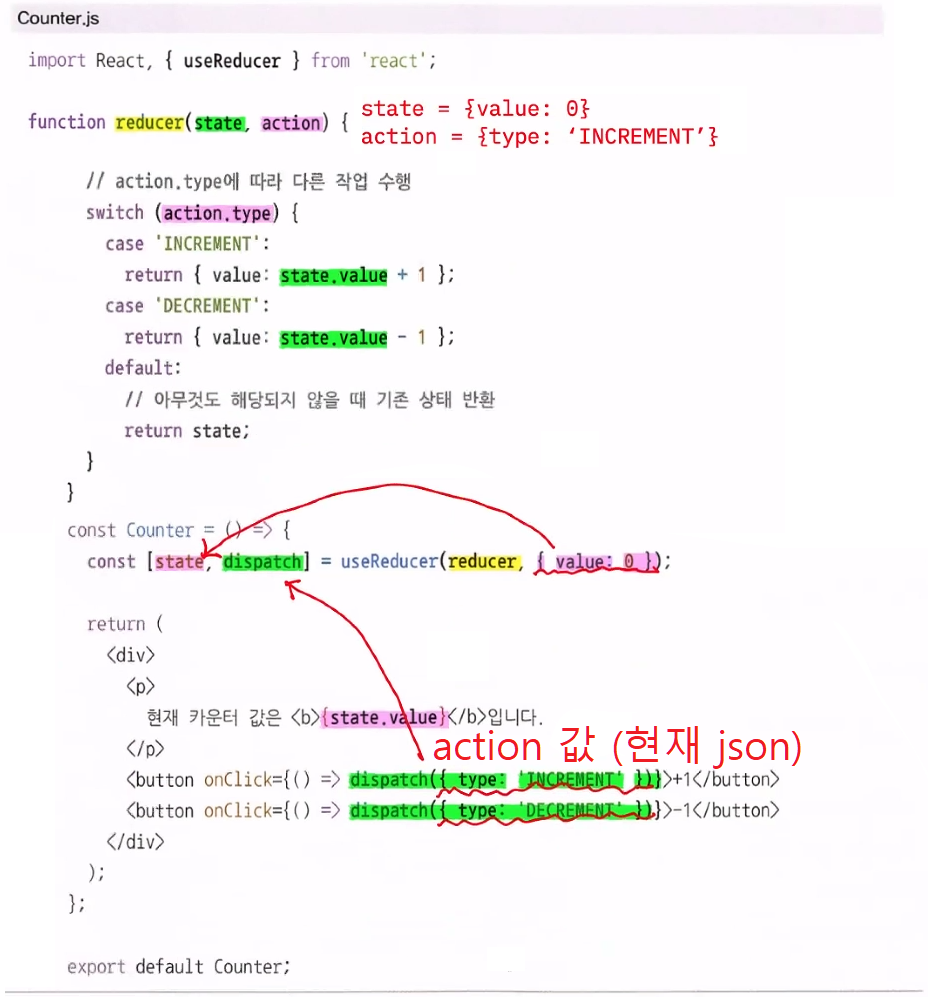


```js
// App.js
import Counter from "./Counter";

const App = () => {
  return <Counter />;
};

export default App;
```

#### \* 리듀서를 활용하여 인풋 상태 관리해 보기

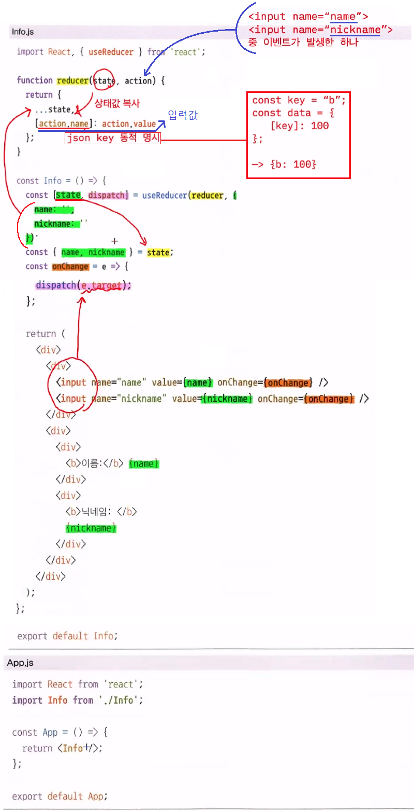
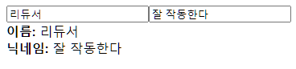

## - useMemo

```
- 함수 컴포넌트 내부에서 발생하는 연산을 최적화할 수 있다.

- 렌더링할 때마다 계산하는 것은 낭비이다. 렌더링하는 과정에서 특정 값이 바뀌었을 때만 연산을 실행하고,
  원하는 값이 바뀌지 않았다면 이전에 연산했던 결과를 다시 사용하는 방식이다.
```

`useMemo 미적용`
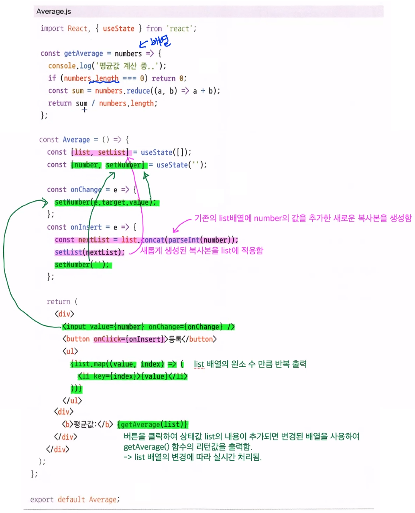
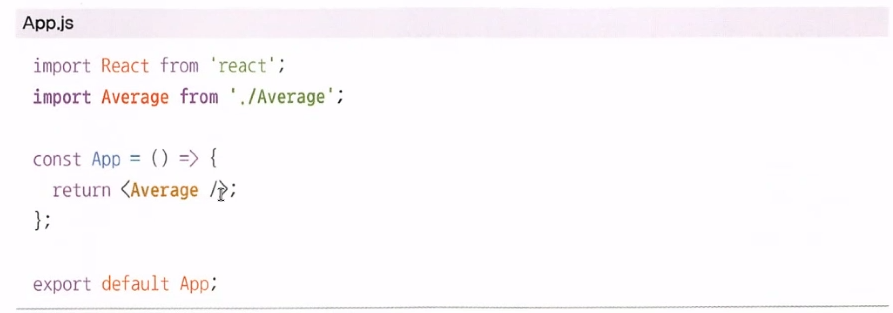
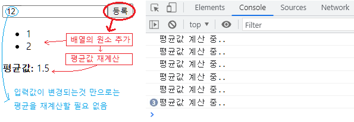

`useMemo 적용`

```js
import { useState, useMemo } from "react";

const getAverage = (numbers) => {
  console.log("평균값 계산 중..");
  if (numbers.length === 0) return 0;
  const sum = numbers.reduce((a, b) => a + b);
  return sum / numbers.length;
};

const Average = () => {
  const [list, setList] = useState([]);
  const [number, setNumber] = useState("");
  const onChange = (e) => {
    setNumber(e.target.value);
  };

  const onInsert = () => {
    const nextList = list.concat(parseInt(number));
    setList(nextList);
    setNumber("");
  };

  // 상태값이 list가 변경되었을 때만 getAverage()를 호출함
  const avg = useMemo(() => getAverage(list), [list]);

  return (
    <div>
      <input value={number} onChange={onChange} />
      <button onClick={onInsert}>등록</button>
      <ul>
        {list.map((value, index) => (
          <li key={index}>{value}</li>
        ))}
      </ul>
      <div>
        <b>평균값:</b> {avg}
      </div>
    </div>
  );
};

export default Average;
```

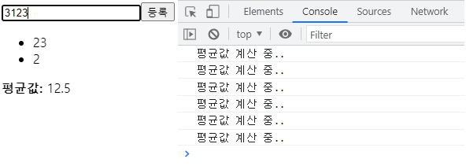

## - useCallback

```
- 렌더링 성능을 최적화해야 하는 상황에서 사용한다.

- 만들어 놨던 함수를 재사용할 수 있다.

- 컴포넌트의 렌더링이 자주 발생하거나 렌더링해야 할 컴포넌트의 개수가 많아지면 이 부분을 최적화해 주는 것이 좋다.

- useCallback의 첫 번째 파라미터에는 생성하고 싶은 함수를 넣고, 두 번째 파라미터에는 배열을 넣으면 된다.
  이 배열에는 어떤 값이 바뀌었을 때 함수를 새로 생성해야 하는지 명시해야 한다. 
  onChange처럼 비어 있는 배열을 넣게 되면 컴포넌트가 렌더링될 때 만들었던 함수를 계속해서 재사용하게 되며, 
  onInsert처럼 배열 안에 number와 list를 넣게 되면 인풋 내용이 바뀌거나 새로운 항목이 추가될 때 새로 만들어진 함수를 사용하게 된다.
  함수 내부에서 상태 값에 의존해야 할 때는 그 값을 반드시 두 번째 파라미터 안에 포함시켜 주어야 한다. 
  예를 들어 onChange의 경우 기존의 값을 조회하지 않고 바로 설정만 하기 때문에 배열이 비어 있어도 상관없지만, 
  onInsert는 기존의 number와 list를 조회해서 nextList를 생성하기 때문에 배열 안에 number와 list를 꼭 넣어 주어야 한다.
```

```js
import { useState, useMemo, useCallback } from "react";

const getAverage = (numbers) => {
  console.log("평균값 계산 중..");
  if (numbers.length === 0) return 0;
  const sum = numbers.reduce((a, b) => a + b);
  return sum / numbers.length;
};

const Average = () => {
  const [list, setList] = useState([]);
  const [number, setNumber] = useState("");
  const onChange = useCallback((e) => {
    setNumber(e.target.value);
  }, []); // 컴포넌트가 처음 렌더링될 때만 함수 생성

  const onInsert = useCallback(() => {
    const nextList = list.concat(parseInt(number));
    setList(nextList);
    setNumber("");
  }, [number, list]); // number 혹은 list가 바뀌었을 때만 함수 생성

  const avg = useMemo(() => getAverage(list), [list]);

  return (
    <div>
      <input value={number} onChange={onChange} />
      <button onClick={onInsert}>등록</button>
      <ul>
        {list.map((value, index) => (
          <li key={index}>{value}</li>
        ))}
      </ul>
      <div>
        <b>평균값:</b> {avg}
      </div>
    </div>
  );
};

export default Average;
```
## - useRef (초반 ref 참조)

## - 커스텀 hook 만들기
```
- 여러 컴포넌트에서 비슷한 기능을 공유할 경우, 이를 Hook으로 만들어 사용 가능하다.
```

