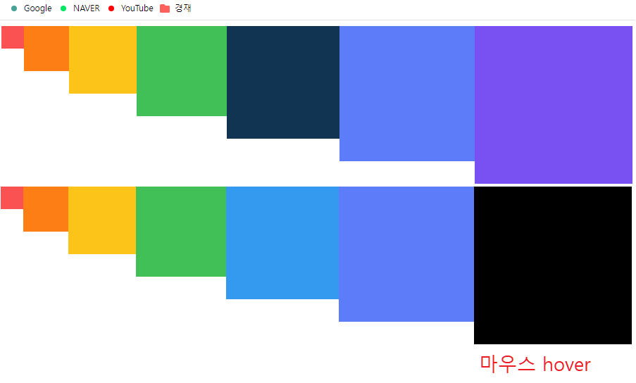
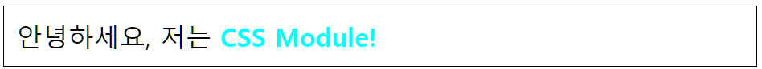
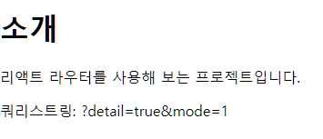
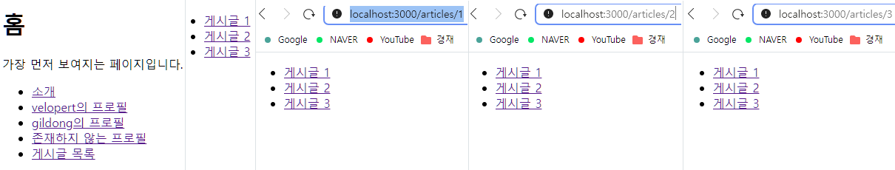

# 컴포넌트 스타일링

```
 •  일반 CSS: 컴포넌트를 스타일링하는 가장 기본적인 방식이다.

 •  Sass: 자주 사용되는 CSS 전처리기(pre-processor)중 하나로
    확장된 CSS 문법을 사용하여 CSS코드를 더욱 쉽게 작성할 수 있도록 해 준다.

 •  CSS Module: 스타일을 작성할 때 CSS 클래스가 다른 CSS 클래스의 이름과
    절대 충돌하지 않도록 파일마다 고유한 이름을 자동으로 생성해 주는 옵션이다.

 •  styled-components: 스타일을 자바스크립트파일에 내장시키는 방식으로
    스타일을 작성함과 동시에 해당 스타일이 적용된 컴포넌트를 만들 수 있게 해 준다.
```

## - 일반 CSS

```
 -  가장 중요한 점은 CSS 클래스를 중복되지 않게 만드는 것이다.
    이름을 지을 때 특별한 규칙을 사용하는 것과 CSS Selector를 활용하는 방법이 있다.
```

## - Sass

```
 -  CSS 전처리기로 복잡한 작업을 쉽게 할 수 있도록 해 주고
    재활용성과 가독성을 높여서 유지 보수를 더욱 쉽게 해 줍니다.

 -  Sass속 sass 문법과 scss 문법의 주요 차이점.
    .sass 확장자는 중괄호({})와 세미콜론(;)을 사용하지 않는다.
    반면 .scss 확장자는 기존 CSS와 문법이 크게 다르지 않다.

 -  설치는 yarn add sass 명령어로 설치하면 된다.
```

```js
// sass, scss 차이 예시
// sass
body
  font: 100% $font-stack
  color: $primary-color
// scss
body {
  font: 100% $font-stack;
  color: $primary-color;
}
```
<div style="page-break-after: always;"></div>

#### \* Sass 예시

```scss
/** SassComponent.scss */
// 변수 사용하기
$red: #fa5252;
$orange: #fd7e14;
$yellow: #fcc419;
$green: #40c057;
$blue: #339af0;
$indigo: #5c7cfa;
$violet: #7950f2;

/* 믹스인 만들기(재사용되는 스타일 블록을 함수처럼 사용할 수있음)
   믹스인(함수)를 호출한 위치엣허 {}안의 스타일 코드가 적용됨 */
@mixin square($size) {
  $calculated: 32px * $size;
  width: $calculated;
  height: $calculated;
}

.SassComponent {
  display: flex;
  .box {
    // 자손 셀렉터이다, .SassComponent .box와 같음
    background: red;
    cursor: pointer;
    transition: all 0.3s ease-in;
    &.red {
      // .box.red와 같음
      background: $red;
      @include square(1);
    }
    &.orange {
      background: $orange;
      @include square(2);
    }
    &.yellow {
      background: $yellow;
      @include square(3);
    }
    &.green {
      background: $green;
      @include square(4);
    }
    &.blue {
      background: $blue;
      @include square(5);
    }
    &.indigo {
      background: $indigo;
      @include square(6);
    }
    &.violet {
      background: $violet;
      @include square(7);
    }
    &:hover {
      // .box에 마우스를 올렸을 때
      background: black;
    }
  }
}
```

```js
/** SassComponent.js */
import "./scss/SassComponent.scss";

const SassComponent = () => {
  return (
    <div className="SassComponent">
      <div className="box red" />
      <div className="box orange" />
      <div className="box yellow" />
      <div className="box green" />
      <div className="box blue" />
      <div className="box indigo" />
      <div className="box violet" />
    </div>
  );
};

export default SassComponent;
```

```js
/** App.js */
import React from "react";
import SassComponent from "./SassComponent";

const App = () => {
  return (
    <div>
      <SassComponent />
    </div>
  );
};

export default App;
```



## - CSS Module

```
 -  CSS를 불러와서 사용할 때 클래스 이름을 고유한 값, 즉 [파일 이름]_[클래스 이름]__[해시값] 형태로
    자동으로 만들어서 컴포넌트 스타일 클래스 이름이 중첩되는 현상을 방지해 주는 기술이다.
    이 고유한 클래스 이름을 사용하려면 적용하고 싶은 JSX 엘리먼트에
    className= {styles.[클래스 이름]} 형태로 전달해 주면 된다.
    :global을 사용하여 전역적으로 선언한 클래스의 경우 문자열로 넣어 주면 된다.

 -  .module.css 확장자로 파일을 저장하기만 하면 CSS Module이 적용된다.

 -  클래스 이름을 지을 때 고유성에 대해 고민하지 않아도 된다.

 -  만약 특정 클래스가 웹 페이지에서 전역적으로 사용되는 경우라면
    :global을 앞에 입력하여 글로벌 CSS임을 명시할 수 있다.

 -  클래스 이름 적용시 CSS 클래스 이름이 멤버 변수로 인식되기 때문에, 카멜 표기법을 사용해야 한다.
```

#### \* CSS Module 예시

```css
// CSSModule.module.css

/*  자동으로 고유해질 것이므로 흔히 사용되는 단어를 클래스 
    이름으로 마음대로 사용 가능 */
.wrapper {
  background: black;
  padding: 1rem;
  color: white;
  font-size: 2rem;
}
.inverted {
  color: black;
  background: white;
  border: 1px solid black;
}
/* 글로벌 CSS를 작성하고 싶다면 */
:global .something {
  font-weight: 800;
  color: aqua;
}
```

```js
// CSSModule.js

import styles from "./css/CSSModule.module.css";

// 클래스 이름이 멤버변수로 인식되기에, 카멜표기법을 사용하자.
/** 클래스 이름을 두개 이상 적용시 아래와 같이 ``를 활용하거나
 *  className={[styles.wrapper, styles.inverted].join(' ')} 같이 join() 함수를 활용하면 된다.
 */

const CSSModule = () => {
  return (
    <div className={`${styles.wrapper} ${styles.inverted}`}>
      안녕하세요, 저는 <span className="something">CSS Modul e!</span>
    </div>
  );
};

export default CSSModule;
```
```js
// App.js
import React from "react";
import CSSModule from "./CSSModule";

const App = () => {
  return (
    <div>
      <CSSModule />
    </div>
  );
};

export default App;
```


#### \* classnames

```
 -  CSS 클래스를 조건부로 설정할 때 매우 유용한 라이브러리이다.
    CSS Module과 함께 사용하면 CSS Module 사용이 훨씬 쉬워진다.

 -  설치는 yarn add classnames 명령어로 설치하면 된다.

 -  여러 가지 종류의 파라미터를 조합해 CSS 클래스를 설정할 수 있기 때문에
    CSS 클래스를 여러 개 설정하거나 컴포넌트에서 조건부로 클래스를 설정할 때 매우 편하다.
    (내장된 bind 함수 사용 추천)
```

`간략 사용 예시`

```js
import classNames from "classnames";

classNames("one", "two"); // = 'one two'
classNames("one", { two: true }); // = 'one two'
classNames("one", { two: false }); // = 'one'
classNames("one", ["two", "three"]); // = 'one two three'

// 클래스 이름의 변수화
const myClass = "hello";

// 조건부 클래스 적용
let a = true;
classNames("one", myClass, { myCondition: a }); // = 'one hello myCondition'
```

`조건부 적용 사용 예시`

```js
/** highlighted 값이 true이면 highlighted 클래스가 적용되고, false이면 적용되지 않는다.
 *  theme으로 전달받는 문자열은 내용 그대로 클래스에 적용된다.
 */

// classnames 미적용
const MyComponent = ({ highlighted, theme }) => (
  <div className={`MyComponent ${theme} ${highlighted ? "highlighted" : ""}`}>
    Hello
  </div>
);

// classnames 적용
const MyComponent = ({ highlighted, theme }) => (
  <div className={classNames("MyComponent", { highlighted }, theme)}>Hello</div>
);
```

`classnames 내장 bind 함수 사용 예시`

```js
import classNames from "classnames/bind";
import styles from "./CSSModule.module.css";

const cx = classNames.bind(styles); // 미리 styles에서 클래스를 받아 오도록 설정하고

const CSSModule = () => {
  return (
    <div className={cx("wrapper", "inverted")}>
      안녕하세요, 저는 <span className="something">CSS Module!</span>
    </div>
  );
};

export default CSSModule;
```

## - styled-components

```
 -  자바스크립트 파일 안에 스타일을 선언하는 방식, ‘CSS-in-JS’라고 부른다.

 -  설치는 yarn add styled-components 명령어로 설치하면 된다.

 -  자바스크립트 파일 하나에 스타일까지 작성할 수 있기 때문에
    .css 또는 .scss 확장자를 가진 스타일 파일을 따로 만들지 않아도 된다.

 -  VS Code에서 문법에 맞게 폰트 색상이 변경이 안된다면, 확장 프로그램인
    vscode-styled-components 설치하면 정상 작동 된다.

 -  styled-components를 사용하여 스타일링된 엘리먼트를 만들 때는
    컴포넌트 파일의 상단에서 styled를 불러오고, styled.태그명을 사용하여 구현한다.
    이후 <MyComponent>Hello</MyComponent> 와 같은 형태로 사용할 수 있다.
```

#### \* styled-components 예시

```js
// StyledComponent.js
import React from "react";
import styled, { css } from "styled-components";

const Box = styled.div`
  /* props로 넣어 준 값을 직접 전달해 줄 수 있다. */
  background: ${(props) => props.color || "blue"};
  padding: 1rem;
  display: flex;
`;

const Button = styled.button`
  background: white;
  color: black;
  border-radius: 4px;
  padding: 0.5rem;
  display: flex;
  align-items: center;
  justify-content: center;
  box-sizing: border-box;
  font-size: 1rem;
  font-weight: 600;

  /* & 문자를 사용하여 Sass처럼 자기 자신 선택 가능 */
  &:hover {
    background: rgba(255, 255, 255, 0.9);
  }

  /* 다음 코드는 inverted 값이 true일 때 특정 스타일을 부여해 준다. */
  ${(props) =>
    props.inverted &&
    css`
      background: none;
      border: 2px solid white;
      color: white;
      &:hover {
        background: white;
        color: black;
      }
    `};

  & + button {
    margin-left: 1rem;
  }
`;

const StyledComponent = () => (
  <Box color="black">
    <Button>안녕하세요</Button>
    <Button inverted={true}>테두리만</Button>
  </Box>
);

export default StyledComponent;
```

```js
// App.js
import React from "react";
import StyledComponent from "./StyledComponent";

const App = () => {
  return (
    <div>
      <StyledComponent />
    </div>
  );
};

export default App;
```


<br/><br/>

`특정 컴포넌트 자체에 적용하는 예시`

```js
// 아예 컴포넌트 형식의 값을 넣어 준다.
const StyledLink = styled(Link)`
color: blue;
```

```js
/** 이런 경우는 해당 컴포넌트에 className props를 
    최상위 DOM의 className 값으로 설정하는 작업이 내부적으로 되어 있어야 한다. */
const Sample = ({ className }) => {
  return <div className={className}>Sample</div>;
};

const StyledSample = styled(Sample)`
  font-size: 2rem;
`;
```

<br/>

`스타일에서 props 조회하기`

```js
<Box color="black">(...)</Box>;
/** styled-components를 사용하면 스타일 쪽에서 
    컴포넌트에게 전달된 props 값을 참조할 수 있다. */
const Box = styled.div`
  /* props로 넣어 준 값을 직접 전달해 줄 수 있다. */
  background: ${(props) => props.color || "blue"};
  padding: 1rem;
  display: flex;
`;

/** props를 조회해서 props.color의 값을 사용하게 했다.
 * 그리고 color 값이 주어지지 않았을 때는 blue를 기본 색상으로 설정했다. */
```

<br/>

`반응형 디자인`

```js
// CSS를 사용할 때와 똑같이 media 쿼리(query)를 사용하면 됩니다.
const Box = styled.div`
  /* props로 넣어 준 값을 직접 전달해 줄 수 있습니다. */
  background: ${(props) => props.color || "blue"};
  padding: 1rem;
  display: flex;

  /* 기본적으로는 가로 크기 1024px에 가운데 정렬을 하고
     가로 크기가 작아짐에 따라 크기를 줄이고
     768px 미만이 되면 꽉 채운다. */
  width: 1024px;
  margin: 0 auto;
  @media (max-width: 1024px) {
    width: 768px;
  }
  @media (max-width: 768px) {
    width: 100%;
  }
`;
```

```js
/** 함수화하여 간편하게 사용하기 */
import styled, { css } from "styled-components";

const sizes = {
  desktop: 1024,
  tablet: 768,
};

// 위에 있는 size 객체에 따라 자동으로 media 쿼리 함수를 만들어 준다.
const media = Object.keys(sizes).reduce((acc, label) => {
  acc[label] = (...args) => css`
    @media (max-width: ${sizes[label] / 16}em) {
      ${css(...args)};
    }
  `;
  return acc;
}, {});

const Box = styled.div`
  /* props로 넣어 준 값을 직접 전달해 줄 수 있습니다. */
  background: ${(props) => props.color || "blue"};
  padding: 1rem;
  display: flex;
  width: 1024px;
  margin: 0 auto;
  ${media.desktop`width: 768px;`}
  ${media.tablet`width: 100%;`};
`;
```
<hr  style="border-color: #82645c;"/>
<br/>

# 리액트 라우터로 SPA 개발

## - SPA (싱글 페이지 애플리케이션)

```
 -  하나의 페이지로 이루어진 애플리케이션이라는 의미이다.

 -  기존에는 페이지 이동할 때, 로딩할 때마다 새 html을 받고, 서버에서 리소스를 전달받아 화면에 출력해 주었다.
    요즘은 웹 정보의 양이 많아 성능상의 문제가 발생하고, 비효율적이다.

    (SPA 방식)
 -  뷰 렌더링을 사용자 브라우저가 담당하고, 필요 부분만 JS로 업데이트하는 방식을 사용하게 되었다.
    (Ajax)
    새 데이터가 필요시 서버 API를 호출해 필요한 데이터만 새로 불러와 사용할 수 됐다.

 -  기술적으로는 한 페이지만 존재하지만, 여러 페이지가 존재하는 것처럼 느낄 수 있다.

 -  자바스크립트를 실행하지 않는 일반 크롤러에서는 페이지의 정보를 제대로 수집해 가지 못할 수 있다.
    검색 엔진의 결과에 페이지가 잘 나타나지 않을 수 있다는 것. 이는 후에 서버사이드 렌더링으로 해결할 수 있다.
```

## - 라우팅이란?

```
 -  라우팅이란 요청한 URL에 따라 알맞은 페이지를 보여주는 것이다.

 -  웹 애플리케이션을 만들 때 페이지 별로 컴포넌트들을 분리해가며
    프로젝트를 관리 필요한 것이 라우팅 시스템이다.

 -  대표적으로 리액트 라우터 라이브러리가 있다.

 -  yarn add react-router-dom 명령어로 설치할 수 있다.
```

#### \* 라우터 적용하기
```js
// index.js

// BrowserRouter를 import하고 <BrowserRouter><App /></BrowserRouter>으로 감싼다.
import React from "react";
import ReactDOM from "react-dom/client";
import App from "./App";
import { BrowserRouter } from "react-router-dom";

const root = ReactDOM.createRoot(document.getElementById("root"));
root.render(
  <React.StrictMode>
    <BrowserRouter>
      <App />
    </BrowserRouter>
  </React.StrictMode>
);
```

```js
// page 두 개를 생성해 주었다.

// Home.js
import { Link } from "react-router-dom";

const Home = () => {
  return (
    <div>
      <h1>홈</h1>
      <p>가장 먼저 보여지는 페이지입니다.</p>
      <Link to="/about">소개</Link>
    </div>
  );
};

export default Home;

// About.js
import React from "react";

const About = () => {
  return (
    <div>
      <h1>소개</h1>
      <p>리액트 라우터를 사용해 보는 프로젝트입니다.</p>
    </div>
  );
};

export default About;
```

```js
// App.js

// 첫페이지로 설정하려면 exact={true} 명시하면 된다.
import { Route, Routes } from "react-router-dom";
import About from "./pages/About";
import Home from "./pages/Home";

const App = () => {
  return (
    <Routes>
      <Route path="/" exact element={<Home />} />
      <Route path="/about" element={<About />} />
    </Routes>
  );
};

export default App;
```


## - URL 파라미터와 쿼리스트링
```
 •  URL 파라미터 예시: /profile/velopert
 •  쿼리스트링 예시: /articles?page=1&keyword=react
```
#### * URL 파라미터
```
 -  useParams라는 Hook을 사용하여 객체 형태로 조회할 수 있다.
    파라미터의 이름은 Route 컴포넌트의 path="" props를 통해 설정한다.

 -  만약 URL 파라미터가 여러 개인 경우 : 를 사용해 변수처리 한다.
    ex) path="/profiles/:username"
```
`사용 예시`
```js
// Profile.js 생성

// useParams로 URL 파라미터 조회
import { useParams } from "react-router-dom";

const data = {
  velopert: {
    name: "김민준",
    description: "리액트를 좋아하는 개발자",
  },
  gildong: {
    name: "홍길동",
    description: "고전 소설 홍길동전의 주인공",
  },
};

const Profile = () => {
  const params = useParams();
  const profile = data[params.username];
  return (
    <div>
      <h1>사용자 프로필</h1>
      {profile ? (
        <div>
          <h2>{profile.name}</h2>
          <p>{profile.description}</p>
        </div>
      ) : (
        <p>존재하지 않는 프로필입니다.</p>
      )}
    </div>
  );
};

export default Profile;
```
```js
// App.js
import { Route, Routes } from "react-router-dom";
import About from "./pages/About";
import Home from "./pages/Home";
import Profile from "./pages/Profile";

const App = () => {
  return (
    <Routes>
      <Route path="/" exact element={<Home />} />
      <Route path="/about" element={<About />} />
      <Route path="/profiles/:username" element={<Profile />} />
    </Routes>
  );
};

export default App;
```
```js
// Home.js
import { Link } from "react-router-dom";

const Home = () => {
  return (
    <div>
      <h1>홈</h1>
      <p>가장 먼저 보여지는 페이지입니다.</p>
      <ul>
        <li><Link to="/about">소개</Link></li>
        <li><Link to="/profiles/velopert">velopert의 프로필</Link></li>
        <li><Link to="/profiles/gildong">gildong의 프로필</Link></li>
        <li><Link to="/profiles/void">존재하지 않는 프로필</Link></li>
      </ul>
    </div>
  );
};

export default Home;
```


#### * 쿼리스트링
```
 -  주소를 받아올 때 useLocation이라는 Hook을 사용한다.
    이 Hook은 location 객체를 반환하는데 아래와 같은 값들이 있다.
    • pathname: 현재 주소의 경로 (쿼리스트링 제외)
    • search: 맨 앞의 ? 문자를 포함한 쿼리스트링 값
    • hash: 주소의 # 문자열 뒤의 값 (주로 History API가 지원되지 않는 구형 브라우저에서 
      클라이언트 라우팅을 사용할 때 쓰는 해시 라우터에서 사용한다.)
    • state: 페이지로 이동할 때 임의로 넣을 수 있는 상태 값
    • key: location 객체의 고유값, 초기에는 default이며 페이지 변경 시 고유 값이 생성됨

 -  쿼리 사용 시 쿼리 문자열을 객체로 파싱하는 과정에서 결과 값은 언제나 문자열이다.
    숫자를 받아 와야 하면 parseInt로 꼭 숫자로 변환해 주어야 한다.
    논리 자료형 값을 사용 시 정확히 "true" 문자열과 일치하는지 비교해야 한다.
```
```js
// About.js
/* 아래와 같이 코드 적용 후 주소창에 
   http://localhost:3000/about?detail=true&mode=1를 입력해 보았다. */
import { useLocation } from "react-router-dom";

const About = () => {
  const location = useLocation();
  /*  const {search} = location;
      const query = new URLSearchParams(search); 
      <p>쿼리스트링: {query}</p>  */
      
  return (
    <div>
      <h1>소개</h1>
      <p>리액트 라우터를 사용해 보는 프로젝트입니다.</p>
      <p>쿼리스트링: {location.search}</p>
    </div>
  );
};

export default About;
```


## - 서브 라우트
```
 -  라우트 내부에 또 라우트를 정의하는 것 

 -  게시글을 열었을 때도 게시글 목록을 보여줘야 하는 경우 등 사용된다.
```

```js
// page 두 개를 생성해 주었다.

// Atricles.js
import { Link } from "react-router-dom";

const Articles = () => {
  return (
    <ul>
      <li>
        <Link to="/articles/1">게시글 1</Link>
      </li>
      <li>
        <Link to="/articles/2">게시글 2</Link>
      </li>
      <li>
        <Link to="/articles/3">게시글 3</Link>
      </li>
    </ul>
  );
};

export default Articles;

// // Atricle.js
import { useParams } from "react-router-dom";

const Article = () => {
  const { id } = useParams();
  return (
    <div>
      <h2>게시글 {id}</h2>
    </div>
  );
};

export default Article;
```
```js
// App.js
import { Route, Routes } from "react-router-dom";
import About from "./pages/About";
import Article from "./pages/Article";
import Articles from "./pages/Articles";
import Home from "./pages/Home";
import Profile from "./pages/Profile";

const App = () => {
  return (
    <Routes>
      <Route path="/" element={<Home />} />
      <Route path="/about" element={<About />} />
      <Route path="/profiles/:username" element={<Profile />} />
      <Route path="/articles" element={<Articles />} />
      <Route path="/articles/:id" element={<Article />} />
    </Routes>
  );
};

export default App;
```
```js
// Home.js
import { Link } from "react-router-dom";

const Home = () => {
  return (
    <div>
      <h1>홈</h1>
      <p>가장 먼저 보여지는 페이지입니다.</p>
      <ul>
        <li>
          <Link to="/about">소개</Link>
        </li>
        <li>
          <Link to="/profiles/velopert">velopert의 프로필</Link>
        </li>
        <li>
          <Link to="/profiles/gildong">gildong의 프로필</Link>
        </li>
        <li>
          <Link to="/profiles/void">존재하지 않는 프로필</Link>
        </li>
        <li>
          <Link to="/articles">게시글 목록</Link>
        </li>
      </ul>
    </div>
  );
};

export default Home;
```


## - 리액트 라우터 부가 기능
#### * NavLink
```
 -  링크가 활성화 되면 active가 클래스가 자동으로 적용된다.
    CSS 적용은 active 클래스에 대한 Global CSS만 미리 정의해 두면 쉽다.
```